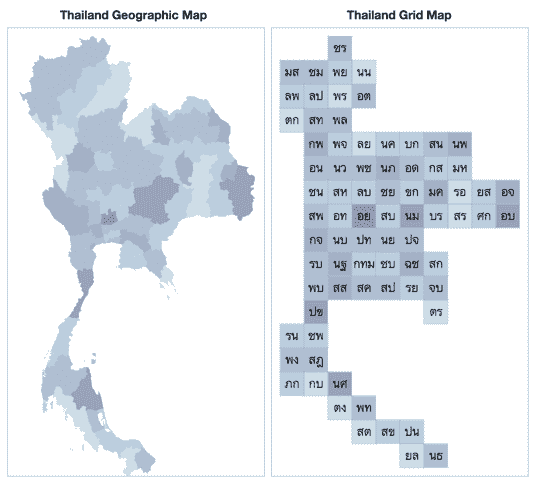
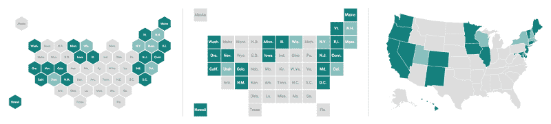
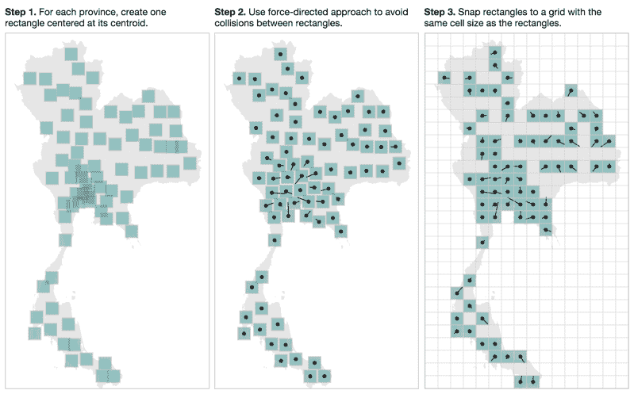
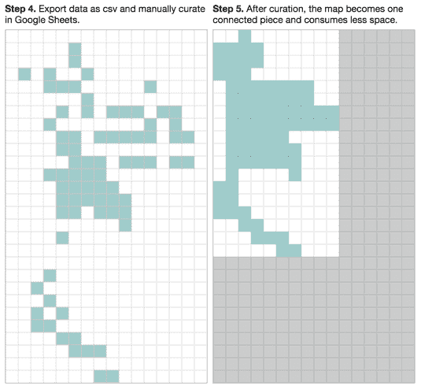

# 一种半自动的方式来创建自己的网格地图

> 原文：<https://www.freecodecamp.org/news/creating-grid-map-for-thailand-397b53a4ecf/>

作者:克里斯特·旺苏帕萨瓦特

# 一种半自动的方式来创建自己的网格地图

Map of Thailand — Each province is colored by the length of its name in English. Name abbreviations are from [Wikipedia](https://th.wikipedia.org/wiki/รายชื่ออักษรย่อของจังหวัดในประเทศไทย).

在过去的一年里，gr *id map* 风格的可视化在美国获得了很大的流行[2，4]。它有很多不错的属性，这启发我为泰国创建一个。

本文的其余部分将解释网格地图，以及我是如何为你在上面看到的泰国地图创建网格地图的。

**但是如果你已经对使用地图感兴趣，而没有阅读如何自己创建地图的细节，直接跳到我的[gridmap-layout-Thailand](https://github.com/kristw/gridmap-layout-thailand)github 知识库**。

#### 什么是网格地图，它的属性是什么？

在栅格地图中，每个区域都被表示为具有相同形状和大小的单幅图块。这些小块被放置在网格内接近真实地理位置的位置。如果瓷砖是正方形，则网格是矩形的。如果瓷砖是六边形，那么网格就像蜂窝。参见下面的美国地图:

Maps of the US: (left) Hexagon Tile Grid Map (center) Square Tile Grid Map (right) Geographic Map. Source: [NPR Blog](http://blog.apps.npr.org/2015/05/11/hex-tile-maps.html)

大多数网格地图可视化是 [*choropleth 地图*](https://en.wikipedia.org/wiki/Choropleth_map) 使用颜色来编码值，如降雨量、平均人口年龄或政治联盟。从地理地图创建 choropleth 地图有一些缺点，因为每个区域的不同大小会在解释结果时引入偏差。此外，许多小区域往往太小，在地图上注意不到。

**优点:g** rid 地图不会因为区域大小不同而引入偏差，这使得它在创建 choropleth 地图时是一个有趣的选择。小区域现在保证大到足以被看见。它比地理地图更容易实现，加载速度也更快。

缺点:这些区域的位置只是近似值，可能不准确。例如，一些相邻区域在网格图上可能不相邻。也扭曲了地区之间的距离。

#### 为泰国创建网格地图

以下是要求:

*   整体地图看起来还是和泰国的地理形状差不多。相邻区域应该看起来相邻或接近。
*   为了便于管理和应用，使用方形瓷砖。例如，这张地图可以很容易地在 Excel [3]或 Google Sheets 中绘制。
*   为了避免混乱，地图中间没有任何洞。

当然，创建这个地图最直接的方法是从头开始手工绘制地图。然而，我想用半自动方法节省一些能量:

1.  对于每个省，创建一个以其质心为中心的矩形。
2.  使用[力导向模拟](https://github.com/mbostock/d3/wiki/Force-Layout)来检测矩形之间的碰撞并移除重叠。每个矩形在其所在省份的质心处都有自己的重心([多焦点力导向布局](http://bl.ocks.org/mbostock/1804919))。下图中的实线显示了矩形从其理想位置的位移。
3.  将矩形与矩形网格对齐。
4.  [将步骤 3 的结果导出为 CSV 文件](https://gist.github.com/kristw/31be36fa0df6a85c1cbd)，并在 Google Sheets 或 Excel 中手动管理。这一步的目标是消除不必要的间隙，将地图连接成一个连续的部分，并调整一些省份的位置。
5.  搞定了。新地图只需要 40%的原始空间。

#### 使用

该过程的输出可以用作 JS、CSV 或 JSON 文件。请参见 GitHub 上的 [gridmap-layout-thailand](https://github.com/kristw/gridmap-layout-thailand) 获取说明。我在上面步骤 1-5 中使用的代码也在那个 repo 中。

最后，这种方法仍然在很大程度上依赖于最后的手动处理，这可能不会产生最佳的优化。如果你有任何建议或想要推荐一个更好的方法，下面的评论框是你的。:)

#### 参考

[1]迈克·博斯托克。[多焦点兵力布局](http://bl.ocks.org/mbostock/1804919)【bl.ocks.org】T22012 年 2 月 11 日出版
【2】丹尼·德贝利厄斯。[让我们镶嵌:瓷砖网格地图的六边形](http://blog.apps.npr.org/2015/05/11/hex-tile-maps.html)*NPR 博客。*发表于 2015 年 5 月 11 日
【3】凯特琳·邓普西·莫莱斯。[如何用 Excel 制作平铺网格图](http://www.gislounge.com/how-to-make-a-tile-grid-map-using-excel/)*GIS 休息室*。2015 年 11 月 10 日出版
[4]内森·尤。[2015 年大网格地图辩论](https://flowingdata.com/2015/05/12/the-great-grid-map-debate-of-2015/)*流动数据。*发布于 2015 年 5 月 12 日