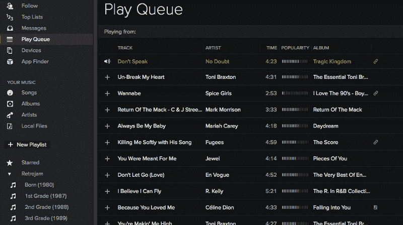
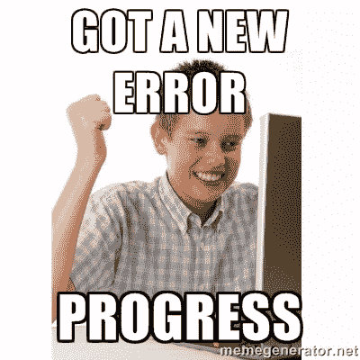
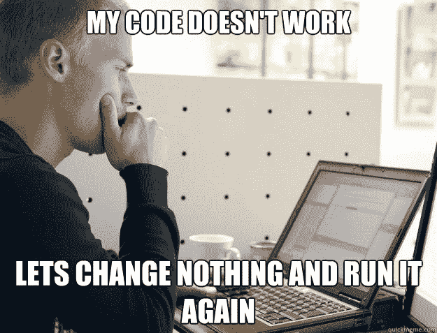

# 构建我的课外音乐应用程序

> 原文：<https://www.freecodecamp.org/news/building-an-app-outside-of-your-curriculum-7b76aa881d52/>

埃利奥特·麦克纳利

# 构建我的课外音乐应用程序

自从我的上一篇文章以来，我已经很久没有参加自由代码营了，那篇文章概述了我经历这个项目的第一个月。哪里出了问题？完全没有。

我一直在做一个供自己使用的项目。我正在使用我在自由代码营的前端开发课程中学到的技能。到目前为止，我对自己所取得的成就感到无比兴奋。

我有一个问题，我想建立一些东西来解决它。

And use a suitably large wrench in the process.

我经常听音乐。几乎每天醒着的时候，我都有一些东西在播放。

我主要使用 Spotify 和 Soundcloud，我很少下载任何东西。我用 Soundcloud 听更多不知名艺术家的音乐，我用 Spotify 听更大的、由唱片公司发行的音乐。

我有时会在 Spotify 上使用播放列表，主要是因为他们的推荐引擎非常好，我可以在此基础上获得令人难以置信的基于情绪的播放列表。然而，对于 Soundcloud，我主要是浏览我的 feed，并喜欢我想听更多的歌曲。我不会把它们添加到播放列表中，因为，嗯，我就是不会。我喜欢听我找到的最新歌曲，直到我再也受不了为止。

传统上，我会像播放列表一样播放 Soundcloud 中我的收藏夹部分。这个顺序可能不是我想要的，但我仍然可以不断地听到我喜欢的好曲子。

Spotify 有一个队列功能，我可以创建一个运行的临时播放列表。例如，我不会把 W&W 的 Rave After Rave 和 Drake 的 Marvin's Room 放在同一个播放列表中，但当我在电脑前编码时，我可能会渴望连续听到这两个音乐。Spotify 让我来做这件事，但是 Soundcloud(我用的比 Spotify 多)没有。

在完成了自由代码营的滑索之后，我开始了我的个人项目。我打算为 Soundcloud 创建一个队列函数！

当你浏览滑索时，很容易找到资源来帮助解决你遇到的特定问题。这是因为成千上万的人构建了相同的应用程序，而且许多人都有和你类似的问题。

当你自己构建某个东西时，很有可能有人没有做你正在做的完全相同的事情。他们可能做了类似的事情，但不完全相同。这是磨练你谷歌技能的绝佳机会！重要的是尝试用代码思考，用另一个程序员可能在 StackOverflow 上提出的方式表达你的问题。

老实说，我在为自由代码营开发 Simon 游戏和 Tic Tac Toe 应用程序的时候，已经花了几周的时间来规划这个项目。完成我的最后一个滑索后，我开始构建我的 Soundcloud 队列应用程序。

我开始阅读 Soundcloud API 上的文档，并对自己说这不会很难。老实说，这并不困难，但是我必须经历很多坎坷。

Soundcloud 提供的 API 文档非常简单，而且有相当多的坏方法。令人惊讶的是，我觉得这是塞翁失马焉知非福。它告诉我，并非一切都是完美的(我的应用当然也不完美)，但作为一名开发人员，你需要能够克服困难。

我广泛使用了 StackOverflow，还必须学习一些关于 JS 实际工作方式的基础知识。我还是不明白 JS 是怎么工作的，不过我会到的。这是一条漫长的路，记得吗？

当我一首接一首地播放歌曲时，那种感觉难以置信。这是我的应用程序的核心功能，我也知道怎么做。我在我的公寓里足足抽了 5 分钟，然后马上给我妈妈发短信，试图向她解释我的成就(无济于事)。

然后，我走到我最喜欢的咖喱店，吃了一顿庆祝餐，喝了一杯维多利亚苦啤酒。

然而，我的旅程还远未结束。正如许多人在谈到编程时所说:

> “修好一个东西，再坏 48 个东西！”

事情就是这样，但我知道我能挺过去。另外，我仍然需要添加一些功能，比如能够从队列中删除一首歌曲，以及改变已经在队列中的歌曲的顺序。

好的一面是，我在编码的时候，实际上可以使用这个应用程序，并在 Soundcloud 上排队歌曲。事实上，当我写这篇文章时，我正在使用它。

我仍在努力让我的应用程序在手机上运行。iOS 和 Android 不允许 Safari 或 Chrome 中的内容自动播放。这让事情变得困难，但我知道有办法。

Soundcloud 的移动网站接受用户的点击输入，然后能够连续播放声音。我仍然不知道他们是如何做到的，但我正在努力！

另一种方法是开发一个本地应用。我还不打算学 Swift 或者 Java。但我可能会尝试学习如何科尔多瓦工程端口，这样我就可以在我的手机上使用它。

在制作这个项目的时候，它让我想起了很多音乐创作。每当我做了一首歌并把它贴出来，它就从来没有完整过。我总是会注意到某个地方有太多的混响，或者这里想要一些白噪声，或者那里想要一个钹。它从未“完成”,我也不认为这个项目在我眼里会“完成”。我总是有一些我想实现的小想法，所以它会不断变化！

感觉终于可以说自己是程序员了。一个非常入门的程序员，但还是一个程序员。

我做了一个东西，为我解决了一个问题，我每天都在用它。

当你在自由代码营的课程中前进时，一定要不断思考你想用新学到的技能构建的个人事物。

当你学习新的方法和建立你的滑索时，想想你如何能把你学到的东西用在让你的生活变得更好上。

不要担心下一件大事。只要不断学习和构建你认为很酷的东西。

我犹豫是否要把我的应用程序链接放在这里，因为 SoundCloud 有每天 15，000/首歌曲的 API 限制，但我还是会这样做，因为我认为这很酷。也许其他人也会。

如果我们能让它达到 API 极限，也许 Soundcloud 会注意到并自己实现这个功能。最终，这就是我真正想要的。

你可以[点击这里](http://queuethat.com/)查看我的应用。我仍在努力提高我的设计技能，这个应用程序正在大量开发中，但它应该是稳定的。希望你会觉得有用。

我将去巴厘岛两个月，参加自由代码营的后端项目。我已经对这个应用程序有了一些很酷的想法，在那里我将能够利用我的新 Node.js 技能。

如果有人在寻找渴望学习新技术的初级开发人员，请在 Twitter 上联系我(也请关注我)。我将在五月回到美国。

在那之前，继续头脑风暴那些课外项目。你准备开始建造它们的那一天很快就会到来。