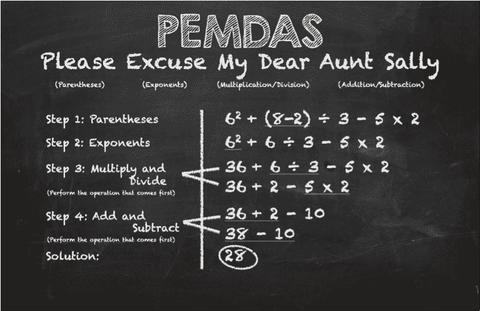
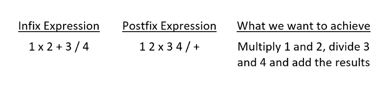
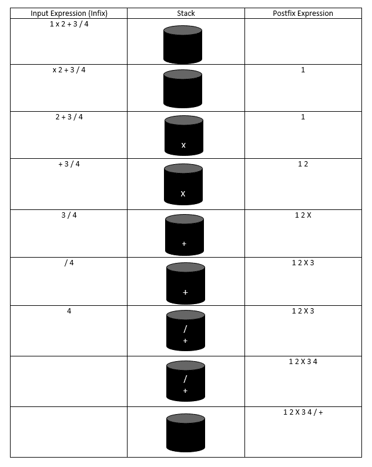

# 中缀表达式 VS 后缀表达式，以及如何构建一个更好的 JavaScript 计算器

> 原文：<https://www.freecodecamp.org/news/zipline-build-a-smart-javascript-calculator-65e21a8b0b0c/>

作者 Pramod Sripada

# 中缀表达式 VS 后缀表达式，以及如何构建一个更好的 JavaScript 计算器

如果你想让你的简单计算器更加智能，这篇文章就是为你准备的。

你可能会问，“我的简单计算器怎么了？”嗯，它可能正确地完成所有的操作，但是它完成这些操作的顺序可能是错误的。

简单的计算器只包含四则运算:加、减、除和乘。我们中的许多人可能在高中学习过运算符的优先级:除法和乘法具有相同的优先级，并且比加法和减法具有更高的优先级，加法和减法具有相同的优先级。

“Please excuse my Dear Aunt Sally” is a common mnemonic for remembering the order of operations (image credit: [oneyearlease.org](http://www.oneyearlease.org/))

操作员优先级的快速回顾可以在这里找到:[http://www.math.utah.edu/online/1010/precedence/](http://www.math.utah.edu/online/1010/precedence/)。

我强调运算符优先级的原因是因为一个简单的计算器执行大多数计算都是错误的。例如，根据正常的计算器，1+2x3 应该等于 7，但简单的计算器给出的结果是 9。

简单计算器之所以做错，是因为它只是将两个操作数相乘，中间有运算符，然后生成结果。

我们不能责怪简单的计算器。毕竟本来就是要简单的。所以现在你可能开始考虑如何重新排列操作符，以便得到正确的结果。是的，你在正确的轨道上。为此，我们需要了解计算机科学中的另外两个概念:中缀表达式和后缀表达式。

简单来说，我们理解的算术表达式是中缀表达式，计算机理解的算术表达式是后缀表达式。

中缀和后缀表达式产生相同的结果。只是人类习惯解中缀表达式，计算机习惯解后缀表达式。

后缀表达式中的另一个关键特性是，它根据优先级在操作数之后包含运算符，这使得计算机可以很容易地使用堆栈来计算它们，并产生正确的结果。

到目前为止，您一定在考虑如何将用户输入的中缀表达式转换成后缀表达式。有一个把中缀表达式转换成后缀表达式的算法可以找到 [***这里***](http://csis.pace.edu/~wolf/CS122/infix-postfix.htm) 。

这个过程是这样的:

Infix to Postfix conversion

后缀表达式要用算法求值，这里可以找到*。除了后缀表达式中操作数后面的运算符之外，它类似于简单计算器所做的计算。*

*最后，将中缀表达式转换成后缀表达式的主要动机是在计算机对表达式求值时保持运算符的优先级。*

*看看我的全功能计算器，它结合了这些原则 [***这里***](http://codepen.io/pramodvspk/full/RWzxgK/) ***。****