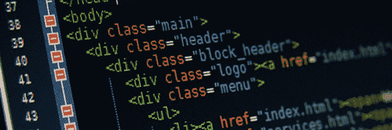
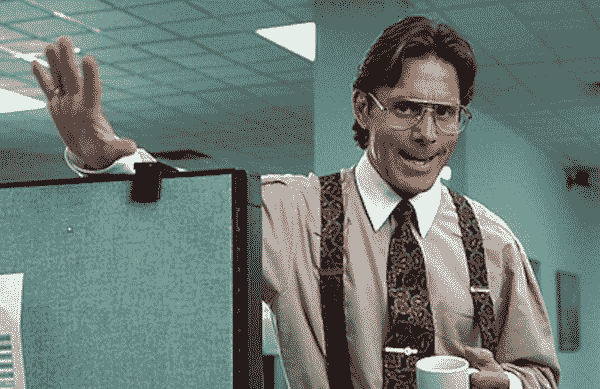
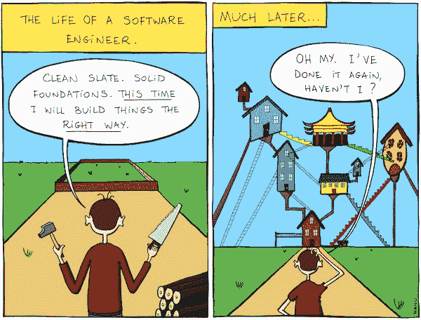
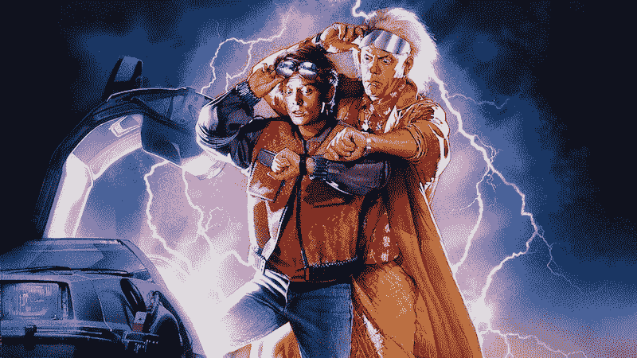

# 21 世纪的阶级斗争

> 原文：<https://www.freecodecamp.org/news/class-struggle-in-the-21st-century-ae670f700794/>

作者丹·麦克亨利

# 21 世纪的阶级斗争

Class class class class class. Credit: unknown

不是那种阶级斗争。我说的是 CSS 类，哇！那是什么？！等一下。有重要消息传来。

> 你需要一个二级标题，红色文字，在 60 秒内，否则这辆巴士会爆炸。你是做什么的，能人？你是做什么的？

好了，该出发了！所以，如果你遵循了一个 Web 教程或者一个流行的框架，我想你应该继续创建一个名为**的类。红色文本**。然后…完成了。

What do you do?! You write a new class that tells you exactly what it does! Credit: Speed

伙计，真快。为什么基努让它看起来像这么多工作？

这也是一个很棒的想法，因为任何查看 HTML 的人都知道视觉风格会是什么样的！因为这是我们绝对不想分开的两层。我想，我们有一个样式表是出于其他原因。

嗯，随着项目的发展和网站的老化，备忘录不断出现，越来越多的文本需要红色。也许每个人都相信，没有它，用户不会注意到真正重要的东西(也就是他们拥有的东西)。所以你把那门课扔得到处都是，就像光秃秃的圣诞树上的金属箔一样。

> ，，
> 
> s="red-text" >，<李 class="red-t ext" >等等。

如此简单。如此高效。但是你知道吗，彼得？我们将要求您将所有红色文本更改为蓝色文本。是的…我们正在重塑品牌，市场研究表明孩子们对蓝色很有安全感，所以…'好的，谢谢！

If you could just — add a color thingy — that’d be great. Aaaand put it everywhere. Yeah. Credit: Office Space

没问题。

> 。红色-文字{
> 颜色:蓝色；
> }

哦。嗯。好吧，那就换*吧。红色文本*到*。蓝色文本*。等等——现在所有的文字都是蓝色的，但是*说*是红色的。哦，太好了！我必须进入网站上的每一个文档，把课堂作业**“红色文本”**改成**“蓝色文本”**。但是我很聪明。我精通电脑。我可以快速搜索、替换和修复所有……哇……9347 个“红色”实例。嗯，开始了…然后…嘣！

现在我们在谈话。文字到处都是蓝色的。这个网站让我感到安全和舒适。他们关于市场调查是对的。人们仍然可以查看源代码，没错，蓝色文本确实被标记为**“blue-text”**。这个世界一切都好。

Not so fast, Hackerman! Credit: Kung Fury

但是突然你听到匆忙的脚步声穿过地板，老板回来了。

> 彼得，斯蒂芬妮·雷德纳的助手刚刚从内政部打来电话。他们想知道为什么网站上写着“*斯蒂芬妮·布鲁纳(此处为图片蓝色)引领蓝色进入一个新时代。”彼得，情况不妙。这一点也不好。*

傻例子？也许吧。但是已经发生了。也许不完全是那样，但它已经发生了。但这并不是真正的问题所在。当你以这种方式命名你的类时，你几乎可以说是在编写内联样式。

Credit: [http://www.bonkersworld.net/building-software/](http://www.bonkersworld.net/building-software/)

这是无意设计的自然结果。这个网站的外观和功能都是固定的，因为它是被一点一点地修补过的。当文化不重视重构时，重构在现实世界中很难实现。

你时间不多了。有钱人不明白为什么钱很重要，也不明白钱一开始就有问题。真的，当你的孩子在干墙上砸出一个洞时，你会把它补上。你不要把墙拆了再建起来。当你头上的某个人在现有网站上做了笔记时，这也是一个超级快速的解决方法。

所以我明白了。但这已经成了一种默认。这不是一件好事。

这里有一个相关的问题:你正在使用一个框架，并希望按钮看起来和行为像按钮。在>上加一个 **<屁股**是不够的；你得像烤土豆一样把它装上去；

那么你会有什么不同的做法呢？

在最后一个例子中，也许 **< butto** n >对于默认来说应该足够了。我们真的需要说 button 是按钮类的一部分吗，我们应该声明一个默认值吗？

在我们假设的业务中，也许结果是当你更仔细地观察时， **<** widget 类。**可能**是< p >只在会计让你加的那些财务术语 div 里是红色的，就是那个带 **h 的那个**哑的。通知类(如此花哨，但他们坚持)。诸如此类。

这里有一个更好的方法:让你的 HTML 保持整洁，并了解你的 CSS 选择器。我们甚至不需要去幻想。我们可以使用一个简单的下行选择器，你可能更好的理解为空格。

> 。小部件 h2，.注意 p {
> 颜色:红色；
> }

这是我大约 20 年前的梦想，当时我正在为自己制作网站，并对 CSS 的未来感到非常兴奋。现在回到这个领域，却发现 CSS 被指责为一种不良做法令人困惑的流行，这有点令人心碎。

Great Scott, Marty! Has the state of CSS gotten that bad in the future? Credit: Back to the Future

在 HTML 元素中乱放类——尤其是过度声明的类——会造成维护上的麻烦，产生混乱的标记，并且在某种程度上违背了分离语义和样式的目的。

所以如果可以的话，千万别上那辆巴士。但是如果你这样做了，试着在你可以的地方减轻事情。最后，记住你在每份文件中想要做什么，不要重复你的努力。