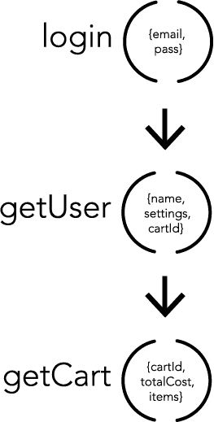
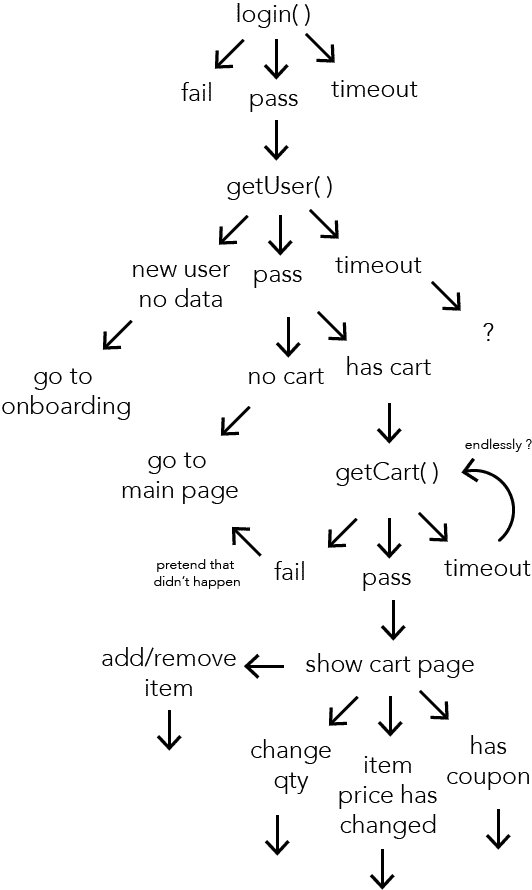
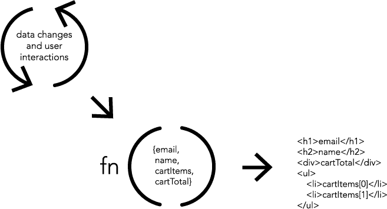

# 函数式编程正在取代纯视图的用户界面。

> 原文：<https://www.freecodecamp.org/news/the-revolution-of-pure-views-aed339db7da4/>

鲍比·舒尔茨


# 函数式编程正在取代纯视图的用户界面。

在过去的几年中，通过使用纯功能视图开发 ui 的方式有了巨大的改进。在函数式编程中，“纯函数”是指当运行时，返回一个值，但不改变其范围之外的任何内容(也称为无副作用函数)。这极大地减少了应用程序中的认知负荷和排列，因此它们大大减少了错误([参见案例研究](https://medium.com/@puppybits/react-without-flux-a76236d1e1d))，易于理解、组合在一起并且非常稳定。

David Nolen 对这种类型的 UI 开发模式有一个最好的解释。这是一个接收数据作为输入并返回视图的函数。没有范围，绑定，子类化，外部访问变量或任何副作用。这使得它非常容易预测，并且很少考虑运行纯视图的上下文。在 JavaScript 世界中，你可以说，给定任何 JSON 将总是创建相同的 HTML、CSS 和事件监听器。

#### 为什么纯视图不同于其他 UI 模式？

为了充分理解这一点，我们需要理解我们多年来在代码中隐含地做了什么。代码被写成一系列复杂的排列。我们调用的每个函数都会改变其私有范围之外的东西。然后我们调用另一个函数来改变其他东西。如果这些函数调用的数据或顺序以任何方式偏离，错误就会以意想不到的方式出现。想想你修复了一个 bug，这个 bug 是由其他类或服务器中某处看似不相关的东西引起的。这些是大的排列问题。

看看下面的图表。这是我们内部对应用程序的看法。



How we “think” our app works.

超清晰，对吧？调用“login()”,然后调用“getUser()”,然后调用“getCart()”。实际上，我们的应用程序流包括错误路径、意外值、网络和线程操作。如果它们以稍微不同的顺序返回，或者数据稍微不同，或者数据在我们的应用程序中被多个类改变，这些都会导致错误。这是一个更准确的可能分支模型:



How our apps really work.

如果任何东西没有在预期的时间在预期的路径上运行，我们就会遇到错误。OOP 类应该将数据、事件和转换封装在它的边界之内，以使其工作时没有错误。显然我们都有缺陷。系统很难，因为它们很复杂，而这些复杂性会导致错误。

#### 简单变得容易

对于那些已经了解了四人帮和面向对象模式，但还没有看过 Rich Hickey 的演讲“简单变得容易”的人来说，现在就去看吧。Hickey 谈到的核心概念是，过多的外部性是我们在阅读代码时无法完全理解代码在做什么的主要原因。这并不容易，因为太多的板块同时在旋转。面向对象语言的模式试图通过大量使用封装来降低复杂性。相反，函数式语言非常重视可组合性，将其作为降低复杂性的关键特性。为了更好地控制我们的用户界面，需要两者的更好结合。

纯视图给大多数开发人员生活的 OO 世界带来了函数式语言的一些好处。在函数式语言中，一个纯函数只做一件事，没有副作用(副作用的意思是它不能影响任何事，只能返回一个新值)。多个简单的函数可以以不同的方式组合，以产生多种类型的输出。套用里奇·希基的话:简单就是做一件事。简单意味着我们能够理解的程度。在纯视图的情况下，查看渲染函数，我们应该能够理解所有潜在的输出。它减少了理解整个代码库以了解它如何影响单个功能的需要。

这就是函数式纯视图流程的工作方式:



Pure Views are simple transforms with no side-effects.

这是一个非常强大的概念。不必到处传播函数、事件、网络堆栈和突变，只需拍摄数据快照并呈现给视图。视图将拥有所有的布局、事件处理程序和访问点，供用户与底层数据进行交互。这意味着要到达应用程序中的任何位置，唯一的依赖是静态数据模型。通常，这些纯视图与生命周期方法相结合，以更好地理解数据何时、为何以及如何变化。例如，看看一些纯视图的实际代码:

```
createView({  getDefaultProps(){    return {      selectedIds: [1, 10],      banks: [/* bank data here */]    };  }   render(){     let selectedBanks = this.props.banks.filter(function(bank){      return this.props.selectedIds.indexOf(bank.id) > -1;    });    let bankItems = [];    for (let i=0; i < selectedBanks.length; i++){      bankItems.push(        el("BankItem", {key:i, bank:selectedBanks[i]})      );    }    return el("div", null,             el("h1", null, "Selected Banks"),             bankItems,             el("a", {href:"/install", "Next")           );  }})
```

该视图封装了由其父视图传入的属性。当调用 render 函数时，它不需要视图自身范围之外的任何东西。所有能影响输出的东西都在一个函数中。直到渲染功能完成，道具和状态也不能改变。这使得推理每次运行将会发生什么变得容易。每当父节点向它发送新数据时，它将触发渲染函数再次运行。

#### 在不增加复杂性的情况下扩展功能

因为纯视图只做一件事，不影响其范围之外的任何事情，所以它非常灵活，不会引入额外的复杂性。有几个案例真正展示了纯视图的力量。

第一种称为**热模块更换**。如果你认为这就像在浏览器中实时重新加载一样，那你就大错特错了。当您在编辑器中保存文件时，只有更新的代码可以发送到您的应用程序，替换旧代码，运行该视图的渲染功能，并且只更改不同的 HTML。应用程序的整个数据层不受影响。这适用于布局、视图层次结构和事件处理程序。应用程序中的数据不会改变，因此您的视图会实时更新。浏览器、iOS、Android、Windows 和 Mac app 中都有支持这个的库。当修改代码和看到输出之间的迭代时间接近 0 时，它会完全改变您的编码工作流程。

接下来是**时间旅行调试**。听起来真的很神奇。没有纯视图，存储每个事件传播及其对视图的影响对大多数系统来说是不可能的。对于纯视图，只需要有一个数组，并在每次数据发生变化时推送新的数据副本。如果你理解持久数据结构是如何工作的，那么保存应用程序中的每一个变化就更容易了。调试的时候就像录像机一样来回擦洗就行了。(Yeah 80 年代的 UI 技术，今天大多数 UI 框架的调试工具包里都没有)。应用程序状态甚至可以序列化并保存在生产中的服务器上，以获得应用程序中几乎每个 bug 的完整恢复步骤。

最后一个主要能力是**弹性超过刚性**。数据不依赖于用户界面。这是明确的关注点分离。应用程序的数据层可以专注于功能、数据转换和缓存，而不必考虑用户可能有的所有顾虑。在绝大多数项目中，业务逻辑几乎没有变化；comm 购物车的代码也有同样的需求。但在视图层，设计师总是在寻找新的方法来解释或澄清界面或增加销量。单元和集成测试可以专注于测试纯的、简单的数据中的应用程序流。因为视图只是一个简单的转换，是数据在任何给定状态下的反映，所以不太容易出现复杂性或错误。这也意味着当设计者或业务主管要求更改视图时，可以在不影响数据流功能的情况下完成。

#### 回到现实世界

纯观点运动正在发展。传统视图层比纯视图几乎没有什么好处。更开放的框架，比如主干网，你可以用纯视图代替字符串模板系统。越来越多的框架作者看到了它的优势，并转向纯视图。真正支持这种方法的几个著名框架是 Elm、Ember 2、Om Next、ReactJS。

为了利用 Pure Views 提供的一些扩展功能，有一些现成的工具使集成变得更加容易。对于热模块更换，Webpack 和 React 有很好的设置。我有一个名为 [Megatome](https://bit.ly/megatome) 的初学者工具包，它可以让你在 2 分钟内启动并运行一个新项目。对于时间旅行调试[来说，Redux](https://github.com/rackt/redux) 是一个与 React 一起工作的数据层。

最后一点是给那些陷入语法审查的人(比如 Lisps 或 JSX):不要根据封面来判断一本书。不往深里看，完全可以忽略不一样的东西所能带来的可能性和力量。再次看看上面的代码，上面是真实世界的纯视图。这都是有效的代码，不需要编译、包管理器或任何额外的构建步骤。唯一缺少的是前三行:

```
let el = React.createElement;let createView = React.createClass;
```

我最近的项目比编码还难。我们让个人理财不再糟糕。在[getfiskal.com](https://www.getfiskal.com)看看你的消费速度如何导致控制你的预算。