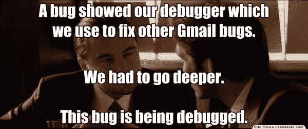
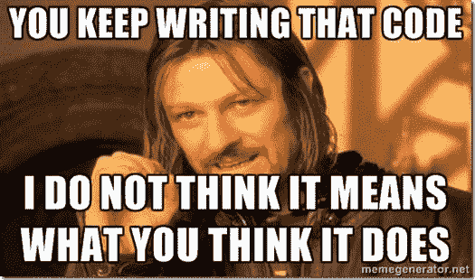
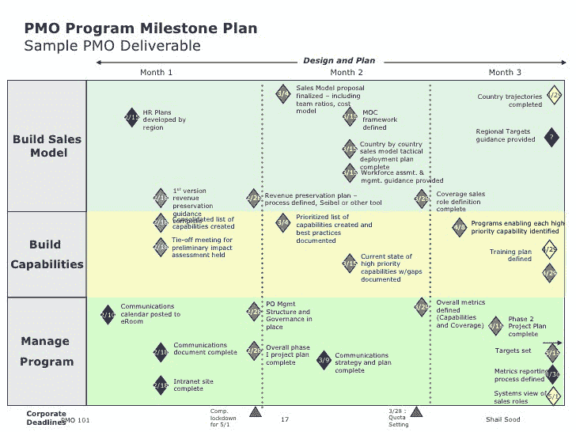
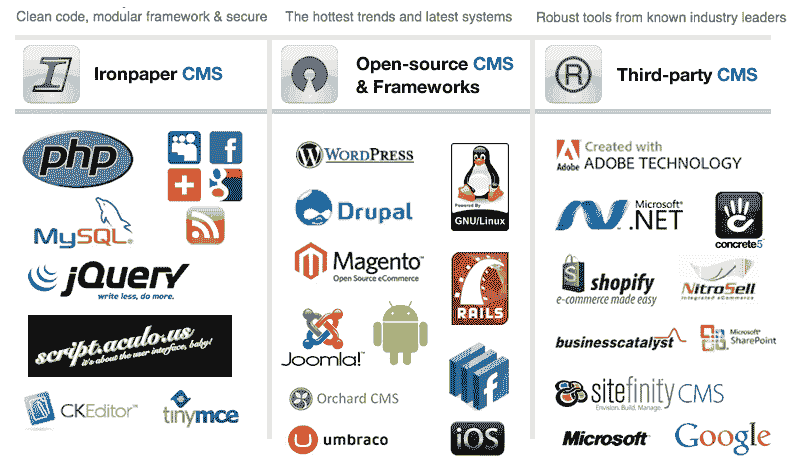

# 将代码转化为现金——作为一名 Web 开发人员如何赚钱并活下去。

> 原文：<https://www.freecodecamp.org/news/turning-code-to-cash-how-to-make-money-as-a-web-developer-and-live-to-tell-the-tale-f5eedc557b3e/>

作者库尔特

# 将代码转化为现金——作为一名 Web 开发人员如何赚钱并活下去。

所以你刚刚学会编码。你很渴望，任何不会编程的人都认为你是个天才，消息传出去，突然间你遇到的每个人都想让你给他建个网站。他们中的大多数人想要免费赠品，但也有一些人愿意付钱。 ***和颜悦色*** 。

这篇文章告诉你，当你接受这份工作时，如何保住他的钱、你的名誉和你的理智。

我要告诉你的事不是什么秘密。作为一名网络开发人员，没有赚钱的灵丹妙药。我要给你的建议看起来很基本，而且大部分是纯粹的常识，但对任何一个开始在出售网站(或编码网站)赚钱的人来说都是绝对必要的。

如果你坚持这些原则，生活会变得容易，你会热爱你的工作，如果你不这样做，当你刚刚开始工作时，你就有可能意外地毁掉自己

#### 没有什么是简单的。

总是言而无信。你看不到未来，如果你说“当然”,并支付你的午餐费用，你会后悔的。

无论是一个简单的报告还是 WordPress 升级，事情都可能会出问题，超出你的控制，最终你会坐在你的电脑前几个小时，看起来很业余，因为你昨天承诺了它，并且免费工作。

#### 了解你的技能组合——并让你的客户知道。

不要接受你没有 100%把握完成的工作。如果他们要求你明确表示，如果你只能做到 80%,你会不做任何承诺“尝试”,告诉你的客户。

他们最终会欣赏这一点，这会建立你们之间的信任。你不想卖给他们一些你不能调试或保护好的东西。

#### 清楚他们在买什么

如果你正在编写代码，那就把它写出来。如果是 CRM 的自定义实现，请声明。永远不要给客户一个 WordPress 网站，上面有你在网上买的模板，并试图把它当作你的作品，或者让他们认为它是。

给他们一份他们所购买的东西以及版权和许可的明细。这适用于股票图像，插件，模板一切。

#### 学会使用工作中最好的工具。

框架是你的朋友，就像你热衷于编写一个电子商务网站一样，你需要面对你对它一无所知的事实。知道自己什么时候力不从心，并使用手头最好的工具。

您将更快地完成工作，您的客户将拥有更好、更安全的产品。

#### 对你的客户来说，你不仅仅是一个开发者。

不管他们承认与否，如果你在和客户打交道，你就是他们的网上股票经纪人。你给他们的任何关于数字软件、社交网络、电子邮件或使用什么手机的建议都会被认真对待。

所以，试着只给他们关于你有详细知识的事情的建议。否则，让他们去找做市场营销/应用开发/服务器管理等的人。

#### 签署你的工作

从一开始就要清楚你的费用是多少，一旦达到要求，就签字同意。你可以给他们每月 5 小时开发/调试的“服务包”或者按小时收费。否则你将会被要求改变措辞或移动东西的请求淹没。

最后，不要做一个混蛋。代码中的“bug”可能不是项目中的 bug。即使在项目结束后，如果报告没有达到预期效果——这是你的责任，不要找比尔，只要解决它。然而，如果报告做了规范要求的所有事情，而客户给了你一个错误的计算账单的公式。

哦，尽量避免朋友和家人，他们会虐待你，几乎从来没有付出。希望这能帮助到外面的人。

如果你喜欢这篇文章，看看我写的其他东西…

[**预防性编程——如何在错误发生前将其修复**](https://medium.com/p/9df82cf215c5)
[*…以及为什么夏洛克·福尔摩斯会成为一名出色的程序员*medium.com](https://medium.com/p/9df82cf215c5)[**学习编程时要记住的 5 件事**](https://medium.com/p/1ed8e734b04f)
[*学习编程具有挑战性。除了选择语言或建立开发环境，你……*medium.com](https://medium.com/p/1ed8e734b04f)[**我是如何成为一名程序员的。当我开始自称为 One**](https://medium.com/p/54a0533c4335)
[*的时候，我已经想开始写关于编程的博客好几个月了，就像我之前的许多人一样，我开始写满了……*medium.com](https://medium.com/p/54a0533c4335)[**如何用 71 行代码编写像库一样的 jQuery 了解 DOM**](https://medium.com/p/e9fb99dbc8d2)
[*JavaScript 框架风靡一时。你打开的任何与 JavaScript 相关的新闻提要都有可能散落一地……*medium.com](https://medium.com/p/e9fb99dbc8d2)[**让它下雨代码—矩阵风格**](https://medium.com/p/ec6e1386084e)
[*HTML 5 画布动画简介*medium.com](https://medium.com/p/ec6e1386084e)