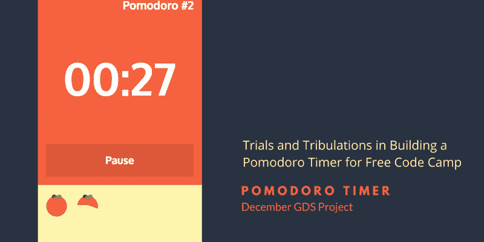
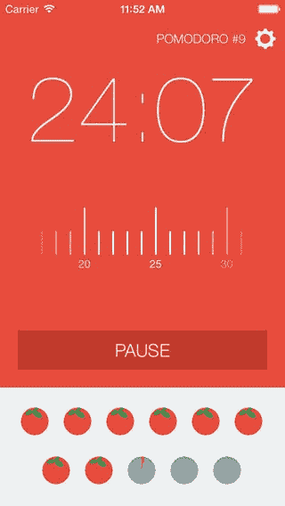
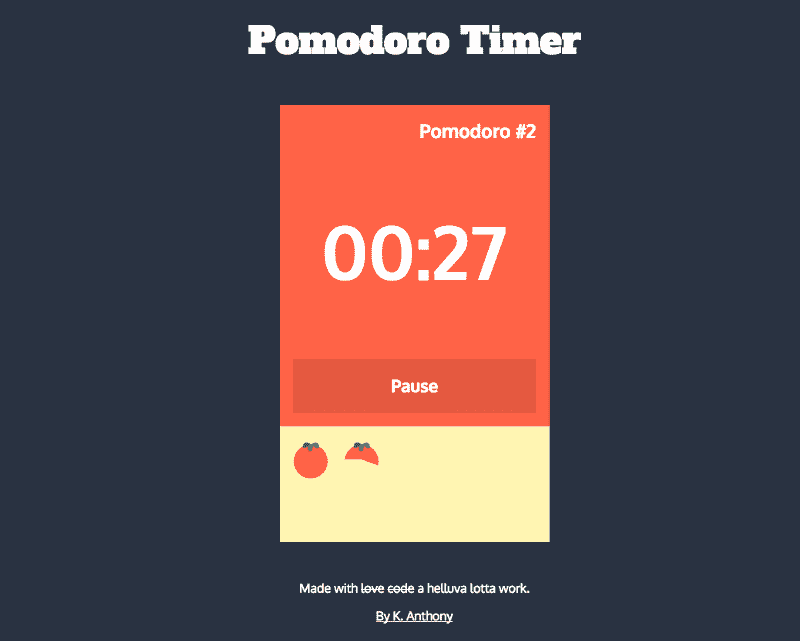

# 12 月去设计一些项目:番茄定时器

> 原文：<https://www.freecodecamp.org/news/december-go-design-something-project-pomodoro-timer-9617ac5d733b/>

作者 k·安东尼

# 12 月去设计一些项目:番茄定时器

我已经悄悄接近年底了。我意识到我已经严重忽视了我的[自由代码营](http://www.freecodecamp.com)实践。

鉴于我有一些空闲时间，在参加 D3.js 的一个非常好的深入初学者课程期间，我决定处理我的下一个前端项目:番茄定时器。

### 球场

所以这个项目是对 Geoff Stoerbeck 的这支[笔进行逆向工程。似乎很简单，对吗？](http://codepen.io/GeoffStorbeck/full/RPbGxZ/)

不对！

我从一开始就知道这个项目会比其他项目更复杂，这可能是我拖拖拉拉的原因。但是一旦我开始了，我发现自己非常有动力去解决我的想法提出的问题。

Pomodoro App by NASA Trained Monkeys

### 我的想法

我的灵感来自 Geoff 的演示和 iOS 应用商店中的 pomodoro 应用程序。特别是由美国宇航局训练的猴子提供的服务。

基本功能是允许用户设置会话和休息时间，并启动计时器。他们还应该能够暂停计时器和重新启动它。

在美学方面，我真的很喜欢随着时间的推移在参考笔中填满圆圈的想法，但我想通过为每个会话创建小进度条来补充这个想法。我也很喜欢把进度条做成西红柿形状的想法。

有了这两件事在我的脑海中，我决定从头开始，只是得到一些工作。

### 查找插件

我的第一个尝试是找到一些框架，让我可以做我想做的事情。

很自然，我从基本功能开始。我需要一个能让我轻松建立计时器的东西。jQuery 不缺少计时器插件，但是我能够很容易地筛选它们，避开任何预先设计好的插件。

我用 Carlous Souza 的 jQuery 简单计时器进行了实验。它有很多我想要的功能，但没有暂停和重启定时器的内置功能。所以我继续寻找，直到我偶然发现了[杰森·查万斯的 jQuery Timer](http://jchavannes.com/jquery-timer/demo) ，它拥有我想要的一切，包括很好的演示和文档。

使用 Jason 的插件，我能够让一个基本的定时器相当快地工作。

我的结构模仿了 Geoff 的演示，有两个变量——一个代表休息时间，一个代表会话时间——您可以使用加号和减号按钮来修改。

做出选择后，单击 start 按钮，会话计时器开始计时。一旦会话计时器完成，div 就会隐藏，break div 会显示，break 计时器开始计时。

### 进度条

我的下一个项目是尝试添加进度条。如我所说，我最初想尝试创造一个形状像番茄的。我希望我新学到的 SVG 入门知识能够派上用场，我甚至不怕麻烦地创建了一个方便的小 SVG 番茄。(相信我，超级可爱。)

但是几天后，我放弃了这个想法，转而选择简单的循环工作。我不得不做一点思考，以意识到我希望这个图像作为一个进度条。但是一旦我想到这个主意，我就去寻找另一个 jQuery 插件。在浏览了几个选项之后，我发现 [Rostyslav Bryzgunov 的 jQuery Circle Progress 插件完全符合要求](https://github.com/kottenator)。

这个插件使得创建一个独立的进度条变得非常容易，但是我需要它在我更大的应用程序中工作。我需要能够启动、暂停和恢复它。

这也是我有很多问题的地方。插件的文档中提到了一种停止动画的方法，通过几天的实验，我对相关的变量越来越熟悉。我可以通过更新动画调用的 animationProgress 属性来创建一个半解决方案。

然而，我发现这只适用于第一次暂停。如果您要恢复计时器，让它运行，暂停它，并尝试再次恢复它，animationProgess 停留在旧的值。

大约过了 3 天，我崩溃了，在 StackOverflow 上问。像往常一样，我得到了一个很快就奏效的答案。

因此，在 89 个版本中，我终于可以在我的应用程序中添加进度条了。

### 麻烦来了

总会有问题的，对吧？我发现无论窗口标签是否激活，我的进度条都会一直显示。我构建计时器的方式是，当你不看的时候，浏览器会暂停它的进程。不好玩。

当我回到 timer GitHub repo 时，我正在寻找修复它的方法，并看到其他人已经提出了这个问题，代码作者已经开始着手解决这个问题了！这将意味着使用代码的非规范分支，但是，我是游戏。

我重构了代码以使用新版本。我必须添加一些已经删除的特性，最明显的是 isActive 属性，我还必须弄清楚如何更新新的倒计时参数。但最终，我在工作了大约 5 或 6 个小时后，让它顺利运行。

### 抛光

我在最后添加了一些美学元素——主要是字体和样式。我还能够添加回我的超级甜番茄，尽管是作为 PNG 而不是 SVG。

我发现的一件事是代码并不像我希望的那样枯燥。按照函数的编写方式，它们不能访问全局变量，所以我不得不在特定的范围内多次创建变量。然而，我认为代码仍然非常可读。我还花时间对代码进行注释，指出感兴趣的地方。

这个项目是迄今为止最困难的，但我对结果感到自豪。

也许 Free Code Camp 为这些项目选择的方法最好的一点是，它们不只是一步一步地通过一个教程。你有一个具有参考功能的项目，但你必须弄清楚如何让事情自己工作。

到最后，你真的会有一种成就感。另外，你实际上已经把你的新知识运用到了工作中。你还会得到一个漂亮的作品集！

### 看一看

我废话说够了。看一下最终版本，让我知道你的想法！

*最初发布于[www.knanthony.com](http://www.knanthony.com/blog/december-gds-project-pomodoro-timer/)2015 年 12 月 16 日。*