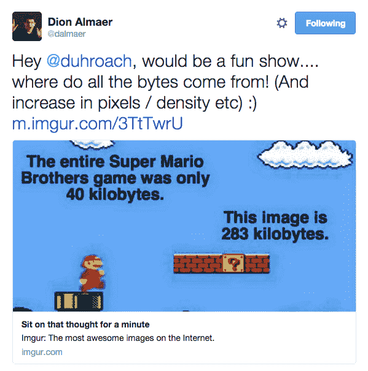
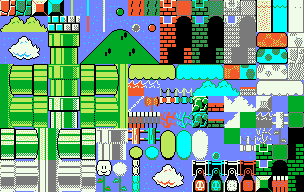
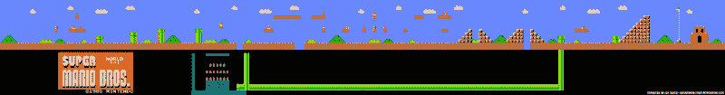
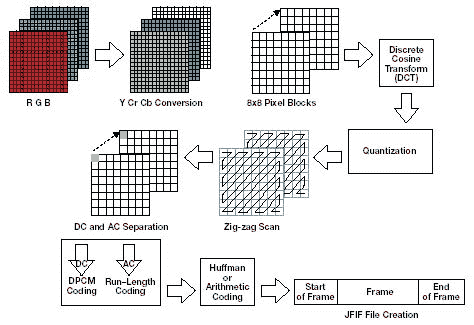
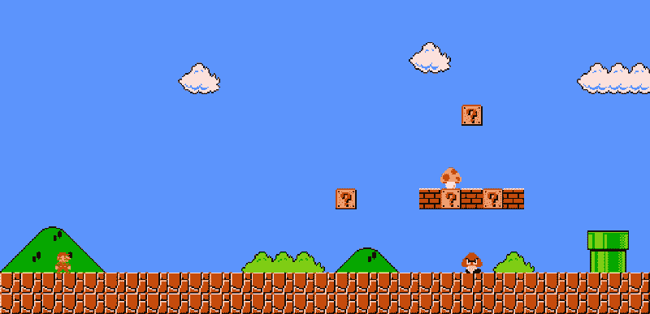
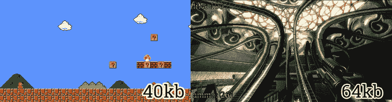

# 所有的字节都是从哪里来的？

> 原文：<https://www.freecodecamp.org/news/where-do-all-the-bytes-come-from-f51586690fd0/>

作者柯尔特·麦坎利斯

# 所有的字节都是从哪里来的？

问得好迪翁！我会回答这个问题，不仅仅是因为你是我的新老板，而是因为这是一个好问题。(还因为[你是我的新上司](https://medium.com/ben-and-dion/heading-to-google-take-2-0-153841c6e1ae#.asvmj5s45)。)

不过，我想在这里澄清一些事情:我们并不是真的在比较苹果与苹果，所以让我们先定义一些技术。

### 马里奥是如何工作的

所以让我们从资产的角度来谈谈最初的超级马里奥游戏是如何运作的。

最初的 NES 控制台只能输出 256 宽 240 高的图像；这意味着需要在屏幕上显示的最终图像大小为 180kb。

此外，NES 只有 2kb 的内存。一盒磁带本身可以存储 8k 到 1mb 的游戏数据。因此，没有办法将整个游戏的内容放入主存。基本上，1MB 盒式磁带数据的子集必须加载到 2kb RAM 中，并用于呈现 180kb 的屏幕。一个人如何做到这一点？

[SpriteSheets](https://en.wikipedia.org/wiki/Sprite_%28computer_graphics%29) 。

Sprite sheets 包含小块图形，可以反复使用。例如，下面是翻拍的原始超级马里奥雪碧表:

It’s not the exact original sprite sheet, but you can get a sense of the small blocks of data that can be use over-and-over again.

每一个 16x16 像素的小方块代表一个“瓷砖”,艺术家们会将它们串在一起，以创建实际的水平。水平本身，只是成为一个巨大的 2D 数组索引到雪碧表。(我在我的 [HTML5 游戏开发课程@ Udacity](https://www.udacity.com/course/html5-game-development--cs255) 的第 3 课中，或者在我的书 [HTML5 游戏开发洞察](http://www.apress.com/9781430266976)中，会更详细地谈到这一点。)加上一些[游程编码](https://en.wikipedia.org/wiki/Run-length_encoding)，或者一些基本的 [LZ77](https://www.youtube.com/watch?v=Jqc418tQDkg) ，你会得到一个相当紧凑的关卡格式。

Behold, that level that you parents could never complete.

因此，有了像瓦片表和精灵表这样的概念，我们可以使用一小组图像来创建大的场景和世界。这通常是大多数游戏的工作方式。即使是 3D 游戏也会有一组通用的纹理，这些纹理会在整个游戏中多次应用。

现在让我们谈谈一般的图像压缩。

### 图像的压缩方式

这是这个比较的“*不公平*”部分。一般的图像压缩算法没有关于它们内部像素的领域知识。JPG、PNG、WebP 都是为*照片*而不是*游戏屏幕*设计的。结果是，对于给定的 16x16 像素块，这些算法假设它在图像中是唯一的；除了一些颜色量化，没有增加真正的逻辑来确定另一个 16x16 的块是否是当前块的*精确副本*。这通常意味着给定数据块的压缩方式有一个下限。

例如， [JPG](https://en.wikipedia.org/wiki/JPEG) 将给定的图像分解成 8×8 的像素块，将 RGB 色彩空间转换成 [YCbCr](https://en.wikipedia.org/wiki/YCbCr) 版本，然后对它们应用[离散余弦变换](https://en.wikipedia.org/wiki/Discrete_cosine_transform)。只有在这个步骤之后，无损编码器才会出现，看看它是否能使用 DPCM 或 RLE 匹配常见的重复组。

A block-view of how JPG image compression works.

因此，两个块可能被压缩成一个块的唯一地方是，如果它们的 DCTd 后版本相同，并且 RLE 可以提出 stride 建议。这种事不常发生。

[尽管有其他缺陷](https://www.youtube.com/watch?v=jHXzzHElFPk)，PNG 在这方面要好得多。PNG 压缩是完全无损的，(所以你的图像质量很高，但你的压缩节省很低)，并且基于 DEFLATE 编解码器，它将 [LZSS](https://www.youtube.com/watch?v=Jqc418tQDkg) 与[算术压缩](https://www.youtube.com/watch?v=FdMoL3PzmSA)配对。结果是长串的相似像素最终会被缩减到更小的尺寸。这就是为什么背景非常均匀的图像作为 PNG 文件总是比 JPG 文件小的原因。

#### 下图是一个 5.9kb 的 PNG 文件，而 JPG 的图像是 106kb

Since this image has lots of duplicate pixels (the blue sky background) compressors like PNG do a better job than their block-based JPG counterparts.

### 苹果 vs 火龙果

我的观点是，将游戏内容与互联网上的一张图片相比较有点不公平。

从游戏的角度来说，你从一小组可重复使用的瓷砖开始，然后索引它们来构建你的大图像，我们可以做到这一点，因为我们知道游戏将如何制作。另一方面，JPG/PNG/WebP 只是试图压缩它可以在本地块中找到的数据，而没有任何匹配重复内容的真实愿望。图像压缩在这方面显然处于劣势，因为他们没有关于数据空间的先验知识，他们无法真正对其做出任何预期。

我的意思是，考虑一下在这个[之类的东西](https://en.wikipedia.org/wiki/.kkrieger)上超级大的演示场景[。他们可以将 30 分钟的完整 3d 射击游戏压缩到 64kb，因为他们了解并知道更多关于他们的数据。](https://en.wikipedia.org/wiki/Demoscene)

A much better comparison. The .[kkrieger](https://en.wikipedia.org/wiki/.kkrieger) demo fit 30 minutes of a 3D shooter gameplay, with physics, sound, textures, and AI into 64kb of data. Seems like a massive amount of gain for just 24kb more than the original Mario.

这表明，通过对数据的正确预测，你可以在压缩方面做很多事情。

### 期待。

显然，自从 NES 时代的 256x240 显示器以来，我们已经长大了。[我口袋里的手机](https://www.google.com/nexus/5x/)有 1，920 x 1，080 的显示像素，它的尺寸为 5.2 英寸，密度约为每英寸 423 像素。相比之下，同样数量的像素大约是 33 个超级马里奥屏幕，或者说，8MB 的像素数据。我不认为任何人对屏幕分辨率的提高感到惊讶，但这也伴随着对*更多数据*的需求。

这是我已经唠叨了一段时间的事情。虽然我们得到了更大的显示器，但内容频道需要提高分辨率输出，以便在我们更高密度的设置下仍然看起来不错(否则，[我们会变得模糊不清)..](http://www.leemunroe.com/designing-for-high-resolution-retina-displays/))。这当然会导致我们的视频游戏包变大，我们的[网页变大](http://royal.pingdom.com/2011/11/21/web-pages-getting-bloated-here-is-why/)，甚至我们的 [youtube 流媒体视频](http://mashable.com/2014/01/03/youtube-4k-ces/)也变大。基本上，我们只是因为屏幕分辨率而向更小的设备发送更多的数据。对于新兴市场的下 20 亿 2G 用户来说，这是有史以来最糟糕的主意。

但是我跑题了。那是不同的岗位。