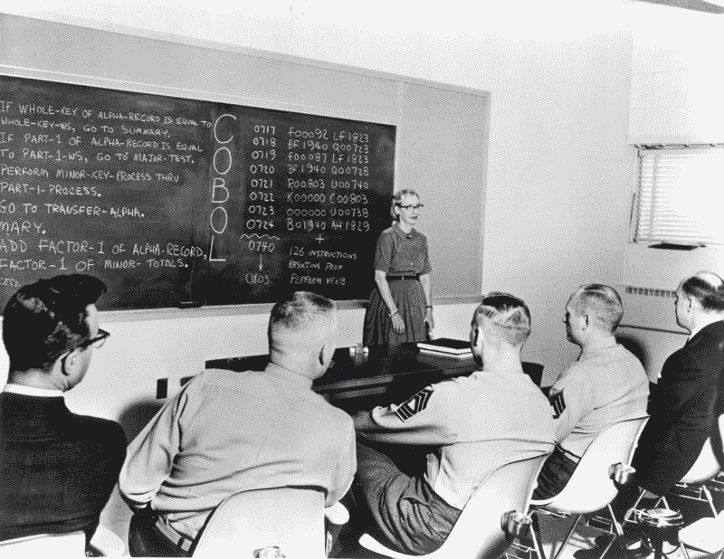
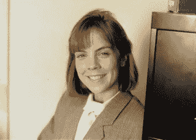
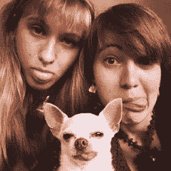
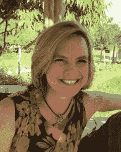

# Nasa，IBM，Mommyhood 和 Back

> 原文：<https://www.freecodecamp.org/news/women-in-tech-my-own-perspective-9eaa481c73b8/>

瓦莱丽·里克特

# Nasa，IBM，Mommyhood 和 Back

One of the first programming languages I learned, COBOL, was created by Grace Hopper.

科技行业的女性？我们身边的人不多。在工程师和其他 STEM(科学、技术、工程和数学)职业的世界里，女性是少数。最多 25%的工程师和计算机科学家是女性。为什么？

为什么很少有工程师和计算机科学家是女性？你的猜测和我的一样好。然而，我认为，年轻的女孩和妇女没有被鼓励像男孩一样充满活力和活力地加入这些领域。

我是少数。没有人鼓励我加入。我没有朋友或父母给我建议。据我所知，对理科感兴趣的女生没有导师。然而，我很幸运地进入了一所女子高中，这所高中的重点是大学预科课程。在那种环境下，我明白了只要有主动性，努力，我什么都可以做。

在我的职业生涯中，我在许多不同的商业环境中工作过。其中一些环境比其他环境更进步。在任何时候，一个办公室都可能有许多男性工程师。如果一个女人碰巧走进那间办公室，这些男人中的大多数会认为那个女人是一个“行政人员”，一个秘书，或者其他一些支持她的男同事的职位。女工程师？那是什么？过去和现在都很少有女工程师。在我目前的环境中，我只知道三个。

我希望事情会有所不同，但我已经接受了现实，这就是 STEM 中的生活。我选择接受它，专注于我最爱的东西——编码！在这个过程中，我成为了那些想从事 STEM 职业的女孩和女性的榜样。

你可能会问，我是怎么进入这个领域的？

Me in 1987, early in my software engineer career.

#### **我自己的 STEM 起源**

我最初的计划是从休斯顿大学新闻专业毕业。我喜欢写作，每天都写日记，用故事填满许多页。然而，当我走进我的第一堂沟通课，在礼堂里见到 200 多名学生时，我有了新的想法。所有这些人都会和我竞争一份工作。我觉得自己很渺小。

听从朋友的建议，我决定尝试经商。金融很有趣，但上了两节会计课后，无聊到不知所措，我发现自己又迷路了。我能去哪里？

我的商科专业的要求之一是计算，所以我尝试了 COBOL。我很好奇。我喜欢创造和解决问题的想法。而且，我是在‘写作’。当我发现 COBOL 语言是由海军上将格蕾丝·赫柏创造的，她是一名女海军军官，也是一名极客，我更加着迷了。哇！

我在 COBOL 课上最美好的回忆是用穿孔卡写程序。“一定要给那些卡片贴上标签，”有人向我建议道。我忽略了这个建议，直到我把我的牌掉到地板上，我才意识到这句话的价值。为了再次成功运行我的程序，花了几个小时将这些卡片重新排序成正确的顺序。呀！感谢上帝，那是我最后一次使用纸牌。下学期，读卡器被从计算机中心和课程中移除。

当我完成我的第二个计算课程 Fortran 时，我被说服了。我把我的专业改成了计算机科学，并且喜欢我的每一堂课。实际上，每次成功的程序执行都会让我兴奋不已。我被迷住了！对我来说，另一个吸引我的地方可能是这些班级的男生人数。很少有女性想编程，这对我来说没问题！

我写过操作系统和编译器；发现计算机体系结构、布尔逻辑和数字电路。一个全新的世界展现在我面前。

计算机科学很难，为了完成工作，我经常工作到深夜。我发现了伪代码和跟踪逻辑的价值，从而减少了调试时间。

在我大学期间，钱很少。为了支付学费，我在杂货店当收银员，所以我在电脑上的时间经常是零碎的。80 年代初，拨号调制解调器风靡一时。那时候没有手机，没有网络，没有笔记本电脑。我的第一台电脑是 64K 内存的 TRS-80 收音机。我主要用它来玩游戏，并通过拨号调制解调器连接到休斯顿大学的数字 VAX 服务器，这样我就可以远程工作了。然而，我们只被允许有严格的 30 分钟的时间，之后会自动关机并断开连接。重新连接可能需要一个小时！以这种方式在家通过电话工作是非常令人沮丧的。谁有可能在 30 分钟内完成所有的工作？这是一个荒谬的政策，对我来说不切实际，所以我经常在晚上 8 点以后开车去休斯顿大学的计算机科学实验室写我的程序。

我花了很长时间才完成学位。准确地说是六年。但是这是非常值得的:每一天，每一小时，每一分钟。我对以杂货店收银员为职业不感兴趣。我需要用我的大脑。

终于，我来到了我的最后一个学期。是时候开始面试了。我知道我会是第一个排队报名参加面试的人。

然而，那是 1983 年。没有手机，没有在线注册，没有脸书或推特。正如我们今天所知，电子邮件并不存在。为了得到面试机会，我不得不亲自开车去休斯顿大学。早上 7 点到职业中心，门口贴着一纸通知，上面有面试的时间段。所有都满了。

为了得到我想要的时间段，我决定早上 5 点去职业中心，手里拿着铅笔，站在门口。在门口的一个地方，在竞争的温暖的身体之前，纸会被放下，他们的手高举着准备好的铅笔，我挤了进去。当纸被放下时，人们匆忙地在他们想要的地方写上他们的名字。有时候，别人更快。我经常在职业中心，手里拿着铅笔，很多次在早上 5 点之前。

通过坚持不懈的努力，我终于为我想面试的公司争取到了时间。1983 年，经济发展缓慢。公司招聘的人数很少。求职面试是一个竞争激烈的世界。当我最终设法得到几份工作邀请时，我有一种巨大的成就感。我当杂货店收银员的日子很快就要结束了。最终，我决定加入美国宇航局承包商福特航空航天公司。我的第一份工作是作为航天飞机模拟器的程序员！

#### ***我的干事业***

在那段时间里，我学到了很多关于航天工业的知识。着陆后推动航天飞机尽快进入太空，目标是每 30 天让三架航天飞机中的一架返回轨道，这令我担忧。当时，我认为这个目标非常不现实。亚特兰蒂斯号是舰队的最新成员。然后，在 1986 年，队列中只有四架航天飞机，急于发射给挑战者带来了灾难。我非常难过。

生活还在继续。

我的计算机职业扩展到了咨询领域，我为许多不同的行业编程，主要是石油和天然气。通常我会作为团队的一员去开发商业应用程序，或者作为技术专家独自去修复系统错误或增强特定功能。我的职业生涯把我送到了通用汽车/EDS、BP/阿莫科、埃克森美孚、安然、埃尔帕索、德士古、明星企业和壳牌等公司。

在安然公司，我帮助实施了一次数据中心迁移。在 EDS，我作为一名 PL/1 程序员被派去帮助他们的团队实现一个人力资源系统。在 EDS 工作之前，我对工作要求的关系数据库了解不多；因此，在前往底特律密歇根州的旅途中，我阅读了一本关于 DB2 的书，并能够在接下来的一周上路。我喜欢数据库(后端)工作。关系数据库有趣、合乎逻辑，而且比它们的分层前身更容易实现。

在俄亥俄州哥伦布市的罗斯实验室(现为 Abbot ),我作为一名 PL/1 专家被召集来寻找系统崩溃的原因，该系统崩溃导致他们停止生产确保奶昔产品。停产已经让该公司损失了超过 100 万美元的收入。在跟踪他们的应用程序后，我发现作者在食谱中使用了递归。当时，服务器没有像今天这样的内存能力。递归程序反复调用自己，堆叠缓冲区内容，直到它们达到特定的结束条件。对于确保应用程序，服务器在十级以上的递归后耗尽了内存并崩溃。有人想成为一个聪明的程序员，而不是一个实用的程序员。我重写了程序，放弃了递归，取而代之的是使用带参数的标准过程和函数调用。我修好了程序；确保产品再次出现在生产装配线上；这个世界一切都好！

有人怀疑我在那个全男性团队中的能力。其中一个特别质疑我对递归问题的解决方案。然而，我的成功赢得了他的心。

此后不久，我发现自己回到了美国宇航局，为 IBM 工作，并领导一个程序员团队为国际空间站(ISS)编写数据字典。又一个酷炫的空间应用！

在我职业生涯的这一点上，我现在是 ISS NASA 项目的团队领导，是我们 IBM 客户的客户经理，下班后，我在我们市中心的分公司给我们的顾问教授专业发展课程。我教授演示技巧、客户和团队面试技巧、专业技术人员的咨询技巧，以及史蒂文·柯维的高效人士的七个习惯。我成为了 Powerbuilder 专家和认证 Powerbuilder 讲师。我绝对是在过度消耗精力。

然而，在这么多客户之后，我开始厌倦这个行业。作为一名顾问，你是作为某个特定工具集或方法的专家被派来的，因此，你必须一遍又一遍地向你的客户证明你是专家。对我来说太老了。

My daughters and their dog, Chiquita.

#### ***STEM 事业 vs .***

我离开了咨询公司，加入了一家公司，在那里我可以维护现有的应用程序，并有更多的时间和我的孩子在一起。通过学习 Oracle DB、PL/SQL、Visual Basic 和 Unix，我提高了自己的技能。

我仍然需要更多。我想花更多的时间和我的孩子在一起。所以我辞去了全职工作，成为了一名全职妈妈。我用我的电脑程序换来了女童子军项目、通宵露营和徽章。我成了一名舍监，帮助学校活动和假期计划。我帮助女儿们做作业，带她们去上钢琴课、芭蕾课、舞蹈课。它每时每刻都是值得的，我不会用它来交换世界上所有的美元。

然而很快，我感觉到了编程的召唤。我发现我仍然爱它；我感到迫切需要把手“弄脏”。通过尽职调查，我为我的教会找到了一份兼职网站管理员的工作，并成为了学校的一名代课计算机老师。我为当地企业和一些非盈利机构做自由网站工作。有些人甚至认为我应该免费为他们编程！忘了它吧！

然而，因为我不再全职从事这项业务，我发现我已经损害了我的职业生涯。重返科技行业极其困难。离开我的职业生涯成为全职妈妈是一件喜忧参半的事情。技术像闪电一样变化，我失去了联系。做了近十年全职妈妈后，我发现很难再找到一份科技行业的全职工作。我周围的世界都在发生变化，我非常渴望重返职场。我要离婚了，我必须能够养活自己。

我最终设法找到了一份承包商的工作，但在这个职位上，我的技能完全没有发挥出来。我发现我工作的公司是好男孩网络的一部分，在那里女性被限制在管理角色。女人根本不被重视。我觉得被轻视了。

为了简化工作，我提高了自己的 Excel 技能，并自学了 Visual Basic for Applications (VBA ),但工作并不十分有趣，我仍然感到格格不入。我利用一个机会，使用 Oracle 和 Application Express (APEX)为项目控制组构建了一个应用程序。我的顶尖技能是自学的，因为我是部门里唯一的 IT 技术人员。甚至当地的 Oracle 数据库管理员也不知道什么是 Application Express。我不得不自学。我搜索了谷歌、书籍和甲骨文 APEX 论坛。最终，我成功地交付了一个应用程序，这个应用程序至今仍在使用，它跟踪公司许多项目的发票和采购订单。

今天，我仍然试图在 IT 市场找到自己的位置。我还没有到达那里。

Me today — still trying to find my niche.

#### ***对未来的干谏***

那现在我该怎么办？

我学会了。我参加研讨会和聚会。我目前正在完善我在 Javascript、Bootstrap、Meteor JS 和 Mongo DB 方面的技能。我指导年轻人。我教那些刚刚开始学习编码的人，并提供建议。还是那句话，我通常是我这一代唯一的女性程序员。

可能帮助我更早回到计算领域的一件事是网络。随着时间的推移，我失去了我的联系。我没有想到，或者不想，保持这些联系，保持联系，甚至建立新的联系。我孤立了自己。最终，这种不情愿伤害了我。

在找新工作的过程中，人际关系网是一个非常重要的工具。我给科技界新老女性的建议是，保持你的人脉。加入像 Anita Borg 研究所、IT 专业人员协会(AITP)和计算机专业人员认证研究所(ICCP)这样的专业组织。结交新朋友。网络。继续您的 IT 教育。在其中，你必须不断学习新的东西，才能跟上最新的技术。没有持续的教育，你就成了恐龙。订阅播客；加入 Safari 参加技术会议；获得认证。

#### ***鼓励女生在干***

你知道吗？我仍然是办公室里唯一知道如何编码的女性！在我的职业生涯中，计算机行业总是只有少数女性。随着时间的推移，似乎大部分都消失了。这是为什么呢？怎样才能鼓励女性留在这个领域，鼓励女生加入？

这是个难题。

我的建议是参与进来！在学校参加[代码小时](https://code.org/)。鼓励你的女儿继续学习数学和科学。让工程俱乐部变得有趣！制造机器人！了解[树莓派](http://www.raspberrypi.org)，和你的女儿们一起创造酷的小玩意！

在这些领域，女孩可以和男孩一样好，甚至更好。如果你用心去做，你可以做任何事情。

那么，你的故事是什么？