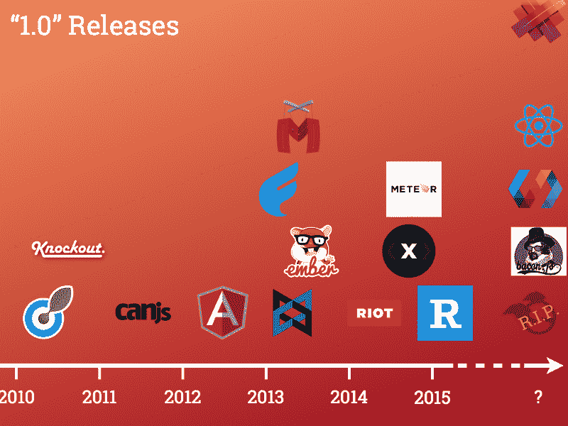

# 克服 JavaScript 框架疲劳

> 原文：<https://www.freecodecamp.org/news/overcoming-javascript-framework-fatigue-741dac9370ee/>

以特罗帕维纳为例

# 克服 JavaScript 框架疲劳

A timeline of recent JavaScript frameworks (image credit: brewhouse.io)

JavaScript 社区正在遭受一波[框架疲劳](http://www.allenpike.com/2015/javascript-framework-fatigue/)。这是由已经持续了一段时间的新框架、技术和想法的大量涌现引起的。尽管这一切都非常令人兴奋，但要跟上这一切是不可能的。

既然跟不上，那就要选择重点做什么。不得不做出这样的选择本身就是焦虑的一个原因。你是否[专注于正确的事情](https://en.wikipedia.org/wiki/The_Paradox_of_Choice#Why_we_Suffer)？你正在学习的框架是最适合你的还是有更好的？下个月[会发生什么事情让你的选择显得过时吗？](http://cube-drone.com/comics/c/the-many-angular-ones)

有一些方法可以抵抗这些疲劳和焦虑的感觉。以下是对我有效的方法。

#### 学会欣赏你已知的未知

你甚至有这个问题的事实意味着你很了解 JavaScript 中发生的事情。所有你觉得你应该学习的东西都是你知道的关于 T1 的东西。他们是你的*已知未知*。

关键是要明白，这组已知的未知数只会越来越多。你永远不会觉得自己知道得够多。事实上，情况恰恰相反:不仅新的东西总是不断出现，而且每次你学到东西的时候，你都会学到相关的东西——你还不知道的东西。

例如，当我读到 [Cycle.js](http://cycle.js.org/) 时，我明白了我对[反应式编程](https://www.youtube.com/watch?v=sTSQlYX5DU0)的总体了解是多么的少。了解 [React](http://facebook.github.io/react/) 打开了 [React Native](https://facebook.github.io/react-native/) (以及 iOS 和 Cocoa)和 [GraphQL](http://facebook.github.io/react/blog/2015/05/01/graphql-introduction.html) 以及 [redux](https://github.com/gaearon/redux) 的途径，如此循环往复。一件事总会引出下一件事。

与其让这个不断扩大的已知未知拖累你，不如学会欣赏它。

当你知道你不知道什么的时候，你就有了以后再学的选择。你知道它的存在和大概用途。这意味着你可以决定什么时候值得花时间去学习它。

我们一直在权衡各种选择。只是我们倾向于不欣赏这种选择，而是对没有学到所有东西有一种模糊的负罪感。没有任何意义。拥有这些选择比对所有你能学到的东西一无所知要好得多。

这种[未知——你不知道的事情的知识](http://baldwinboyle.com/news/antilibrary/) —不能代替实际的知识和技能，但也绝不是无用的。

#### 接受事物会不断变化的事实

如果说到 web 开发，有一件事是你可以确定的，那就是它将会不断变化。随着我们集体想出更好的做事方式，以及随着设备功能和外形的发展，情况会发生变化。

无论现在 JavaScript 的前沿是什么，你可以打赌三年后它都不会是前沿。大部分都会被遗忘很久。其中一些将会出现，但创新可能会围绕一些我们甚至无法想象的东西出现。

例如，Angular 1.x 仍然很强劲，并将在未来几年继续存在。但这不是创新的地方。同样的事情最终会发生在 React 和今天所有新的事物上。

这种情况也许不尽如人意，但却是现实。你的选择是要么接受事物会不断变化，要么保持几代人的领先地位，远离动荡。这两种选择都是完全正确的，尽管两者都要付出代价。无论如何，变*就会*不变，试图与之抗争没有太大意义。

#### 明白一切都有价值

无论你选择花时间在什么样的框架或技术上，它最终都会以某种方式帮助你。这是真的，即使它不是正确的。

你所学的一切都有助于你大脑中的神经元网络。你会建立联系，这将使你以后学习其他东西更容易。了解一件事情使你能够将它与其他事情进行比较和对比。从这个意义上说，不管是什么科目，学习总是有用的。

这意味着，急于找到一个合适的框架或技术来学习并不像有时感觉的那样重要。这些东西不仅很难找到，而且在很多情况下，它们可能根本就不存在。更容易找到的是有用的东西。他们无处不在。你不妨学习一些看起来有趣或好玩的东西，即使它可能不是绝对正确的东西。

例如，在用 Ruby 和 Rails 构建应用程序时，我花了几年时间学习各种 Ruby 技术。我今天一个都没用，我也不确定以后会不会用。白白浪费了那么多时间。我不这么认为。这些技能不仅在当时很有用，而且我也确信我在那段时间学到的一切塑造了我今天的编程方式。我完全期待同样的事情最终会发生在我现在使用的所有工具上。

绕过寻找正确框架的焦虑的一个技巧是走出你的方式去寻找那些*不会*直接有用的东西。找到[一篇有趣的计算机科学论文](https://www.recurse.com/blog/75-goodbye-paper-of-the-week)，探索其中的概念。或者花时间在与你的工作不直接相关的[技术](http://squeak.org/documentation/)上。你从这种冒险中学到的好处并不明显，但它们是非常真实的，并且经常以意想不到的方式出现。离开框架的激烈竞争一会儿也是非常令人耳目一新的。

#### 学会学习

另一个非常有用的技巧是变元，花时间学习*学习*。为什么[不自己练习解决问题的过程](http://www.amazon.com/How-Solve-It-Mathematical-Princeton/dp/069116407X/ref=dp_ob_title_bk)，或者熟读像[这样的技巧，刻意练习](http://shop.oreilly.com/product/0636920036593.do)。诸如此类的事情对于了解你的职业生涯会有所帮助。

里奇·希基是这样说的:

> “你需要仔细识别实际涉及的游戏。精通编程与语言、范例、平台、构建模块、开源、会议等没有太大关系。这些东西一直在变，不是根本。知识获取技能允许你根据需要去获取它们。我会带一个开发人员(或者甚至是非开发人员！)拥有深厚的知识积累和解决问题的技能，而不是一个经验浅薄的程序员。”

正如学习新框架(以及学习*关于*新框架)可能有价值一样，这也是更大回报可能出现的地方。变得善于学习和解决问题，你在学习下一步可能需要的新技术技能时就会少得多。

*最初发表于 [Tero 的博客](http://teropa.info/blog/2015/07/15/overcoming-javascript-framework-fatigue.html)。*