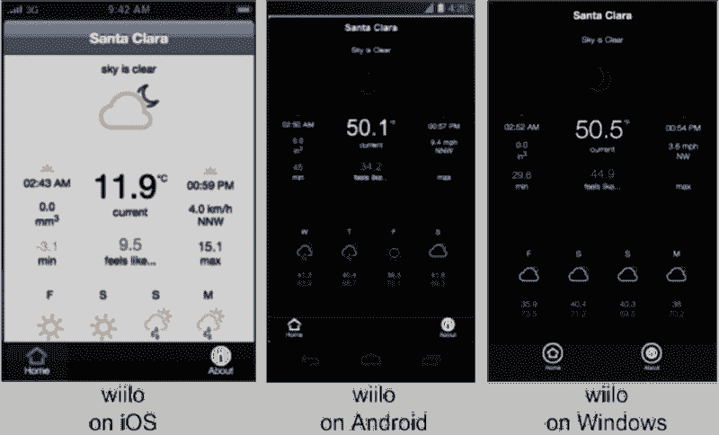

# 我如何使用 JavaScript 和 XDK 构建我的第一个多平台移动应用

> 原文：<https://www.freecodecamp.org/news/intel-xdk-or-how-i-finally-built-my-first-multi-platform-app-bc4ca181cbb5/>

作者:罗布·韦兰

# 我如何使用 JavaScript 和 XDK 构建我的第一个多平台移动应用

我必须提前承认:我有十多年开发应用程序的经验。

我主要为企业业务编写应用程序。这意味着我使用商业软件程序和专有编程语言——主要由我为之开发、受雇或两者兼而有之的组织的政策驱动。

在此期间，开源语言成长起来。而且，虽然我对 JavaScript、CSS 和 HTML 技能略知一二，但我在这些领域的技能还不足以直接迁移到 web 开发工作中。这是我最近选择的职业，因为:

*   有人把我的奶酪藏了起来，所以有必要重新学习
*   有很多人想要网站之类的东西
*   智能设备的多平台应用开发前景看好

所以，我开始重新学习。我选择了[自由代码营](http://www.freecodecamp.com)，或者说，它最终选择了我。我真的不知道是哪一个。我“如何”跳入自由代码营的水域对这个故事并不重要。尽管这是重要的背景信息。

这个故事另一个重要部分是多平台应用程序开发的前景。

我花了两年，或者更长时间，试图找到一个像样的工具，实现多平台应用程序开发的承诺。我确信，如果我坚持使用我过去尝试过的一些工具，也许会有一些有用的东西。

但是，困难就在这里:我非常着急。我没时间学。我真的需要一个开发工具，它可以不费吹灰之力地开箱即用。我想在这方面我已经习惯了商业产品。

回到自由代码营。我要说的是，我到了滑索那里。我完成了那些。我也有点注意力不集中。一旦我完成了滑索，我意识到:“现在我可以构建基于网络的应用程序了”。我现在精通开源语言:标记和脚本语言，如 HTML、CSS 和 JavaScript。这个阶段我需要休学一段时间。

因此，我再次寻找能够实现多平台应用程序开发的工具。经过一段时间的尝试，我重新熟悉了英特尔 XDK(是的，我在我的机器上安装了大约 6 个月，闲置)。公平地说，当我第一次安装它的时候，我的脚本技能有些欠缺(尽管我对 VBA、面向对象编码和关系数据库集成有全面的理解)。

英特尔 XDK 也改进了很多，在我用它构建我的第一个应用之前，我升级到了(当时的)当前版本。

那么，我为什么选择英特尔 XDK 公司而不是它的竞争对手呢？多年来，我已经测试并丢弃了大约十种不同的工具。以下是我的经验总结:

*   一款竞争产品无法让最终用户(我)编辑我自己的应用。我可以开始建立一个，但没有已知的方法来编辑它。这不是一个人们预料中的问题——永远不会。你知道，休息一段时间后，比如，我不知道，关闭我的电脑以便我可以睡觉，然后第二天回来继续开发我的应用程序——但没有办法在我的机器上访问我的工作？猜猜那个开发工具在我的机器上持续了多久…是的，我寻求支持。我找到的答案比不能编辑自己的代码更让我失望。Grrr…
*   文档:我尝试了另一个工具，其中的文档已经存在了 12 个月左右(根据发布日期)。在那段时间里，科尔多瓦已经远离了那些陈旧的文件。而且，就像许多被灰尘覆盖的东西一样，关于如何使用我想到的这个特殊工具的说明真的没有那么相关或有用。它被扔进了垃圾箱。
*   其他基于服务器的工具有点让我紧张。如果服务器停机或负责组织破产会发生什么？我怎么才能拿回我那该死的代码？我不喜欢冒那么大的风险。世界转得太快了。东西总是掉下来。我不需要因为我对应用程序主机的选择不当而将我的 IP 地址丢弃。基于服务器的解决方案的成本往往超出我的承受能力。当我写的代码托管在别人的机器上时，谁真正拥有知识产权呢？

### 关于英特尔 XDK 的更多信息

当我玩这个版本的英特尔 XDK 时，我愉快地发现，我可以让我的应用程序运行。先走。这不是一个简单的应用程序——它使用地理定位来查找一些东西。和其他三位一体的东西。我事先知道我需要一些插件。在这篇文章的早些时候玩 PhoneGap 让我接触到了 Cordova (PhoneGap 曾经是免费的，现在被 Adobe 拥有，不那么免费了)。这是几个月前的事了。查看英特尔 XDK 建议，一些东西可以由英特尔的专有代码完成，也许有些需要由第三方插件处理(如科尔多瓦)。

事实证明，当我开始的时候，一些英特尔的专有代码正在被废弃(但我这个最终用户当时并不清楚)。我选择的那段代码(on . device . ready——不是它的全名——因为我已经忘了)已经过时了。

我喜欢 XDK——因为它很好用——但是，像现在的许多工具一样，文档跟不上功能。这并不是说文档一定远远落后。在英特尔 XDK 公司的案例中，文档是全面和准确的(耶)，但是有点难以找到(aww)。

所以，是的，我在试着打这个电话，我的应用还可以。我不记得了——是我升级到下一个版本，我的应用程序崩溃了，还是我的代码无法完美工作，我也升级到了下一个版本(是的，英特尔每个月都会推出一到两次英特尔 XDK 的升级，作为一名独家交易商，请努力跟上这个时间表)。

事实上，我几乎放弃了英特尔 XDK 公司。但是，我想:“去他妈的”(我是澳大利亚人)。还有:“我快完成这个应用了。我会挺过去的。”因此，我发现一些信息表明,“on.device.ready”呼叫尚未死亡，但其朋友的家人已经死亡并被埋葬(不推荐，用大写蓝色字母表示)。为心爱的人哭泣毫无意义。是时候改变方式，积极前进了。

因此，我很快了解了 Cordova 插件，以及如何在 XDK 英特尔使用它们。事实证明这并不难。在我的第一个应用中，我使用了相当常用和著名的插件。

是的，好消息是，一旦我知道如何插入 Cordova 插件，我就不会回头了。

因此，这里有一些使用英特尔 XDK 构建应用的捷径。我的智慧之珠帮助你，读者，避开我走过的黑暗之路，保持光明:

*   我不管你想开发什么应用程序，告诉英特尔 XDK 公司开发一个 Cordova 版本。以防你需要使用插件。是的，你可能需要状态栏。因为 iOS。
*   你至少需要 HTML 和 CSS 技能。加上一些 JavaScript 以便正确使用插件。是的，如果你喜欢的话，你可以使用 JQuery。JavaScript 或 JQuery 的多少取决于您正在构建的应用程序。你将需要能够建立网站，以便使用类似英特尔 XDK。你还不知道如何建立一个网站？解决方案如下:加入[免费代码营](http://www.freecodecamp.com)，学习滑索。一旦你做到了这一点，你就可以开始玩英特尔 XDK 了。是的，你是。
*   对于您的第一款应用，请告诉英特尔 XDK 公司使用他们的模板进行构建。这会给你一些现成的代码，这将有助于简化“等等，现在怎么办？”部分。
*   index.html:这是应用程序最终用户(客户)看到的第一个用户界面。你所掌握的网站开发知识，包括免费代码 Camp Ziplines，将帮助你弄清楚如何处理这个文件。
*   GitHub:你会希望按照你使用的每个插件的说明来操作。要找到你的插件的文档，谷歌“github cordova [plugin]”，其中“[plugin]”是你正在搜索的插件的名称。例如，搜索“github cordova statusbar”应该可以很容易地找到 statusbar 插件。github 上的 cordova 插件文档非常优秀。
*   StackOverflow:在这里问你的“愚蠢”问题。别忘了先搜索你问题的答案。StackOverflow 上庞大的导师社区会特别努力地指出你的问题已经被问过(并得到了回答)。
*   [英特尔 XDK 产品论坛](https://software.intel.com/en-us/forums/app-framework):在此询问您“愚蠢的”英特尔 XDK 特定问题。英特尔的人是你的朋友(很高兴)。其他使用英特尔 XDK 的开发人员也乐意提供帮助。
*   英特尔 XDK 在构建 Windows 设备时构建了三个软件包。我仍在试图理解它为什么构建三个，但我只需要将一个上传到 Windows store。查看英特尔 XDK 论坛寻找答案。我问。[现已记录在案](https://software.intel.com/en-us/xdk/docs/xdk-doc-quick-links)。不是完整的答案。这正是你继续学习所需要的答案。够了。

### 保持简单愚蠢

好吧，这是你父母应该在你离家前告诉你的基本建议:

*   创建尽可能少的代码。
*   这包括资产文件。我的第一个应用有太多的 CSS 文件和太多的 JS 文件。说真的。我在“on.device.ready”上使用的“aww，snap”给了我一个机会，将我的 IP 整合到更少的文件中，并扔掉实际上在任何地方都没有使用的部分。这是最好的练习。
*   使用他人的代码(不是指抄袭)——使用英特尔 XDK 提供的现成模板来缩短学习曲线。至少对于你的第一个应用来说是这样。
*   卡在“如何”上？问谷歌，你会在 StackOverflow 里找到答案。根据你的目的修改学习内容，然后继续下一个问题。下次你就知道了。
*   看书。哈哈哈。好像我有时间。不过说真的。找时间。
*   我还在读 Swift 编程语言…甚至都不相关。但至少是关于代码的。
*   用别人的资产。对于我的第一个应用程序，我找到了一个 CSS 动画库，和一个整洁的字体库。我确保我的应用程序在我的应用程序的“关于”信息页面中注明了这些库。根据许可条件。因为这是正确的选择。

### 使用 XDK 创建您的第一款应用

下载并安装 XDK。

在英特尔 XDK 公司:

1.  单击“开始新项目”。
2.  选择“模板”，然后选择“布局和用户界面”。
3.  选取“标签视图”应用程序(如果您喜欢，也可以选取其他模板类型)。勾选“使用应用程序设计器”(这将安装一些现成的代码来构建和开始——耶)。
4.  单击继续。
5.  在“项目”窗口中，单击“升级到 Cordova”按钮。
6.  创建项目后，添加以下 Cordova 插件(回到项目菜单):
    Statusbar

您选择的插件将完全取决于您正在构建的内容。这些插件帮助您使用您的应用程序将在其上运行的设备的功能。很可能你至少需要一个。因为 iOS。

### 构建您的应用

除了苹果公司过度设计的要求之外(我还需要哪个该死的证书？)和“Windows 的三个选择包”，构建过程本身就很简单。转到“构建”选项卡。上传你的代码，构建你的包，下载你的包。

我不知道你怎么样。我很穷。我可以测试我的 iOS 包。我无法测试我的 Android 或 Windows 软件包。我希望有一天能够在不止一个平台上进行测试。抱歉测试豚鼠(即。我在谷歌和 Windows 设备上的所有客户)。

对于开发人员来说，英特尔 XDK 的仿真器仅作为参考。你会想出办法的。继续前进。不要俘虏。现在不是害怕“如果它不起作用怎么办”的时候。有点信心。因尝试而被诅咒。不要因为失败而被诅咒。

对于 Android，你会希望使用“Android 人行横道”选项来构建。两个词来解释为什么:“flex box”。如果您需要了解更多信息，请查看文档。Flex box 有办法潜入每个项目(以我有限的经验)。

### 有什么我不能帮你的？

*   苹果的做事方式被严重过度设计了。您必须使用复杂的方法创建自己的证书。每个人都会弄错。至少一次。坚持。
*   苹果的审核周期很长。大概 7 天(那不是印刷错误，需要几天！).这是一次扣人心弦的初次经历。app 被拒怎么办？如果被拒绝了，我会知道该怎么办吗？为什么要花这么长时间？这种审查状态意味着苹果将审查它还是我应该审查它？啊啊啊。准备好了吗？这是怎么回事？哦，还有那些不眠之夜。以及每分钟对邮件的检查。那永远不会到来。
*   谷歌需要几个小时。同样的应用程序将在 24 小时内进行审查和部署。也许更久一点。不到 48。也就是说，如果你写一个庞大复杂的应用程序，可能需要更长的时间。
*   Windows 需要几个小时。然后大约一天后就可以在 Windows 商店下载了。但是，你将没有顾客。所以这是一个有争议的问题。无论如何，为 Windows Phones 构建。这会使你的简历更加完整。

### 我现在在做什么？

我正在开发另一个应用程序。

这个故事最初出现在[creatureoftech.com](http://creatureoftech.com/)。