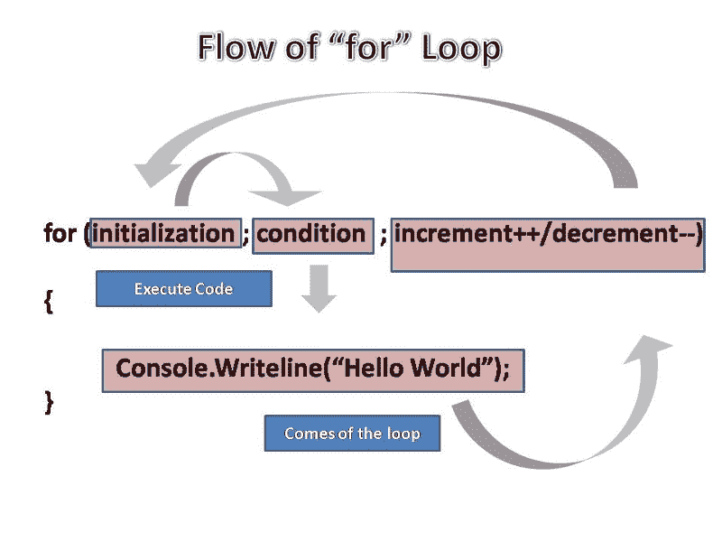

# 探索 JavaScript 迭代

> 原文：<https://www.freecodecamp.org/news/exploring-javascript-for-in-loops-bdfc226d8515/>

费斯图斯·杨加尼

# 探索 JavaScript 迭代



循环允许程序执行重复的任务，比如遍历一个数组，同时坚持 [DRY 原则](https://en.wikipedia.org/wiki/Don%27t_repeat_yourself)(不要重复自己)**。当你想多次执行一个功能，每次使用不同的输入时，它们**和**就派上了用场。**

就像其他编程语言一样，JavaScript 支持不同类型的循环。本文将探讨的**、**的**、**和**做/当**循环时的**。**

#### For 循环

循环的**是 JavaScript 循环中最常见的样式。下面是它的基本语法:**

```
for (<initialization>; <condition>; <incremental expression>) {   code block // This is executed if condition evaluates to true}
```

*   **初始化**——用于用 **var** 关键字声明新变量，通常用于初始化一个计数器变量(var i = 0)。
*   **条件** -在每次循环迭代之前要评估的布尔表达式。如果该表达式的计算结果为 true，将执行内部命令。
*   **增量表达式** - 在每次循环迭代结束时计算的表达式。这通常用于递增、递减或更新计数器变量。

示例:

```
//Counting 1 to 5for (var i = 1; i <= 5; i++) {  console.log(i);}//=&gt; 1//=> 2//=&gt; 3//=> 4//=> 5
```

```
//Iterating through an arrayvar arr = [17, 22, 35, 54, 96];
```

```
for (var i = arr.length; i >=0; i--) {  console.log(arr[i]);}//=&gt; 96//=&gt; 54//=> 35//=> 22//=> 17
```

#### For/in 循环

循环中的**用于遍历对象的属性。一个 **for/in** 语句如下所示:**

```
for (variable in object) {  statements}
```

*   **变量**-**在每次迭代中，一个不同的属性名被分配给这个变量。**
*   **对象**-**可枚举属性被迭代的对象。**

示例:

```
var myObj = {city: "Austin", state: "Texas", country: "USA"}
```

```
for (var key in myObj) {  console.log(myObj[key]);}//=&gt; Austin//=> Texas//=> USA
```

#### While 循环

**While** 循环是条件循环，在迭代开始时检查条件，如果条件为真，则执行语句。下面是一个 **while** 循环的基本语法:

```
while (condition) {  statement //code block to be executed as long condition is true.}
```

*   **条件** -在每次循环迭代之前评估的表达式。如果该条件评估为真，则执行内部命令。如果条件的计算结果为 false，那么内部语句将不会执行，程序将继续运行。
*   **语句**-**-****-**只要条件评估为真就执行的代码块。

示例:

```
var i = 0;while (i < 3) {  console.log(i);  i++;}
```

```
//=>0//=>1//=>2
```

#### 做/同时

do/while 循环是 while 循环的变体。与 while 循环不同， **do/while** 循环将执行代码块一次，然后检查条件是否为真。那么只要条件为真，它就会重复循环。

语法:

```
do {      statement //code block to be executed}while (condition);
```

*   **语句** - 至少执行一次，每次条件评估为真时重新执行。
*   **条件**-****表达式在每次循环迭代后计算。如果条件评估为真，则重新执行该语句。如果条件评估为 false，则停止执行语句。****

****示例:****

```
**`var cars = ["Tesla", "Prius", "GMC", "Ford"];`**
```

```
**`var i = 0;do {      console.log(cars[i]);              i++;}while (i < cars.length)`**
```

```
**`//=&gt; Tesla//=> Prius//=> GMC//=> Ford`**
```

****我希望这个简短的循环之旅能够帮助您更好地理解 JavaScript 中迭代的工作方式。如果你有任何关于 loops 的问题，或者只是想聊天，你也可以在 [twitter](https://twitter.com/yangani) *上联系我。*****