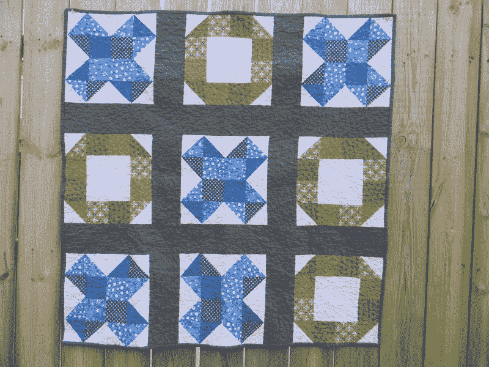

# 如何从零开始拼凑一个人工智能

> 原文：<https://www.freecodecamp.org/news/struggling-with-a-coding-challenge-follow-these-simple-steps-a5372c6ea0f4/>

克里斯托弗·菲利普斯

# 如何从零开始拼凑一个人工智能

Image source: [The Modern Quilt Guild](http://www.themodernquiltguild.com/)

昨天我从[自由代码营](http://freecodecamp.com)开始了井字游戏项目。

从很多方面来说，这是一个“编程”挑战，因为它涉及到创建智能地响应你的移动的人工智能。事实上，我们的目标是创造一个无敌的人工智能。

这似乎比从 DOM 中获取一些元素，将它们转换成 jQuery 对象，并对它们应用一些方法要复杂一些，就像我们在早期项目中所做的那样。所以我开始四处搜索，结果迷失在极大极小理论、可怕的 YouTube 教程和糟糕的指南中。

我决定自己直接跳进去。这个决定让我学到了很多。

#### 知道你不知道的事

在编码中，认识到你当前的知识和它的局限性是非常重要的。那么，你如何应对一个远远超出你所知的挑战呢？

**1。想想你将如何处理这个问题。**制定一个进攻计划，即使你还不确定每一步会如何进行。如果是在[自由代码营](http://freecodecamp.com)，确保你在这个计划中包含用户故事，以及你将如何包含每一个。

**2。从基础开始。**对于井字游戏，这意味着创建带有按钮的 HTML 和 CSS，这些按钮可以从 DOM 中取出并在 JS 中使用。

**3。使用您以前使用过的方法。**我曾多次使用 jQuery 和 JavaScript 处理 DOM 中的元素，所以获得一个按钮，给它一个 innerHTML 文本值和一个类，不是问题。

**4。创建更简单的解决方案**。对我来说，这包括创建一个没有人工智能的 2 人游戏。你可以在这里看到这个。简单概述:

*   当用户点击一个按钮时，它会在按钮上加一个“X”。然后，下一个玩家的玩家符号会变成“O”。然后它来回切换。
*   当一条获胜线创建时，会创建一条警告消息，上面写着“祝贺”+玩家符号+“您赢了”。
*   如果没有产生获胜线，则是平局，并带有适当的警告信息。

**5。用您所知道的**添加功能层。我添加了一些按钮，让你选择第一个玩家想成为的符号。这些都很简单，只是改变了一个变量。接下来我要做的是创造一些人工智能。我尝试了两件事。

*   将计算机响应放入下一个可用框中的循环。这创造了一个非常简单的人工智能，很容易被打败。看这里。
*   一个循环，它产生一个介于 1 和 9 之间的随机数，如果它是自由的，就在那个盒子里放一个值。更复杂，但最终是一个非常愚蠢的人工智能！看这里。

**6。研究、学习并完善您的解决方案**。我现在正在研究极大极小理论，这是一个递归函数，根据理论上的玩家/电脑回合来生成可能的场景。一旦我很好地掌握了这个功能，我将致力于应用它。我还需要[重构](http://blog.cphillips.co.uk/archives/98)我的代码，因为它有点乱。

没有太大的问题。利用你现有的知识，从小步开始，在此基础上，然后研究你无法完成的剩余任务。这个挑战是迄今为止所有[自由代码营](http://freecodecamp.com)课程中教会我最多的。

最初发表于[克里斯·菲利普斯](http://blog.cphillips.co.uk/archives/323)。