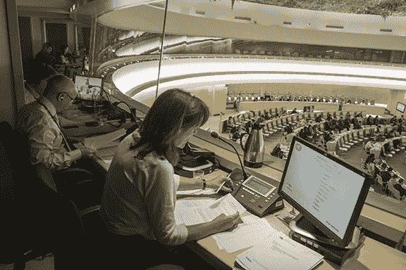

# 免费代码营可能会帮助你活得更久

> 原文：<https://www.freecodecamp.org/news/freecodecamp-might-help-you-live-longer-5c5f5104d31e/>

克里斯托弗·菲利普斯

Legendary programmer Grace Hopper lived to 85, 45 years longer than most women born in 1906.

# 免费代码营可能会帮助你活得更久

自从我在[自由代码营](http://freecodecamp.com)开始了我的 web 开发之旅，我感觉更加清醒，更加警觉，并且能够以更快的速度处理信息。直到最近我才意识到，在那里编码实际上也可能帮助我活得更长。

已经有很多关于痴呆症和阿尔茨海默氏症的研究——特别是关于保持大脑活跃和学习其他语言的研究，编码对此有所贡献。

主要术语是“认知储备”——大脑对自然退化进行功能性补偿的能力。

> *研究表明，拥有坚实认知储备的人一般不太可能表现出痴呆的典型症状——短期记忆丧失、多任务处理困难*

那么，如何通过编码来提高认知储备呢？

1.  **解决问题**:编码以不同的方式挑战你的大脑，迫使你打开新的神经通路。它[提高效率](http://www.cumc.columbia.edu/dept/sergievsky/pdfs/CogResTheory.pdf)，并提高你的大脑在挑战性条件下的工作能力。这意味着，如果你遭受脑损伤，退化或其他，你的大脑更有可能能够在更高的水平上运作。
2.  创造力:自从我开始编码以来，我注意到我的创造力和独创性有了显著的提高。这种创造力也超越了我的电脑。我的朋友报告说，我提出了更多的原创想法。[这与一项研究](http://onlinelibrary.wiley.com/doi/10.1002/jocb.62/abstract)相吻合，该研究表明“语言创造力”和认知储备的增加之间存在联系。
3.  打开新的可能性:编码打开了我的思维，让我有了无限的创造可能性。编码的创作过程类似于我攻读人类学学位时，意识到世界各地的文化表现形式千差万别。代码的可能性也是如此。这打开了我大脑中很长时间没有使用的部分，可能会提高我的认知储备。

### **双语制**

有大量的研究表明双语可以增加认知储备。当处理一种新的语言时，旧的语言在某种程度上被激活以处理新的语言。这种功能性互动在大脑中产生更多的灰质和白质，导致认知储备增加。但是我们可以假设编码语言都是一样的吗？

帕绍大学的一项研究在 17 名志愿者阅读源代码时对他们进行了大脑扫描。他们发现编程语言和自然语言激活了大脑的相同部分，并且方式相似。

增加你的认知储备不仅会降低患阿尔茨海默氏症和痴呆症的风险，而且[还被证明](http://www.cumc.columbia.edu/dept/sergievsky/pdfs/cognitivereserveinaging.pdf)对血管损伤、帕金森氏症、创伤性脑损伤、艾滋病毒和多发性硬化症的发病率有影响。你不只是通过编码来阻止痴呆症——你还对许多其他疾病产生了影响。

### 为什么选择 FreeCodeCamp？

那么为什么我特意提到了[自由代码阵营](http://www.freecodecamp.com)？我觉得他们的开源课程比我尝试过的任何其他课程都更独立，这只是导致我比其他人使用更多的大脑物质。这应该会更加增加我的认知储备。

有了免费代码营，我不仅仅是在看视频或阅读教程——我正在从一张空白的画布上创建整个项目，比如我最近的[天气应用](http://codepen.io/chris_is_phillips/pen/zvMvWz)。

下次当你在努力学习第二种编程语言，或者只是学习第一种语言的新语法或句法时，不要沮丧。它能救你的命。

*最初发表于[克里斯·菲利普斯的博客](http://blog.cphillips.co.uk/2015/11/freecodecamp-might-help-you-live-longer-2/)。*