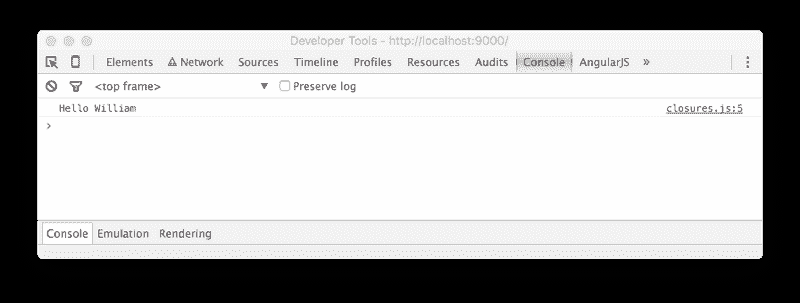
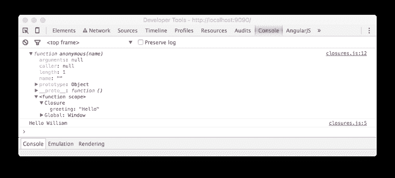

# 结束关于闭包的书

> 原文：<https://www.freecodecamp.org/news/closing-the-book-on-closures-50b095289bfa/>

威廉伯爵夫人

# 结束关于闭包的书


JavaScript 闭包是一个重要的，但众所周知容易混淆的概念。这是不可避免的——如果你想成为一名开发人员，你需要理解什么是闭包以及如何使用它们。

不要让这个花哨的名字吓到你——一旦你开始使用闭包，你就会意识到它们其实没什么大不了的。

让我们从简单的事情开始:

```
 1 function sayGreeting(greeting) {  2  3     return function(name) {  4  5         console.log(greeting + " " + name);  6     }  7  8 }
```

你会马上注意到我们的函数， **sayGreeting，**返回另一个函数。我可以在 JavaScript 中这样做，因为函数被认为是 ***、*** 一级的，这意味着它们可以像数字、字符串或布尔值等其他数据类型一样传递。这可能会产生一些有趣的语法:

```
 1 function sayGreeting (greeting) {  2  3     return function (name) {  4  5         console.log (greeting + " " + name);  6     }  7  8 }  9 sayGreeting("Hello")("William");
```

那么，当我们运行这段代码时，您希望在控制台中看到什么呢？想一想，然后看看下面的图片。



如果你猜的是“你好，威廉”，那你就对了。来吧，给自己一个鼓励。现在，让我们更仔细地了解一下*为什么。*

```
sayGreeting("Hello")("William");
```

记住 sayGreeting **返回**一个函数。正如我们前面提到的，JavaScript 中的函数是一级函数，可以像其他数据结构一样传递。因此，当**say greeting(“Hello”)第一次被调用**时，它执行并返回一个匿名函数。返回的函数也可能被调用，这就是为什么您会看到第二组括号:sayGreeting("Hello") **("威廉")**

为了更容易理解，让我们稍微修改一下代码，将第一次调用设置为一个变量:

```
 1 function sayGreeting (greeting) {  2  3     return function(name) {  4  5         console.log(greeting + " " + name);  6     }  7  8 }  9 10 var sayHello = sayGreeting("Hello"); 11 sayHello("William");
```

如果你在你的控制台上运行这个，你会得到和以前一样的结果。但是 sayHello("William ")如何从 **sayGreeting** 函数中知道参数 **greeting** 的值呢？为了理解这一点，我们需要更深入一点。

每当一个函数被调用时，内存都是为该函数及其内容留出的，即使在该函数执行完毕后，这些内容仍然存在。我们可以通过用一个 **console.dir()** 包装 **sayHello** 变量来实现这一点

```
 1 function sayGreeting(greeting) {  2  3     return function(name) {  4  5         console.log(greeting + " " + name);  6     }  7  8 }  9 10 var sayHello = sayGreeting("Hello"); 11 12 console.dir(sayHello); 13 sayHello("William");
```



你会在控制台看到，变量 **sayHello** 是一个匿名函数，在其作用域内有一个 C **losure** 与一个 **name:value** 对，

**问候:“你好”**

这应该看起来很熟悉，因为“greeting”是第 1 行的 sayGreeting(greeting) { … }函数的参数名，而“Hello”是我们第一次调用第 10 行的函数时传递给它的字符串。然后为这些值留出内存，当我们调用第 13 行上的函数时，该内存可用作外部引用。

为了帮助形象化，让我们写出第 13 行执行的 **sayHello** 函数的主体。

```
 1 function (name) {  2  3     console.log (greeting + " " + name);  4 }
```

为 name 参数传入字符串“威廉”，然后在第 3 行执行 console.log( **问候语** + " "+ **名字**)。

然后它寻找**问候**和**名字**的值。

我们的函数为 **name** 找到一个值:“William”。但是它对**问候**没有价值。所以现在是时候去钓鱼了，它查看它的外部引用(在词法范围内)，试图找到 greeting 的值。

换句话说，它记得它被显式地写在代码中的什么地方，也就是 sayGreeting 函数的内部的**。**

```
 1 function sayGreeting(greeting) {  2  3     return function(name) {  4  5         console.log(greeting + ' ' + name);  6     }  7  8 }
```

当它在其外部引用中找到**问候**的值时，我们称之为**逼近外部变量**，当这发生时，你有**闭包**。

还不算太糟，是吧？

这是一个非常基本的例子，但是即使在复杂的应用程序中，规则也是一样的。每当一个函数在它自己内部找不到某个值的时候，它就会沿着作用域链一直向下(或者向上，这取决于你的设想)寻找那个值来创建闭包。