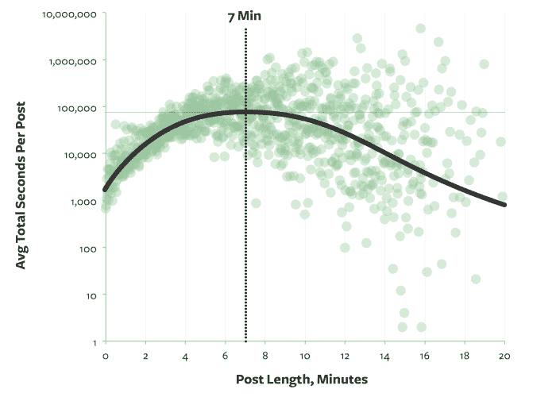
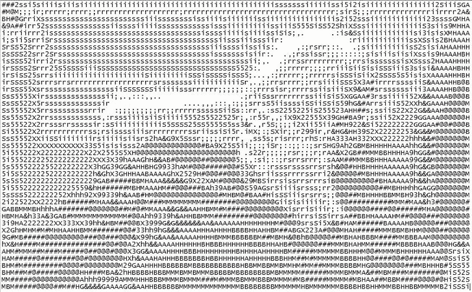

# 撰写其他开发者会真正阅读的中型文章的技巧

> 原文：<https://www.freecodecamp.org/news/this-weekend-we-launched-our-open-source-community-s-medium-publication-52954c08adea/>

这个周末，我们发布了开源社区的媒体出版物。200 多名开发人员立即报名成为作家。稍加努力，他们将与成千上万的同行分享他们的编码见解，你也可以。

我们将尽可能多地发表您的高质量文章。

以下是一些关于编写能引起其他开发者共鸣的内容的提示:

#### 通读我们已经发表的文章。试着写一些还没有人涉及的东西。

#### [七分钟](https://medium.com/data-lab/the-optimal-post-is-7-minutes-74b9f41509b#.p8jwm4wpf)似乎是最佳的中等帖子长度。但是不要为了达到目的而淡化你的职位。

#### 好的写作需要时间。不断重读和修改你的文章，直到你认为它是完美的。在你出版之前，一定要读最后一遍。

#### 自传式的帖子只有在提供有用的、非显而易见的信息时，才会引起其他人的兴趣。试着教你的读者一些东西。

#### 当你写一篇技术文章时，你的目标不应该仅仅是看起来很聪明——它应该是提供信息和被理解。

#### 避免用“文字墙”来恐吓读者。保持你的段落在 1-4 句之间，用标题和图片将它们分开。

#### 想象一下丽莎——进步的、人道主义的、永远处于青春期的《辛普森一家》中的角色——会阅读你出版的所有东西。不要发表任何会让丽莎对你失望的东西。

#### 分享您的编码见解

你绝对应该为[自由代码营](http://www.freecodecamp.com)的媒体出版物做出贡献。下面是如何做到这一点的，3 个简单的步骤(和一个更难的步骤):

1.  创建一个中型帐户。
2.  添加头像和简历。
3.  用你的用户名给[team@freecodecamp.com](mailto:team@freecodecamp.com)发一封电子邮件，请求成为我们出版物的作者。
4.  写牛逼的帖子。提交给我们。我们将对它们进行审查，并有可能发表它们。

我们收到了很多意见。如果我们不马上发表你的，请用 Gitter 给我发消息。我会给你你的提交状态和快速反馈。

关于编码的快乐写作！

*如果您喜欢，请点击？下面。关注我和免费代码营，获取更多关于技术的文章。*

