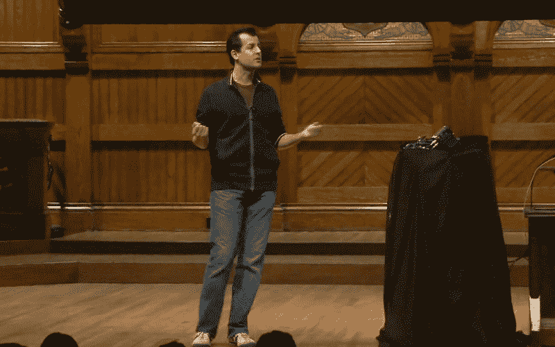

# CS50x 如何改变我对编码的看法

> 原文：<https://www.freecodecamp.org/news/how-cs50x-changed-my-world-perspective-and-totally-learn-coding-and-stuff-3cd2edd9b012/>

作者史蒂夫

David J Malan presenting CS50

# CS50x 如何改变我对编码的看法

2009 年夏天，我完成了一本西蒙·辛格写的费马大定理。这件事非同寻常的原因只有一个——*我数学很烂*。我不是指一般意义上的，或者谦虚自嘲的方式。我是说我的数学真的很烂。我离开学校时，这个科目甚至连一个基本的普通中等教育证书都没有拿到。

(对我的美国朋友来说，普通中等教育证书相当于高中文凭。)

我对微积分或代数只有一个模糊的概念。即使我尝试，我也无法描述一个图形或一个函数。见鬼，在那一点上，我甚至不知道“*到*的力量”是什么意思。

尽管有这些巨大的局限性，我还是非常喜欢这本书，以至于我立即开始了数学学习狂潮。我对这个问题的尊重又恢复了。

我很快就被吸引住了，于是我求助于我的同事，他已经获得了大学数学学位。他的名字叫安德鲁·库克，他和怪兽电力公司的詹姆斯·p·沙利文是尽可能亲密的人。

作为一名有天赋的橄榄球运动员，安德鲁也有迷人的能力来隐藏他受过良好教育，但却隐藏在一连串的幽默和愚蠢的轶事之后。如果一个话题看起来像是朝着一个重要的问题发展，他会立即将话题转移到他在一场橄榄球比赛中把丹尼·西普里亚尼(著名橄榄球运动员)摔倒在他头上的时候。

他试图隐瞒，但我知道他懂数学。我请他教我，他勉强同意了。

但是我们的辅导课很快就结束了。不是因为安德鲁的辅导技巧(这是非常出色的)，而是因为一个巨大的人格缺陷，这个星期我才刚刚能够调和。

#### ***第 n 度不断的需要***

我想说的是，不管我在学习哪一门学科，我总是觉得有必要超越基线去了解为什么事情会以这种方式发生。是需要经常问为什么，发现背后的思维。

不是只剥回来一层，或者两层，而是 *N 层*。不幸的是，我发现，在数学和计算领域，这种追求是有害的。

我在艺术方面一直是个熟练的学生。尤其是英语。在艺术学科中，对第 n 级的持续需求并不是太大的负担。事实上，这可以是一种愉快而悠闲的方式来扩大你对一个主题的熟悉程度。

比如说；当展示一幅著名的意大利文艺复兴时期的壁画时，学生可能会问为什么蓝色在作品中占据如此突出和受尊敬的位置。剥离这里的历史和文化内涵并不困难:颜料群青来自珍贵的宝石天青石，创造了一个非常深刻和丰富的色调。这种颜料价格昂贵，意味着它是留给象征圣洁和谦逊的圣母玛利亚的。

最初由阿富汗的波斯人开发的青金石受到了意大利艺术家的高度重视，颜色 Ultramarinus(翻译过来就是“海的那一边”)成为了意大利精神的同义词。事实上，这支足球队被称为蓝色军团，因为青金石是 1861 年至 1946 年统治意大利的赛唯雅的颜色。

15 世纪的艺术家琴尼诺·琴尼尼在他著名的画家手册中写道:

> 群青是一种杰出、美丽、最完美的颜色，超越所有其他颜色；人们不能对它说什么，或做什么，它的质量不会超越。”

> *——*cennini，手册(《艺术》一书，pg)。(36)

你看，在艺术中，你可以很容易地追溯思维或成就的链条，找到人类学、文化或政治事件的根源。

当你在维基百科上浏览链接时，你也可以从事一个更加随意和宽松的版本，即第 n 度的不断需求，尽管最终你总是会回到题为哲学的文章。任何一个开着 16 个维基百科标签消磨了一个下午的人都会明白这一点。

对持续需求的一个更实际的反驳是下面的格言:**接受过去的。**

****我的父亲是一名手艺人，15 岁离开学校，是一个极其务实的人。他的注意力是如此的绝对，以至于他很少提问，除了他需要多长时间来完成手头的任务——无论是建筑、贴瓷砖、装修还是他热爱的高尔夫球。他经常对我询问原因的需要感到沮丧。****

****一天，当他试图教我做木工时，他错误地提到了快速木匠法则，即“3，4，5”(通常被称为毕达哥拉斯定理)，当我问“*为什么是这个法则？”*****

****“因为事实就是如此”他摇着头回答道。****

****这就是我在 2009 年夏天带给安德鲁的令人恼火的态度。每次他试图教我一个基本的数学规则时，我都会问为什么会有这样的规则。基本原则是什么？直到最后，我们将只剩下[无限缩减](http://glosbe.com/la/en/reductio%20ad%20infinitum)来完成基础数学(整数等等。)，对此我会提出更多的问题。****

****我永远不会忘记安德鲁举起他的手说，“我们必须到此为止。有时候你必须接受什么是****

*****我考虑了他的声明，去回答，但他插话道:*****

> *****史蒂夫，确实有数学家试图质疑事物的基本顺序；他们最终会变得神志不清。你得接受 2+2。你必须接受平方根是平方根。否则整个秩序就会崩溃，你会发疯的。”*****

*****他专注地看着我，点点头。*****

> ******“疯子，你懂的。*精神错乱。*****

******不幸的是，我没有听从安德鲁的建议。相反，我把注意力转移到了计算机科学上，在这个领域里，我不断地发现自己因为无法接受该领域的前人的工作而受到限制。******

******当展示一个基本的 JavaScript 模块时，仅仅学习编程理论和命令是不够的。我必须知道编译器是如何工作的。仅仅知道它将源代码转换为汇编代码是不够的。我必须知道组装是如何工作的。仅仅知道汇编如何允许我编译的程序运行是不够的。我必须知道电荷如何在系统中传播。仅仅承认电子工程是硬件的核心是不够的。我必须知道电子是如何运动的，极性，电流，电流，门…因此循环永无止境。******

*******无限缩减。第 n 度的不断需要。*******

******几个星期之内，我已经跑题太远了，以至于我无可救药地落在了同学后面，学习也不及格。我真的对 JavaScript 一无所知，当然对编译器、汇编、电子工程或电子本身也一无所知。我迷失在自己的精神世界里。******

******直到我开始了由 [EdX](https://www.edx.org/course/harvardx/harvardx-cs50x-introduction-computer-1022) 主持的 [CS50](https://cs50.harvard.edu/) 。你们可能不知道，CS50 是哈佛大学的大型开放式在线课程(MooC ),由大卫·j·马兰(David J. Malan)主持。它教授计算机编程和计算机科学的基础知识。它最终也把我带到了[自由代码营](http://freecodecamp.com/)。******

************

******在我 32 岁的时候，在网络课程的第一周，我对无休止的第 n 个学位的需求终于停止了。******

******在第 0 周的讲座中，David 刚刚介绍了二进制、ASCII、函数、变量、循环、布尔表达式和条件的概念。他邀请全班同学使用 Scratch 编程环境进行游戏和实验。******

******就在第二周的第二次演讲中，他使用了这个句子:******

> ******“我们将在前人的基础上继续发展……创造新的东西。”******

******让我重复一遍。******

> *******“我们将在前人的基础上继续发展…* 创造新的*。”*******

******敬。创造。一些事情。新的。******

******这句话尖锐地突出了我们为什么信任前人的工作。这是为了腾出完成新任务所需的时间。为了创造下一阶段的发展，我们通过信任摆在我们面前的工作*来避免需要知道所有事情的麻痹。*******

******编码的目的不是反思，而是创新。******

******我不知道为什么我花了这么长时间才接受信任铺好的路的概念，但摆脱第 n 度的枷锁向前迈进令人耳目一新。******

******只需要对我的世界观做一个小小的调整，一个全新的创意自由的视角就展现出来了。CS50 和对计算机科学的欣赏阻止了我重新发明轮子的尝试，并让我开始在旧知识上叠加新知识。******

******现在我可以拥抱自由代码营了。******

******史蒂文·费尼是一个敏捷的蔻驰人，喜欢阅读、登山和谈论创业。他是 Sure Summit 咨询公司和[菠萝切片创意机构](https://www.slicingpineapples.com/)的创始人。******

******他在[stevenfeeney.com](https://www.stevenfeeney.com/)和[中型](https://medium.com/@steven_feeney)写博客。不用第三人称说话时，可以通过 [@steven_feeney](http://www.twitter.com/steven_feeney) 联系到他，所以不要当陌生人。******