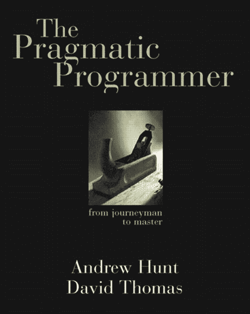
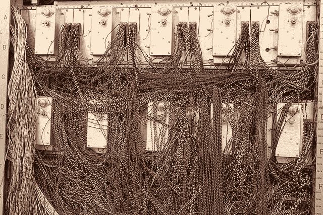

# 不要住在破窗户里

> 原文：<https://www.freecodecamp.org/news/pragmatic-programmer-broken-windows-6916998eecbe/>

作者西蒙·福斯特

# 不要住在破窗户里

昨晚，我开始阅读安德鲁·亨特和戴维·托马斯的《实用程序员》。在我寻求成为一名更好的程序员的过程中，一个实用的建议立即跃入我的脑海:**不要生活在破碎的窗户中。**

理论是这样的:一个只有一扇破窗户的废弃建筑吸引了更多的破窗户、涂鸦、垃圾，以及一种没有人关心这个建筑的感觉。然而，如果当局立即修理窗户，这是可以避免的。

你也可以将这一理论应用到生活的其他方面，比如保持厨房的清洁。在你花了几个小时打扫你的厨房使它一尘不染后，你努力保持它的干净。但是如果你的厨房堆满了脏盘子，多留一个杯子或脏碗也不会有什么影响。

这个理论的软件工程含义是，如果你注意保持你的代码整洁，它将保持这种方式。如果你知道某个东西坏了，但却没有时间去修复它，那么其他的错误和问题就会爬进来，直到它变得一团糟，没有人敢碰它。

我们有一个网站，开始变得有点问题。它没有坏，但是已经有一段时间没有人给它任何爱了。它的一些功能开始变得不可靠。

作为我工作的地方唯一的程序员，我很少有时间去思考这个网站——更不用说坐下来维护它了。

但是相关支持电话的数量一直在逐渐增加——越来越多的窗户被打破——我花了越来越多的时间修补它的漏洞，让人们开心。

我知道我知道破窗原则，我知道该怎么做:花几天时间和这个网站坐下来，找出到底是什么导致了这些问题。

然后，我会重建这些碎片，更换众所周知的破裂的玻璃，并在此期间冲洗几面墙。