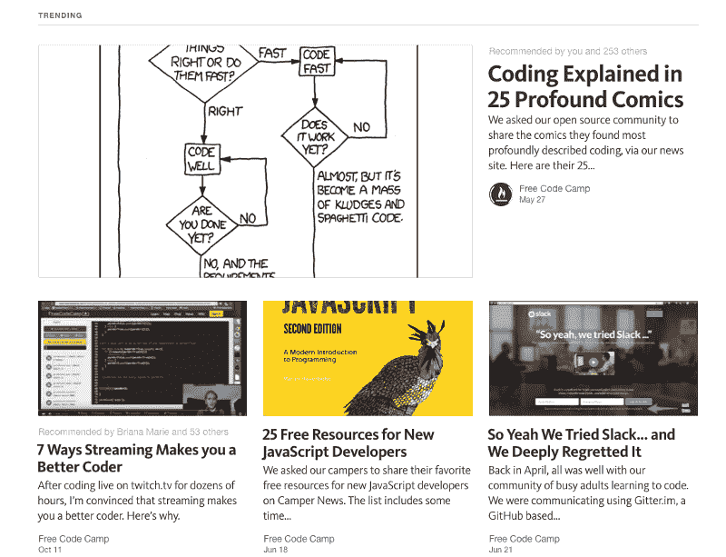

# 分享我的编码之旅

> 原文：<https://www.freecodecamp.org/news/i-ve-thought-about-blogging-my-coding-journey-for-a-while-but-nobody-would-read-it-except-for-my-9c41a9a8eb97/>

克里斯·洛夫莱斯

# 分享我的编码之旅

我曾经想过把我的编码之旅写在博客上，但是没有人会看，除非我纠缠他们。

Not me btw.

但是如果我在 Medium 上写博客，自由代码营可以获取我的博客文章并在这里向整个社区发布。

Woo hoo!

我正在学习一些基本的媒体技巧，例如:

1)始终在顶部张贴大图片，并在整个帖子中使用有趣的图片。

2)让你的帖子紧紧围绕主题。

3)如果你在为某件事挣扎，其他人可能也有同样的问题。所以写博客吧。

Medium 使创建和共享这样的内容变得如此容易。

我计划更经常地发表文章，希望我的许多文章最终会出现在自由代码营的出版物中。

Check out that snazzy looking publication.

**创建一个中型账户加入我，然后前往[http://medium.freecodecamp.com](http://medium.freecodecamp.com)，点击“关注”按钮。**

然后开始写你的编码之旅。