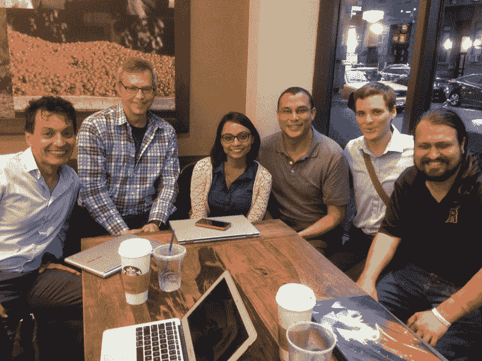
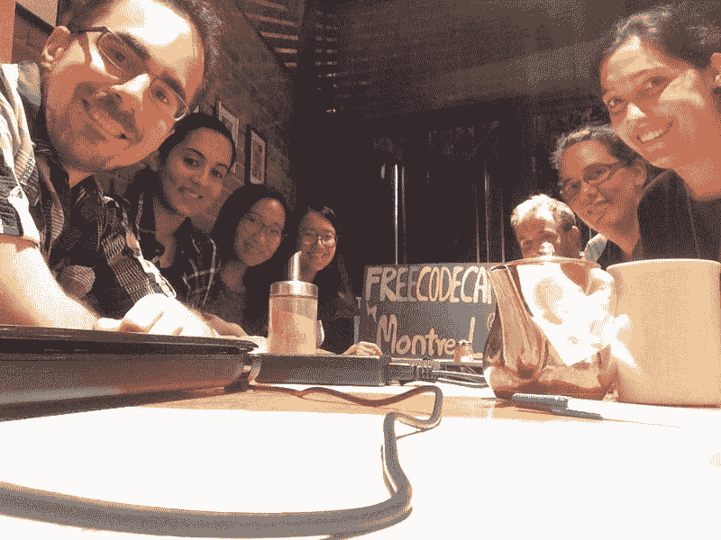
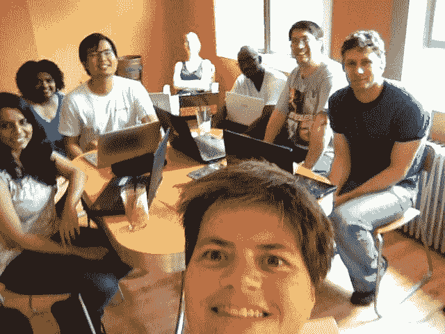

# 用咖啡和代码启动你当地的露营地

> 原文：<https://www.freecodecamp.org/news/jump-start-your-local-campsite-with-coffee-and-code-a8d1a57d30e/>

由免费代码营

A Free Code Camp coffee-and-code in New York City

# 用咖啡和代码启动你当地的露营地

我们的[脸书露营地](https://github.com/FreeCodeCamp/FreeCodeCamp/wiki/List-of-Free-Code-Camp-city-based-Campsites)是认识你所在城市的人和练习编码的好方法。任何人都可以通过参与或举办咖啡和代码会议来帮助他们的营地变得更加活跃。

Free Code Camp Montreal campers meet for a coffee-and-code

咖啡和代码会议是非正式的聚会，在那里你可以和你所在城市的其他露营者一起闲逛和编写代码。

我们最近对当地领导进行了调查，询问他们如何举办自己的咖啡和代码会议。以下是他们不得不说的话。

Campers hold a a coffee-and-code in Surigao

#### 保持随意

选择一些对你最合适的时间，然后创建一个脸书民意测验，看看哪个时间最受其他露营者的欢迎。

#### 提前宣布

露营者来自各行各业，但大多数人在不编程的时候都有工作或家庭让他们很忙。在你的咖啡和代码之前你给的通知越多，越多的人将能够参加。

A Free Code Camp Pittsburgh coffee-and-code

#### 尝试不同的公共场所

不要害怕尝试几个不同的地方，找到最好的地方。露营者在图书馆、咖啡店甚至酒吧都取得了成功。

#### 不要担心出席率

人们很忙。试着划出几个小时，这样露营者可以根据他们的时间表来来去去。只需要两个好奇的露营者就能成功地进行一次“咖啡与代码”会议。

加入我们的[当地领导人脸书小组](https://www.facebook.com/groups/freecodecampers/)了解更多信息，并发布您自己的建议。