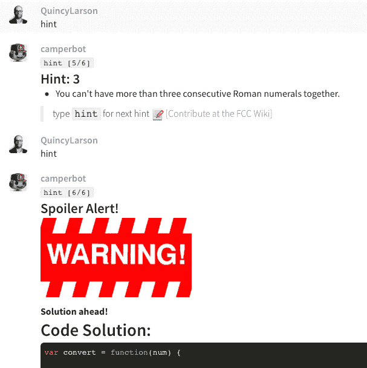
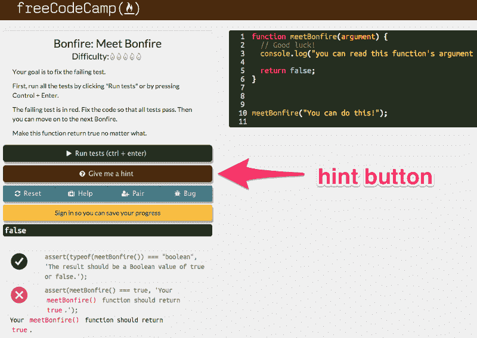
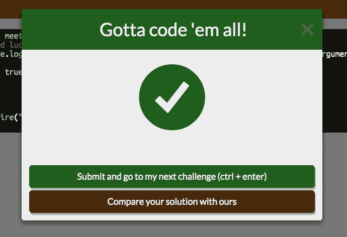
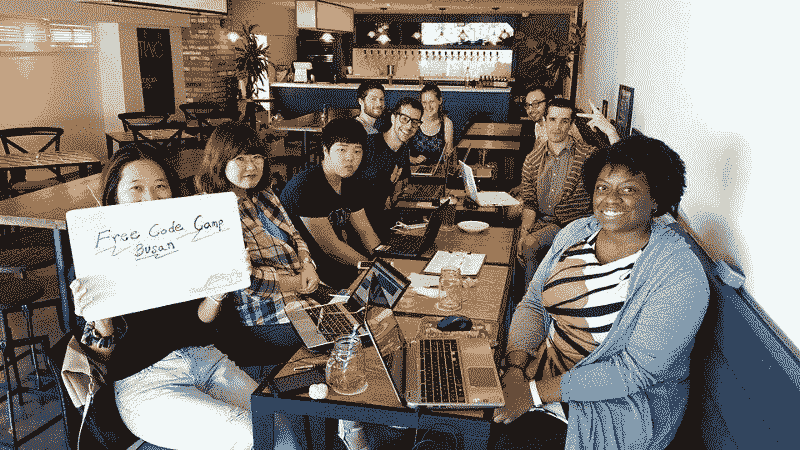
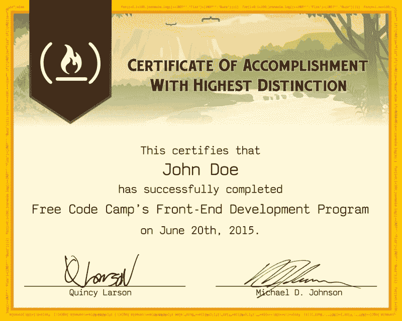

# 感谢您的反馈，我们正在改进的 5 个方面

> 原文：<https://www.freecodecamp.org/news/5-ways-we-re-improving-thanks-to-your-feedback-4b1362a2c634/>

由免费代码营

# 感谢您的反馈，我们正在改进的 5 个方面

*这篇文章最初于 2015 年 9 月 17 日发表在我们现已关闭的博客上。*

上周，我们向所有在 LinkedIn 上你的教育背景下列出了自由代码营的人发出了一份简短的 3 个问题的调查。非常感谢 400 名营员，他们已经给出了宝贵的反馈，包括无数的成功故事。

我们问的最重要的问题是，**“我们在哪些方面可以做得更好？”**以下是我们得到的五个最常见的建议:

#### 1."自由代码营应该在我遇到挑战时给我提示."

对于我们的许多挑战，比如篝火，我们在聊天室中内置了一个[提示系统。](https://github.com/FreeCodeCamp/FreeCodeCamp/wiki/camperbot)

由于这些提示被广泛要求，我们已经开始研究一个新的“提示”按钮，它将在我们的挑战中提供这些提示。

#### 2."自由代码营应该在我完成每个挑战后向我展示他们推荐的解决方案."

总是有许多方法来解决给定的编码挑战。我们不想禁止一种特定的方法。但是，由于这是一个受欢迎的请求，我们已经开始开发一个功能，允许您将您的解决方案与我们的解决方案进行比较。

#### 3."自由代码营应该教我如何使用我的本地开发环境."

对于大多数新程序员来说，配置本地开发环境占用了大量的时间，这些时间用在编码上会更好。这就是为什么我们设计的所有挑战都可以在你的浏览器中解决。虽然基于云的代码编辑器很强大，但你最终会希望在本地计算机上运行 Node.js 和 MongoDB 这样的工具。因此，我们正在撰写各种 wiki 文章，引导您在各种操作系统上配置本地开发环境。

#### 4."自由代码营应该在我的手机上运行得更好."

从我们的反馈中可以清楚地看出，露营者经常通勤，他们希望在手机和平板电脑上应对我们的挑战。我们设计了自由代码营以这种方式工作，但最近出现了一个错误，阻止了挑战提交。我们深入研究并隔离了这个错误的原因，然后修复了它。

您可以在手机或平板电脑上再次完成我们的挑战。也就是说，我们仍然建议尽可能在笔记本电脑或台式机上编码。

#### 5.“自由代码营应该在中国行得通。”

许多营员报告说自由代码营在中国已经停止工作。这是由于中国政府的防火长城，它不仅屏蔽了谷歌，还屏蔽了其 cdn 和其他有用的资源，如谷歌字体。我们已经移除了所有谷歌的 cdn，并自己提供谷歌字体，以确保自由代码营在中国正常加载。

### 我们也有一些共同的要求，我们不打算在不久的将来解决。

#### 1."自由代码营应该提供指导."

维基百科创始人吉米·多纳尔·威尔士说得好:

> “我遇到很多年轻人，他们浪费很多时间担心找不到一个能帮助他们走向成功的神奇导师。但是伟大只会来自你的内心。是的，你需要向别人学习，但要向许多人寻求智慧。”

正如养育一个孩子需要一个村庄，提升一个程序员的伟大需要一群乐于助人的朋友。

我们鼓励你牢记吉米·多纳尔·威尔士的建议，充分利用你当地的露营地、黑客空间和编码聚会，而不是寻求指导。

#### 2."自由代码营应该有其他资源的评论，比如书籍或工具."

我们选择花时间让自由代码营为你变得更好——而不是写评论让其他资源变得更好。

我们确实经常在[脸书](http://facebook.com/freecodecamp)和[推特](https://twitter.com/intent/user?screen_name=freecodecamp)上推荐资源，当我们确信它们值得你花费时间的时候。

首先，[我们的社区为新开发人员提供了 25 个免费资源](http://blog.freecodecamp.com/2015/06/25-free-resources-for-new-javascript-developers.html)。

### 许多营员也指出了我们已经解决的问题，但显然没有很好地公布。

#### 1.“使用挑战地图导航到我的下一个挑战是一件痛苦的事情。一定有更好的办法。”

我们最近在导航栏上增加了一个“学习”按钮。现在你可以点击“学习”,立即进入你上一次参与的挑战。

#### 2.“我应该能够跳过那些我已经熟悉的技术挑战。”

我们想借此机会指出，如果您愿意，您可以完全跳过我们的中途站。

没错——无论是我们的[前端开发证书](https://github.com/FreeCodeCamp/FreeCodeCamp/wiki/Free-Code-Camp-Front-End-Development-Certificate)，还是我们的[全栈开发证书](https://github.com/FreeCodeCamp/FreeCodeCamp/wiki/Free-Code-Camp-Full-Stack-Development-Certificate)，都不要求完成我们的航路点。如果你知道你在做什么，请尽情投入我们的篝火、滑索和蹦极跳。我们认为你会同意这些项目是大部分学习发生的地方。

#### 如果你的 LinkedIn 教育背景还没有加入免费代码营，只需要 30 秒。

[跟着这个链接](https://www.linkedin.com/profile/edit-education?school=Free+Code+Camp)，然后把你的毕业日期定为明年。对于“学位”，键入“全栈 Web 开发”。对于“研究领域”，键入“计算机软件工程”。然后点击“保存更改”。