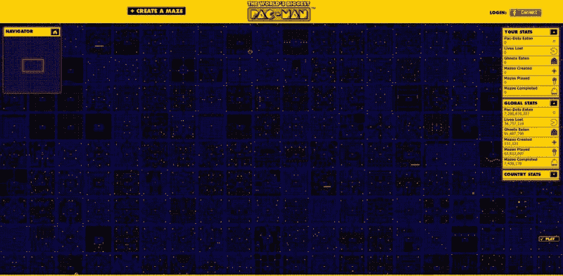
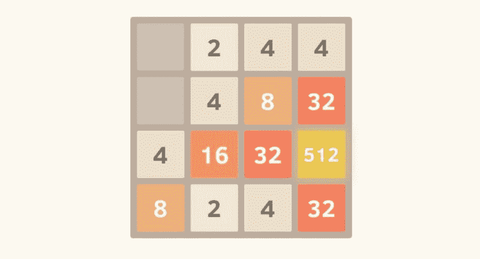

# 观看我们整个周末的代码游戏直播

> 原文：<https://www.freecodecamp.org/news/watch-us-code-games-live-all-weekend-eccdb8ed2f32/>

由免费代码营

# 观看我们整个周末的代码游戏直播

With technologies like WebGL, you can code 3D games that run right in a browser.

*注:这篇文章最初于 2015 年 7 月 15 日发表在我们现已停刊的博客上。*

本周末，我们将在 Twitch.tv 频道上直播一场不间断的游戏开发马拉松[。

JavaScript 是一种强大而通用的技术。它在 web 开发、移动开发、物联网、数据可视化，当然还有游戏中很受欢迎。](http://twitch.tv/freecodecamp)

这个周末，我们的营员将使用基于 JavaScript 的技术构建各种游戏。该剧将于美国东部时间周五下午 5 点在我们的 [Twitch.tv 频道](http://twitch.tv/freecodecamp)开播，并将持续到周日晚上。

The World’s Biggest Pac-Man takes the classic game to it’s extremes with HTML5.

JavaScript 游戏可以在任何装有浏览器的设备上运行，并且通常不需要下载，因此非常适合独立游戏开发者。有了像 WebAssembly 这样的新技术，这些基于浏览器的游戏可能很快就会在图形和游戏性方面与 Xbox 和 Playstation 游戏相匹敌。

The 2048 puzzle game, built by one person over a single weekend, took the internet by storm in 2014.

我们社区的许多开发者喜欢开发视频游戏。虽然游戏开发工作比网页开发工作更难找到，但每个人都同意游戏开发很有趣。