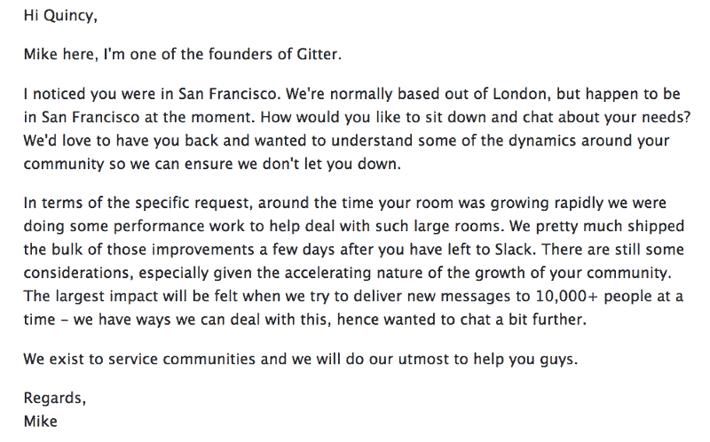

# 我们对 Slack 的体验

> 原文：<https://www.freecodecamp.org/news/so-yeah-we-tried-slack-and-we-deeply-regretted-it-391bcc714c81/>

回到四月，我们忙碌的成年人学习编码的社区一切都很好。我们使用 Gitter.im 进行交流，这是一个基于 GitHub 的聊天室系统。然而每天都有人问我“为什么你的露营者不使用 Slack？”

甚至在开始自由代码营之前，我就已经在 10 月份考虑过 Slack back，所以我很清楚它的局限性。但是渐渐的，朋友们说服了我。

首先，我们摆弄了 Slack 的 API，并为他们繁琐的电子邮件邀请系统找到了一个未记录的解决方案，这样我们就可以自动将露营者添加到我们的 Slack 中。然后哈佛的 CS50 班，最受欢迎的在线课程之一，开始使用它。我想，“好吧——如果对哈佛来说足够好，我们换一个可能是安全的。”

尽管他们的免费层警告说，你只能获得 10，000 条可搜索的存档和 5 个集成，但他们明确表示，“在 Slack 上，你可以向你的团队添加多少人是没有限制的。”所以我们认为我们不需要担心成长超过他们的服务。

我们的营员很高兴，并称赞 Slack 的热键和移动体验。Slack 的格子图案和温暖的视觉设计让他们欣喜不已。

不幸的是，我们遇到了一个未记录的限制——当我们达到一定数量的用户后，Slack 不再允许我们添加新用户。我们别无选择，只能搬回吉特。

尽管是伦敦时间凌晨 1 点，Gitter 团队中的某人很快回复了我绝望的推文，向我保证 Gitter 没有隐藏的最大房间大小。他们向我保证，事情“应该会好起来”。

值得指出的是，Gitter 是一个小团队。Crunchbase 没有显示他们有任何资金。然而，他们正在慢慢赢得与 Atlassian 的 Hipchat、Basecamp 和 Slack 等竞争对手的战斗，至少在容纳大型开源社区方面。

我试过 Gitter 的 iOS 应用。它比以前快得多，并包括了新的功能，如@mentions 上的制表符补全。

我注意到的另一件事是，Gitter 现在允许你选择隐藏你的电子邮件地址，这是 Slack 尚未实现的事情[,尽管流行的需求](https://twitter.com/slackhq/status/531750460940886016?lang=en)和相对容易实现。这是一个隐私问题，我们不得不明确警告我们的露营者，但再也不用担心了。

刚才，我甚至收到了 Gitter 创始人之一发来的邮件:

向 Gitter 团队大声欢呼，感谢他们欢迎我们的归来，并接纳了我们这个庞大的社区。