# 数字中的 2014:命令行背后的我的生活

> 原文：<https://www.freecodecamp.org/news/2014-in-numbers-my-life-behind-the-command-line-5156d508cc32/>

由免费代码营

# 数字中的 2014:命令行背后的我的生活

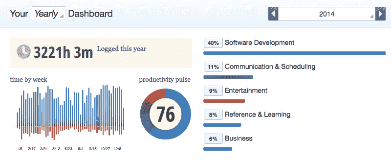

2014 年，我决定简化我的生活。我不像以前那样追求各种各样的人类体验，而是想把精力集中在几项给我带来快乐的关键活动上:阅读、跑步和编码。

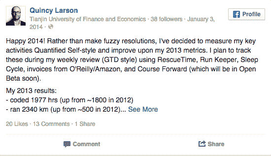

Here’s my 2014 resolution post from Facebook:

一路上，我花了一个月的时间为一个没有人最终使用的电影台词搜索引擎捕获并转录了 20，000 个声音字节。我还关闭了我和朋友一起建立的在线课程推荐引擎。

但是好事也发生了。我建立了一个快如闪电的学术引用引擎。更重要的是，我帮助发起了一场运动，让忙碌的人们通过为非营利组织建立项目来学习编码。

我能在做以前的全职公司工作时做到这一点吗？

大概不会。所以我很感激我存了每一分钱，这样我就可以离开那里了。

但是说够了。让我们继续讨论您真正感兴趣的内容，我的 2014 年数据:

### 数字

*   黑客马拉松震撼:7
*   使用笔记本电脑的小时数:3，221 小时(其中 91%的小时数具有一定的工作效率或高工作效率)
*   阅读非小说类书籍:17
*   跑步公里数:1935
*   平均睡眠时间:7:35

### 黑客马拉松

黑客马拉松是一种很好的方式:

*   会见雄心勃勃的程序员
*   练习构建和推销产品
*   并熟悉新工具。

我参加了 7 次黑客马拉松，甚至赢了几次。

### 笔记本电脑上的小时数

自由代码营没有办公室。无论我在哪里打开我的笔记本电脑都是工作。我在 iPad 上看书，并不真的试图在智能手机上做任何有成效的事情，所以我开着笔记本电脑的时间是工作时间的一个不错的替代。

不算面对面的会议，我似乎每周工作 55 个小时。我知道这一点，因为我使用一个叫做 [RescueTime](https://www.google.com/url?sa=t&rct=j&q=&esrc=s&source=web&cd=1&cad=rja&uact=8&ved=0CCAQFjAA&url=https%3A%2F%2Fwww.rescuetime.com%2F&ei=NJioVJeyBNjSoAT4ooHQDg&usg=AFQjCNEC_hb2zi_rwspT0-NO81lbcClMgA&sig2=1g0zZbuB6KB1yuK5TTw8Yg&bvm=bv.82001339,d.cGU) 的工具来准确跟踪我关注的应用程序或网站。

例如，我知道我在 2014 年有 1288 个小时专注于 RubyMine(我的 IDE)或 Terminal，我花了大约 290 个小时做娱乐相关的活动，如玩快速象棋或观看 YouTube。

The final RescueTime report for my laptop usage in 2014

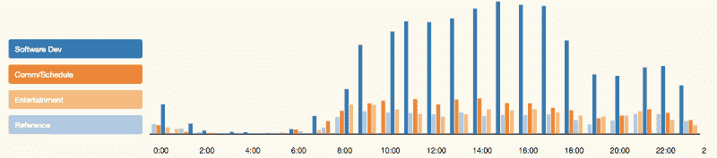

在我安顿好一天的工作地点，处理好电子邮件和社交媒体后，我的工作效率似乎在上午 10 点左右有所提高。晚上 7 点以后，我的工作效率会大大降低。

我也知道，作为一名开发人员，我经常在谷歌上搜索。

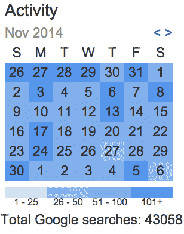

Google doesn’t provide annual stats, but this visualization gives you an idea of how dependent I am on the service.

### 健康

我从我的[睡眠周期](http://www.sleepcycle.com/)数据中知道，平均来说，我在午夜准时上床睡觉，在 7:40 醒来，这意味着略多于 5 个完整的 90 分钟睡眠周期。

所以我满足了我的睡眠决心。但是健康、饮食和锻炼的其他关键方面呢？我不追踪卡路里，因为我还没有找到一个好的被动方式来做这件事。但是我会追踪我的跑步。

八月，我在过十字路口时分心，走错了路，落在了路边。我不得不停止跑步 6 周，让我的脚痊愈。加上旅行，这意味着我全年只跑了 1935 公里(相当于 46 场马拉松)。我的目标是两倍。

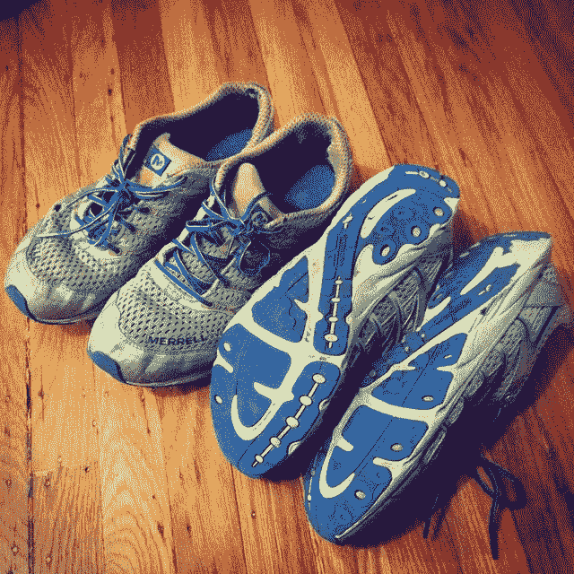

*I buy two pairs of Merrell Mix Master Move Minimalist shoes every Cyber Monday. Somehow they make it through the whole year.*

### 阅读

至于阅读，我决定对我今年读过的每本非小说类书籍做一个推特长度的评论:

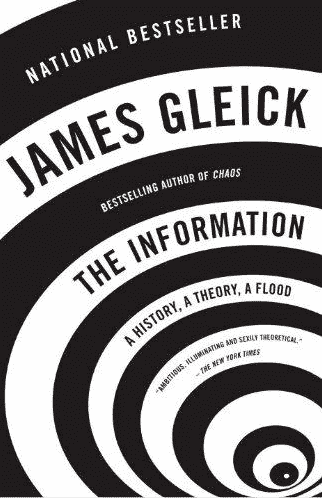

[#书评](https://twitter.com/hashtag/BookReview?src=hash):历史上的[#信息科学](https://twitter.com/hashtag/InformationScience?src=hash):[#香农](https://twitter.com/hashtag/Shannon?src=hash)到[#洛夫莱斯](https://twitter.com/hashtag/Lovelace?src=hash)到[#图灵](https://twitter.com/hashtag/Turing?src=hash)到[#道金斯](https://twitter.com/hashtag/Dawkins?src=hash)[http://t.co/FtWFXBXySl](http://t.co/FtWFXBXySl)[pic.twitter.com/F2Wwwqq1sg](http://t.co/F2Wwwqq1sg)—昆西·拉森(@奥西亚)[2015 年 1 月 3 日](https://twitter.com/ossia/status/551444565987577856)

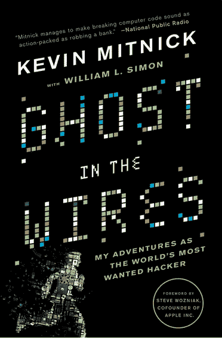

[#书评](https://twitter.com/hashtag/BookReview?src=hash):好奇心+社会工程技能+技术技能=利润，然后监狱【http://t.co/JtDAgNEmCy[pic.twitter.com/y78g7zcHEM](http://t.co/y78g7zcHEM)—昆西·拉森(@ ossia)[2015 年 1 月 3 日](https://twitter.com/ossia/status/551443550202646528)

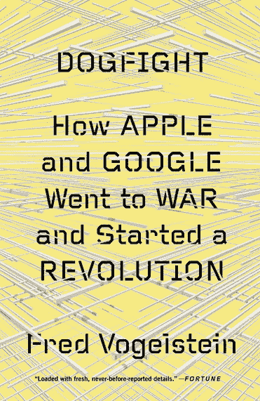

[#书评](https://twitter.com/hashtag/BookReview?src=hash)如何[#苹果](https://twitter.com/hashtag/Apple?src=hash)创造了现代智能手机，谷歌又将它民主化【http://t.co/9Qw2XGQazB[pic.twitter.com/o1bihZEG04](http://t.co/o1bihZEG04)—昆西·拉森(@ ossia)[2015 年 1 月 3 日](https://twitter.com/ossia/status/551442930502602753)

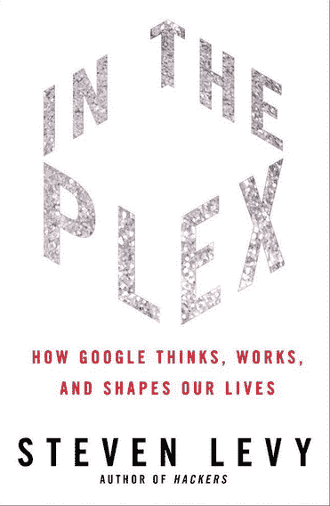

[#书评](https://twitter.com/hashtag/BookReview?src=hash):这本关于[#谷歌](https://twitter.com/hashtag/Google?src=hash)的最好的书讲述了既尴尬又得意的故事【http://t.co/EVkq2y5R1Y】T4pic.twitter.com/p7e28GeEAY—昆西·拉森(@ ossia)[2015 年 1 月 3 日](https://twitter.com/ossia/status/551442634648981505)

实用、勤奋的学者用公共资金创造了互联网。【http://t.co/hiL9XxpVys[pic.twitter.com/OG79HLTM1U](http://t.co/OG79HLTM1U)—昆西·拉森(@奥西娅)[2015 年 1 月 3 日](https://twitter.com/ossia/status/551442278678413312)

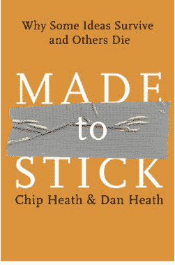

你应该只尝试传达一个观点，并且以有趣、令人难忘的方式进行。【http://t.co/PQrTLrxgcL[pic.twitter.com/mKRleIxmCR](http://t.co/mKRleIxmCR)—昆西·拉森(@奥西娅)[2015 年 1 月 3 日](https://twitter.com/ossia/status/551441712011157504)

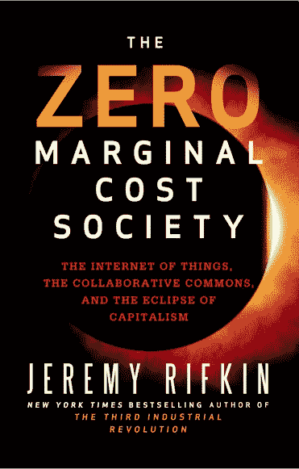

[#书评](https://twitter.com/hashtag/BookReview?src=hash):自动化驱使成本趋近于零，因此注定资本主义【http://t.co/9golBC2xm6T2[pic.twitter.com/O9w0g90lhs](http://t.co/O9w0g90lhs)—昆西·拉森(@ ossia)[2015 年 1 月 3 日](https://twitter.com/ossia/status/551441176356614144)

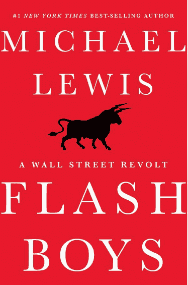

[#书评](https://twitter.com/hashtag/BookReview?src=hash):什么是 [#HFT](https://twitter.com/hashtag/HFT?src=hash) ，它是如何产生的，为什么它是金融的一个疫病，以及如何减轻它【http://t.co/Ob9EnSIDWd[pic.twitter.com/ipeud0bK2J](http://t.co/ipeud0bK2J)—昆西·拉森(@ ossia)[2015 年 1 月 3 日](https://twitter.com/ossia/status/551440410938073088)

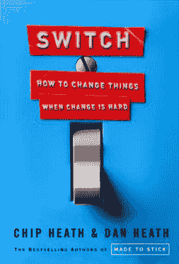

[#书评](https://twitter.com/hashtag/BookReview?src=hash):如何通过诉诸本能(大象)和理智(它的骑手)来说服【http://t.co/RQGvjHdHSeT2[pic.twitter.com/Nu4Cnsda1V](http://t.co/Nu4Cnsda1V)—昆西·拉森(@奥西娅)[2015 年 1 月 3 日](https://twitter.com/ossia/status/551440068682858497)

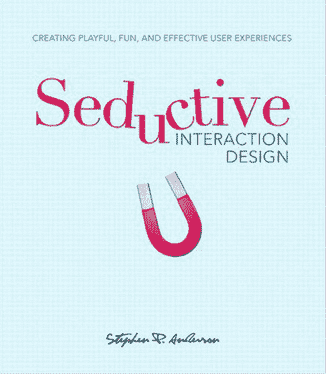

[#书评](https://twitter.com/hashtag/BookReview?src=hash):涵盖[#游戏化](https://twitter.com/hashtag/Gamification?src=hash)、[#内容策略](https://twitter.com/hashtag/ContentStrategy?src=hash)、[#情感设计](https://twitter.com/hashtag/EmotionalDesign?src=hash)趣味快捷[http://t.co/g0UcuciLyR](http://t.co/g0UcuciLyR)[pic.twitter.com/z5elEZAwHT](http://t.co/z5elEZAwHT)—昆西·拉森(@奥西娅)[2015 年 1 月 3 日](https://twitter.com/ossia/status/551439402941952000)

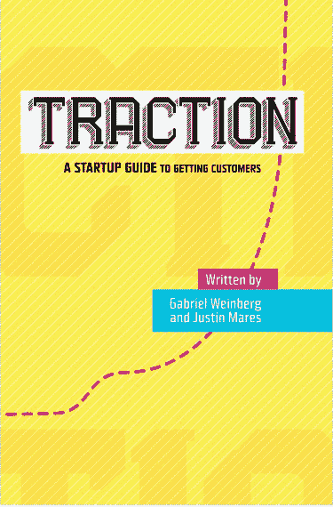

[#书评](https://twitter.com/hashtag/BookReview?src=hash):19 个成熟营销渠道的概要和选择 3 个的简单练习。【http://t.co/lzP5JJyvlF[pic.twitter.com/p5iS6DLPEl](http://t.co/p5iS6DLPEl)—昆西·拉森(@奥西娅)[2015 年 1 月 3 日](https://twitter.com/ossia/status/551433277983440896)

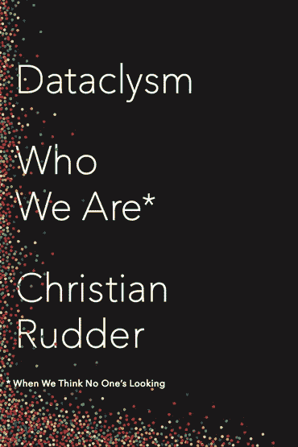

[#书评](https://twitter.com/hashtag/BookReview?src=hash):人性到底有多奇怪，多乱？我们来分析一个婚恋网站的数据吧！【http://t.co/oMOVk8jxHN[pic.twitter.com/kt0wqVJYTp](http://t.co/kt0wqVJYTp)—昆西·拉森(@奥西娅)[2015 年 1 月 3 日](https://twitter.com/ossia/status/551432834322546688)

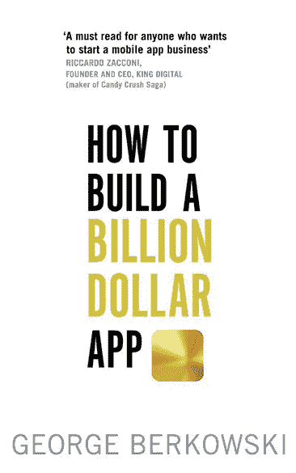

这本书有一章是关于如何把你 5 亿美元的应用变成 10 亿美元的应用。适用？【http://t.co/HXyx4Wt3IY[pic.twitter.com/1iefXwqcuj](http://t.co/1iefXwqcuj)—昆西·拉森(@奥西娅)[2015 年 1 月 3 日](https://twitter.com/ossia/status/551432034611367936)

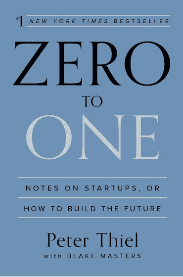

[#书评](https://twitter.com/hashtag/BookReview?src=hash):大胆不墨守成规。你也可以找到像谷歌那样的 T2 垄断企业。【http://t.co/VbT2mPYYyA[pic.twitter.com/jV7cCd6CH7](http://t.co/jV7cCd6CH7)—昆西·拉森(@奥西娅)[2015 年 1 月 3 日](https://twitter.com/ossia/status/551430125989146625)

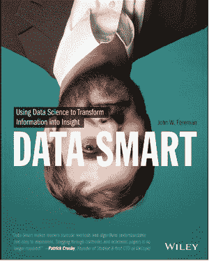

[#书评](https://twitter.com/hashtag/BookReview?src=hash):学习并应用[#数据科学](https://twitter.com/hashtag/DataScience?src=hash)概念，只需要一张电子表格【http://t.co/Ekq8cUrSuN】T4pic.twitter.com/CLvtZjTlXp—昆西·拉森(@ ossia)[2015 年 1 月 3 日](https://twitter.com/ossia/status/551428734105178112)

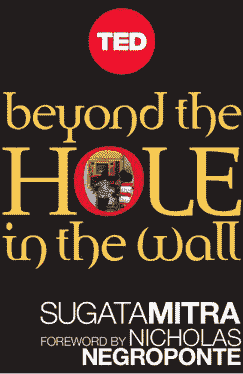

孩子们可以在最少的外界帮助下有效地相互教学。[#削皮学习](https://twitter.com/hashtag/PeerLearning?src=hash)。【http://t.co/eA661pxr7d[pic.twitter.com/zfIRAtCleO](http://t.co/zfIRAtCleO)—昆西·拉森(@奥西娅)[2015 年 1 月 3 日](https://twitter.com/ossia/status/551428393959710721)

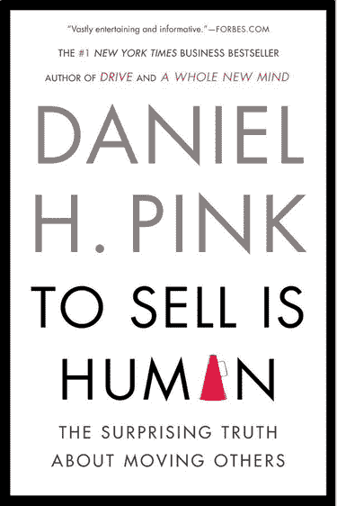

[#书评](https://twitter.com/hashtag/BookReview?src=hash):主张做销售是你人生的一大块，如何做得更好【http://t.co/T8688vD4aRT2[pic.twitter.com/cqkqsm1UmB](http://t.co/cqkqsm1UmB)—昆西·拉森(@ ossia)[2015 年 1 月 3 日](https://twitter.com/ossia/status/551426643542425600)

## 2015 年决议

我对我简单的新生活方式很满意。跑步既有趣又免费，它让我在城市里参加一个又一个会议。每周都有伟大的新书问世，随着作者应用更多定量的、数据科学风格的方法，见解的质量只会提高。结对编程是了解人们的一种很棒的方式。事实上，我在新年的时候和韩国的另一个代码营员结对编程。

因此，我的 2015 年决心是努力为自己保持这些提高的标准。也就是说，今年我将竭尽全力达到 4000 公里。