# 25 幅深刻的漫画解释了编码

> 原文：<https://www.freecodecamp.org/news/coding-explained-in-25-profound-comics-8847ea03819c/>

由免费代码营

# 25 幅深刻的漫画解释了编码

我们要求我们的开源社区通过我们的[新闻网站](http://freecodecamp.com/news?ref=25comics)分享他们发现的最深刻描述编码的漫画。以下是他们最受欢迎的 25 幅漫画。

### #1

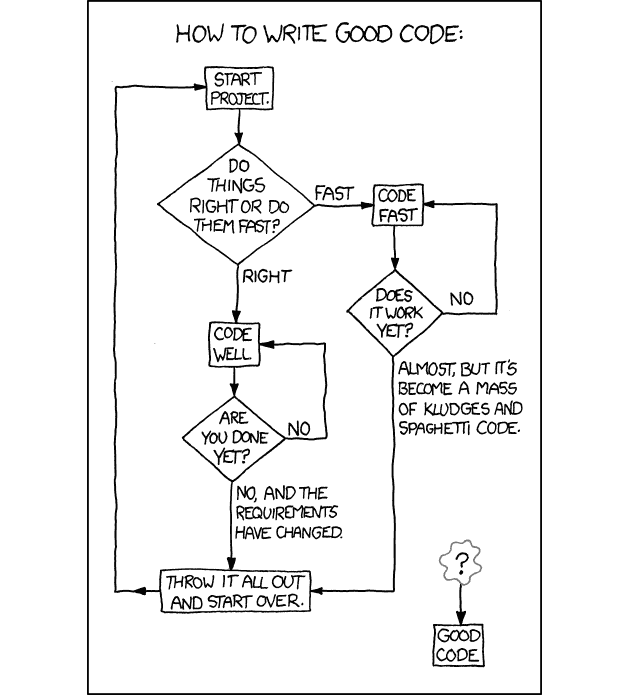

artist: [Randall Munroe](http://xkcd.com/license.html)

### #2

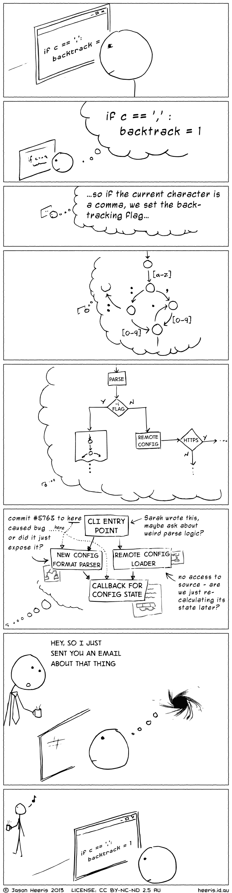

artist: [Jason Heeris](http://creativecommons.org/licenses/by-nc-nd/2.5/au/)

### #3

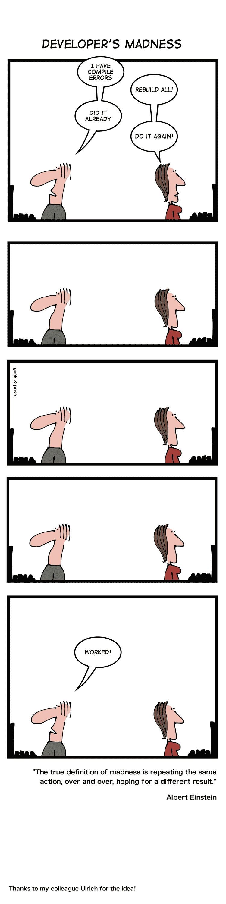

artist: [Oliver Widder](http://geek-and-poke.com/)

### #4

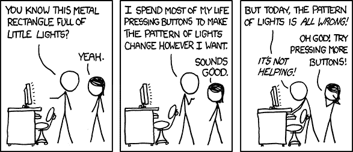

artist: [Randall Munroe](http://xkcd.com/license.html)

### #5

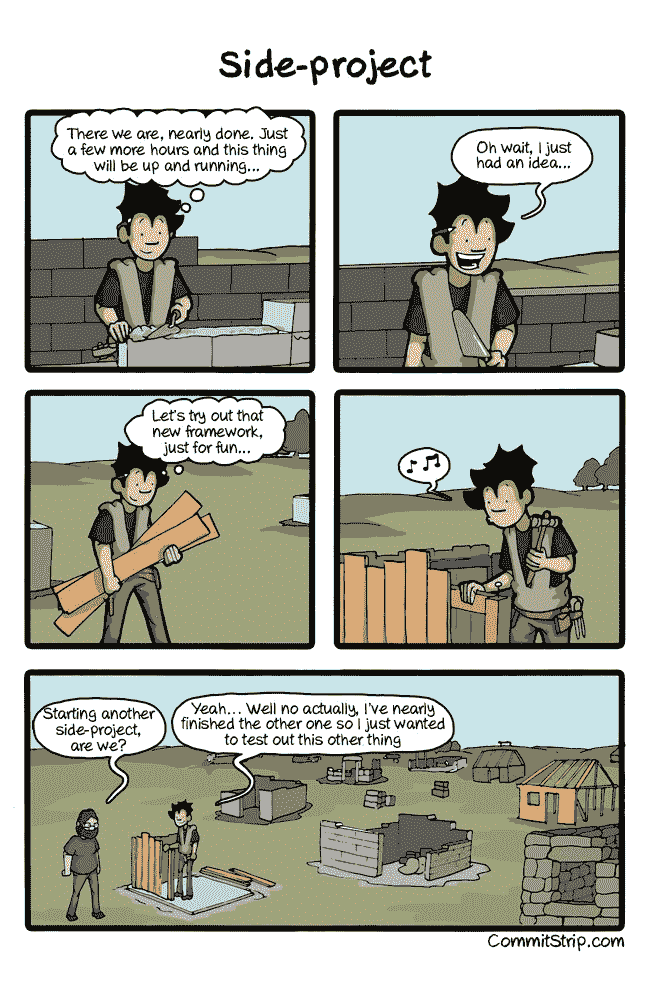

artist: [CommitStrip](http://www.commitstrip.com/en/about/)

### #6

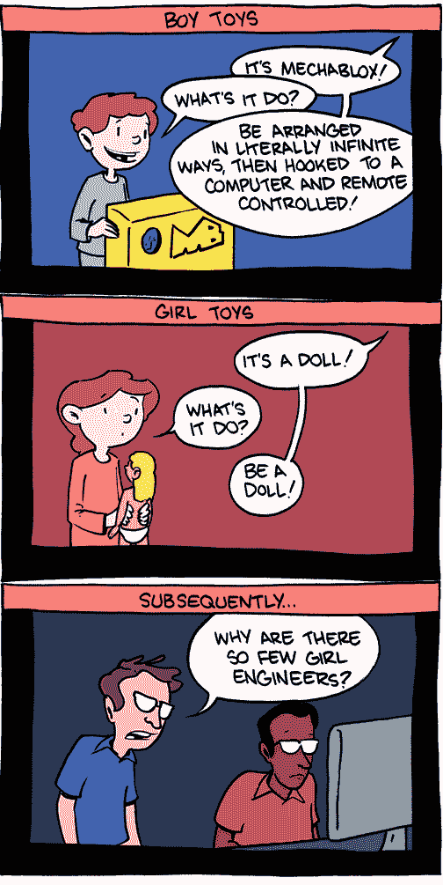

Artist: [Zach Weinersmith](http://www.smbc-comics.com/)

### #7

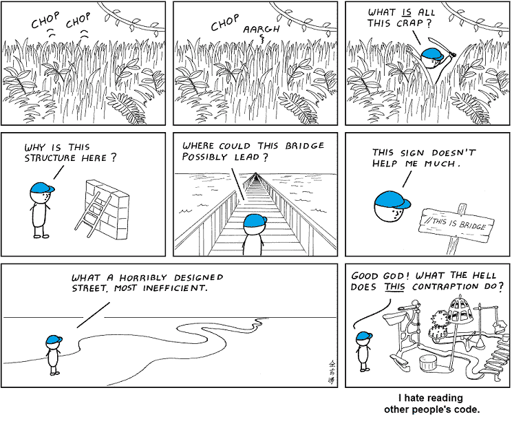

artist: [Abstruse Goose](http://creativecommons.org/licenses/by-nc/3.0/us/)

### #8

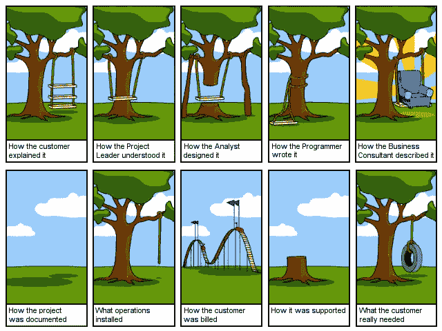

Originally published between 1969–1975 on paper. Variations exist. Create your own at projectcartoon.com

### #9

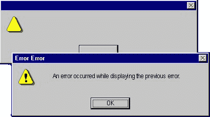

Artist: Unknown

### #10

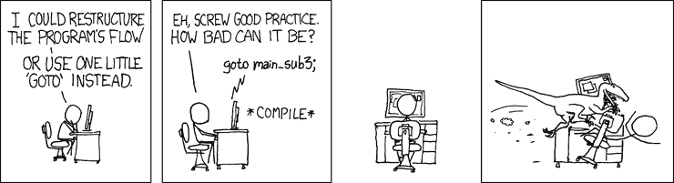

artist: [Randall Munroe](http://xkcd.com/license.html)

### #11

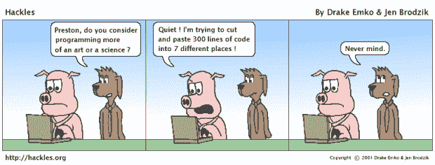

artist: [Drake Emko and Jen Brodzik](http://hackles.org/index.html)

### #12

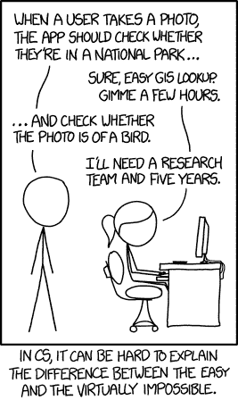

artist: [Randall Munroe](http://xkcd.com/license.html)

### #13

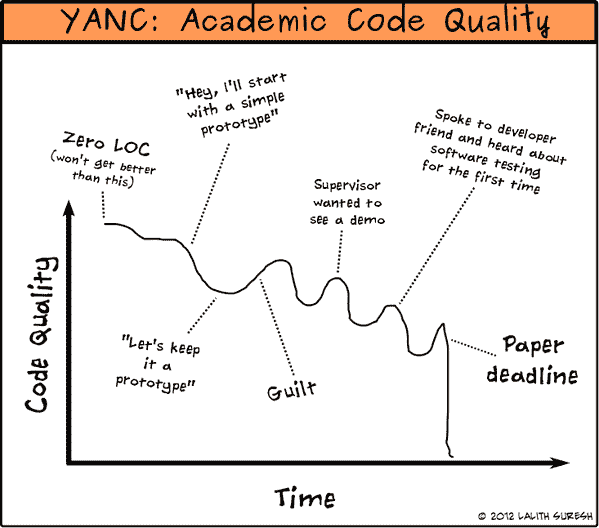

Artist: [Lalith Suresh](http://lalith.in/2012/06/07/academic-code-quality/)

### #14

artist: [Randall Munroe](http://xkcd.com/license.html)

### #15

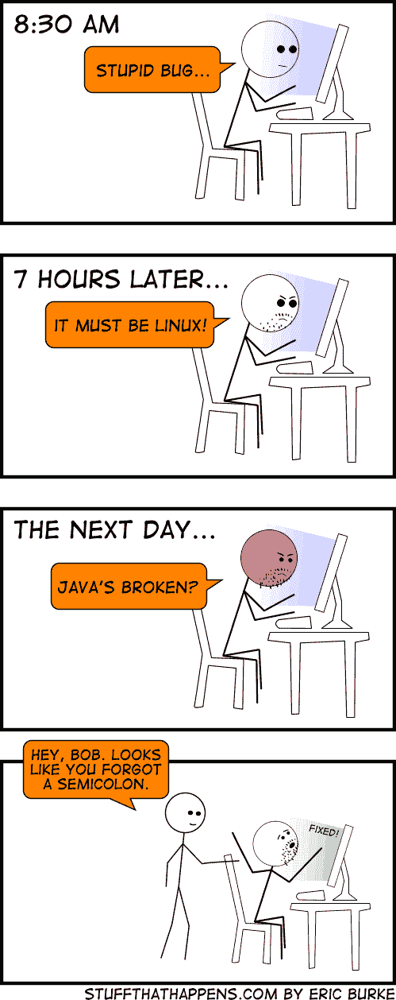

artist: [Eric Burke](http://stuffthathappens.com/?f)

### #16

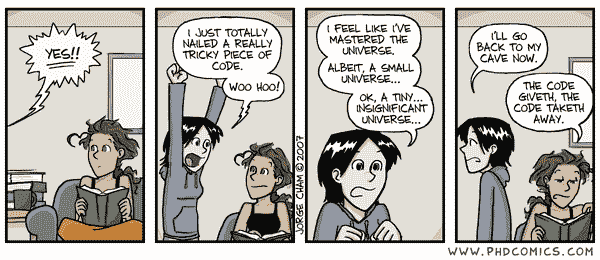

artist: [Jorge Cham](http://jorgecham.com/)

### #17

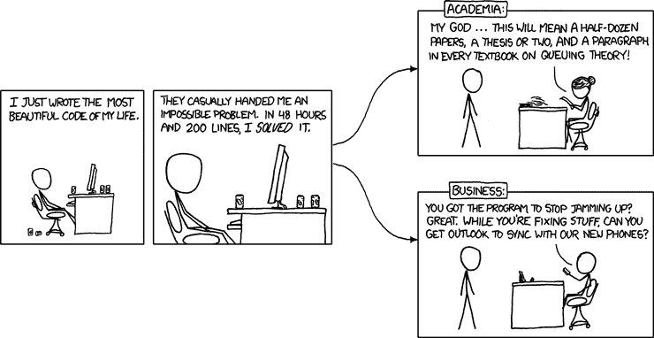

artist: [Randall Munroe](http://xkcd.com/license.html)

### #18

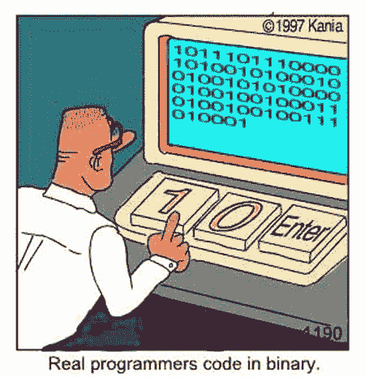

Artist: Kania

### #19

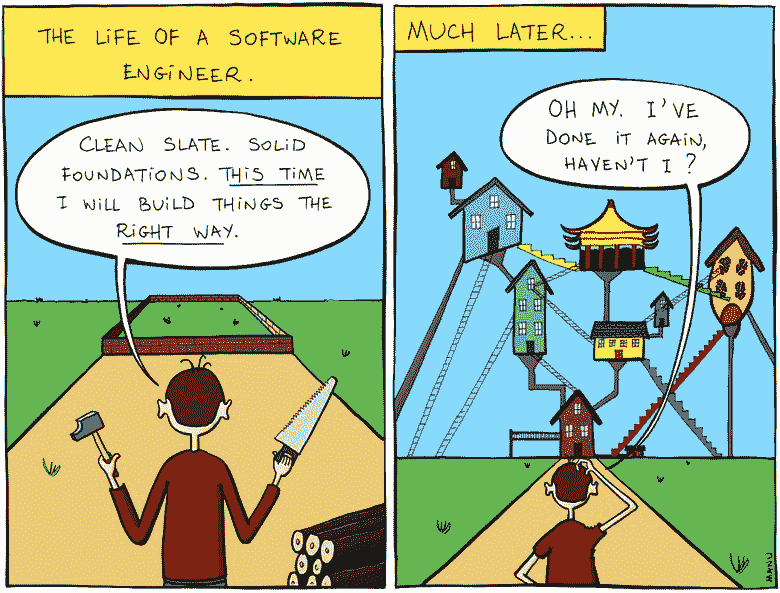

artist: [Manu Cornet](https://plus.google.com/+ManuCornet/posts)

### #20

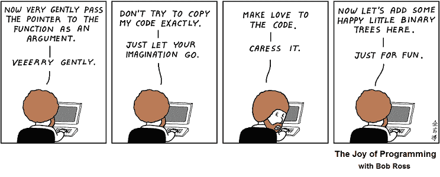

artist: [Abstruse Goose](http://creativecommons.org/licenses/by-nc/3.0/us/)

### #21

artist: [Randall Munroe](http://xkcd.com/license.html)

### #22

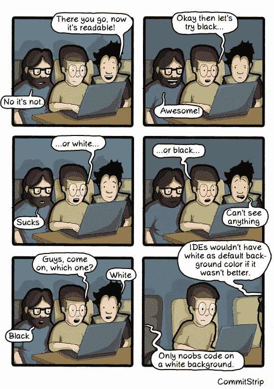

artist: [Commit Strip](http://www.commitstrip.com/en/about/)

### #23

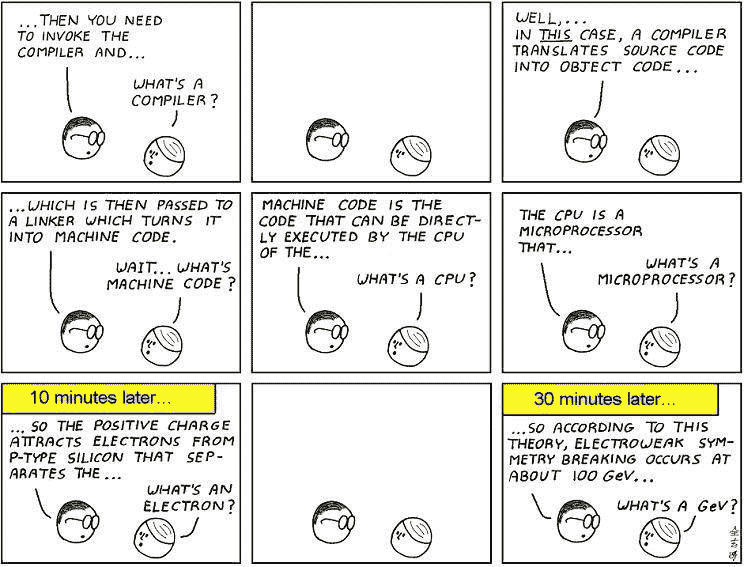

artist: [Abstruse Goose](http://creativecommons.org/licenses/by-nc/3.0/us/)

### #24

artist: [Randall Munroe](http://xkcd.com/license.html)

### #25

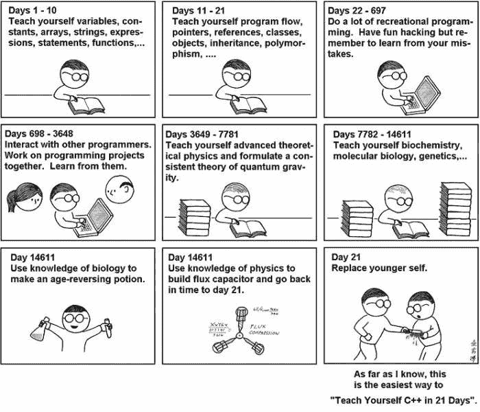

artist: [Abstruse Goose](http://creativecommons.org/licenses/by-nc/3.0/us/)

我们不能帮助你在 21 天内学会编码，但是如果你能安排一年的晚上和周末，让我们试试:[freecodecamp.com](http://freecodecamp.com?ref=25comics)。

特别感谢以下贡献漫画的营员: *@* 最大化*，* @carlp3，@serpentadonis，@duttkapil，@noellegrandison，@biancamihai，@anthonygallina，@bergy，@dougtslug，@harames，@elliescode，@denmch。和整个自由代码营社区投票支持他们。