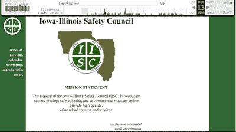
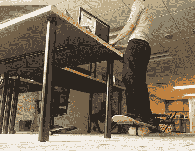

# 为什么我退出了自由代码营

> 原文：<https://www.freecodecamp.org/news/why-i-dropped-out-of-free-code-camp-717d8ed21ced/>

由免费代码营

# 为什么我退出了自由代码营

我完成了[自由代码营的](http://www.freecodecamp.com)课程，为其开源代码库做出了贡献，然后以比我预期的快得多的速度找到了一份编码工作。这些天来，我忙于在做父亲、丈夫和全职软件工程师之间周旋。所以我决定退出[免费代码营](http://www.freecodecamp.com)。

六个月前，我带着一种新发现的严肃态度来到了[自由代码营](http://www.freecodecamp.com)。我只是涉猎了一下自学。我坚定地致力于尽快成为一名合格的初级开发人员的目标。

### 我的旅程

我是布兰登·拜尔斯。我是一名 31 岁的父亲、丈夫和软件工程师。

我第一次开始摆弄代码是在小学的时候，当时我正坐在家里的第一台电脑后面:一台 Macintosh Centris 610。Hypercard 是我对编码的随意介绍。短暂地转向 C++让我对低级语言敬而远之。然后我开始制作网站，并爱上了我的第一个真正的文字编辑:BBEdit。中学时，我加入了学校的第一个学生网站管理员团队。在 20 世纪 90 年代末，我获得了 500 美元，为一个非营利组织设计了一个网站。我成了职业选手。

In high school, I received $500 to build this site in raw HTML.

我合理化自己不想长大成为程序员，因为我不想整天坐在电脑后面。

我的青少年时代带来了分心。当我回到 HTML 时，我发现 CSS 和 JavaScript 已经加入了这个聚会。我作为一个简单的网站管理员的日子结束了。CSS 和 JavaScript 增加的复杂性让我放弃了编码。我合理化自己不想长大当程序员，因为不想整天坐在电脑后面。高中毕业后，生活引领我走向一个我认为比编码更有创造性的方向。我在东南亚留学。我继续深造，在爱荷华大学获得了戏剧艺术学士学位。

我经历了许多职业:服务员、按摩师、剧作家、面具制作人、摄影师、播客、出版过的烹饪书作者。大多数都不成功。除了在紧迫的期限内写一本书的强度之外，这些路径都没有像我渴望的那样挑战我的大脑。我因缺乏目标而感到沮丧。

我的发酵手册。我也有发酵播客和网站。

经历了这一切，编码慢慢回到了我的生活中。大约三年前，我开始学习 Ruby。但是自学了半年多，感觉比开始的时候更失落。我断断续续地回到 Ruby，但它从来没有真正坚持过。

我花了太多时间来考虑学习哪种语言和框架是最重要的。很多时候，我都怀疑自己到底吸收了多少。然后我重新发现了 JavaScript。我不确定如何或者何时，但是大约一年前，我决定 JavaScript 适合我。那时，我是一个全职爸爸，带着我蹒跚学步的儿子。我经常熬夜或早起，以便在一天中尽可能多地自学。我最大的挑战不是缺乏睡眠，而是缺乏条理。当我对某人负责时，我觉得我能完成任何事情。但是当我完全独立的时候，我的计划往往会变得分散。

### 寻找免费代码营

我在书籍、长篇视频教程和博客帖子中的特别课程建议中寻找结构。然后，在 2014 年 10 月，我看到一条关于一个名为[自由代码营](http://www.freecodecamp.com)的新社区的推文。我马上就报名了。我喜欢和非营利组织一起做真实项目的结构和概念。

但是我继续在我不同的程序和结构风格之间跳跃。我很少参加自由代码营聊天室的讨论。我成了一个偶然的[自由代码阵营](http://www.freecodecamp.com)潜伏者。尽管如此，我还是有一种强烈的愿望要把自己塑造成一个合法的开发者。我知道我需要责任感。我强迫自己加入自由代码营聊天室的讨论。

我以前认为自己智力不足的地方，变成了所有人在实践编写代码的艺术和科学时遇到的常见绊脚石。

很快，我发现一些营员志愿为开源代码库做贡献，并培育社区。对我来说，这是一个有目的参与的好机会。深夜的讨论。结对编程。这些是转变的时刻，当我从独立学习的黑暗中走出来，走向共同挑战的光明。我很快意识到我并不孤单。我以前认为自己智力不足的地方，变成了所有人在实践编写代码的艺术和科学时遇到的常见绊脚石。

学习编码是一项挑战。每个人学的都不一样。对一个人来说容易的事对另一个人来说可能很难。但是总的来说，我们都有知识可以分享。我们每个人都至少为社区带来一种经验或技能——一些对我们来说容易的东西，然后我们可以帮助其他人理解。同样，当我们陷入无法理解的困境时，其他人也会在那里支持我们。

我似乎通过教别人学得最好。所以我抓住机会设计了一点自由代码营的课程。具体来说，我参与了一些原始的篝火晚会。编写这些算法挑战让我对它们背后的代码有了更深入的理解，这直接导致了我今天的工作。

### 得到这份工作

我 2015 年的目标是在年底成为一名工作开发者。相反，我在第一季度找到了一份工作。

只要有可能，我都会参加当地的开发者会议。在一次活动中，我遇到了一个一年多没见的朋友。我和他分享了我的免费代码营经历。我告诉他，在设计了一些篝火算法挑战后，测试终于开始对我有意义了。

我的朋友告诉我，他有一个朋友在一家公司工作，该公司正在招聘一名可以编写自动化测试的开发人员。一次偶然的相遇导致了一系列的面试。一周后，我找到了一份工作。我被雇佣了。

我的正式头衔是测试助理软件工程师。我在威斯康辛州麦迪逊的一个小型远程团队工作，为一家名为 Interactive Intelligence 的公司工作。我主要用 Angular.js、Node.js 和量角器编码。这份工作既有挑战性又有回报，而且我的工资比以往任何时候都高。到目前为止，代码职业是我所希望的一切。

我对从露营者到工作者的无缝过渡感到惊讶。如果没有自由代码营，我能找到工作吗？最终，当然。但是[自由代码营](http://www.freecodecamp.com)提供了一个远比我之前 24 年涉足科技更密集的体验。

我在新工作岗位上站在平衡板上编码的自拍照。

### 前进

我还没有完全恢复工作/生活的平衡，也没有时间为[自由代码营](http://www.freecodecamp.com)做贡献。但是我永远感激所有的营友，是他们让我朝着正确的方向前进。

哦，还有我小时候对整天坐在电脑后面做程序员的恐惧？这是完全没有根据的。

首先，我喜欢坐在电脑后面，并且一直如此。拿工资做这个是一个巨大的额外津贴。第二，我不坐，我站着。我不只是站着不动，我整天都在平衡板上移动，一边打字。但是平衡板是以后的事了。在那之前，编码快乐！

*最初发布于[blog.freecodecamp.com](http://blog.freecodecamp.com/2015/05/why-i-dropped-out-of-free-code-camp.html)2015 年 5 月 14 日。*