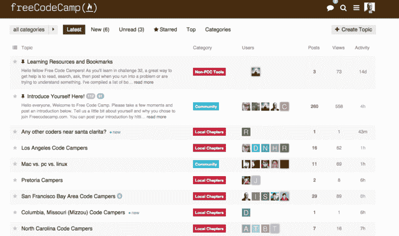
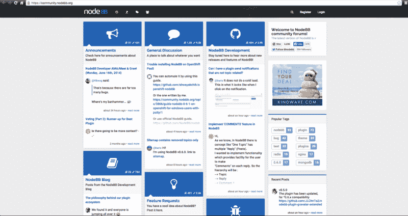
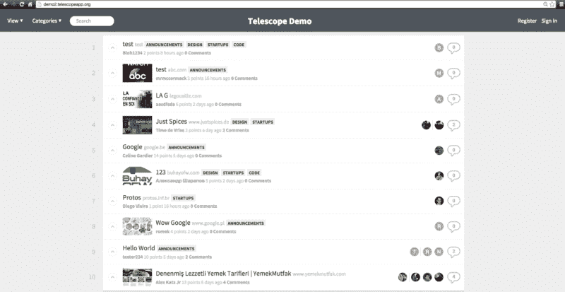
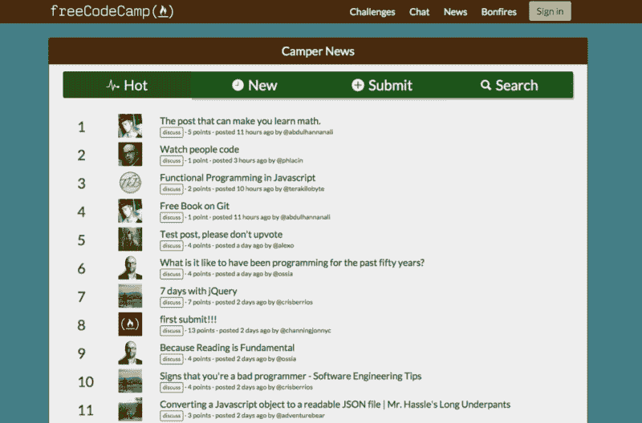

# 现代讨论工具概述，以及为什么我们决定建立自己的讨论工具

> 原文：<https://www.freecodecamp.org/news/an-overview-of-modern-discussion-tools-and-why-we-decided-to-build-our-own-54bd98c48b15/>

由免费代码营

# 现代讨论工具概述，以及为什么我们决定建立自己的讨论工具

我们的聊天室是一个有趣的地方，可以闲逛、交朋友和获得快速帮助。但是我很早就知道我们的营员想要一个不太同步的地方来讨论文章和分享他们的项目。

我们需要一个现代化的讨论工具，具有投票、评论、线程和搜索功能，可以被搜索引擎进一步索引。

既然我们是[务实的程序员](http://amzn.to/1wWvhrz)，而且我们尽了最大努力避免[没有发明这里的综合症](http://en.wikipedia.org/wiki/Not_invented_here)。我们决心给市场上的每一种产品一个公平的机会。所以首先我们尝试了以下所有方法:

### Reddit 子 Reddit

优点:

*   您可以在不到一个小时的时间内创建并配置一个子编辑。
*   Subreddits 是免费的，可靠的，由 Reddit 管理。
*   子记录作为一种发现机制。其他 Reddit 用户可能会偶然发现你的 subreddit。

缺点:

*   Reddit 的页面充满了分散注意力的按钮和广告，不断地将用户的注意力从你的内容上引开。
*   它需要一个 Reddit 登录名和密码，以及活动会话。
*   Reddit 得到的是反向链接，而不是你。

### 话语

优点:

*   话语有大量的功能和一个强大的管理面板。
*   Discourse 自动将图像和夜间数据库转储备份到 AWS S3。
*   您可以使用 [Bitnami](https://bitnami.com/stack/discourse) 在几个小时内将 Discourse 部署到 AWS 并进行配置。

缺点:

*   为了定制和维护对话实例，您需要了解 Ruby on Rails。
*   话语希望你按照它的方式做事。例如，你不能禁用它的任何热键。
*   话语缓慢。即使是在一个小型 EC2 实例上(大约 700 美元/年)，应用程序也只是爬行，不管使用它的人有多少。

### NodeBB

优点:

*   NodeBB 是用 NodeJS 写的，所以速度很快。
*   NodeBB 被设计为与 Redis 一起工作，这在模式设计中有所体现。MongoDB 支持感觉像是“附加的”。
*   多亏了一个活跃的开发社区，它每天都在变得更好。

缺点:

*   我们无法让它在 Heroku 和 MongoDB 上运行，也找不到任何关于我们如何做到这一点的文档。
*   NodeBB 做了很多事情，但没有一件做得特别好。

### Telesc.pe

优点:

*   Telesc.pe 在功能上与 Hacker News 和 Reddit 几乎相同

缺点:

*   你得用 Meteor.js 来定制和维护。
*   上次我们尝试时，Telesc.pe 无法在 Heroku 上运行，尽管构建包应该允许 Meteor 应用程序在 Heroku 上运行。

### 露营者新闻

在尝试了所有这些解决方案并发现它们对我们的露营者来说不是最佳的之后，我们决定放弃并建立一个我们自己的解决方案。优点:

*   露营者可以立即开始张贴，而不必离开自由代码营或创建额外的登录和密码。
*   营员的帖子链接回他们的自由代码营作品集，提升他们在社区中的形象。
*   每次提交都成为一个可搜索的工件，露营者可以在未来找到并使用。

我们可以观察聚合行为，A/B 测试，利用收集到的数据让自由代码营成为更好的学习编码的地方。

我们尽量贴近 Reddit、产品搜索和黑客新闻的惯例。

随着我们从营员那里得到反馈，营员新闻将继续发展。它已经是开源的，但我们可能会更进一步，让我们的一些营员将它分解成一个独立的应用程序。

点击这里查看露营者新闻。我们期待着阅读您的文章。

*最初发布于[blog.freecodecamp.com](http://blog.freecodecamp.com/2015/03/an-overview-of-modern-discussion-tools-and-why-we-decided-to-build-our-own.html)2015 年 3 月 10 日。*