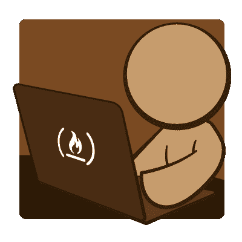
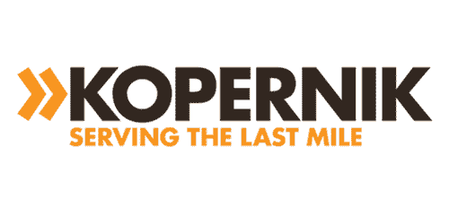
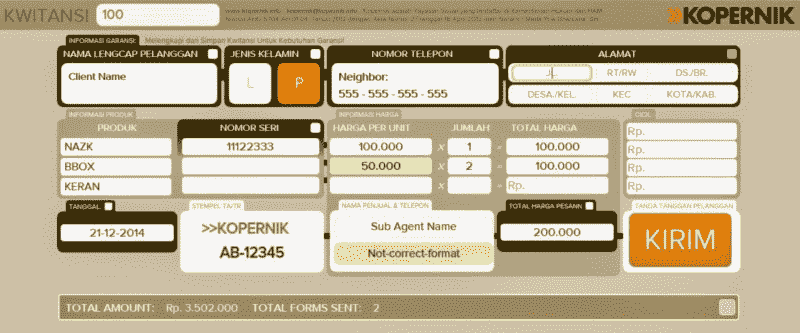
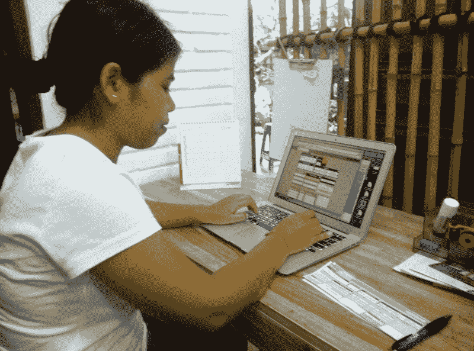

# Kopernik:一个非盈利项目回顾

> 原文：<https://www.freecodecamp.org/news/kopernik-retrospective-68685371b00b/>

由免费代码营

# Kopernik:一个非盈利项目回顾

几天前，我们将我们在自由代码营的第一个非营利项目标记为已发货。这是一个巨大的里程碑(对我们和自由代码营来说都是第一个交付的项目)。我为能够交付一个工作软件而感到非常高兴，但也因为这种体验非常棒，是我职业生涯中的第一次。Kopernik 让我看到了技术，即使是最简单的形式，如何影响成千上万人的生活，以及我们如何成为其中的一部分。

### 自由代码营

首先，我将重述一下自由代码营做了什么:自由代码营是一个由有抱负的 web 开发人员组成的社区。它专注于全栈 JavaScript，其课程有两部分。第一部分是在网上找到的不同的免费课程(很快将成为内部课程)，相当于大约 100 个小时，第二部分是为非营利组织制作真实世界的项目，也大约需要 900 个小时。这样，露营者和非营利组织都从项目中受益，而且在这个过程中不涉及金钱。这对每个人来说都是双赢。

### Kopernik 神奇女侠倡议

完成挑战(自由代码营的课程)后，我被分配到一个项目(耶！)和其他露营者亚历克斯一起。我们的项目是为一个名为 Kopernik 的非营利组织，在亚洲许多国家都有业务，但在这种情况下，它是为印度尼西亚分公司。Kopernik 所做的是将清洁技术带到印度尼西亚东部非常贫穷和偏远的地区，帮助妇女及其家庭改善生活，并赋予她们创业的权利。观看此视频，您会发现更多信息:

### 问题是

> “为了让 Kopernik 衡量这个项目的影响并改进我们的项目方法，我们需要记录代理商的销售数据以及有关技术最终用户的一些数据。随后，我们采访最终用户，以确定该技术在多大程度上改善了他们的生活。

> “然而，我们的销售代理和区域协调员在互联网接入有限、不可靠且速度缓慢的地区工作。用户通常对计算机和设备没有多少经验。销售数据是通过纸质收据从我们的代理商那里收集的，但将这些数据转换成 Kopernik 可以用来创建有意义的报告的格式是一个复杂的过程。”

正如你所看到的，这个项目带来了许多挑战，包括缺乏经验的终端用户和不利的网络应用环境。最终，这个问题转化为一个数据捕捉应用程序，当连接可用时，它能够离线工作并自动上传，因为在所描述的地区，它可能会中断数周。这让我们在决定使用 Chrome 扩展之前研究了几天，这样我们就可以利用 Chrome 本地存储并运行后台服务。我们选择它也是因为网络浏览器是一个熟悉的界面，使我们能够使用 app store 进行自动更新。一旦决定了这一点，我们就准备开始编码。

### Amber，我们的非营利利益相关者和 MVP

我们做这个项目的最大优势是有 Amber 作为我们的股东。首先，她对这个项目非常兴奋，并为我们提供了所有我们需要的帮助。随着我们的进展，她很快就给我们提供了所有需要的字体、图形、需求、翻译和账目。此外，她非常积极地向她的同事推广这个项目，所以我们可以得到尽可能多的反馈。

此外，Amber 是一名有着多年经验的 web/软件开发人员，她能很快查明 bug 和可用性问题。这帮助我们向前迈进，并最终交付更好的应用程序。此外，她总是让我们觉得自己是 Kopernik 的一部分，我们真的很高兴知道这个项目将有助于他们的事业。这让我真的希望将来能全职为这样的非营利组织工作。

### 挑战和教导

当然，做真实世界项目的想法之一是有学习的机会，并在做挑战的同时将学到的所有东西付诸实践。在这种情况下，它帮助我提高了我的 HTML 和 CSS 技能，因为表单本身的格式非常定制。试图获得正确的布局并不像我们最初想的那么容易。这也帮助我理解了一些 UX 的概念，因为我们增加了许多视觉功能，并在项目进行的过程中做了许多修改。有些晚上只是阅读文件，但回报是值得的。关于我们面临的挑战，我要说的是，除了每个项目中经常发生的与代码相关的问题之外，最大的挑战是与我的合作伙伴保持同步，因为一些任务是相互依赖的，而进行 git 合并有时并没有预期的结果。我也错过了结对多一点，更符合我们正在做的事情。但是我认为，这种经历也帮助我们以更好的方式定义了被分配的任务，并对代码进行了分段，因此更容易并行工作，这是每个涉及不止一个开发人员的项目的真正需求。

### 该项目

该项目由两个子项目组成:一个前端应用程序，以 Chrome 扩展的形式，和一个后端应用程序，它公开了一个 API 端点，用于接收从表单应用程序发送的数据。

在前端方面，有一个表单，使用普通的 **HTML** 和 **CSS** (没有预处理)，一个用于处理网络状态和数据传输的脚本，另一个用于使用 **Chrome 本地存储 API** 处理存储功能的脚本，以及另一个用于处理表单交互性和验证的脚本。唯一使用的依赖项是用于处理选择器、视觉反馈和 Ajax 的 jQuery 2 . 1 . 3。

此外，还有一个使用 **Gulp** 的构建步骤，可以缩小 HTML、CSS 和 JavaScript 文件，并优化图像和字体。打包后扩展的最终大小是 85KB，包括 jQuery。在后端，应用程序使用 **Node.js** (0.12.1)和 **Express.js** 作为 API 端点。接收到的数据用 API 密钥进行验证(为了安全起见)，并使用**mongose**存储到远程 **MongoDB** 数据库中。然后，一个进程检索存储的数据，并将其转换为. csv 文件，该文件又被上传到远程 **sFTP** 服务器。在未来，它将与 CRM 系统有更紧密的集成。应用程序本身在 **Heroku** 上运行，部署由 **Wercker** 处理，它向构建添加测试功能(尚未使用),并将源 repo 与 Heroku 应用程序 repo 解耦。使用的另一个工具是添加**新的 Relic** (自由层)用于性能和停机时间监控。一旦我们确保在代码中没有发现对生产服务器的引用，源代码将很快可用。

### 最后的想法

能够在这个项目和自由代码营中走到这一步，真的让我充满了喜悦。与 Kopernik 合作是我做项目的最好经历之一，我真的希望它能帮助基金会改善他们的物流和覆盖面。当然，我想继续改进应用程序，并根据需要添加更多功能，尽管我知道我没有被要求这样做。

我还要感谢 Michael 和 Quincy 给了我们这样做项目的机会，让自由代码营每天都变得更好。这是 Kopernik 的 Amber 制作的一个视频，作为对自由代码营社区的感谢:

最后，我认为做这样的项目，无疑会帮助任何从事 web 开发的人提高他们未来找到工作的机会，并使我再次确认我也是这个训练营的一员。现在，进入下一个项目。

Cristián Berríos 是一个正在发展中的全栈 JavaScript 开发人员，位于墨西哥城。你应该在推特上关注他。

*最初发布于[blog.freecodecamp.com](http://blog.freecodecamp.com/2015/04/kopernik-retrospective-my-first-nonprofit-project-at-free-code-camp.html)2015 年 4 月 1 日。*