# UX 编舞的原则

> 原文：<https://www.freecodecamp.org/news/the-principles-of-ux-choreography-69c91c2cbc2a/>

丽贝卡·乌赛·亨德森

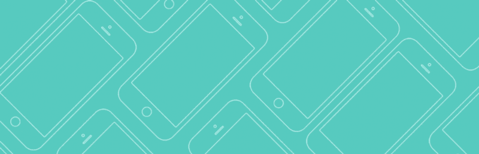

# UX 编舞的原则

#### 迪士尼和 UX 的交集，以及为什么学习如何画米老鼠会改变你的设计方式

最近，我与格兰·基恩、迪士尼动画制作人和传奇人物合作，在 SXSW 做了一次演讲。本文总结了我们在小组讨论中分享的内容。

在我成为 UX 设计师之前，我想成为一名标题序列设计师。我在卡内基梅隆大学上过一门课，老师是丹·博亚尔斯基，名为《时间、运动和交流》。这都是关于动态印刷，节奏，颜色和运动。丹曾经描述屏幕上的每一个元素，就好像它是舞台上的一个演员——一个我们正在指导的角色，赋予它行为和个性。

> "你负责指挥每个元素的入场、表演和退场."

我们会不断地重新审视这个序列，解释为什么一个角色会在那里，它的角色是什么。引入时间和动作改变了我的一切，因为我意识到它给了你对你试图传达的情感以及观众如何理解你的信息的精确控制。我经常从片头序列中寻找灵感，因为我着迷于一个 30 秒或 3 分钟的序列如何能够为整部电影设定基调，并预示将要发生的事情。当找工作开始时，我最终成为 R/GA 的一名 UX 设计师是一个幸运的意外。我知道 R/GA 在[片头序列设计](http://rga.com/about/featured/our-history/)方面有一段历史——不知道他们现在是否还在做这个——但知道这是一个我想工作的地方。我打算申请一个视觉设计的职位，但是被推到了 UX，所以从第一天开始我就想，“什么是线框？!"

快进到几年后:我已经创建了数百个线框和数千个注释来描述事物是如何工作和配合的。比如:*当用户点击菜单图标时，面板会从页面顶部向下滑动。当用户点击缩略图时，视频将全屏放大。*然后我就想到了。我们被困在这些**极端状态**的设计中，我们的工作中缺失了一大块。当我们的可交付成果包括为这些静态组件(如主页、产品页面或文章页面)设计时，我们只标注了事物是如何一起流动的，我们完全没有展示其间发生了什么。注释没有提供足够的上下文:我们不得不开始*展示它*。

我做的线框越多，我就越开始意识到我曾经学过的关于动作设计的一切都与我们作为 UX 和视觉设计师的角色完全相关。随着我开始更多地关注我每天从事的一切，我意识到最*流畅、愉快和直观的*体验总是那些将细节融入动作设计的体验。

#### 迪士尼和 UX

如果我们要谈论运动并从某个地方开始，那就是迪斯尼。迪士尼开发了动画的 12 条原则，我发现这些原则非常重要，因为它们描述了现实的运动和情感投入。迪士尼对现实生活中事物的运动和行为有着深刻的理解。他们知道，当观众观看屏幕上的东西时，他们希望事情以自然的方式发展。迪士尼也知道，如果他们想吸引观众，他们需要一层情感投入。这就是为什么他们成为第一批制作完整长度故事片的动画师，这些故事片抓住了观众的心，让角色感到可信和可感同身受。现实的运动，情感的投入，解决极端的状态…这就是所有这些开始走到一起的方式。

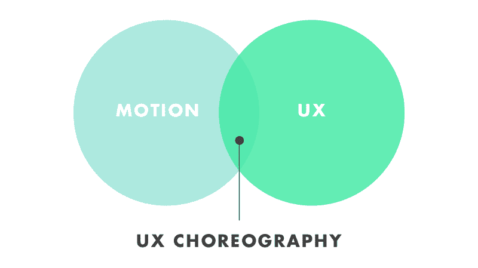

> UX 编舞结合了*如何*与*何时以及为什么*——运用动作和吸引观众的适当技术与用户体验中最不可或缺的时刻相结合，你可以开始让你的用户参与双向对话。

#### UX 编舞的 5 个原则

这里要带走的最重要的东西是，作为 UX 和视觉设计师，我们的工作不仅仅是让东西变得实用和遵循最佳实践。我们也试图让这些经历变得愉快，最重要的是，通过经历序列来讲述一个故事。我越是关注运动在数码中的应用以及正在使用的技术，我就越是开始看到一种模式。我得出了这 5 条原则，我觉得它们解决了 UX 最重要的交流点，解决了极端状态之间的差距，总体上创造了一种更完美的体验。正确处理这些细节很重要，因为它会影响人们对你产品的看法和信任，这总体上会创造更积极的体验和愉快的体验。

### 反馈

反馈有助于展示用户交互的结果，它是否成功，以及为什么成功。它经常被用来显示某事是正确的还是不正确的，如果某事正在加载，如果你正在取得进展，或者只是当你正在进行选择。反馈很重要，因为它能与用户建立信任，让用户看到它真的很满意和愉快！它有助于为交互添加触觉元素，因为它让你忘记你可能只是在敲击一块玻璃，而是让你感觉你正在与屏幕上的真实元素进行交互。感觉事情对你所做的有反应是很好的。当你想到为反馈而设计时，重要的是努力让它对用户来说*明显*。当多层元素一起工作对用户的行为做出反应时，反馈会更加有效。

那么，迪士尼在这里能教给我们什么呢？**夸张**。格伦将夸张描述为一种被 T2 感受到的东西，而不仅仅是看到的。通常你会看到角色的反应非常强烈。

Beast getting frustrated and surprised

他举了一个例子，当贝尔说她不去吃饭时，野兽对她感到沮丧。野兽的脸绷了起来，眼睛睁得大大的，看起来很惊讶。然后他的脸压扁了，他的眉毛看起来很生气。观众甚至没有注意到正在发生的事情的微妙之处，因为它发生得太快了，但它使最终结果感觉像一个颠簸，完全显而易见。

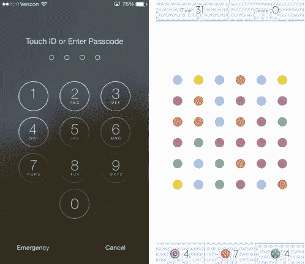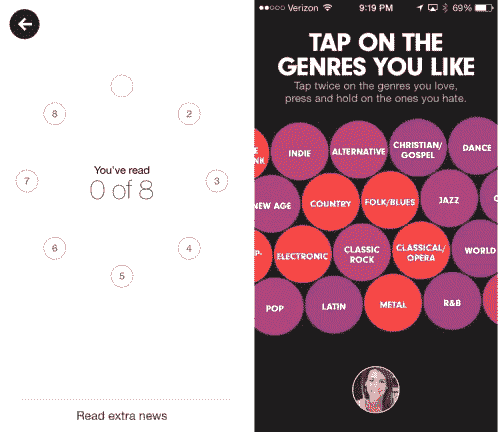

Examples of Feedback. iOS password shake: simple head shake, directly relates to how we give feedback to each other. Dots: simple and delightful, many different layers working together. Yahoo News: each circle fills one by one, the counter updates, your progress is complete and you are rewarded with a full screen fact. Beats: genres react when you tap, progress building is a queue to the user. (PS — check out capptivate.co for great examples).

### 前馈

前馈:这是一种暗示。这是视觉启示。它有助于向用户传达什么是可能的交互以及期望什么，以便他们更好地理解事物是如何工作和配合的。前馈引导用户通过正确的行动顺序，这样他们可以避免混乱，更好地完成你的目标。这真的有助于人们为即将发生的事情和要做的事情做好准备，暗示诸如“注意，看这里！”或*“你可以把它放在这里”*或*“把这个拉远一点。”*通常这些都是非常微妙的细节……人们可能甚至没有注意到它们正在发生，也没有回忆起是什么小线索帮助了他们。微妙，但强大！当前馈被有效执行时，回报可能是巨大的。

迪士尼的预期原则有一个非常相似的目标:让观众为即将发生的事情做好准备。

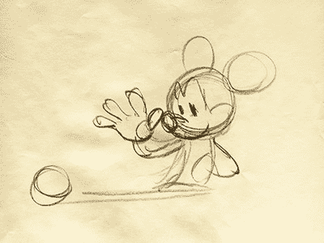

Mickey’s open hand becomes a symbol for the action of reaching across and grabbing a ball

为了传达这一原则，格伦首先举例说明了一个非常简单的序列，米奇穿过桌子捡起一个球。在第一幅画中，他的手离他很近，米奇正盯着桌子对面的球。在下一幅画中，米奇的手已经在球上了。这是一个如此简单的手势，你认为你只需要举例说明，对吗？这里的败笔是没有给观众带来享受；在他们知道之前，一个动作就完成了。他们可能还没有准备好你将要做的事情，即使在你解释的时候它看起来很明显。花时间通过增加一个额外的画面来建立预期，米奇的手张开，伸过桌子对观众来说成为一个象征，他们意识到有些事情即将发生。

> “你不能对观众不耐烦，他们只是在回应。”

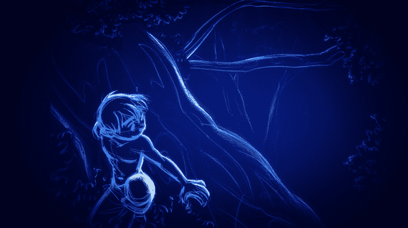

格伦分享的另一个期待的例子是二重唱中托什从树上爬下来的场景。最初，格伦只是不得不离开。然而，他很快意识到，每个人都错过了它，因为它发生得太快了。“你永远不会希望你的观众在你身后，”格伦描述道。他重画了这个场景，不得不先回头看米娅，然后把他的躯干向后转，沿着树往下走。这个微妙的暗示让世界变得不同，帮助观众自然地理解 Tosh 接下来要做什么。

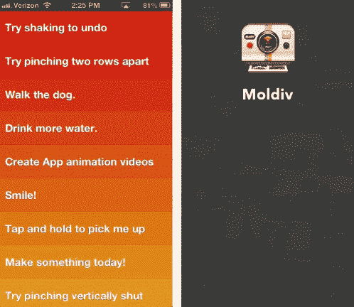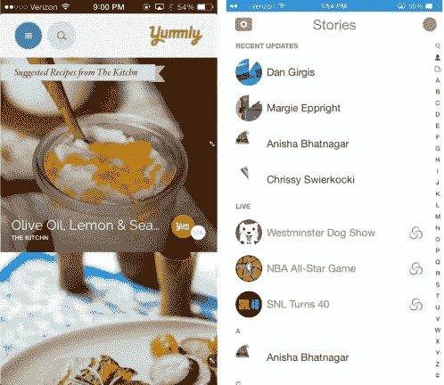

Examples of Feedforward. Clear: a subtle hint at a new list item as soon as you pull. Moldiv: a slight peek at the controls behind the home screen gives users a cue. Yummly: what was previously just a white background now becomes an input field. Snapchat: pull to refresh, the hint of a color or a spinner is a cue that something is about to happen.

### 空间意识

空间意识有助于用户了解他们所处的环境，并理清每个元素之间的关系。如果你仔细想想，你正在创造的虚拟数字环境本质上有无限的可能性。你的每一次体验都有一个独特的地方……元素可能“活”在屏幕后面，左边或右边，夹在中间，在抽屉里……任何你小小的设计师内心渴望的东西。然而，你需要确保给你的环境赋予逻辑。在小屏幕上考虑这一点尤其重要，在小屏幕上，你不得不考虑如何正确使用你拥有的小屏幕空间，以及如何降低复杂性。作为一名设计师，在设计环境时拥有这个开放的画布对你来说是非常好的，但这意味着用户必须学习和理解你所做的东西。他们必须了解他们接触的每一个环境*。总有一段入职和适应的时间。用户需要了解东西从哪里来，下一步去哪里，在哪里可以再次找到它们。你真的必须让人们在这些转变中放松，这样他们就能理解他们是如何从 A 点到达 B 点的，这样就不会感觉到一个明显的、突然的变化。现实世界中不存在突变！空间意识的主要目标是为你的用户定位，并赋予环境逻辑。关于这一点，迪士尼的**舞台**原则教给了我们很多。*

格伦经常谈到一个角色在场景中的位置是如何创造期待的。例如，如果一个角色在最左边，右边的空白空间会产生“想要”，当你有了“想要”，你就有了可以利用的东西。它创造了一种强度，就好像有什么东西即将与观众产生共鸣。

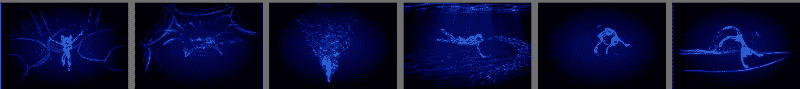

sequence of Mia in Duet

在二重唱中有一个美丽的场景，米娅跳进池塘，游泳，翻转，然后离开水面，做了一个侧手翻。格伦形容这一场景有一种“磁力”,对米娅的所作所为做出反应，并推动她前进。例如，当她第一次接触水时，有一个重大的变化——气泡就像在她周围爆炸。他说，“你不可能在没有某种影响的情况下改变整个环境。”这些泡泡有助于告诉你她去过哪里，然后围绕在她周围的鱼告诉观众她下一步要去哪里。就好像他们把她挤到了下一帧。我喜欢这个序列的原因是环境的逻辑如何让它感觉像是一个从一帧到一帧的连接线程，引导观众的注意力。

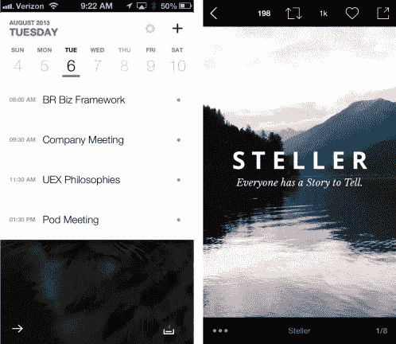

Examples of Spatial Awareness. Calendar: days of the week rest side by side, ease the user between each one. Stellar: a storytelling app takes the theme further into its UI with the use of pages. VSCO: trays of controls act like a toolkit you can pull up from the bottom. Nike Making: categories zoom full screen, push to top, then the layers of sub-categories drop down and float into place.

### 用户焦点

用户焦点引导用户的注意力，澄清变化状态。这一切都是为了控制每时每刻的层级转换。它根据目标强调正确的要素。可能有多层元素一起工作来支持该动作。它可能不总是像在需要的时候把一个元素放到前台那么简单…也许背景也有反应。它可以变淡或变暗，以突出焦点。你会经常看到像使用上下文控件这样的技术——这些重要的小动作你总是想放在手边——你知道它们就在那里——但是你不一定要一直看到它们。只有当你呼唤它们的时候，它们才会成为焦点。

以用户为中心有助于明确你体验中的每一个目标。**清晰**:无可否认，这不是迪士尼的官方原则！让我们把它命名为荣誉 13 号。但是格伦会告诉我这是他在迪斯尼学到的最重要的技巧之一。埃里克·拉森总是强调他们永远不应该丢下观众。

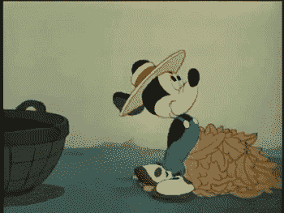

A scene from Little Whirlwind, animated by Freddie Moore.

“在迪士尼，我不断听到那些看似不可能的事情，”格伦会说。有些时候，你可以让别人相信一些看起来荒唐疯狂的事情，而他们不会质疑。比如在*小旋风* (1941)中，有一个场景是弗雷迪·摩尔在制作米奇试图按住旋风不停吹走的一篮子树叶的动画。突然，米奇把手伸进自己的身体中央，拿出一把*巨大的*锤子。它如此之大，是因为这是观众唯一能看到的场景，也是当时场景中最重要的东西。观众不会质疑锤子为什么会在那里，或者它是从哪里来的，因为它是那一刻最需要的东西。*看似不可能的*让你觉得你可以稍微打破规则。

> “如果观众和你在一起，他们会很高兴。如果你失去了他们，没有人会高兴。”

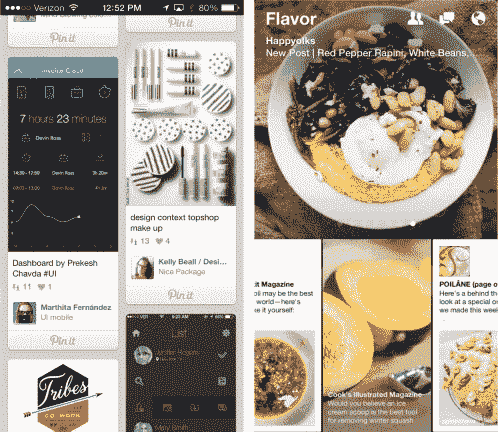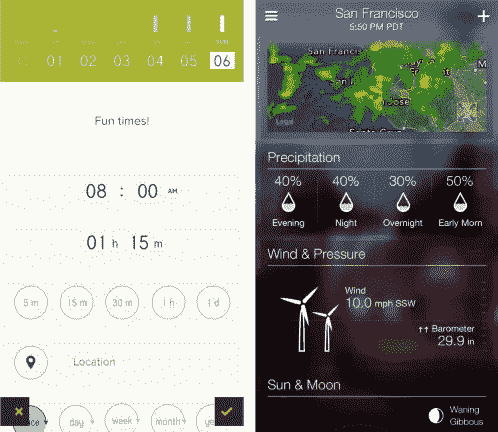

Examples of User Focus. Pinterest: contextual controls appear at the moment they are needed. Paper Notifications: layers of animation guide attention — the globe bounces, the tray slides out and there’s a slight glow in the title. Peek: selections take up full screen, get very bright while others fade back, selections float back into place when done. Yahoo Weather: motion is the first thing that grabs your attention at the bottom; communicates wind speed.

### 品牌语调

我经常告诉人们要像对待复制指南一样思考这个问题。我们思考的每个项目，*“如果一个品牌对我们说话，它会说什么？”*我们还需要开始思考，*“如果一个品牌要移动，会是什么感觉？”*是不是异想天开？是否迅捷有力？是不是一个微妙的附加细节帮助用户认出你到底是谁？展示你的语气会给你的用户留下一些小的瞬间，让他们感觉想说，“我完全可以看到这个品牌这么做”，因为这感觉如此正确和恰当。

想想你每天使用的所有应用程序、网站和体验，以及你为什么一直使用它们。通常有几十个其他应用程序可以做同样的事情，完成同样的任务。他们可能都有很好的用户体验，但是人们更倾向于那些更好的体验。你会觉得他们*让你*开心，或者他们*让你*开心，或者你*从中获得了一些东西*。他们拥有的不仅仅是良好的用户体验。他们有*情调*。**吸引力**是我们要参考的最后一个迪士尼原则。这是最神奇的，但不可否认的是很难设计。

> “吸引力是一种神秘的东西，因为你知道什么时候你拥有它，什么时候你没有它，但你不知道如何获得它。”

格伦描述说，弗雷迪·摩尔是迪士尼的一名动画师，他真正负责创造迪士尼的“外观和感觉”。在它出现之前，米奇“只是一个圆圈”这不是我们今天所知道的米奇。弗雷迪开始在他的角色中的每一个元素之间创造一种关系。弗兰克·托马斯和奥利·约翰斯顿经常告诉动画师，“每条线都与另一条线相关。”画米老鼠时，一切都遵循一个主题。你可以从米奇的头部圆圈开始，然后画他的鼻子，使它向上指，并沿着他的头部曲线。他的眼睛越来越靠近鼻子并与之相关，接着是他的眉毛和嘴——它们会抬起来并贴着他的脸颊。突然，你被米奇身上的某种东西吸引住了。米奇有能力吸引观众，因为他有吸引力。格伦认为每个角色在你画出来之前就已经存在了。当你做对了，你认出了他们，你就是那个把角色带到这个世界的人。当你有吸引力的时候，你会发现那些时刻，当它们都聚集在一起的时候是一件美好的事情。

> “这是吸引力的关键。这就像元素的和谐…一个完美的和弦。你听到后会说，‘就是这样。’"

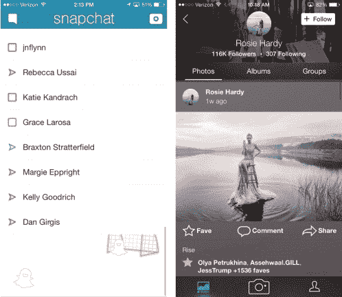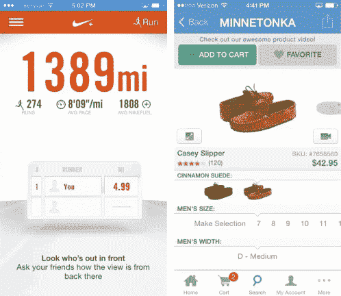

Examples of Brand Tone of Voice. Snapchat: whimsical — the ghosts have become so iconic, people look forward to seeing what else they are going next. Flickr: subtle and clever — when you refresh someone’s profile, the iconic pink and blue dots cycle around. Nike+: the whole app follows the theme of running, with bold and powerful badges sliding into place on the track. Zappos: people love finding easter eggs…especially if it’s a cat wearing a cape.

这五个原则是你如何吸引你的观众，以及他们如何与你的故事互动。你有责任精心制作一个真实的、感性的体验序列，将你作品中的所有关键帧连接起来。这是我们开始解决缺失部分和定义作品中角色的地方。但是我们设计的角色不仅仅是屏幕上的角色，我们也是为人类元素设计的，我们的主角是我们的用户。

无论是电影、应用、网站还是书籍…无论背景、媒介、环境如何，*我们的目标都是一样的*。我们都在和故事中的角色互动，你有责任指导每个角色的出场、表演和退场。你设计的界面只是一个更大故事的窗口。

为运动而设计可能是一件新的和不熟悉的事情，但是我们都经历过这样的时刻，你踏入一个新的问题，却不知道如何解决它。格伦甚至分享了起初为*二重唱*设计是多么令人生畏的任务——他习惯在一张纸上画画，如果一个角色离开了纸，他们就消失了。但在这种互动体验中，观众可以从各个方向跟随角色，就好像他必须解决一个无限的画布。这就是为什么把这些原则放在你的口袋里是一件很棒的事情——它们将成为你可能遇到的任何问题的基础。

> “我总是做我不知道如何做的事情，以便我可以学会如何做。”—毕加索

#### 鳍状物

#### 额外收获:UX 编舞的制作以及我如何有幸与一位迪士尼传奇人物共事

去年我有一个简单的目标:就我感兴趣的话题做一次设计演讲。就这么简单。动作设计是我一直感兴趣的一个话题，我发现它与我们今天作为 UX 和视觉设计师所做的事情越来越相关，所以我在去年夏天 R/GA 的 [AIGA 导师活动](http://chicago.aiga.org/mentor-program-summer-session-studio-tour-talk-1-rga/)期间做了一个演讲(我很高兴能完成这个演讲)。我把它提交给了 SXSW，没有想到它会变成别的什么东西，但是在建议找一个迪士尼动画制作人来合作(*)之后，我去哪里找呢？！几次试图与人接触，一次运气，一次随机的介绍，以及众星云集——我被介绍给了格兰·基恩，迪士尼的传奇人物。格伦在迪士尼工作了 38 年，是一些我们最喜爱的电影的动画制作人，如《小美人鱼》、《野兽美人》和《阿拉丁》。他两年前离开了迪士尼，想看看那里还有什么，以及如何将他的动画背景应用到其他东西上，并继续推动自己(查看他为[谷歌的聚焦故事](https://play.google.com/store/apps/details?id=com.motorola.avatar&hl=en)所做的工作，其中包括他最近的动画短片《二重唱》)。当我告诉格伦关于 UX 的编舞时，他立刻就感兴趣了。).你看，他刚加入迪士尼的时候，“9 老先生”都要把迪士尼动画原理知识传承下去。“总有一天你会比我们做得更大，”奥利·约翰斯顿告诉格伦。格伦觉得他们已经把“接力棒”传给了他。他从未想到这些迪士尼原则会被转化成类似《UX》的东西，所以他把这视为一个向我“传递接力棒”的机会。所以很久以前，我们在 SXSW 合作了一场绝对精彩的演讲。我可以滔滔不绝地讲几个小时格伦分享的故事和我学到的东西，但我们得把这些留到下次再说！*

你已经走了这么远，感谢你的阅读！如果你想要更多的资源，这里有一些，或者发推特给我@becca_u

**寻找灵感**

这篇文章中的许多例子都是由 Alli Dryer 策划的，查看她的网站，看看实践中几十个伟大的运动例子。

[http://capptivate.co/](http://capptivate.co/)

其他收藏夹:

[http://hoverstat.es/](http://hoverstat.es/)

[https://instagram.com/userinterfacesio](https://instagram.com/userinterfacesio)

**更多牛逼阅读:**

[https://medium . com/@ pasql/transitional-interfaces-926 EB 80d 64 e 3](https://medium.com/@pasql/transitional-interfaces-926eb80d64e3)

[http://www . smashingmagazine . com/2013/10/23/smart-transitions-in-user-experience-design/](http://www.smashingmagazine.com/2013/10/23/smart-transitions-in-user-experience-design/)

**了解迪士尼原则，然后开始制作东西**

[http://the12principles.tumblr.com/](http://the12principles.tumblr.com/)

[http://uxinmotion.net/](http://uxinmotion.net/)

[http://Digg . com/2015/12-原理-动画-奥利-约翰斯顿-弗兰克-托马斯-艾伦-贝克尔](http://digg.com/2015/12-principles-animation-ollie-johnston-frank-thomas-alan-becker)