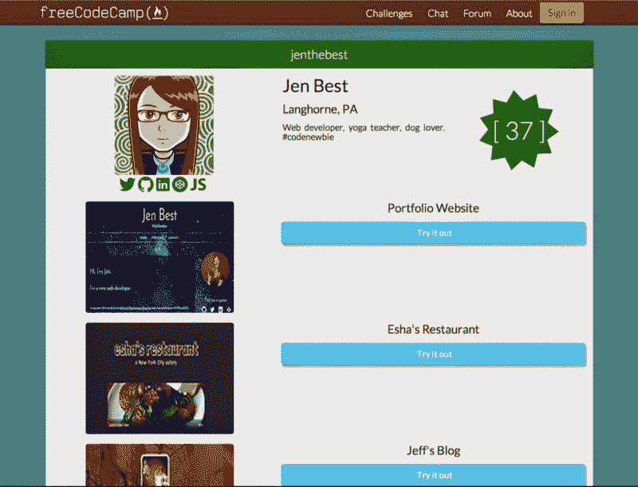

# 自由代码营的每个人现在都有一个投资组合

> 原文：<https://www.freecodecamp.org/news/everyone-at-free-code-camp-now-has-a-portfolio-4ab25254249a/>

由免费代码营

# 自由代码营的每个人现在都有一个投资组合

*注:我们最初于 2015 年 1 月在现已关闭的博客上发表了这篇文章。*

我们很高兴地宣布，自由代码营的每个人现在都有一个免费的公共代码组合！你一直在努力完成我们的编码挑战并构建 JavaScript 应用。现在是时候向世界展示你的进步了！

您的新免费代码营组合包括:

*   你的名字和所在地
*   你的 140 字简历
*   链接到您的 Twitter feed、LinkedIn 个人资料、CodePen 项目、CoderByte 徽章和 Github 帐户
*   列出你已经完成的免费代码营挑战，以及完成的时间
*   你建立的最多 3 个网站的组合，每个网站有一个链接和一个屏幕截图

你的免费代码营作品集是一个免费的、个性化的链接，可以作为你作为一个程序员的进步的一个全方位展示。

Jen 是第一批完全个性化她的作品集页面的代码营员之一。恭喜你，珍！你的作品集也会被搜索引擎收录，给你更多的曝光机会，提升你作为编码者的个人品牌。你可以把你的作品集和你的其他社交媒体资料链接起来，让它在搜索结果中显示得更靠前。

现在你拥有了一片免费代码阵营。您的个人资料将存放在 freecodecamp . com/[您的用户名]中。你可以在 www.freecodecamp.com/account 的[定制。

你还会注意到我们已经将 Angular.js 添加到自由代码阵营中，并对我们所有的 web 表单进行了“成角化”。这将使您更容易定制您的公共投资组合。

所以我们终于是一个妥妥的 MEAN Stack app (MongoDB，Express.js，Angular.js，Node.js)！非常感谢 Camp 顾问](http://www.freecodecamp.com/account)[万亿字节](https://github.com/terakilobyte)带头努力在自由代码 Camp 上实现 Angular.js！

如果你看到 Angular.js 可以在我们的应用中使用的任何地方，[在 GitHub 上分叉我们](https://github.com/FreeCodeCamp/freecodecamp)并提交一个 pull 请求。我们希望整个应用程序有棱角！