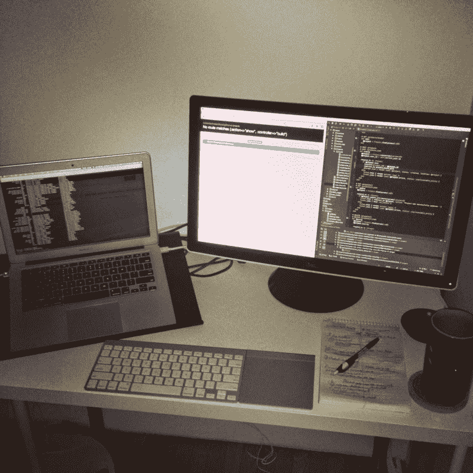
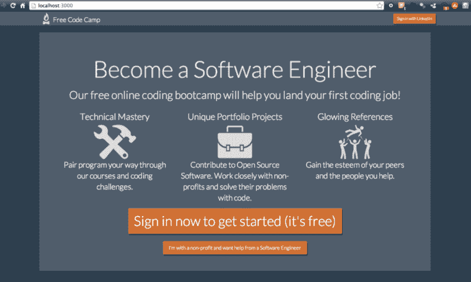
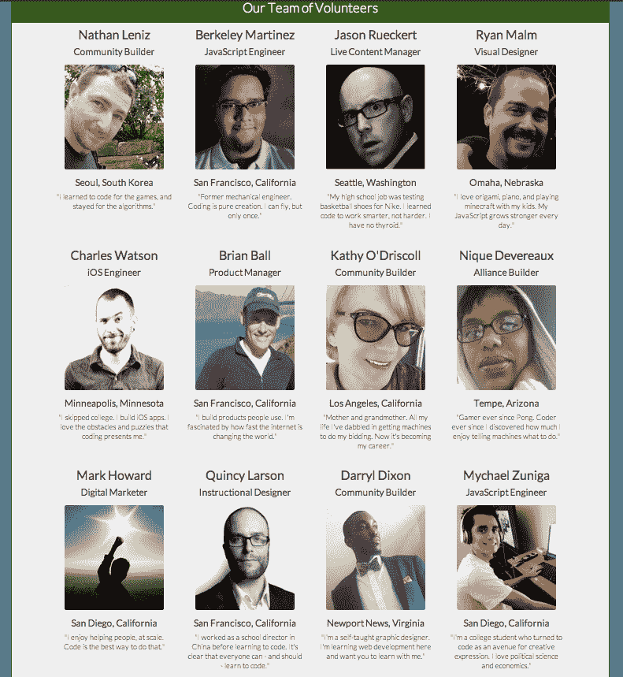

# 行动透明:自由代码营现在是开源的

> 原文：<https://www.freecodecamp.org/news/transparency-in-action-free-code-camp-is-now-open-source-9dae1985d925/>

由免费代码营

# 行动透明:自由代码营现在是开源的

我们很高兴地宣布，自由代码营现在[完全开源](https://github.com/freecodecamp/freecodecamp)。现在，您可以派生出我们的代码库，并使用它来建立您自己的教育社区。如果你注意到一个 bug 或者想出一个改进自由代码营的方法，你现在可以通过提交一个 pull 请求直接采取行动。

### 我们的准则

我最初用 Ruby on Rails 构建了自由代码营，因为我对它很满意。但是很明显 JavaScript 是未来的趋势。像 Node.js 和 Express.js 这样的新工具使得完全迁移到 JavaScript 堆栈成为可能，这正是许多学校和公司正在做的事情。自由代码营的很大一部分是消除噪音，帮助忙碌的人专注于学习一套固执己见的工具。由于我们正在学习全栈 JavaScript，一个非 JavaScript 代码库发出了错误的信号。所以我放弃了 Rails 应用，学习了足够多的异步 Node.js 来“危险”，并开始构建。

*我搭建自由代码营 0.1.0 版本的壁橱办公室。*

我查看了 Meteor.js 和 Mean.js(这是在 Mean.io 分叉之前)，甚至考虑过将 Angular.js 与谷歌应用引擎后端一起使用。但最终，我决定使用黑客马拉松入门应用程序。凭借其身份验证套件和 API 集成，它本身实际上就是一个框架。
几天后，我推出了免费代码营，里面只有五个编码挑战和一个 Hipchat 聊天室。慢慢地，人们开始走过来。奇迹般地，他们中的许多人留了下来！

大约 10 周前我们推出自由代码营时的样子。

自由代码营是我的第一个 Node.js 应用。我将代码展示给一位经验丰富的 JavaScript 开发人员，他不停地喊着“你到底在想什么？”当他浏览代码库时。虽然很糟糕，但他承认，由于它一天能提供数千次页面浏览，没有发生任何事故，这并不完全是一件尴尬的事情，我应该继续开放源代码。因此，为了增加安全性，我们安装了 Helmet.js，将 API 密钥转移到一个. env 文件中，并将它们从 Git 历史记录中清除。瞧，自由代码营在生产中使用的完全相同的代码现在可以在这里免费获得。

### 我们的基础设施

我们只使用了一个(免费的)Heroku dyno，但由于我们偶尔会超过 20 个并发会话，我们将其增加到两个，每月 35 美元。我们通过 S3 提供资产，并为我们的话语驱动论坛提供一个小型 AWS 实例。我们每年为 Vimeo Pro 账户和 Screen Hero 账户支付 240 美元，为单一的 Google Apps for Business team 账户支付 60 美元。这使得我们所有基础架构的总成本低于每年 2，000 美元。

### 我们的志愿者营地辅导员

我们是一个忙碌的人学习编码的社区。我们称自己为“代码营员”。我们中的一些代码营员甚至比其他人更忙，因为我们自愿贡献我们的时间来积极改进自由代码营。我们的“营地辅导员”团队在我们的聊天室和论坛上闲逛。我们尽最大努力欢迎新人，回答各种编码问题。我们唯一的目标是最大限度地增加像我们这样的忙碌的人的数量，他们能够克服我们的挑战，为非营利组织建立一个项目组合，然后得到一份编码工作。

我们一些耐心、热情的夏令营辅导员。

没有人会得到任何报酬。如果我们最终接受资助或通过招聘委员会赚钱，我们会想出一个公平、透明的方法来给我们的志愿者分配股权或开始支付他们。我们大部分的交流是通过我们的聊天室和频繁的结对编程会话进行的。我们在地理上是分散的，但是我们尽可能见面。我们的营地辅导员提出新的功能和内容，讨论优先事项和细节，然后配对并开始构建。例如，这篇博文已经被几个夏令营辅导员编辑和改进过了。

### 我们的指标

在不到 3 个月的时间里，我们已经发展到将近 5000 名代码营员。但是我们真正引以为豪的不是我们代码营员的数量，而是他们职业道德的水平。一群有工作、有学校、有孩子的人——甚至还有孙子孙女们——正把他们宝贵的时间投入到学习编程上。三周前，我们彻底改革了我们的课程，从那时起，我们已经有数百人完成了长达一小时的挑战。我们已经公开了所有这些指标[这里](http://www.freecodecamp.com/stats)。顺便说一句，如果你对分析我们的(匿名)数据感兴趣，或者帮助我们更好地可视化它，我们很乐意为此提供便利。

### 我们的未来

不要指望我们会有任何秘密行动或盛大的揭幕仪式。我们更感兴趣的是在开放中进化，就像互联网一样，而不是像原子弹一样爆炸式的首次亮相。我们相信开源的格言“只要有足够的眼球，所有的错误都是肤浅的”，并欢迎你的任何想法，让自由代码营成为忙碌的人学习编码的更好、更有效的地方。

最后，我想比较一下自由代码营和 Ubuntu 的理念。不是驱动互联网的 Ubuntu Linux 发行版，而是与其同名的南非 Ubuntu 哲学。Ubuntu 是一个祖鲁语单词，大致意思是“我之所以是我，是因为我们都是谁。”

莱伊曼·古博韦，利比里亚和平活动家，诺贝尔和平奖获得者，他发明了 Ubuntu 最广为接受的英语定义。

自由代码营是因为我们的代码营员。忙碌的人们互相帮助学习编码。这就是我们将继续前进的方向。

*最初发布于[blog.freecodecamp.com](http://blog.freecodecamp.com/2014/12/transparency-in-action-free-code-camp.html)2014 年 12 月 29 日。*