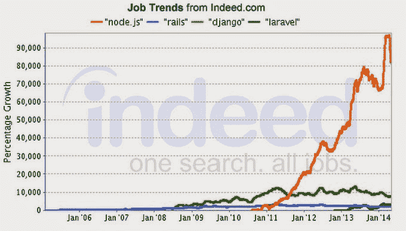
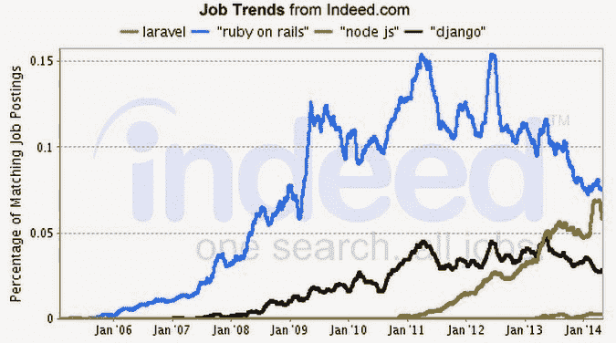
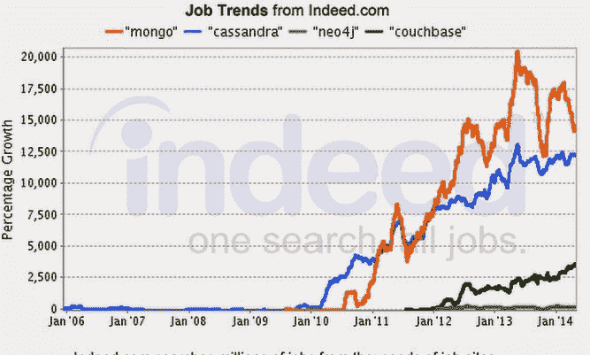
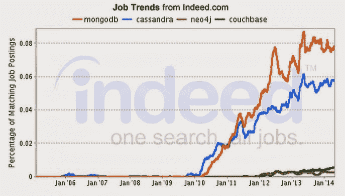
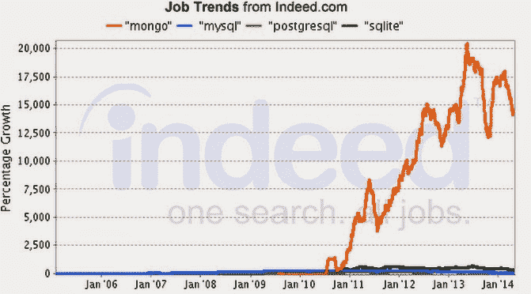
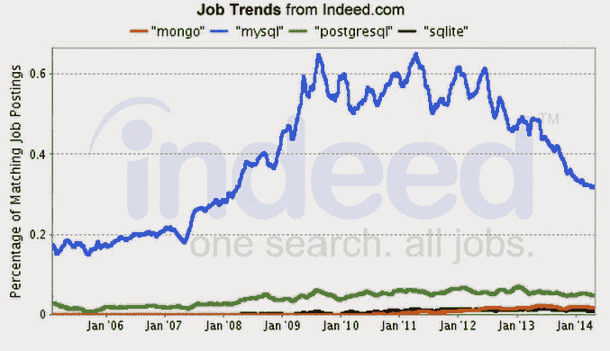
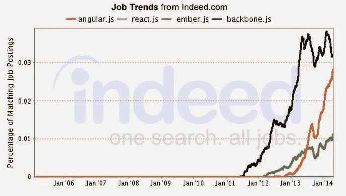
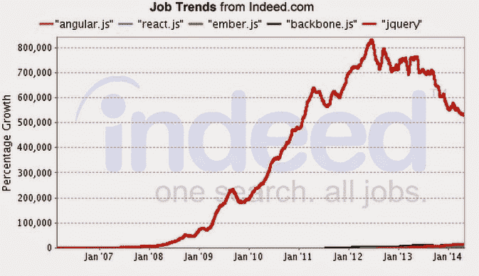
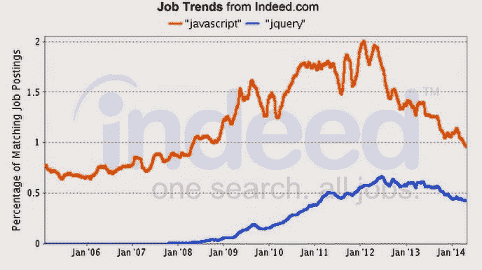

# 学习平均堆栈的真正原因:就业能力

> 原文：<https://www.freecodecamp.org/news/the-real-reason-to-learn-the-mean-stack-employability-29011ff6b2eb/>

由免费代码营

# 学习平均堆栈的真正原因:就业能力

更多的编码训练营(如 Hack Reactor)和在线课程平台(如 Khan Academy)正在转向 JavaScript 作为他们的教学语言。

JavaScript 作为第一语言是有意义的，因为无论如何你都需要学习它。没有它，你在网络上做不了多少事情，所以人们越来越多地直接使用 JavaScript，跳过 Ruby、Python 和 PHP。JavaScript 还拥有最活跃的开发者社区。但是还有第三个你应该一开始就学习 JavaScript 的原因:就业能力。

雇主们不仅仅渴望 JavaScript 人才，他们还渴望熟悉特定的基于 JavaScript 的技术的工程师。而那些技术恰好是组成 MEAN Stack 的技术——MongoDB、Express.js、Angular.js 和 Node.js。

在我们开始之前，请注意这些数据来自 Indeed.com，最大的招聘信息聚合器。我们用职位发布的数量来代表职位的数量。我们只关注 Oracle、微软和 IBM 等非专有解决方案。

### 模型-视图-控制器 Web 开发框架的比较

*   Node.js 和 express . js——支持 MEAN stack 的 web 服务器和基本 web 开发框架。Node.js 发布不到 5 年，但已经被 LinkedIn、沃尔玛、SAP 和微软采用。
*   rails——流行的基于 Ruby 的 web 开发框架，旨在帮助开发人员快速构建传统的服务器密集型应用程序。绝大多数编码训练营仍然专注于 Rails。有趣的事实:铁轨是由丹麦赛车手发明的。
*   django——Python 最流行的 web 开发框架。另一个有趣的事实是:姜戈是由堪萨斯州的一家报纸发明的。
*   laravel——目前最流行的 PHP web 开发框架，尽管 PHP 社区并没有像 Ruby 和 Python 社区那样普遍地支持一个框架。

如你所见，就就业增长而言，Node.js 是明显的赢家。绝对来说，Node.js 正在迅速赶上 Ruby on Rails:

### NoSQL 数据库的比较

我们要看的下一个堆栈组件是数据库。首先，让我们比较一下最流行的 NoSQL(非关系)数据库。

*   MongoDB——MEAN stack 使用的文档存储数据库。Mongo 也很受 Rails 应用程序的欢迎，并且是 Meteor.js 项目的默认数据库。
*   Cassandra——在脸书创建的宽列数据库，后来开源给 Apache。
*   neo4j——最流行的图形数据库。
*   couch base——另一个强调速度的文档存储数据库。

雇主对 MongoDB 的需求是 NoSQL 数据库中增长最快的。从绝对意义上来说，MongoDB 也是赢家:

但是您可能想知道这与 SQL 数据库相比如何。让我们来看看:

MongoDB 的增长速度比最流行的 SQL 数据库快很多倍。但是如果我们从绝对意义上来看就业市场，它还有很长的路要走:

很明显，NoSQL 数据库仍然只占数据库人才市场的一小部分。对 NoSQL 这个名字的常见解释是“不仅仅是 SQL”，意思是 NoSQL 数据库应该作为传统 SQL 数据库的补充，而不是替代。这是我们在介绍 MongoDB 之前介绍关系数据库和 SQL 的一个主要原因。

### 前端 JavaScript 框架

在过去的三年中，出现了几个模型-视图-控制器 JavaScript 框架。这些允许开发人员在客户端操作 DOM 元素。这些允许单页应用程序，浏览器不必导航到新的页面。

*   angular . js—MEAN Stack 中的“A”。谷歌(以及推而广之的 YouTube)已经投入了大量资金和工程人才来改进 Angular.js。
*   react . js——由脸书开发，强调性能。
*   ember js——提供 MVC 结构后端，同时在前端使用 Handlebars.js 和 jQuery 等传统工具。
*   backbone . js——最初的 MVC JavaScript 框架，现在仍然非常流行。它有一个很大的社区和很好的文档，包括一些关于代码学校的课程。

正如你所看到的，Angular.js 增长很快，而 Ember.js 和 Backbone.js 似乎已经停滞不前。React.js 太新了，它甚至没有在图表上注册，但我听说过一些公司，如 Khan Academy，正在使用它。从绝对值来看，Angular.js 正在迅速赶上 Backbone.js:

但是，当然，这个图表忽略了前端 JavaScript 世界中 800 磅的大猩猩 jQuery:

为了好玩，让我们比较一下提到“jQuery”的职位发布的总百分比和提到“JavaScript”本身的职位发布的百分比:

令人惊讶的是，jQuery 被提及的次数几乎是 JavaScript 的一半。在我看来，对此有三种可能的解释:

1.  jQuery 使用起来非常直观，以至于技术含量较低的 web 设计人员继续使用它，而不是转向更强大的前端框架，如 Angular.js。这些 web 设计人员有很多使用 jQuery 的遗留应用程序，并且正在雇人来维护它们。
2.  创建招聘信息的非技术人力资源人员认为 jQuery 和 JavaScript 是同义词，或者 jQuery(发布于 2006 年)是 JavaScript(发布于近 20 年前)的更高级形式，所以他们列出了 jQuery。
3.  许多雇主不需要前沿前端 JavaScript 框架提供的繁重工作。或者，更有可能的是，他们无法理解这些框架有多么强大，以及它们如何能够产生卓越的体验。

不管原因是什么，信息是明确的。为了最大化你的就业能力，学习 jQuery 是绝对必要的，即使这些其他框架可以做 jQuery 能做的所有事情，甚至更多。jQuery 的成功很大程度上可以归功于它的易用性。在许多方面，学习 jQuery 甚至比学习 JavaScript 更容易，并且在学习像 Angular 这样的 MVC 框架时，您将应用到 jQuery 的许多概念仍然适用。所以总而言之:

*   平均堆栈的每一个单独的组成部分正在成为各自类别的赢家。
*   从就业能力的角度来看，关注整体平均水平是有意义的。比如说，如果你的雇主想用 Backbone.js 而不是 Angular.js，你已经熟悉了其中一个，并且可以很容易地学习另一个。
*   MongoDB 是值得关注的合适的 NoSQL 数据库，但是熟悉关系数据库和 SQL 本身是值得的。
*   学习 jQuery。大量练习 jQuery。把它放在你的 LinkedIn 个人资料和简历的显著位置。

*最初发表于[blog.freecodecamp.com](http://blog.freecodecamp.com/2014/10/the-real-reason-to-learn-mean-stack.html)2014 年 10 月 26 日。*