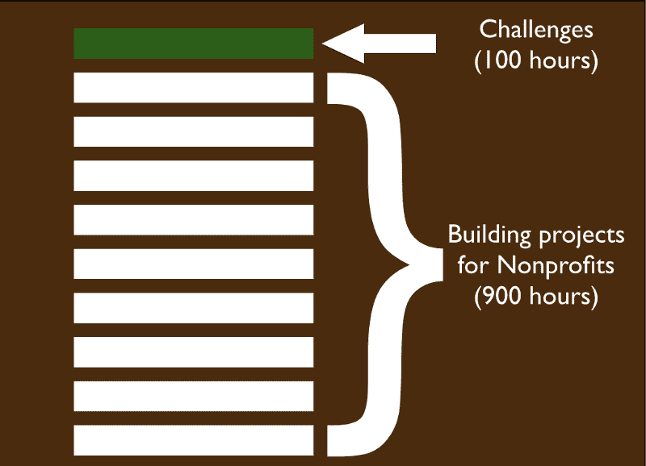

# 简短、互动、基于浏览器

> 原文：<https://www.freecodecamp.org/news/short-interactive-browser-based-491e2f188481/>

由免费代码营

# 简短、互动、基于浏览器

在我们最初的两个月里，通过与他们交谈和观察他们的行为，我们对我们的社区了解了很多。基于这些见解，我们彻底改革了我们的挑战:

*   简短——你可以一次完成每个挑战。
*   基于浏览器——您可以立即开始编码，无需安装任何东西。
*   完全交互式—您将 100%的时间进行编码。

我们新的模块化挑战意味着您可以随着时间的推移一砖一瓦地培养自己的技能。

这些挑战代表了你编码的第一个 100 小时。它们帮助您建立对编码工具和最佳实践的基本理解。一路上，你会得到一群忙碌的人的支持，他们把学习编码放在首位。

然后真正的学习就开始了。你将建立你的开发环境，组建一个团队，并开始为非营利组织构建项目[。](https://trello.com/b/BA3xVpz9/nonprofit-projects)

前 100 个小时的编码挑战给你一个基线，为接下来 900 个小时的项目导向学习做准备。

我们期待听到你的见解，回答你的问题，并与你结对编程！

*最初发布于[blog.freecodecamp.com](http://blog.freecodecamp.com/2014/12/free-code-camps-new-challenges-short.html)2014 年 12 月 18 日。*