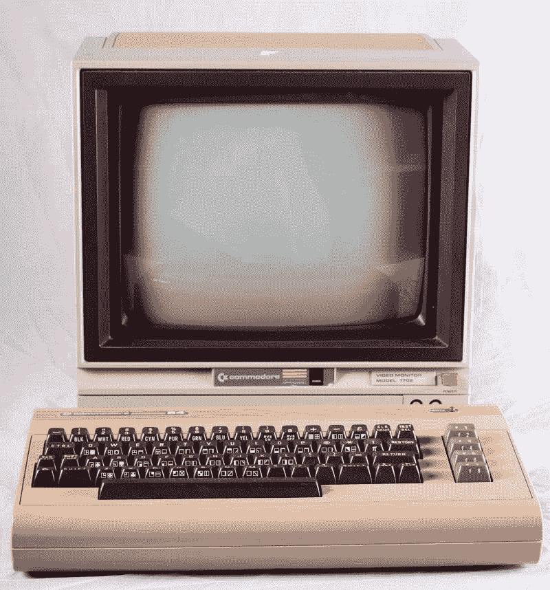
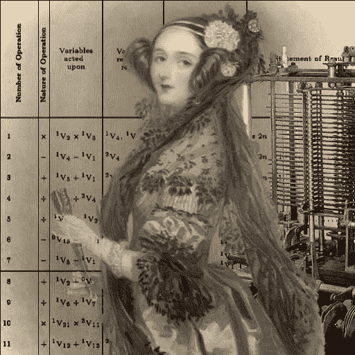
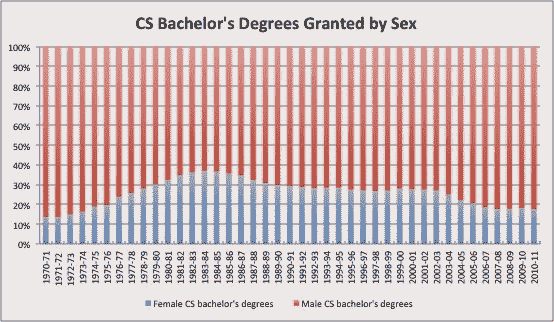
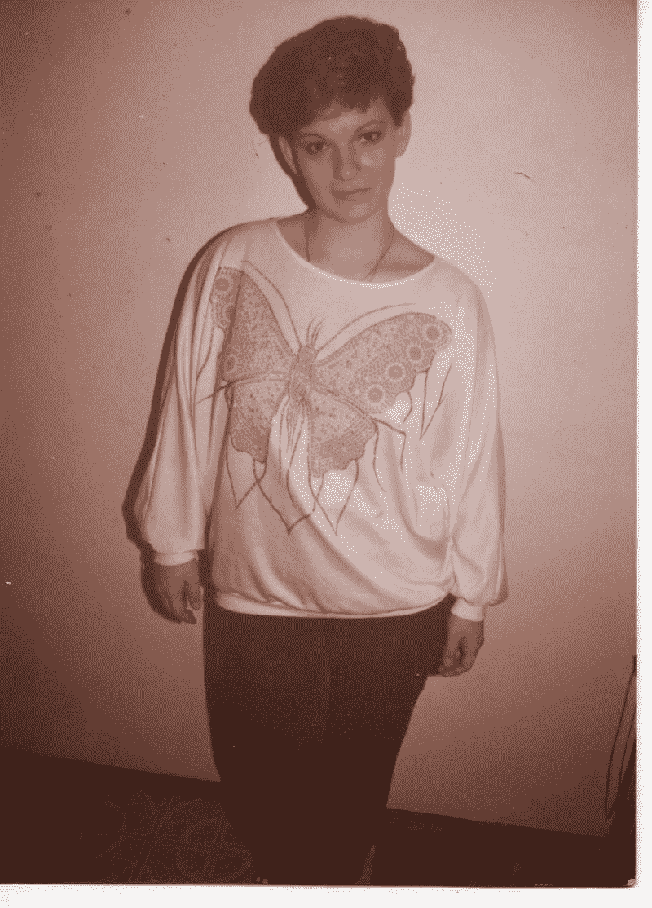

# 我是一个奶奶，我的编码生涯才刚刚开始

> 原文：<https://www.freecodecamp.org/news/im-a-grandma-and-my-coding-career-is-just-getting-started-86bfe862b870/>

由免费代码营

# 我是一个奶奶，我的编码生涯才刚刚开始

一见钟情是一件事。1983 年我十几岁的时候就感受到了。我爬出父母的旅行车，走过舅舅家的前门。一个奇怪的盒子放在他们客厅的桌子上。我的表弟启动它，然后随便输入一些东西。

他告诉它该做什么。它做到了。我完全被迷住了。

当我全神贯注地坐在他旁边时，我的堂兄继续演示 Commodore 64 的许多功能。

我的初恋——1983 年的准将 64。

那天晚上，我一直等到所有人都睡着了，然后溜进客厅。我把 Commodore 64 的类似电话簿的手册放在膝盖上。我在显示器的蓝光下眯起眼睛，把一行行代码从手册转移到命令行，我的手指敲击着它的太空时代键盘。到天亮时，我已经把一个像素化的小人搬上了银幕。

准将 64 激发了我的想象力。我看到了我的未来，它和我的现在很不一样。机器人女佣罗西正在从一个类似《星际迷航》的食物复制器里给我拿一顿精致的饭菜。我俯身在一个装饰华丽的电脑终端前，穿得像个维多利亚时代的贵族。机器在我周围旋转，实现了我的每一个突发奇想和幻想，而我笑了。

*I envisioned myself as a modern Ada Lovelace. She was the world’s first programmer, and my it’s most stylish.*

就在太阳升起来烤焦我与 64 号准将共度的迷人夜晚时，我的高中辅导员高高在上，压制着我新发现的激情。他耸耸肩告诉我，我的数学成绩太低了，用电脑做不了任何有意义的事情。

生活还在继续。我高中毕业了。我喜欢电脑，但似乎我不适合用电脑工作，我需要赚钱。于是我报了美容学校，成为了一名美甲师。这很有趣也很容易，而且我赚了足够多的钱。

我结婚了。有一次我怀孕了，我们用来涂假指甲的化学物质的气味让我恶心，我不得不戒掉。在接下来的几年里，我呆在家里带孩子，并通过临时工中介公司找到了一份行政助理的工作来帮助支付账单。

绝大多数计算机科学专业的学生都是男性，而且这种趋势在最近几十年里变得更加严重。(图片来源:罗伯特·l·米切尔与计算机世界)

我站在一旁看着电脑从桌子到笔记本再到口袋。在 90 年代末，我在浏览新闻组时了解到一种叫做“Linux”的东西。我决定一定要得到它。

当我的孩子睡觉或在学校的时候，我有时能够偷时间，下一次我有机会就安装 Linux。一个更加光明、以技术为动力的未来似乎又一次展现在我面前。我喜欢 Linux。不仅仅因为它是开放的，还因为它感觉是开放的。我被鼓励去研究引擎盖下的代码，甚至做了一些调整。但是随着孩子们渐渐长大，生活变得更加忙碌，我收起了我的玩具。我切换回 Windows，专注于学习当时看起来更实用的技能。我想成为一名更有价值的行政助理，所以我掌握了微软 Excel、Word 和 Outlook。

尽管如此，有时我会找机会使用我从构建自己的 Linux 机器中学到的知识。我会帮助办公室里的人安装硬件和调试网络。在那些稍纵即逝的时刻，我会从秘书升到有一定帮助的 IT 服务台技术人员。但是接下来电话铃会响，把我拉出门去跑腿，或者帮我为老板安排会议。回顾我生命中的那段时期，我实际上并不满足。至少我在用电脑工作，让我的家人继续生活。

但是当我丈夫生病的时候，一切都变了。我辞掉了工作，这样我就可以整天呆在家里照顾他。我们最小的孩子刚刚进入青春期，我们觉得他父亲生病的时候我在家里支持他比较好。

2009 年老公去世的时候，家里只剩下我和儿子。我的其他孩子已经长大成人，有了自己的家庭。我面临着回到我并不真正热爱的职业或者找到一份新工作的前景。

即使在那时，我仍然没有想到给计算机编程可能是一个可行的选择。我仍然听到那个高中辅导员告诉我数学不够好的声音。所以我回到美容行业，开始做化妆师。

化妆很有趣。我学会了如何建立一个网络，以及如何利用这个网络。我遇到了很多有趣的人，并帮助他们展现出最好的一面。但我从来没有觉得这是我应该成为的人。你看，在一天结束的时候，每个人都洗掉了他们的化妆品。然后就好像一开始就没有化妆一样。我决定我需要做一些永久的事情。我需要做一些最终重要的事情。

*Me in 1983\. You can tell it was 1983 because of the tell-tale Flock of Seagulls hair.*

我知道编程是我的目标。我只是不知道需要多长时间才能到达那里。我是一个女人。不管你喜不喜欢，这是我的一个特征。老婆。妈妈。奶奶。我知道有些女性在她们的人生中途成功了。所以我开始看书。我读了所有关于这些女人的资料。软件企业家。程序员们。一路走来，我发现了整个女性网络，她们只是忽视了社会对软件工程作为男性领域的隐性定义。

当我读她们的故事，看她们的演讲时，我开始意识到这些女人只是在做我已经开始做但已经停止的事情。他们和我有着相同的愿景:通过告诉机器做什么来赋予自己力量。他们追逐的是同一只兔子，我曾悄悄穿过那些黎明时分的起居室。但是他们把它变成了职业。

我不仅意识到这是我一直以来的使命，我还兴奋地发现我已经是实现这一目标的一部分了。在使用早期个人电脑和 Linux 的过程中，我培养了“开发者思维”。我花时间在阅读和重读软件文档时挠头。我甚至很好地理解了 HTML、CSS 和 JavaScript，可以将其他人的代码集成到我的网页中，使它们更具交互性。

所以两个月前，我停止了积极寻找化妆演出。我报名参加了 Skillcrush.com 网络开发课程。这让我起步了，但我很快得出结论，如果我真的要在这个行业中做一名软件工程师，我需要用教程来补充这些课程，并尽可能多地构建 web 应用程序。我加入了 FreeCodeCamp.com 的社区。现在我醒着的大部分时间都在用 JavaScript 编码。
如果有有趣的事情发生，我仍然会偶尔去化妆，我仍然很喜欢。但是现在我找到了我更喜欢的东西。

现在看着自己那些尴尬的高中照片，开始觉得轻了。这是一个曲折的旅程。但是那个机器人女佣和那个食物复制器终于回到我的视线里了。

#### 凯西·奥德里斯科尔住在加利福尼亚州的洛杉矶。你应该在推特上关注她。

*最初发表于[blog.freecodecamp.com](http://blog.freecodecamp.com/2014/11/I-am-a-Grandma-and-my-coding-career-is-just-getting-started.html)2014 年 11 月 26 日。*