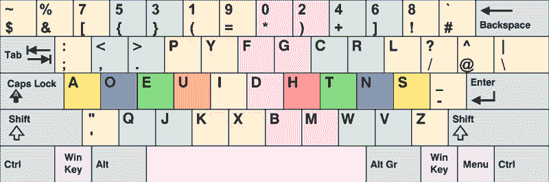

# 学习编码的警示故事。我自己的。

> 原文：<https://www.freecodecamp.org/news/a-cautionary-tale-of-learning-to-code-my-own-eddb24d9d5a7/>

我只是一个办公室里穿着西装的家伙，有一个模糊的创业想法。后来我决定学编码。

我无意中听到某个家伙在欢乐时光里吹嘘他使用一种叫做 Ruby 的语言能够多么容易地自动化他的办公工作流程。我想，“哈，鲁比。”我回到家，谷歌了一下，不到 15 秒，我就完成了一个随机的 Ruby 教程。

一周后，我参加了我的第一次黑客空间会议。每个人都在谈论像 Scala、Clojure 和 Go 这样的语言。要学的东西太多了。我借了三本奥莱利的书，每本都有大约 50 页。

Most technical books start off nice and easy before making big assumptions about your prior knowledge.

一个朋友告诉我应该擅长 Emacs，并给了我他的配置文件。我花了几个小时学习基本的 Lisp 语法，以便进一步配置它。

后来有个人走过，看见我在用 Emacs。“你为什么使用 Emacs？”他问我。“你不知道维姆更好吗？”“嗯。Vim。”于是我开始背几十个 Vim 键盘快捷键。

Most arguments about text editors are what engineers call “religious wars” — rooted more in historical differences than practical merit.

当时，认为我打字越快，编码越快似乎是合理的。我改用程序员的 Dvorak 键盘布局，因为，嘿，客观上这是程序员可以使用的最有效的键盘。

Can you count how many letters, numbers and symbols are in their original Qwerty positions? I’ll give you a hint — it’s in the low single digits.

在我可以让我的上网本成功启动 Linux 的那几天——我每分钟可以输入超过 10 个单词——我通过阅读书籍和 Udacity 课程来学习 Python。

I snapped this selfie the Saturday morning after my last day at my corporate job. I got up early and dressed in a suit to reinforce the seriousness of the task at hand: I was going to learn to code! Facebook caption: “My new office — the kitchen table! I clock in here every morning at 8 and until 6, I only get up for “bio-breaks”.” Note the use of quotes around the term bio-break. I was trying to be cute and talk like a programmer. I now catch myself using this term daily, without irony.

经过 7 个月艰苦的自学和参加编码活动，我得到了我的第一份软件工程师工作。

在我与 CTO 的面谈中，我告诉他我学到的所有工具和我正在使用的深奥的配置。CTO 点点头，礼貌地听着。当我吹嘘完我的知识广度后，他礼貌地提醒了我一下。他说，“你可以用很多方法来做大多数事情，但只有少数方法是有意义的。”说完，他递给我一台破旧的 MacBook，把我放在开发人员休息室里。

四年前，该公司决定使用 Ruby on Rails 构建他们的产品。他们完全致力于这个决定，他们的大部分原始代码仍然完好无损。所有的工程师都使用 MacBooks，它既可靠又类似于他们在生产中使用的 Ubuntu Linux 服务器。

大家没有争论 Vim 还是 Emacs，只是用了 RubyMine，一个强大的集成开发环境(IDE)，有一个明智的默认配置。这意味着任何一个工程师都可以坐在任何一个工程师旁边，立即开始对一个任务进行结对编程，而不需要让自己适应他们同事的开发环境。这个事实本身就解决了两个开发人员在尝试合作时的尴尬和无意识的抵触。

公司不介意我不了解 Ruby on Rails。由于我已经足够专注于学习 Python 和 Django，并赢得了一次黑客马拉松，他们认为这是我最终可以学习 Rails 的标志。

最初的几周很艰难，不仅仅是因为我要和一个新团队用新的语言、框架和代码库工作。这很难，因为我看到的每一个地方都有证据表明我以一种荒谬的自虐方式学习编码。

我花了几个月的时间独自坐在图书馆和咖啡馆里，盲目地从命令行安装工具，调试 Linux 驱动程序问题，并为丢失括号这样的小事绞尽脑汁。

我涉猎了所有能想到的在线课程项目，开办了无数的 MOOCs。直到第五个月，我才意识到没有指南的指导，我在网上真的学到了一些东西！

这给我的印象是编程是一场永无止境的斗争。我确信我遇到的看似正常的程序员实际上是反社会者，他们经历了学习编码的创伤，然后受到压抑。

与我的同事相比，他们甚至很少遇到语法错误，因为他们的 ide 首先发现了它们。我同事的 MacBooks 刚刚能用。如果他们收到一条错误信息，并且无法通过几分钟的阅读和谷歌搜索来解决，他们会简单地互相发送即时消息来帮助调试。他们会跳到彼此的桌子上，随意地配对程序。

没有太多的自我或精英主义。没有那种编程是一件苦差事的感觉。这只是友好的成年人之间的一系列建设性对话，其中几个人已经像我一样学会了自己编写代码。

团队致力于他们的工具。除了开发人员可以试验 Angular.js 等新 JavaScript 框架的激情项目日和黑客马拉松之外，他们主要关注的是如何利用现有技术做得更好。他们对允许什么进入他们的代码库持保守态度。

你可以在像 ThoughtBot 这样的地方看到同样的风气，每个人都坚持使用一个小而有效的工具链(在他们的例子中，Rails、Vim、Postgres 和 Redis)。通过专注于几个关键工具，他们的工程师变成了可以轻松进行互操作的专家。

因此，真正的问题是，如果高生产率的软件工程师团队使用一套集中的工具工作得最好，那么学习编程的人难道不能使用一套集中的工具学习得最好吗？在线编码课程和编码训练营肯定是这样认为的。

但是作为个人，有这么多选择，真的很难决定学什么。我知道是因为我是那条在十字路口绕圈的狗，追逐着一辆又一辆的车。一个好的程序员的技能组合可以用 T 型来形容，在很多领域知识浅薄，但至少在一个领域知识深厚。但是经过几个月的压力和努力工作，我变得更像一条下划线。

对于我见过的每一个以这种方式开始学习的人——我见过很多——可能有无数人以这种方式开始，感到气馁，并放弃了成为程序员的梦想。我不希望这种事发生在你身上。

### 你需要集中精力

话不多说，下面是我看到的新程序员经常犯的大错误:

*   频繁地切换语言或框架，或者自欺欺人地认为他们可以精通所有的语言或框架。
*   用外来的工具个性化他们的开发环境，而不是在与他人协作时可以可靠使用的更传统的工具。
*   尝试学习像 Docker 和 Famo.us 这样的工具，因为它们是新的和令人兴奋的，即使他们还没有掌握更基础的技术。

如果我不得不用一个词来总结我的建议，那就是:**专注**。

我的问题是:你能描述一下你学习编码的计划吗？如果你觉得你的计划是有重点的，你现在应该停止阅读，继续学习，因为我不想说一些可能会让你失去重点的话。如果你还没有集中学习编码的计划，我有一个好消息——你现在就可以这样做。但是这需要几分钟的时间，并且需要做出一些艰难的决定。等等！不要离开…哦，很好。你还在这里。好了，以下是你需要做的决定:

1.  选择一个你感兴趣的软件开发类型来定义你的职业:网络、移动、游戏或嵌入式。我推荐 web，因为它很灵活。有大量的工作和大量的学习资源。如果你对 web 开发之外的事情充满热情，留下这篇博客文章，在谷歌上搜索“开发入门”,全力以赴吧！
2.  选择**一种**语言来学习:JavaScript、Ruby 或 Python。各有所长。每个都有可以用来构建 web 应用程序的工具(分别是 Node.js、Rails 和 Django)。除非你已经有了强烈的偏好，否则我推荐 JavaScript，因为它是最流行的语言。
3.  选择**一门**网络课程进行学习。如果你正在学习 JavaScript，freeCodeCamp.org 的[有一个全面的。相信设计你所选择的课程的老师的智慧，按照推荐的顺序完成它，不要跳来跳去。](http://freecodecamp.com/)

一旦你做出了这些决定，前进的道路就很简单了。忽略围绕新工具的大肆宣传，保持头脑清醒。通过一周七天完成你选择的课程来保持你的动力，即使每次只有半小时。通过相信你今天的决定所做出的判断来保持你的自信。

记住:只要有耐心，任何有能力的人都可以成为伟大的程序员，包括你。

我只写编程和技术。如果你在推特上关注我，我不会浪费你的时间。？