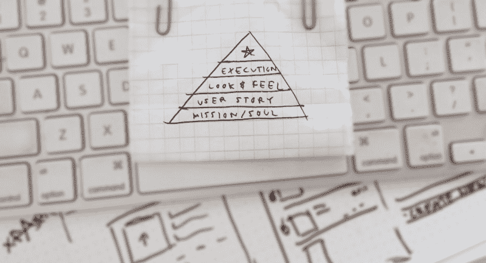
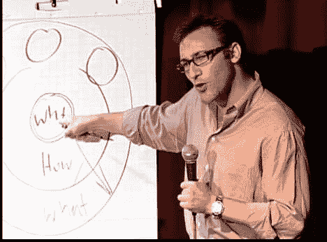
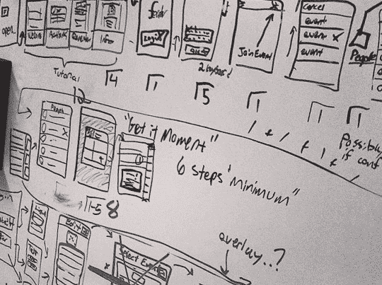
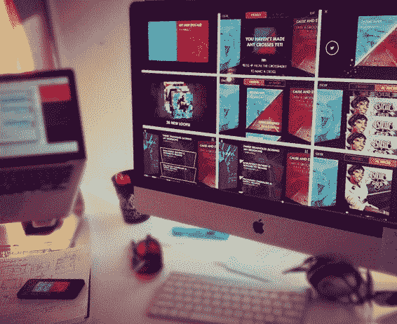
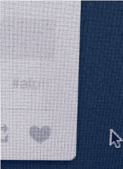

# 设计过程:金字塔

> 原文：<https://www.freecodecamp.org/news/the-design-process-a-pyramid-c77135c177d4/>

威廉·牛顿

A Doodle from Ryan Germick explaining his design process

# 设计过程:金字塔

#### 在敲定下一个设计项目之前需要回答的问题。

大约两年前，我和[谷歌涂鸦团队](http://www.google.com/doodles/finder/2013/All%20doodles)的负责人[瑞安·格米克](https://twitter.com/ryangermick)坐在一起。

当我问他的团队是如何持续推出如此出色的设计时，Ryan 要了我的笔记本，并画了一个金字塔。他把它分成五层，他告诉我:

### 首先，从任务开始，*灵魂*，*‘为什么？’*

理解项目的灵魂是构建完整设计方案的基础。这很抽象，可能需要一些思考，但是在*灵魂*里面有你设计问题的答案。

Simon Sinek in his [popular TED Talk](http://www.ted.com/talks/simon_sinek_how_great_leaders_inspire_action.html), explains that you should “Start with ‘Why’”

你设计的一切都与这个想法有关，所以识别它是设计过程中第一个也是最重要的部分。

如果你的使命陈述太长，问一些愚蠢的问题，挑战你的假设，把它精简到本质。*灵魂*应该优雅地回答“这是为了什么？”

### 第二阶段:理解用户故事

一个人的一生，永远不会以你的产品/网站/海报/硬件开始和结束。前、中、后都有上下文。

While I was at [Feathr](http://feathr.co/), we discovered most users would use our app for the first time while preparing for an event at home. The relaxed, organization-oriented mindset played a large role in shaping our design.

在人们与你的设计互动之前，考虑他们的感受，他们想要什么，他们想要什么。尽可能以人为中心。有很多方法可以做到这一点。

当一个人与你的*东西*互动时，他们体验到了什么，它与项目的使命和灵魂有什么关系？

一个人使用、聆听、看到和触摸你的“东西”的经历应该会强化设计的灵魂。换句话说:如何整合“用户做什么”和“项目做什么”

再者，当用户的体验‘结束’后，接下来会发生什么？

### **第三阶段:开发外观&感觉**

既然你知道了你为什么要做这个东西，以及人们会如何与它互动，那么是时候回答这个问题了:*它看起来像什么？*

The look & feel for [Crossfader](http://crossfader.fm/), an app that lets anybody DJ like a pro by tilting their phone.

这一层是设计的*用户故事*和*灵魂*的第三层，但它通常被误解为设计师工作中“最大”或“最重要”的部分。

回答了前两个问题，就很容易设计出令人满足并能在潜意识层面引起人们共鸣的东西。

使用灵魂和故事作为指导，简化了以一种深刻的方式整合的建筑视觉设计。

### 第四阶段:我们如何执行？

设计的最后一部分是实现。如果你是一个只做设计的人，在这个阶段很容易采取“不干涉”的方法，让开发人员做他们的事情——但是要保持警惕！

这个阶段是灵活的，因为有许多不同的方法来实现一个设计。找到与*灵魂*、用户故事和&感觉相结合的方式，创造一个有凝聚力的整体。

积极参与，确保不遗漏任何细节。点你的 I 和交叉你的 t，测量两次，切割一次，等等…

不管你是不是自己做，都要确保它是做好的，并且做对了。

### 第五阶段:越过顶端

所以你已经实现了一个解决问题的好主意。至此，您已经有了一个完整的设计。

大多数设计师都止步于此。**不要。**

这是你更上一层楼的部分。

这就是“好”设计和“伟大”设计的区别。

在这一步，你可以真正释放你的创造力，利用你已经拥有的(坚实的)东西，让它闪耀出意想不到的光芒。

[Tumblr](http://tumblr.com/) has a fun and playful ‘like’ and ‘unlike’ animation that surprised and delighted me the first time I saw it. [Source](http://ui-animations.tumblr.com/)

因为你已经从*灵魂*开始设计了你的方式，用户体验，视觉设计，通过执行，你得到了一个强有力的机会将你的项目与一颗壮丽的星星联系在一起。

#### 让我们回顾一下:

建造金字塔时，你必须从底部开始。

你的基金会正在定义这个项目的使命和灵魂。

在此基础上，考虑用户故事和上下文。

这将把你引向一个坚实的有利位置，从这个位置创造一个看起来和感觉上*恰到好处*的视觉设计。

执行设计，建造你引以为豪的东西。

最后，在顶部放一颗樱桃，上面有令人惊讶和愉快的细节，让灵魂真正一路闪耀。

虽然我的例子是与软件相关的，但通过用“听众”、“观众”等代替“用户”，这些原则适用于全球所有与设计相关的领域。

> 如果你觉得这篇文章有帮助，[注册我的电子邮件列表](http://dandnclothing.us4.list-manage.com/subscribe?u=4e5334f6a1925f07e1771b12f&id=3e6855a7bc)，在那里我写设计产品！感谢阅读！