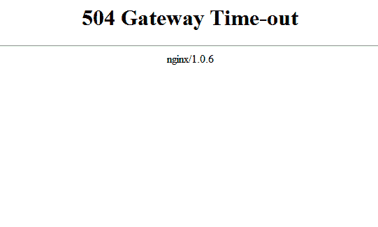
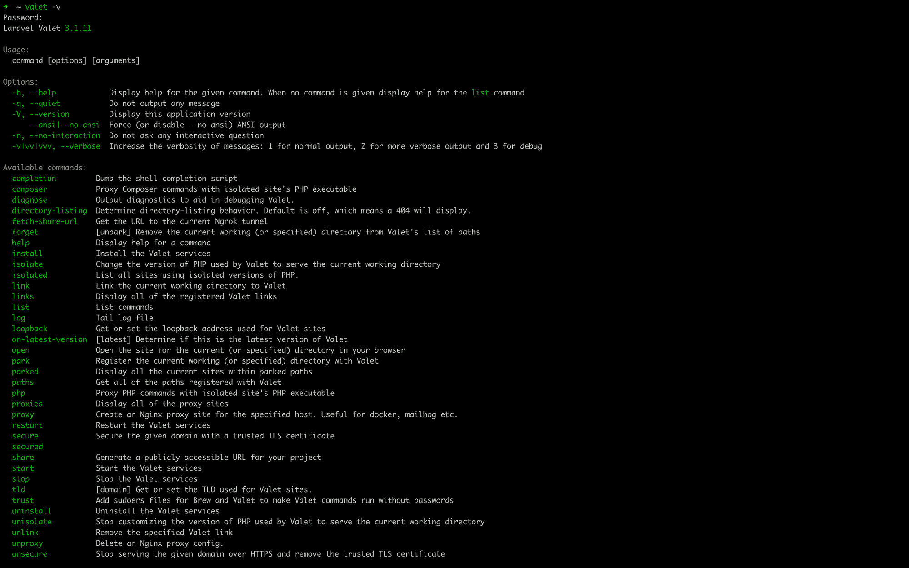

# Laravel 代客服务性能–如何防止 504 错误并加快代客服务速度

> 原文：<https://www.freecodecamp.org/news/speed-up-performance-in-laravel-valet/>

上周，我决定在我的 Mac 上安装 Laravel Valet。但是安装后，我安装的微服务架构应用程序的性能相当慢。

我不知道这是 M1 的问题，还是因为我还没有关闭机器。我关机了，问题依然存在。我在网上找不到任何表明这是 M1 的问题的信息。那我该怎么解决呢？

****在本教程中，您将学习:****

*   为什么会出现错误 504？
*   什么是 Laravel 代客和它是如何工作的？
*   贴身男仆的命令你应该知道
*   如何修复 504 错误，并加快代客性能

## 为什么会出现错误 504？



Error 504 Nginx

错误 504，也称为“网关超时”，是当服务器响应 HTTP 请求的时间比平时长时发生的错误。这使得它无法完成请求周期。

网关超时是由多种原因导致的服务器端错误。当服务器超过默认限制**256 米**或执行时间 **60 秒**、**时，网络连接问题可能会导致服务器、防火墙等过载。**

在本地开发生命周期中，本地服务器也会出现这种错误，比如 XAMPP、WAMP 和代客。

本文将通过添加一些配置来加速服务器请求生命周期，从而帮助您在 Valet 上解决这个问题。

## 什么是 Laravel 代客和它是如何工作的？

Laravel Valet 是一个用于 macOS、Windows 和其他操作系统的开发环境。安装完成后，当您的笔记本电脑开机时，Valet 会在后台运行 Nginx 进程。

与 XAMPP 和 WAMP 等其他开发环境不同，每次开始工作时，您都必须手动启动服务器。然后，Valet 使用 DnsMasq 将所有驻留的应用程序代理到一个`.test`域。

例如，你可以在 XAMPP 服务器上访问`http://localhost/application`，但是在代客服务器上，你可以访问`http://application.test`，它会指向应用程序的安装位置。

使用 Valet 意味着你不必把所有的应用程序都放在 htdocs 或 www 目录中。相反，您创建的任何随机目录都可以在 Valet 中完美地工作。

## 你应该知道的有用的贴身男仆命令:

*   **`valet park` :** 在一个目录中注册所有的应用程序/站点，并用。测试域。

```
cd ~/project_directory
valet park 
```

*   **`valet parked` :** 给出了所有注册站点的列表。网站名称、SSL、URL 和路径等信息都是可用的。

```
cd ~/project_directory
valet parked
```

*   **`valet secure` :** 使用 SSL 证书保护您的应用程序，并使您可以通过 HTTPS 访问该网站。

```
cd ~/project_directory/site
valet secure
```

*   **`valet unsecure` :** 使用这个命令解除你的站点的安全，并恢复到通过 HTTP 提供服务。

```
cd ~/project_directory/site
valet unsecure 
```

*   **`valet isolate` :** 隔离一个特定的站点，让它在一个不同的 PHP 版本上运行，这个版本不是全球安装的版本。可以在终端上运行`php -v`查看版本。但是如果您的一些应用程序想要降级或升级，您应该使用 isolate 命令并指定您需要的版本。下面的隔离命令，强制站点使用 PHP 7.4 版:

```
cd ~/project_directory/site
valet isolate @php7.4
```

*   **`valet unisolate` :** 将站点恢复到全球安装的 PHP 版本。

```
cd ~/project_directory/site
valet unisolate
```

*   **`valet restart` :** 重启命令确保所有代客服务重启。当修改、更新和安装配置时，这很有用。

```
cd ~/project_directory/site
valet restart
```

*   **`valet -v` :** 该命令帮助检查当前的代客版本。不仅如此，该命令还显示了所有可用命令的列表以及它们在 Valet 中的作用。

```
~/project_directory/site
valet -v
```



Valet available commands

## 如何提高代客泊车的性能

在终端中，我们需要在一个目录中创建一个文件`www.conf`，然后添加我们需要的配置设置。

获取您的 PHP 全局版本，并像这样复制它:

```
php -v
```

导航到目录，用之前复制的 PHP 版本替换 7.4。

```
cd /opt/homebrew/etc/php/7.4/php-fpm.d
```

像这样创建一个`www.conf`文件:

```
touch www.conf 
```

打开文件，以便您可以添加代客配置设置:

```
open -a TextEdit www.conf
```

该命令在您的文本编辑器中打开`www.conf`文件，您可以用这些设置更新该文件:

```
pm.max_children = 200
pm.start_servers = 20
pm.min_spare_servers = 10
pm.max_spare_servers = 20
pm.process_idle_timeout = 10s
pm.max_requests = 500
```

从文本编辑器中保存并关闭文件。

让我们仔细检查添加到`www.conf`文件中的每一行:

*   **`pm`** 是流程管理器的缩写，该设置将影响流程管理器如何控制每个子流程。我们可用的可能值包括静态、按需和动态。
*   pm.max_children 是一个静态选项，表示子进程的最大数量，我们设置为 200。
*   **`pm.start_servers, pm.max_spare_servers`****`pm.min_spare_servers`**:这些是动态值，子进程是根据服务器指令动态设置的——即 start_servers = 20，min_spare_servers = 10，max_spare_servers = 20。
*   **pm.process_idle_timeout** :未处理的空闲请求被终止所用的总时间被设置为默认值 10 秒。其他单位可以用分钟(m)、小时(h)或天(d)来估计。
*   **pm.max_requests** : 这是指一个子进程在被杀死/终止之前，在给定时间内可以处理的最大请求数。如果请求执行到最大限度，它就变成空闲的，pm 就把它处理掉。

最后，使用 sudo brew 命令从终端重启所有服务。请再次注意 7.4，这是因为我的全球 PHP 版本。

```
sudo brew services restart php@7.4
```

现在，您可以在您的本地环境中与 504 错误和缓慢的代客服务性能说再见了。

## 包扎

在本文中，您了解了如何使用 Laravel 代客以及如何设置所有代客配置。您还了解了如何确保快速开发环境，并消除持久的 504 网关超时错误。

坚持学习，快乐编码！

你可以在 [LinkedIn](https://www.linkedin.com/in/suleolanrewaju/) 和 [Twitter](https://twitter.com/bigdevlarry) 上找到我。