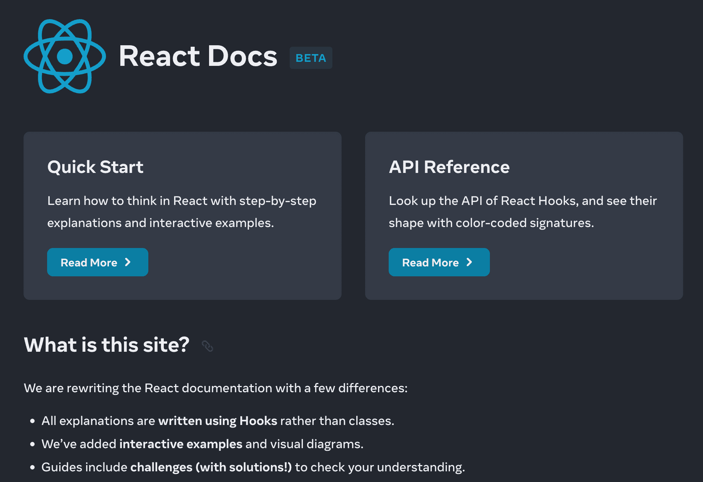
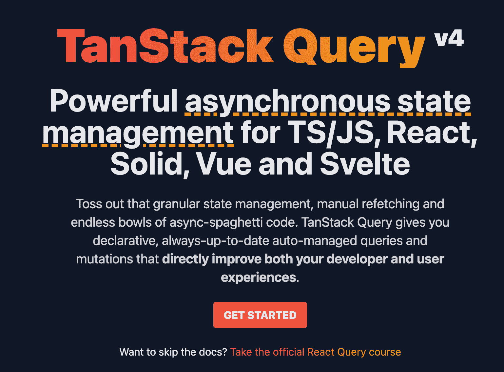

# 2023 年如何学习 React

> 原文：<https://www.freecodecamp.org/news/how-to-learn-react-in-2023/>

作为构建前端应用程序最受欢迎的 JavaScript 库，2023 年是学习 React 的最佳年份。

在本指南中，我将向您展示最有价值的资源和提示，我相信它们会帮助您更快地学习和做出反应。在这个过程中，你还会节省很多宝贵的时间和精力。

想要 2023 年学习 React 的绝佳资源？使用 [**React 训练营**](https://reactbootcamp.com) 获得成为 React pro 所需的所有训练。

## 需要学习 JavaScript？你可以边学反应边学

希望学习 React 的初学者最常问我的问题是:“我需要学习 JavaScript 吗？”

React 是一个 JavaScript 库，经常被宣传为“只是 JavaScript”这表明，要真正学习 React，必须先了解 JavaScript。我认为 JavaScript 与 React 的关系是—*你对 JavaScript 了解得越多，你就会成为越好的 React 开发人员*。

也就是说，你不需要先学习所有的 JavaScript。许多 JavaScript 概念可以在您学习 React 的同时学习。

下面是 JavaScript 中的一些概念的列表，您需要理解这些概念才能有效地使用 React。其中包括:

*   变量
*   数组(和。map()函数)
*   目标
*   JavaScript 事件
*   函数和箭头函数
*   范围和闭包
*   承诺和异步等待语法。
*   基本错误处理

这些都是 JavaScript 概念，根据我的经验，你真的需要知道在任何级别使用 React。

当您开始构建自己的项目并查看他人的代码时，您将会遇到并学习更多的 React 概念。

如果你想要一个有用的指南来开始学习这些概念和更多，我已经在 freeCodeCamp 上写了一个[广泛的备忘单，涵盖了你需要对 React 有信心的所有 JavaScript。](https://www.freecodecamp.org/news/javascript-skills-you-need-for-react-practical-examples/)

## 找教程？使用新的 React 文档

当您第一次开始学习 React 时，您的第一个问题可能是:“我在哪里可以学到我需要的所有与 React 相关的信息？”你可能会问是应该在 YouTube 上观看课程还是在 Udemy 上购买课程。

虽然在许多不同的网站上都有大量的 React 课程，但你应该依赖的第一个也是主要的网站是 React 官方文档网站:[reactjs.org](https://reactjs.org/)。

与前几年学习 React 相比，2023 年学习 React 的特别之处在于，在过去的一年中，React 文档得到了彻底的更新和改进。它完全是当前 react 版本的最新版本，有大量的实际例子，甚至还有交互式代码沙箱，这样您就可以在浏览器中开始学习 React，而不必在自己的机器上创建项目。

> 如果你想启动一个新的 React 项目，你可以在浏览器中使用链接 [react.new](https://react.new) 快速完成。这将创建一个带有完整 React 应用程序的 CodeSandbox，您可以随意使用它。在自己的电脑上创建项目会更快更容易。

你可以在 beta.reactjs.org 找到新的 React 文档。在适当的时候，你可以在 reactjs.org 找到它。

beta.reactjs.org

使用新的 React 文档的另一个重要原因是它对初学者非常友好，在我看来，它可以让你比其他方式更快地学习概念。如果您过去害怕阅读技术文档，我想您会感到惊喜。

## 你不需要学习类组件

如果你想知道 2023 年是否需要学习类组件，你不需要。

当你开始学习 React 时，你会听说一个叫做**类组件**的东西，它基于一个普通的 JavaScript 类。作为一名 React 开发人员，不再需要学习这一点，但学习它仍然会让你受益匪浅。

在 2018 年推出名为 **React hooks** 的功能后，React 开发者已经转向使用函数组件，这些组件是用 JavaScript 函数制作的。

类组件仍然是 React 的一部分，在许多情况下(如错误边界)，它们仍然用在生产代码中。但是请注意，你不需要为了熟练反应而学习它们。

事实上，我很少遇到它们，除非我在查看更老的代码库。它们中的大多数已经被移植到函数组件和 React 钩子上了。

## 帮自己一个忙，学习 React Query

任何严肃的应用都需要数据。您需要的数据通常存在于您的应用程序之外，因此您需要一种策略来获取这些数据并在您的项目中使用。

当你开始获取数据时，我强烈建议你学习一个名为 **React Query** 的库。

可以通过 npm 包@tanstack/react-query 安装 React Query。

React Query, also called Tanstack Query

React Query 已经成为 React 应用程序中获取和管理外部数据的首选库。

使用 React Query 有什么好处？除了作为许多 React 开发人员和公司现在熟悉和依赖的库之外，学习 React Query 将使您受益匪浅，因为它可以说是您在 React 应用程序中获取和管理外部数据的最强大的方法。

使用 React Query 的最大好处在于，它为您提供了一个缓存(一个存储),让您可以保存每个查询的结果，因此您可以“保存”您获取的数据。此外，它有许多工具可以完全按照您想要的方式更新缓存。

它还提供了您所做的每个查询的相关状态信息，比如它是正在加载还是导致了错误。

在你习惯于使用 Fetch API 或 Axios 等工具通过 useEffect 钩子手动获取数据之后，我会学习 React Query。一旦你做到了，你就会看到在你所有的 React 项目中使用 React Query 的好处。

## 不需要学 Redux

如果您在过去几年中试图学习 React，您可能会有这样的印象:要学习 React，您最终必须学习另一个名为 Redux 的库。

Redux 是一个帮助我们管理 React 应用程序状态的库。您可以将状态视为 React 应用程序中可能会发生变化的任何数据。Redux 使我们能够跨 React 应用程序的每个部分管理一个状态(比如，用户是否登录)。

Redux 不再像过去几年那样需要学习。第一个原因是发布了 **React 上下文** API。在许多情况下，React 开发人员使用 Redux 只是在他们的应用程序组件之间传递数据。这是 React Context 可以为我们做的工作。

此外，如果您需要在应用程序的许多不同部分更改或更新状态(这是一个不同于简单读取您的状态的要求)，Redux 有许多竞争对手。与 Redux 不同，这些库不需要您学习新概念，比如 reducers、actions 等等。

Zustand - "Bearbone" state management

这些较新的、“较轻的”状态管理库包括:

*   **祖斯坦德**
*   喝吧
*   报应

一旦您掌握了 React 的基础知识，并开始构建标准 todo 应用程序之外的稍大的应用程序，您就会理解拥有状态管理库的必要性。Redux 仍然是一个很棒的库，但是首先要看看具有更简单 API 的库，比如 Zustand。

## 不一定要创建 React 应用程序

一旦你准备在你的电脑上创建一个 React 项目，你要知道有很多方法可以做到这一点。

总的来说，Web 开发越来越趋向于在线——并不是每个 React 项目都必须在你的电脑上完成。在许多情况下，你可以在浏览器中使用像 **CodeSandbox** 或 **StackBlitz** 这样的工具，完全免费地启动一个全新的项目。

但是，总有一天，您会需要或想要在本地机器上创建一个 React 项目。使用像 **Create React App** 这样的工具很容易，它允许你通过运行一个命令来创建一个 React 项目。

Create React App 依然是制作 React 项目的绝佳工具。就像 Redux 一样，新的替代方案已经出现，给你 Create React 的所有便利，但是在一个更小、通常更快的包中。

Vite, an alternative to Create React App

这方面的主要例子是 **Vite** 。Vite 是一个构建工具，它允许你创建一个新的 React 项目以及许多其他类型的 JavaScript 项目。

使用 Vite over Create React 应用程序的好处是，它给你一个更快的开发服务器。

要开发和更改您的应用程序，它必须运行在开发服务器上。相比之下，Create React Appl 可能需要相对较长的时间来启动和响应您所做的代码更改(这被称为**热重装**)。除了需要更少的依赖，Vite 还提供了更快的体验。

创建 React 应用程序的另一个很好的选择是 **Next.js** 。接下来是技术上的 React 框架，它提供了许多便利，使开发变得更加容易。仅举几个例子，它自带路由器和数据获取工具。

使用像 Next.js 这样的框架的好处是，在构建项目时，您只需做出较少的决策。您需要选择项目所依赖的更少的依赖项。构建 React 应用程序所需的几乎所有东西都内置在 Next.js 中

也就是说，Next 的操作与普通的 React 项目非常不同，因为它是默认由服务器呈现的。这可能会带来自身的问题和需要避免的潜在隐患。但是如果您对构建严肃的、生产就绪的 React 项目感兴趣，Next 无疑是最佳选择。

## 想要全方位学习 React 的方法吗？

如果您想开始学习 React，您可能不知道下一步该做什么，甚至在这篇文章之后。这完全可以理解。

React 是一个真正的挑战，这就是为什么我制作了一个完整的资源来帮助学习 React—[**React 训练营**](https://reactbootcamp.com) 。它将在几周内，而不是几个月内，为您提供成为一名有效的 React 开发人员所需的所有 React 培训。

只需点击下面的链接即可开始。尽情享受吧！

 
*点击加入 React 训练营*