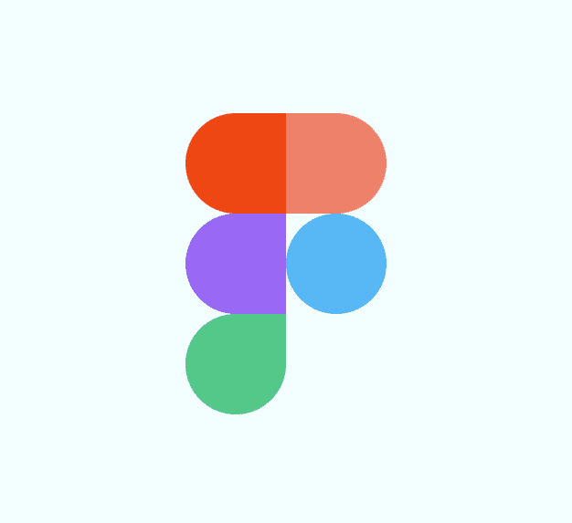
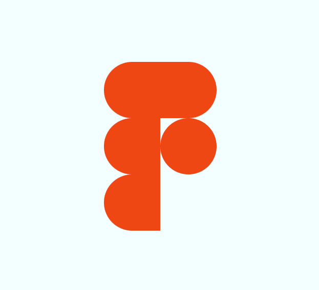

# 通过在纯 CSS 中构建 Figma 徽标来学习 CSS

> 原文：<https://www.freecodecamp.org/news/learn-css-by-creating-the-figma-logo-in-pure-css/>

学习 CSS 的最好方法之一就是在学习的时候创造一些有用的东西。我将通过创建 Figma 徽标向您展示如何使用以下 CSS 概念:

*   柔性包装
*   多个类别
*   边框半径

## 我们将创造什么

我们将创建纯 CSS 的 Figma 标志。它看起来会像这样:



## 如何创建我们的起始文件

让我们首先创建两个名为`index.html`和`style.css`的文件。在您的`index.html`文件中添加以下起始代码:

```
<!DOCTYPE html>
<html lang="en">
<head>
	<meta charset="UTF-8">
	<meta http-equiv="X-UA-Compatible" content="IE=edge">
	<meta name="viewport" content="width=device-width, initial-scale=1.0">
	<title>Figma Logo</title>
	<link rel="stylesheet" href="style.css">
</head>
<body>

</body>
</html> 
```

在`style.css`文件中添加以下起始代码:

```
body {
  padding: 0;
  margin: 0;
  height: 100vh;
  display: flex;
  justify-content: center;
  align-items: center;
  background-color: azure;
} 
```

## 如何使用 Flex-wrap 属性

我们将使用 Flexbox 来创建图像。Flexbox 有一个属性叫做`flex-wrap`。默认情况下，flex 项目将尝试全部放在一行中。您可以更改这一点，并根据需要使用该属性让项目换行。

我们希望在标志的第一行和第二行都有两个设计元素。第三行有一个设计元素。

在`<body>`标签中使用以下代码更新`index.html`文件:

```
<div class="figma-logo">
  <div class="element left"></div>
  <div class="element right orange"></div>
  <div class="element left purple"></div>
  <div class="element circle blue"></div>
  <div class="element left clip green"></div>
</div> 
```

## 多重 CSS 类是怎么回事

当你看上面的代码时，你会注意到 logo 中的每个元素都被分配了不止一个 CSS 类。我们这样做是为了保持设计的一致性。

`element`类将设置我们设计中每个元素的高度和宽度。

`right`、`left`和`clip`类用于为元素设置适当的`border-radius`。

`orange`、`purple`、`blue`和`green`类用于设置每个元素的颜色。

## 如何添加我们的造型

我将使每个元素的高度和宽度都是 100 像素。类别`figma-logo`的宽度将为 200 像素。通过将宽度设置为该值，Flexbox 将在出现两个元素后换行。

将以下样式添加到您的`style.css`文件中:

```
.figma-logo {
	width: 200px;
    display: flex;
    flex-wrap:wrap;
}

.element {
	width: 100px;
	height: 100px;
	background: red;
} 
```

当我们查看我们现在拥有的东西时，它看起来像这样:


## 如何使用`border-radius`属性

我们的下一步是使用 CSS `border-radius`属性来定义每个元素。CSS 属性使一个元素的外边框边缘的角变圆。每个 CSS 元素有 4 个角。我们将利用这一点，分别设置每个角的样式，或者使用边框半径将四个角设置为相同的样式。

徽标左侧的三个元素都有一个圆形边框。右边最上面的项目也有同样的圆形边框。右边的第二个项目是一个圆。

让我们为这些项目添加样式。将以下代码添加到您的`style.css`文件中:

```
.left {
	border-top-left-radius: 50px;
    border-bottom-left-radius: 50px;
}

.right {
	border-top-right-radius:50px;
    border-bottom-right-radius:50px;
}

.circle {
	border-radius:50px;
} 
```

现在，当我们看我们的徽标时，它看起来像这样:



我们越来越近了。第三行的最后一个元素在右侧有边框。在 HTML 代码中，我已经调用了这个类`clip`。将这个 CSS 代码添加到您的`style.css`文件中:

```
.clip {
	border-bottom-right-radius:50px;
} 
```

## 如何定义我们的颜色

现在我们的标志看起来像真正的 Figma 标志，但没有正确的颜色。在`index.html`文件中，我为颜色`orange`、`purple`、`blue`和`green`添加了 CSS 类。我们需要做的最后一件事是为这些类添加背景颜色。

将以下内容添加到您的`style.css`文件中:

```
.orange {
	background: #FB7266;
}

.purple {
	background: #A061FA;
}

.blue {
	background: #2EBDFA;
}

.green {
	background: #00CE84;
} 
```

## 最终徽标

如果您在浏览器中查看您的`index.html`文件，您应该会看到完整的 Figma 徽标:


## 我们连线吧！

谢谢你今天看了我的文章。你可以在这里获得[源代码。](https://github.com/ratracegrad/figma-logo-pure-css)

如果你喜欢我的内容，请考虑给我买一杯☕.咖啡