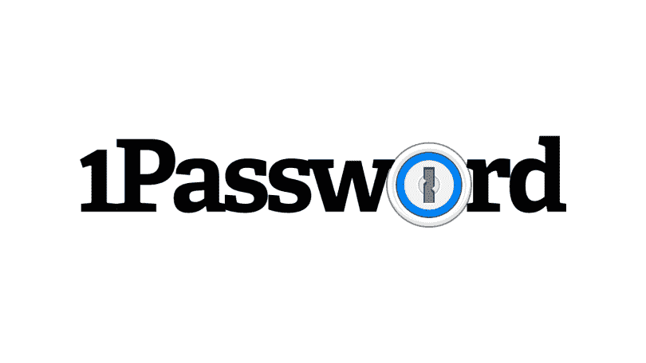
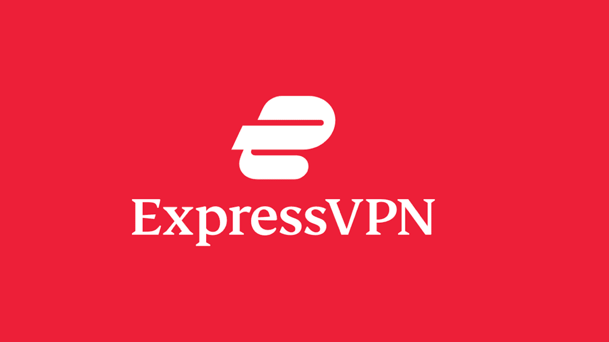
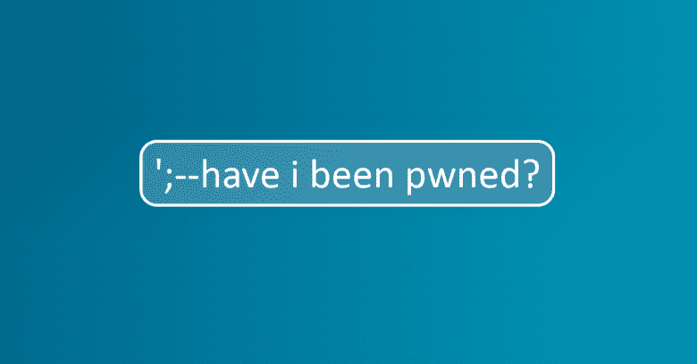

# 如何保护你的在线隐私——五个有用的工具

> 原文：<https://www.freecodecamp.org/news/how-to-protect-your-privacy-online/>

在当今日益增长的网络威胁环境中，学会如何保护自己非常重要。在这篇文章中，我将分享我最喜欢的五个工具，你可以用它们来保护你的在线隐私。

## 为什么在线隐私很重要

你有没有想过你的数据有多大价值？

每个应用程序、网站和企业都在努力获取更多关于你的信息。他们知道的越多，就越能预测你想要什么。有时甚至在你做之前。

个人隐私保护我们免受生活中潜在的伤害或不必要的侵扰。它还允许我们维护我们的尊严和自主权。

最重要的是，个人隐私是我们的基本权利。没有它，我们只是用来训练一个 AI 模型的数据点。

愤世嫉俗者认为“个人隐私是过去的遗物”。不完全是。

在当今渴求数据的世界，保护你的隐私和使用互联网提供的优秀产品仍然是可能的。⁠:这里有五个工具可以帮助你保护网上隐私。

## [勇敢的浏览器](https://brave.com/en-in/)

Photo by [Rubaitul Azad](https://unsplash.com/@rubaitulazad?utm_source=medium&utm_medium=referral) on [Unsplash](https://unsplash.com?utm_source=medium&utm_medium=referral)

Brave 是一款专注于隐私和安全的网络浏览器。默认情况下，它会阻止第三方广告并跟踪 cookies。它还允许用户控制他们看到的广告以及他们的数据如何被使用。

以下是 Brave Browser 与众不同的几个关键特性:

*   **隐私:**默认情况下，Brave 会阻止第三方广告和跟踪 cookies，这有助于保护您的在线隐私。
*   安全: Brave 到处使用 HTTPS 来升级不安全的网站，以确保 HTTPS 连接的安全。这有助于保护您免受中间人攻击和其他形式的在线监控。
*   **性能:** Brave 使用了与谷歌 Chrome 相同的技术 Chromium 开源项目。这意味着它快速、稳定，并支持最新的网络标准。
*   **奖励:** Brave 允许用户在观看尊重隐私的广告时以[基本注意力令牌(BAT)](https://www.investopedia.com/terms/b/basic-attention-token.asp) 的形式获得奖励。这为用户提供了一种方式来支持他们访问的网站和他们喜欢的内容创作者，而不必与广告商共享他们的数据。

勇敢的浏览器提供了隐私，安全和性能的结合。Brave 是 Chrome 或 Edge 的更安全的替代产品，可以保护您的隐私。

## [1 密码](https://1password.com/)

CC: PcMag

1Password 是一个密码管理器和安全的数字钱包。这是一个软件程序，它允许你在一个安全的、加密的保险箱中存储和管理你的密码、信用卡信息和其他敏感数据。

使用 1Password，您只需记住一个主密码。这将有助于您为所有在线帐户使用强而唯一的密码。

1Password 可在多种设备和平台上使用，包括 Windows、Mac、Linux、iOS 和 Android。

1Password 还有其他替代方法，如 Lastpass 和 LogMeOnce。但是，以下是为什么 1Password 是更好的选择的几个原因:

*   **安全性:** 1Password 使用强大的行业标准加密技术来保护您的数据。它有许多安全功能，有助于防止未经授权访问您的保险库。这可以让您放心，您的所有信息都是安全可靠的。
*   **易用性:** 1Password 易于使用。它有一个简单、直观的界面，支持多种设备和平台。它还与您的网络浏览器集成，因此您可以在浏览互联网时保存和填写密码。
*   **功能:** 1Password 提供了一系列功能，包括生成强密码的能力。1Password 还可以存储信用卡信息，如果需要，您可以选择与他人共享密码。

总的来说，1Password 集安全性、易用性、功能和支持于一身，是 password manager 用户的热门选择。

## [隐私獾](https://chrome.google.com/webstore/detail/privacy-badger/pkehgijcmpdhfbdbbnkijodmdjhbjlgp)

CC: Wikipedia

隐私獾是一个免费的浏览器扩展，有助于保护您的在线隐私。隐私獾是电子前沿基金会(EFF)的产品。EFF 是一个倡导数字权利和公民自由的非营利组织。

隐私獾的工作原理是检测和阻止第三方跟踪 cookies。它还分析第三方追踪者的行为，看看哪些人在未经你同意的情况下追踪你。隐私獾可用于 Chrome、Firefox 和 Opera 网络浏览器。

以下是为什么隐私獾是一个伟大的工具的几个原因:

*   **它是免费的:** Privacy Badger 是一个免费开源的浏览器扩展，这意味着你不需要支付任何费用就可以使用它。
*   **很简单:** Privacy Badger 很好用，界面简单，不需要复杂的设置来配置。你可以只安装它，让它做自己的事情。
*   **有效:** Privacy Badger 使用先进的算法来检测和阻止第三方跟踪。当它遇到新的追踪者时，它也有学习和适应的能力。这意味着它可以有效地保护您的隐私，而不需要您做任何工作。
*   **它是透明的:** Privacy Badger 的开发者是 EFF，是社区内知名且值得信赖的组织。EFF 定期发布关于隐私獾的发展和表现的报告和更新。

隐私獾提供了一个简单有效的方法来保护您的在线隐私。凭借由人工智能算法支持的简单界面，隐私獾是保护您隐私的必要工具。

## [快速虚拟专用网](https://www.expressvpn.com/)

CC: PcMag

ExpressVPN 是一种虚拟专用网络(VPN)服务，可让您安全地访问互联网。

ExpressVPN 对您的流量进行加密，并通过远程服务器进行路由。这可以使它看起来好像你是从不同的位置浏览。

这有很多好处，包括保护你的隐私。您还可以访问您所在地区的受限内容，并绕过互联网审查。

ExpressVPN 是许多提供 VPN 服务的公司之一，但它以其速度和可靠性而闻名。

以下是 ExpressVPN 成为最佳选择的几个原因:

*   速度: ExpressVPN 因其速度快而受欢迎，这使得流媒体视频或玩在线游戏更容易。
*   **可靠性:** ExpressVPN 以其可靠稳定的 VPN 服务而闻名。ExpressVPN 有一个庞大的服务器网络和一个全天候工作的工程师团队来维护服务。
*   **安全性:** ExpressVPN 使用高度加密来保护您的数据。它还提供了许多安全功能，如 [DNS 泄漏保护](https://www.fortinet.com/resources/cyberglossary/dns-leak)，以帮助您保持在线安全。
*   **隐私:** ExpressVPN 有严格的无日志策略。这意味着它不会收集或存储您的在线活动的任何信息。这可以让你安心，你的隐私得到保护。
*   **兼容性:** ExpressVPN 可用于多种设备和操作系统。这包括 Windows、Mac、Linux、Android 和 iOS。它还为路由器、游戏机和其他设备提供定制的 VPN 应用。

ExpressVPN 结合了速度、可靠性、安全性、保密性和兼容性。这使得它成为 VPN 用户的热门选择。

## [已经开始了](https://haveibeenpwned.com/)

CC: Sophos

是一个帮助你检查你的个人信息是否被泄露的网站。

安全研究员特洛伊·亨特在 2013 年创建了 HIBP。从那以后，它已经成为一种广泛使用的检查泄露的个人信息的资源。

如果 HIBP 发现您的信息被暴露，它会建议您采取措施来保护自己。这些可能包括更改密码、启用双因素身份验证等等。

以下是 HIBP 的一些特点:

*   **数据泄露搜索:**您可以输入您的电子邮件地址或用户名，查看它是否被包含在 HIBP 数据库的任何数据泄露中。
*   通知服务:你可以注册 HIBP 的通知服务，如果你的电子邮件地址出现新的数据泄露，它会提醒你。
*   **破解密码搜索:**可以输入密码，查看是否出现过任何数据破解。这可以帮助您确定密码是否安全，或者您是否应该更改它。
*   **Pwned 密码 API:** HIBP 提供了一个 API，允许开发人员在自己的应用程序中使用破解密码搜索功能。
*   **数据泄露统计:** HIBP 提供数据泄露统计。这包括受损记录的数量和暴露的数据类型。

即使您设置了强密码，您使用的应用程序也可能会遇到数据泄露。HIBP 帮助您跟踪这些违规行为，确保您的数据安全。

## 摘要

网络隐私不是神话。我们可以使用一些很棒的工具来保护我们的数字生活，安全地使用互联网。

除了设置强密码和启用双因素身份验证等标准安全实践之外，还要使用这五种工具。这里还有一些关于保持在线安全的提示。

喜欢这篇文章吗？访问 https://www.stealthsecurity.io/*的* [，了解更多网络安全内容。也可以在 LinkedIn 上](https://www.stealthsecurity.io/) [*和我*](https://www.linkedin.com/in/manishmshiva/) *联系。*