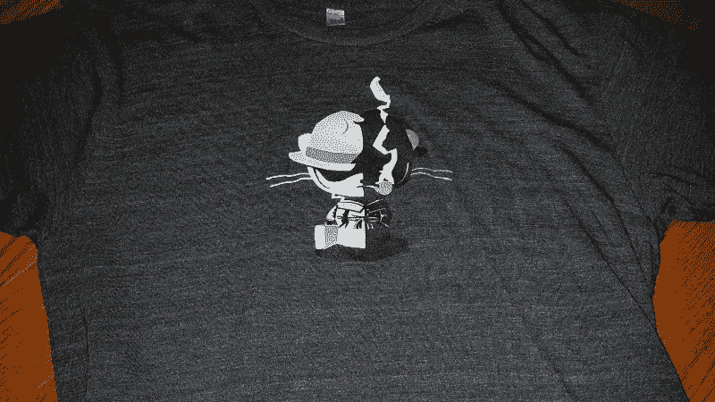
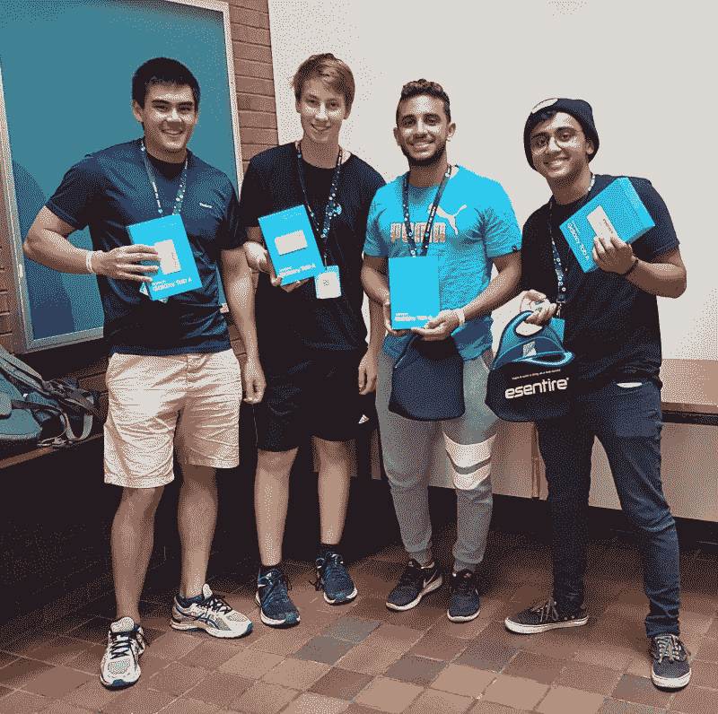
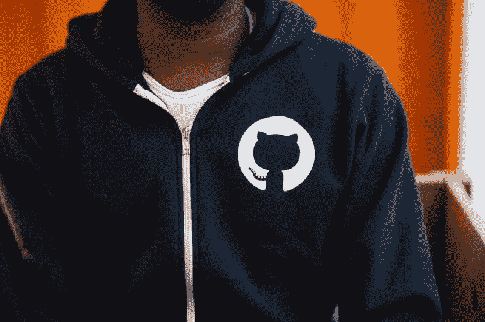

# 我只是一个梦想着安全研究的 15 岁孩子。然后我发现了我的第一个漏洞。

> 原文：<https://www.freecodecamp.org/news/a-15-year-olds-first-exploit-of-github-70c41fc7ef2c/>

考尔德·怀特

# 我只是一个梦想着安全研究的 15 岁孩子。然后我发现了我的第一个漏洞。

从小我就一直有梦想。一个是去 [Hack the North](https://hackthenorth.com) (加拿大最大的黑客马拉松)，这是我去年九月完成的。它超越了我最疯狂的梦想。我的团队甚至获得了埃森泰尔的 API 奖。

Minutes after finding out we won.

但我的故事的重点不是我去了某个黑客马拉松并赢得了某个奖项。重点是我完成了一件我认为完全超出我能力的事情。

你知道那种感觉吗？“是的，我知道有人能做到这一点。但只有在(技能)方面有多年经验的人才可以。”

那是 3 年前的我，那时我刚开始编程。

我认为让计算机做一些事情的想法很酷。我从来没有想过有一天我会用它做什么了不起的事情。

事实上，我一遍又一遍地告诉自己，我正在建造的所有东西都已经有人做过了。这个过程的价值就在于我从重新创造中获得经验。

在《黑客北方》中获奖打破了我自我压抑的枷锁。不——它完全把他们敲竹杠了。我准备好做任何事。

我还有一个梦想，虽然小得多:得到一件 GitHub 帽衫。

我一直很欣赏 GitHub 公司，觉得穿他们的帽衫会很酷。

两个月后，我陷入了低谷，困在了工作中。我想起了我的这个 GitHub 帽衫梦。

问题是，我不能只买帽衫。我刚刚用钱买了一件东西，怎么能穿上它，这意味着这么多技能？我没有赢得它，但我想要它。

我想了几个方法来获得它。可能是 GitHub 赞助的黑客马拉松，比如 GitHub [Game Off](https://github.com/blog/2451-game-off-our-annual-game-jam-returns-in-november) 。但是他们都有太多的变数。

然后我想起听说过他们的昆虫赏金计划。不过，当我听说这件事时，我放弃了。我想，“那对我来说太高级了。”

不再是了。该去工作了。

### 开始黑吧！

在他们的网站上闲逛时，我真的很茫然。毕竟，这是我第一次尝试黑网站。

我终于登陆了 GitHub 的发行系统。我已经知道他们用自己的 markdown 解析器解析你的评论。就这样，我找到了攻击的方向。经过 6 个小时的工作，我发现了一个远不严重的漏洞，但足以尝试提交。

这有点可怕，因为作为新用户你只能提交 5 个 bug，然后你就完蛋了。我经历了 [HackerOne](https://hackerone.com) 的提交过程，这是我之前从未听说过的事情。

### 回应

两周后，它被接受了。算是吧。

这种利用的风险极低，但 GitHub 仍然提出给我发奖金。因为 HackerOne 的 [Hack the World](https://www.hackerone.com/hacktheworld/2017) 事件，我还获得了无限量的终身私人储存库和 HackerOne 上的双倍积分！

尽管这种黑客行为可能风险很低，而且我个人也做过更大的项目和更好地定义比赛，但我仍然认为这是我作为开发人员职业生涯中的一个里程碑。

我长什么样或者我有多年轻并不重要。重要的是我在软件方面的经验。我希望永远如此。

我用 Github 的一部分钱买了我的帽衫，现在我自豪地穿着它在其他网站上寻找我的下一个黑客。