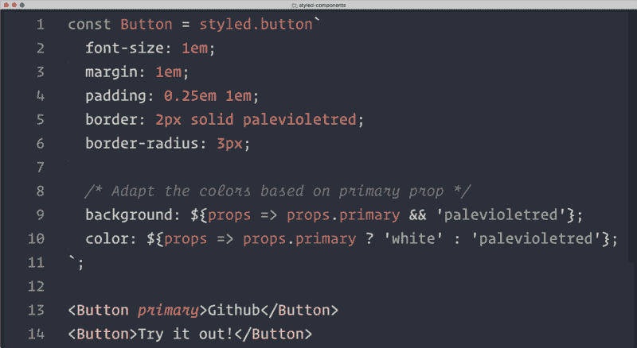

# 风格组件的 5 分钟介绍

> 原文：<https://www.freecodecamp.org/news/a-5-minute-intro-to-styled-components-41f40eb7cd55/>

萨沙·格里菲

# 风格组件的 5 分钟介绍



CSS 很奇怪。你可以在 15 分钟内学会它的基本知识。但是在你找到一个好的方法来组织你的风格之前，可能需要几年的时间。

这部分是由于语言本身的古怪。开箱即用，CSS 是相当有限的，没有变量，循环，或函数。同时，它非常宽松，可以对元素、类、id 或它们的任意组合进行样式化。

### 混乱的样式表

你可能已经亲身经历过了，这通常会导致混乱。虽然像 SASS 和 LESS 这样的预处理程序增加了许多有用的特性，但它们并没有真正阻止 CSS 无政府状态。

这种组织工作留给了像 [BEM](http://getbem.com/) 这样的方法，虽然有用，但完全是可选的，不能在语言或工具级别强制执行。

### CSS 的新浪潮

几年后，新一波基于 JavaScript 的工具正试图通过改变编写 CSS 的方式从根本上解决这些问题。

[Styled Components](https://github.com/styled-components/styled-components) 就是这些库中的一个，由于其创新性和熟悉性的结合，它很快吸引了大量的关注。因此，如果你使用 React(如果你不使用，[查看我的 JavaScript 学习计划](https://medium.freecodecamp.com/a-study-plan-to-cure-javascript-fatigue-8ad3a54f2eb1)和我的[React 简介](https://medium.freecodecamp.com/the-5-things-you-need-to-know-to-understand-react-a1dbd5d114a3)，它绝对值得一看这个新的 CSS 替代方案。

我最近用它来重新设计我的个人网站，今天我想分享一些我在这个过程中学到的东西。

### 组件，样式化

关于样式化组件，你需要理解的主要事情是，它的名字应该从字面上理解。您不再根据 HTML 元素或组件的类或 HTML 元素来设计它们的样式:

```
<h1 className="title">Hello World</h1>
```

```
h1.title{  font-size: 1.5em;  color: purple;}
```

相反，您正在定义拥有自己封装样式的**样式组件**。然后你就可以在你的代码库中自由地使用它们了:

```
import styled from 'styled-components';
```

```
const Title = styled.h1`  font-size: 1.5em;  color: purple;`;
```

```
<Title>Hello World</Title>
```

这似乎是一个微小的区别，事实上两种语法非常相似。但是他们的主要区别是风格现在是他们组件的一部分。

换句话说，我们不再把 CSS 类作为组件和样式之间的中间步骤。

正如 styled-components 的联合创始人马克斯·斯托伊伯所说:

*“*`styled-components`*的基本思想是通过移除样式和组件之间的映射来实施最佳实践。”*

### 卸载复杂性

这乍一看似乎是反直觉的，因为使用 CSS 而不是直接样式化 HTML 元素的全部意义(还记得`<fo` nt >标签吗？)是通过引入这个中间类层来解耦样式和标记。

但是，这种分离也带来了很多复杂性，而且有一个论点是，与 CSS 相比，像 JavaScript 这样的“真正的”编程语言能够更好地处理这种复杂性。

### 课堂上的道具

为了与这种无类哲学保持一致，在定制组件的行为时，styled-components 使用了超越类的道具。所以与其说:

```
<h1 className="title primary">Hello World</h1> // will be blue
```

```
h1.title{  font-size: 1.5em;  color: purple;    &.primary{    color: blue;  }}
```

你会写:

```
const Title = styled.h1`  font-size: 1.5em;  color: ${props => props.primary ? 'blue' : 'purple'};`;
```

```
<Title primary>Hello World</Title> // will be blue
```

正如您所看到的，样式化组件通过将所有 CSS 和 HTML 相关的实现细节排除在 React 组件之外，使您能够清理 React 组件。

也就是说，样式化组件 CSS 仍然是 CSS。所以像这样的事情也是完全有效的(尽管有点不习惯)代码:

```
const Title = styled.h1`  font-size: 1.5em;  color: purple;    &.primary{    color: blue;  }`;
```

```
<Title className="primary">Hello World</Title> // will be blue
```

这是一个使样式化组件非常容易进入的特性:当它有疑问时，你总是可以回到你所知道的！

### 警告

值得一提的是，styled-components 仍然是一个年轻的项目，有些特性还没有得到完全支持。例如，如果您想从父组件中为子组件设置样式，您现在必须依赖于使用 CSS 类(至少在 styled-components v2 出现之前)。

还没有“官方”的方法在服务器上预渲染你的 CSS，尽管手动注入样式是完全可能的。

styled-components 生成自己的随机类名，这使得使用浏览器的开发工具很难找出样式最初是在哪里定义的。

但是非常令人鼓舞的是，styled-components 核心团队意识到了所有这些问题，并且正在努力逐一解决它们。[版本 2 快到了](https://github.com/styled-components/styled-components/tree/v2)，真的很期待！

### 了解更多信息

我在这里的目标不是详细解释样式化组件是如何工作的，而是让您大致了解一下，这样您就可以自己决定它是否值得一试。

如果我已经设法让你好奇，这里有一些地方，你可以了解更多关于样式组件:

*   马克斯·斯托伊伯最近写了一篇关于为《粉碎杂志》设计风格化组件的原因的文章。
*   [样式组件报告](https://github.com/styled-components/styled-components)本身有大量的文档。
*   Jamie Dixon 的这篇文章概述了转向样式化组件的一些好处。
*   如果你想了解更多关于这个库实际上是如何实现的，请查看 Max 的这篇文章。

如果你想更进一步，你也可以看看 [Glamor](https://github.com/threepointone/glamor) ，一个新浪潮 CSS 的不同视角！

自我推广时间:[我们正在寻找开源贡献者来帮助 Nova](https://github.com/TelescopeJS/Telescope/tree/devel) ，这是创建完整的表单、数据加载和用户帐户的全栈 React & GraphQL 应用程序的最简单方法。我们还没有使用样式化组件，但是你可能是第一个实现它们的人！