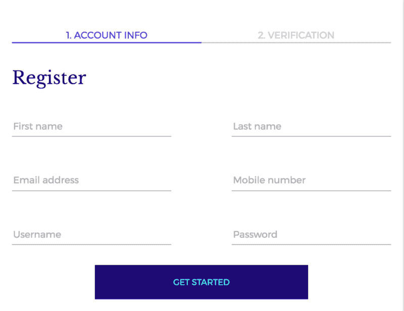
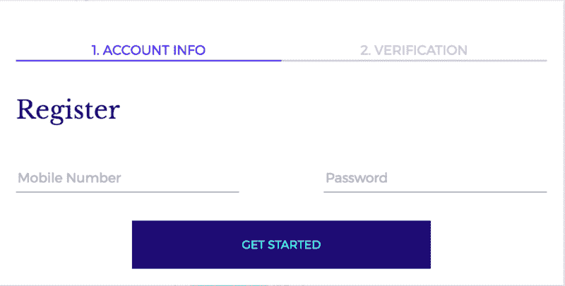
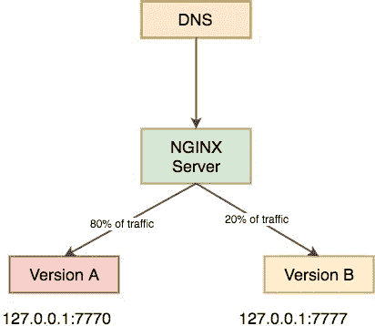
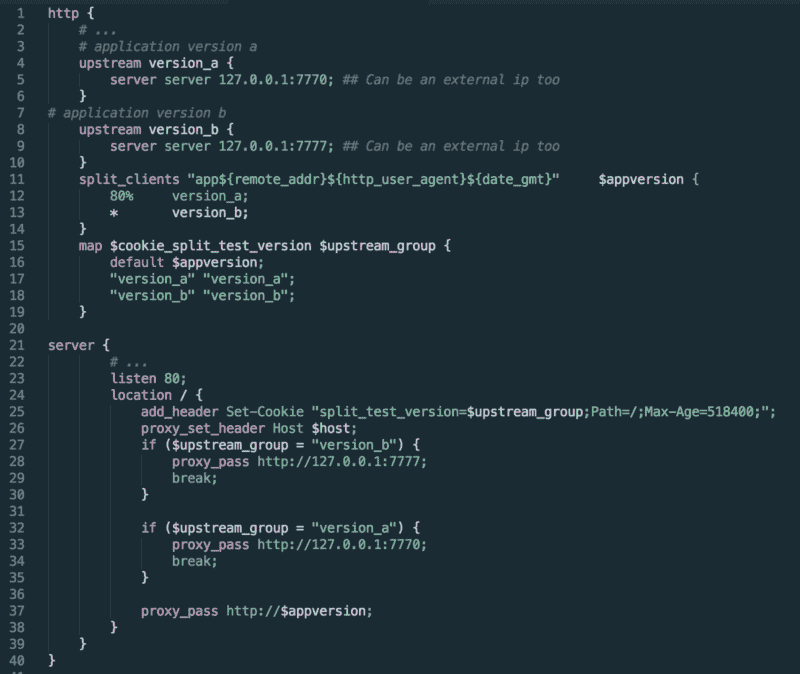

# 使用 NGINX 在不到 40 行代码中进行 A/B 测试

> 原文：<https://www.freecodecamp.org/news/a-b-testing-with-nginx-in-40-lines-of-code-d4f94397130a/>

作者 Nitish Phanse

# 使用 NGINX 在不到 40 行代码中进行 A/B 测试


A/B 测试使设计师和产品经理能够深入了解用户的行为模式。

一方面，它允许产品经理在概念化用户旅程时有更多的灵活性。但另一方面，它已经成为开发人员的噩梦，被告知要为同一个组件制作两个版本。

> “A/B 测试背后的一般概念是创建一个实验，由一个对照组和一个或多个接受替代治疗的实验组(在网飞称为“细胞”)组成。每个成员只属于给定实验中的一个单元，其中一个单元总是被指定为“默认单元”。这个单元代表对照组，它接受的体验与所有未参加测试的网飞成员相同。”

> -网飞博客

#### 当前的生态系统提供了什么？

很多公司，比如 Mixpanel、VWO 和乐观地提供客户端 SDK(JavaScript 代码),它们必须被添加到页面 HTML 的`head`标签中。然后可以通过仪表板创建测试。

尽管上述方法在按钮颜色、组件高度和其他 CSS 属性方面为您提供了很多选择，但它并不真正允许您创建两个单独的流。

此外，一些外部库确实会影响页面加载时间，给用户带来不稳定/滞后的体验。

### 展示 NGINX


Nginx 是一个轻量级 web 服务器，它提供了一系列功能，比如负载平衡、反向代理和 HTML 压缩。它很容易设置，并为开发人员提供了很多控制。

NGINX 是一个为分割测试分配流量的极好工具。

它稳定，速度惊人，典型用例的配置在网上很流行。只需花几个小时浏览文档，就可以完成更复杂的配置。小公司可能没有资源花在 A/B 测试的付费软件上，但是 NGINX 提供了一个选项来执行某种形式的 A/B 测试。

例如，假设您想了解以下哪种形式的转换效果更好:



Version A and Version B respectively

您的假设可能是，更少的表单字段意味着用户输入的数据更少，从而导致更多的转换。

所以我们可以定义两个桶:版本 A 和版本 b，前者是控制组，显示为 80%的流量。后者是测试组，形成剩余 20%的流量。

端口 7770 将承载一个代码桶，而端口 7777 将承载第二个代码桶。



### 密码

您的 nginx.conf 文件可以如下所示进行修改。

```
http {    # ...    # application version 1a    upstream version_a {        server server 127.0.0.1:7770; ## Can be an external ip too    }
```

```
 # application version 1b    upstream version_b {        server server 127.0.0.1:7777; ## Can be an external ip too    }
```

```
 split_clients "app${remote_addr}${http_user_agent}${date_gmt}"   $appversion {        80%     version_1a;        *       version_1b;    }
```

```
server {        # ...        listen 80;        location / {            proxy_set_header Host $host;            proxy_pass http://$appversion;        }    }}
```

创建两个上游，每个桶一个。

`split_client` 指令帮助我们按照指定的权重将流量转移到特定的上游。

`app${remote_addr}${http_user_agent}${date_gmt}appversion` 基于上述参数创建一个散列，nginx 使用它来记录对任一桶的请求。优选地，这些参数是仅与用户相关的参数，如`user_agent`、`remote addr`。

好的——这是可行的，但是它没有给用户一个持久的体验。

如果我刷新我的页面，有可能我会在不同的桶之间切换，这可能是一个可怕的用户体验。

考虑上面的情况:想象一下，试图填写一个六字段的表单，然后在刷新时突然看到一个两字段的表单。扑朔迷离！

### 不同的方法

1.  代理将请求传递给任一存储桶
2.  设置一个过期时间等于测试持续时间的 cookie。
3.  检查 cookie 是否存在以及代理是否传递到正确的存储桶，以确保统一的用户体验。

我们将使用 NGINX 的`map`指令，并将`$cookie_name` 变量映射到我们创建的不同桶。

```
http {    # ...    # application version a    upstream version_a {        server server 127.0.0.1:7770; ## Can be an external ip too    }
```

```
 # application version b    upstream version_b {        server server 127.0.0.1:7777; ## Can be an external ip too    }    split_clients "app${remote_addr}${http_user_agent}${date_gmt}"     $appversion {        80%     version_a;        *       version_b;    }
```

```
 map $cookie_split_test_version $upstream_group {        default $appversion;        "version_a" "version_a";        "version_b" "version_b";    }
```

```
server {        # ...        listen 80;        location / {            add_header Set-Cookie "split_test_version=$upstream_group;Path=/;Max-Age=518400;";
```

```
 proxy_set_header Host $host;
```

```
 if ($upstream_group = "version_a") {                proxy_pass http://127.0.0.1:7777;                break;            }
```

```
 if ($upstream_group = "version_b") {                proxy_pass http://127.0.0.1:7770;                break;            }
```

```
 proxy_pass http://$appversion;        }    }}
```

由于格式化上面的代码有点困难…



### 结论

1.  NGINX 提供了一个非常简单的 API 来创建 A/B 测试环境。
2.  允许创建多个存储桶。上面的例子显示了两个桶，但是我们可以拆分流量并创建更多的桶。
3.  由于相同的代码托管在两个端口上，部署可能会变得棘手(目前我有两个分支:主分支和测试分支)，无论是从不同的分支还是从同一个分支完成。
4.  进行一次以上的 A/B 测试可能会变得棘手。是的，您可以使用`location`指令并根据所需的测试设置不同的 cookies，但是有两个测试(*测试 1，控制:80，测试 20 &测试 2 控制:50，测试 50* )是不可能的。也就是说，你不应该在每个页面上一次进行一个以上的 A/B 测试。否则你将会得到 2^n 版本的页面，其中 n 是测试的次数，跟踪转换将会是地狱。
5.  跟踪现在可以在非常精细的级别上完成，因为代码库是有效分离的。

如果我在上面有任何错误，请告诉我。乐于纠正和学习。希望你喜欢这篇文章。

**PS:有人注意到它不到 40 行代码吗？！**