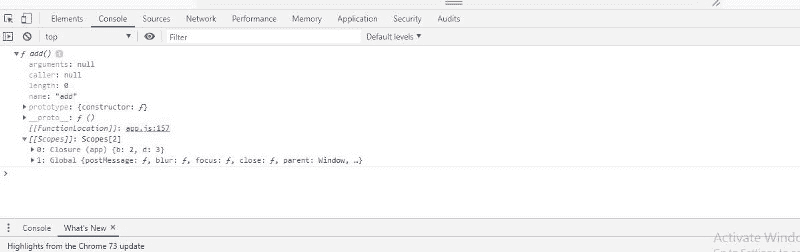

# JavaScript 中闭包的基本指南

> 原文：<https://www.freecodecamp.org/news/a-basic-guide-to-closures-in-javascript-9fc8b7e3463e/>

闭包是函数创建时作用域内所有变量的集合。要使用闭包，在另一个函数内部创建一个函数，这个函数称为嵌套函数。内部函数将可以访问外部函数范围内的变量(**闭包**有助于访问外部函数范围)，甚至在外部函数返回之后。每次创建函数时都会创建闭包。

在继续理解闭包之前，让我们先了解一下 JavaScript 中的作用域链。

通常，有两种类型的范围:

*   全球范围
*   局部范围

在 ES5 版本中，函数内部的变量在外部是不可见的。但是块内部的变量(像 if 或 while 这样的条件)在外部也是可见的。

由此，ES5 有了作用范围。没有块范围。

> 编辑时间:2019 年 5 月 9 日

> 根据 **ES5** 的说法，使用函数是在代码中声明块范围的唯一方式。

> 但是，在 ES6 中，**let**&**const**keywords 提供了阻止范围。

> 无论如何，最好了解 JavaScript 是如何逐步发展的。

让我们在 ES5 版本中继续:

```
var a = 10;
function app(){
   var b = 2;
   console.log(a); // 10
   console.log(b); // 2
}
console.log(b); //   ReferenceError: b is not defined
app();
```

我们已经知道， **a** 是一个全局变量& **b** 是一个局部变量，它是 app 函数的**专用**。

我们不能在局部范围之外获取局部变量的值。

#### 使用嵌套函数—函数中的函数

```
var a = 10;
function app(){
     var b = 2;
     var d = 3;
  function add(){
     var c = a + b;
   }
 return add;
}
var x = app();
console.dir(x);
```

这里，app 是父函数& add 函数是子函数。

*   不使用 console.log， **console.dir** 用于控制台指定 JavaScript 对象的所有属性，这有助于开发人员获取该对象的属性
*   变量 x 被赋给 app 函数& app 函数返回 add 函数。因此，我们可以看到 add 函数的所有对象属性。

如果您在浏览器中看到控制台，您可以在 Scopes 数组中看到闭包对象。



由于内部**函数 add** 访问外部函数变量 **b & d** ，这两个变量将被添加到闭包对象中作为引用。

让我们来看下一个结束的例子:

```
var a = 10;
var startFunc;
function app(){
      var b = 2;
   function add(){
      var c = a + b;
      console.log(c);
   }
   startFunc = add();
}
app(); // Invoke the app function
startFunc; 
// as the app function invoked above will assign the add function to startFunc & console the value of c
```

*   名为 startFunc 的全局函数被分配给 add 函数，该函数是父 app 函数的子函数。
*   这只有在 app 函数被调用后才有可能，否则 startFunc 将作为一个没有赋值的全局变量

#### 闭包在 JavaScript 中的应用

我们大多数人在编码时使用闭包，但是我们不明白为什么要使用它。JavaScript 不像其他面向对象的编程语言那样有像 **private、public、protected** 这样的访问修饰符。因此，在 ES5 中，我们必须使用函数来保护名称空间免受外部代码的使用。

特别是在函数中，**立即调用的函数表达式(life)**是在声明之后立即执行的函数表达式。您不需要在函数声明后调用它。

IIFE 支持用 JavaScript 编写**模块模式**(设计模式之一)。

生活的语法定义是:

```
(function(){
             //variables & scope that inside the function 
})();
```

让我们举个例子:

```
var studnetEnrollment = (function () {
    //private variables which no one can change
    //except the function declared below.
     var count = 0;
     var prefix = "S";
    // returning a named function expression
     function innerFunc() {
         count = count + 1;
         return prefix + count;
     };
 return innerFunc;
})();
var x = studnetEnrollment(); // S1
console.log(x);
var y = studnetEnrollment(); // S2 
console.log(y);
```

count & prefix 是两个私有变量，任何人都不能更改&只能由内部函数(这里是它的 innerFunc)访问。这种访问只有通过名为 Closure 的特性才是可能的。

*   第一次调用 studentEnrollment 函数时，函数内部的 count 变量由 innerFunc 函数递增 1。
*   第二次，计数增加到先前的计数值 1 到 2
*   通过闭合特征，这些都是可能的。

#### 结论

闭包是外部函数中变量的集合，它提供对内部函数范围的访问，以保护全局名称空间。

闭包使开发人员能够像 OOP 语言一样编写干净的代码，不会混淆 ES5 版本中的全局和局部变量名。

快乐编码……！！！！！