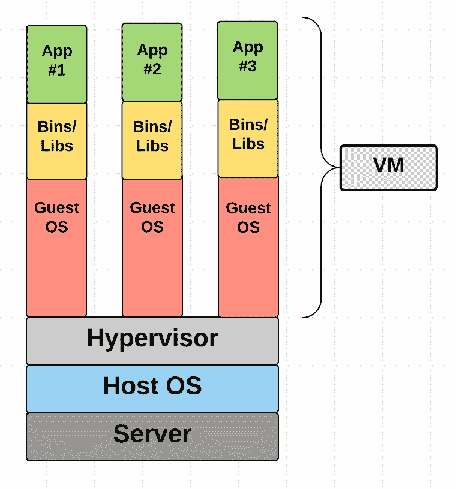
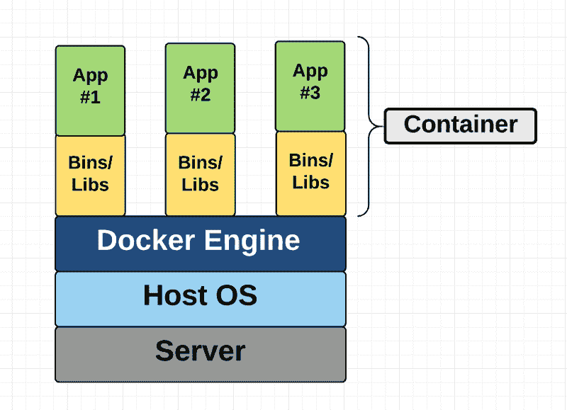
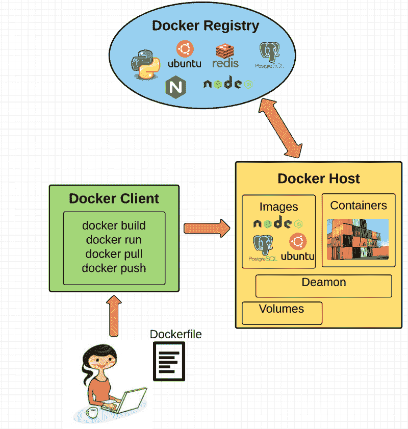
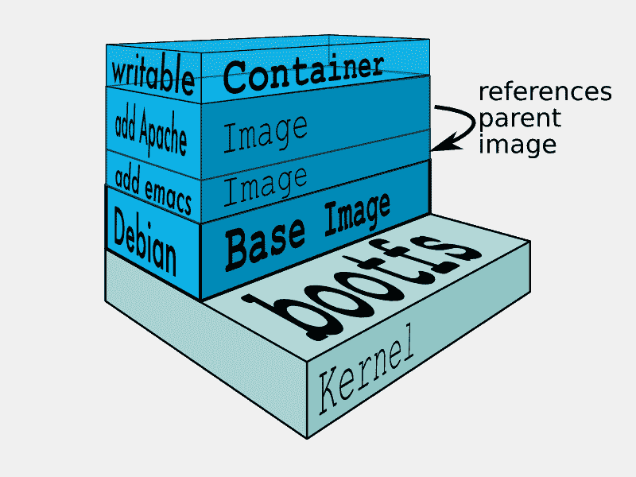

# 对初学者友好的容器、虚拟机和 Docker 介绍

> 原文：<https://www.freecodecamp.org/news/a-beginner-friendly-introduction-to-containers-vms-and-docker-79a9e3e119b/>

作者:Preethi Kasireddy

# 对初学者友好的容器、虚拟机和 Docker 介绍

Source: [https://flipboard.com/topic/container](https://flipboard.com/topic/container)

如果你是程序员或技术人员，你可能至少听说过 Docker:一个打包、运输和在*“容器”中运行应用程序的有用工具。*很难不这样做，因为最近它受到了开发人员和系统管理员的广泛关注。甚至像谷歌、VMware 和亚马逊这样的大公司也在建立服务来支持它。

不管你是否已经想到了 Docker 的一个直接用例，我仍然认为理解一些关于什么是*“容器”*以及它与虚拟机(VM)相比如何的基本概念是很重要的。虽然互联网上有很多优秀的 Docker 使用指南，但我找不到很多对初学者友好的概念性指南，尤其是关于容器是由什么组成的。所以，希望这篇文章能解决这个问题:)

让我们从了解什么是虚拟机和容器开始。

### 什么是“容器”和“虚拟机”？

容器和虚拟机的目标相似:将应用程序及其依赖项隔离到一个自包含的单元中，该单元可以在任何地方运行。

此外，容器和虚拟机消除了对物理硬件的需求，允许在能耗和成本效益方面更有效地使用计算资源。

容器和虚拟机之间的主要区别在于它们的架构方法。让我们仔细看看。

### 虚拟计算机

虚拟机本质上是真实计算机的模拟，它像真实计算机一样执行程序。虚拟机在使用*“虚拟机管理程序”*的物理机上运行。反过来，一个管理程序可以运行在主机上，也可以运行在*【裸机】*上。

让我们解开行话:

**虚拟机管理程序**是虚拟机在其上运行的软件、固件或硬件。虚拟机管理程序本身运行在物理计算机上，称为*“主机”*。主机为虚拟机提供资源，包括 RAM 和 CPU。这些资源在虚拟机之间进行分配，并且可以根据您的需要进行分配。因此，如果一个虚拟机正在运行一个占用更多资源的应用程序，您可能会为该虚拟机分配比同一台主机上运行的其他虚拟机更多的资源。

运行在主机上的虚拟机(再次使用虚拟机管理程序)通常也称为*“来宾机”*该客户机包含应用程序和运行该应用程序所需的任何内容(例如，系统二进制文件和库)。它还拥有自己的整个虚拟化硬件堆栈，包括虚拟化网络适配器、存储和 CPU，这意味着它还拥有自己成熟的客户操作系统。从内部来看，客户机就像一个拥有自己专用资源的单元。从外部来看，我们知道它是一个虚拟机，共享主机提供的资源。

如上所述，客户机器可以运行在**托管的虚拟机管理程序**或**裸机虚拟机管理程序**上。它们之间有一些重要的区别。

首先，托管的虚拟化管理程序运行在主机的操作系统上。例如，运行 OSX 的计算机可以在该操作系统上安装一个虚拟机(例如 VirtualBox 或 VMware Workstation 8)。虚拟机不能直接访问硬件，所以它必须通过主机操作系统(在我们的例子中，是 Mac 的 OSX)。

托管虚拟机管理程序的好处是底层硬件不那么重要。主机的操作系统负责硬件驱动程序，而不是虚拟机管理程序本身，因此被认为具有更多的“硬件兼容性”另一方面，硬件和虚拟机管理程序之间的这一附加层会产生更多的资源开销，从而降低虚拟机的性能。

裸机虚拟机管理程序环境通过在主机硬件上安装并运行来解决性能问题。因为它直接与底层硬件接口，所以不需要主机操作系统来运行。在这种情况下，作为操作系统安装在主机服务器上的第一件东西将是虚拟机管理程序。与托管的虚拟机管理程序不同，裸机虚拟机管理程序有自己的设备驱动程序，并直接与每个组件进行交互，以执行任何 I/O、处理或特定于操作系统的任务。这带来了更好的性能、可伸缩性和稳定性。这里的权衡是硬件兼容性受到限制，因为虚拟机管理程序只能内置这么多设备驱动程序。

谈了这么多关于虚拟机管理程序的内容后，您可能想知道为什么我们需要在虚拟机和主机之间增加一个额外的*“虚拟机管理程序”*层。

因为虚拟机有自己的虚拟操作系统，所以虚拟机管理程序在为虚拟机提供管理和执行该客户操作系统的平台方面起着重要作用。它允许主机在虚拟机之间共享资源，这些虚拟机在主机上作为来宾运行。

Virtual Machine Diagram

如图所示，虚拟机为每个新虚拟机打包了虚拟硬件、内核(即操作系统)和用户空间。

### 容器

与提供硬件虚拟化的 VM 不同，容器通过抽象“用户空间”来提供操作系统级的虚拟化。当我们打开术语*容器*时，你会明白我的意思。

对于所有的意图和目的，容器看起来像一个虚拟机。例如，它们有专用的处理空间，可以作为根用户执行命令，有专用的网络接口和 IP 地址，允许自定义路由和 iptable 规则，可以挂载文件系统，等等。

容器和虚拟机之间的一个很大的区别是容器与其他容器共享主机系统的内核。

Container Diagram

这个图向您展示了容器只是打包用户空间，而不是像 VM 那样打包内核或虚拟硬件。每个容器都有自己独立的用户空间，允许多个容器在一台主机上运行。我们可以看到所有的操作系统级架构都在容器间共享。唯一从头开始创建的部件是媒体夹和库。这就是容器如此轻便的原因。

### Docker 在哪里出现？

Docker 是一个基于 Linux 容器的开源项目。它使用 Linux 内核特性，如名称空间和控制组，在操作系统之上创建容器。

集装箱远非新品；谷歌多年来一直在使用他们自己的容器技术。其他 Linux 容器技术包括 Solaris Zones、BSD jails 和 LXC，它们已经存在了很多年。

那么，为什么 Docker 突然变得越来越流行了呢？

1.易于使用: Docker 让任何人——开发人员、系统管理员、架构师和其他人——更容易利用容器来快速构建和测试可移植的应用程序。它允许任何人在他们的笔记本电脑上打包一个应用程序，反过来可以在任何公共云、私有云甚至裸机上不加修改地运行。咒语是:“构建一次，运行在任何地方。”

2.**速度:** Docker 集装箱非常轻便快速。由于容器只是运行在内核上的沙盒环境，它们占用的资源更少。您可以在几秒钟内创建并运行 Docker 容器，相比之下，虚拟机可能需要更长时间，因为它们每次都必须启动完整的虚拟操作系统。

3. **Docker Hub:** Docker 用户也受益于 Docker Hub 日益丰富的生态系统，你可以把它想象成一个“Docker 图片的应用商店”。Docker Hub 拥有数万张由社区创建的公共图片，随时可供使用。搜索符合您需求的图像非常容易，只需很少或不需要修改就可以下载和使用。

4.模块性和可伸缩性: Docker 可以很容易地将应用程序的功能分解到单独的容器中。例如，您可能在一个容器中运行 Postgres 数据库，在另一个容器中运行 Redis 服务器，而 Node.js 应用程序在另一个容器中运行。有了 Docker，将这些容器链接在一起创建应用程序变得更加容易，使得将来独立扩展或更新组件变得更加容易。

最后但同样重要的是，谁不爱码头鲸呢？；)

Source: [https://www.docker.com/docker-birthday](https://www.docker.com/docker-birthday)

### 基本 Docker 概念

现在我们已经有了大致的了解，让我们一点一点地了解 Docker 的基本部分:

#### 码头引擎

Docker 引擎是 Docker 运行的层。它是一个轻量级的运行时和工具，管理容器、图像、构建等等。它本机运行在 Linux 系统上，由以下部分组成:

1.在主机上运行的 Docker 守护程序。
2。Docker 客户端，然后与 Docker 守护程序通信以执行命令。
3。用于远程与 Docker 守护进程交互的 REST API。

#### 码头客户

作为 Docker 的最终用户，Docker 客户端是您与之交流的对象。可以把它想象成 Docker 的 UI。例如，当你做…

您正在与 Docker 客户机通信，然后客户机将您的指令传递给 Docker 守护进程。

#### docker daemon(坞站守护程序)

Docker 守护进程实际执行发送给 Docker 客户机的命令——比如构建、运行和分发容器。Docker 守护进程运行在主机上，但是作为用户，您永远不会与守护进程直接通信。Docker 客户机也可以在主机上运行，但这不是必需的。它可以运行在不同的机器上，并与运行在主机上的 Docker 守护进程通信。

#### Dockerfile

Docker 文件是您编写构建 Docker 映像的指令的地方。这些指令可以是:

*   **运行 apt-get y install some-package** :安装软件包
*   **暴露 8000:** 暴露一个端口
*   **ENV ANT _ HOME/usr/local/Apache-ANT**来传递环境变量

诸如此类。一旦设置好 docker 文件，就可以使用 **docker build** 命令来构建一个映像。以下是 Dockerfile 文件的一个示例:

#### Docker 图像

图像是只读模板，由 docker 文件中编写的一组指令构建而成。映像定义了您希望打包的应用程序及其依赖项看起来是什么样子，以及启动时要运行什么流程。

Docker 映像是使用 Docker 文件构建的。docker 文件中的每条指令都向映像添加一个新的“层”,层代表映像文件系统的一部分，可以添加或替换它下面的层。层是 Docker 轻量级但功能强大的结构的关键。Docker 使用一个联合文件系统来实现这一点:

#### 联合文件系统

Docker 使用 Union 文件系统来构建映像。您可以将联合文件系统视为一个可堆叠的文件系统，这意味着不同文件系统(称为分支)的文件和目录可以透明地重叠在一起，形成一个文件系统。

在重叠的分支内具有相同路径的目录的内容被视为单个合并的目录，这避免了创建每一层的单独副本的需要。相反，它们都可以被赋予指向同一资源的指针；当某些层需要修改时，它会创建一个副本并修改一个本地副本，保持原始副本不变。这就是为什么文件系统看起来是可写的，但实际上不允许写。(换句话说，就是“写入时复制”系统。)

分层系统有两个主要优点:

1.**免复制:**层有助于避免每次使用映像创建和运行新容器时复制完整的文件集，从而使 docker 容器的实例化非常快速和廉价。
2。**图层分离:**进行更改要快得多——当您更改图像时，Docker 只会将更新传播到被更改的图层。

#### 卷

卷是容器的“数据”部分，在创建容器时初始化。卷允许您保存和共享容器的数据。数据卷独立于默认的 Union 文件系统，在主机文件系统上作为普通的目录和文件存在。因此，即使您销毁、更新或重建容器，数据卷也不会受到影响。当您想要更新卷时，可以直接对其进行更改。(额外的好处是，数据量可以在多个容器之间共享和重用，这非常简单。)

#### 码头集装箱

如上所述，Docker 容器将应用程序的软件包装到一个看不见的盒子中，里面装有应用程序运行所需的一切。这包括操作系统、应用程序代码、运行时、系统工具、系统库等。Docker 容器是基于 Docker 映像构建的。由于映像是只读的，Docker 在映像的只读文件系统上添加一个读写文件系统来创建一个容器。

Source: Docker

此外，在创建容器时，Docker 会创建一个网络接口，以便容器可以与本地主机通信，将一个可用的 IP 地址附加到容器，并执行您在定义映像时指定的运行应用程序的进程。

一旦您成功地创建了一个容器，您就可以在任何环境中运行它，而无需进行任何更改。

### 双击“容器”

唷！有很多活动部件。有一件事一直让我好奇，那就是容器实际上是如何实现的，尤其是因为容器周围没有任何抽象的基础设施边界。经过大量的阅读，这一切都是有意义的，所以我在这里尝试解释给你听！:)

术语“容器”实际上只是一个抽象的概念，用来描述一些不同的功能如何一起工作来可视化一个“容器”。让我们快速浏览一遍:

#### 1)名称空间

名称空间为容器提供了它们自己的底层 Linux 系统视图，限制了容器可以看到和访问的内容。运行容器时，Docker 会创建特定容器将使用的名称空间。

Docker 在内核中使用几种不同类型的名称空间，例如:

a. **NET:** 提供一个容器，该容器具有自己的系统网络堆栈视图(例如，自己的网络设备、IP 地址、IP 路由表、/proc/net 目录、端口号等。).
b. **PID:** PID 代表进程 ID。如果您曾经在命令行中运行过 **ps aux** 来检查您的系统上正在运行什么进程，您会看到一个名为“PID”的列。PID 名称空间为容器提供了它们自己的进程作用域视图，它们可以查看进程并与之交互，包括一个独立的 init (PID 1)，它是“所有进程的祖先”。
c. **MNT:** 给容器自己的系统上[“挂载”的视图。因此，不同挂载名称空间中的进程具有不同的文件系统层次结构视图。
d. **UTS:** UTS 代表 UNIX 分时系统。它允许进程识别系统标识符(即主机名、域名等)。).UTS 允许容器拥有自己的主机名和独立于其他容器和主机系统的 NIS 域名。
e. **IPC:** IPC 代表进程间通信。IPC 命名空间负责隔离每个容器内运行的进程之间的 IPC 资源。
f. **USER:** 这个名称空间用来隔离每个容器内的用户。与主机系统相比，它允许容器具有不同的 uid(用户 id)和 gid(组 ID)范围视图。因此，进程的 uid 和 gid 在用户名称空间内部和外部可以是不同的，这也允许进程在容器外部拥有非特权用户，而不牺牲容器内部的 root 特权。](http://www.linfo.org/mounting.html)

Docker 一起使用这些名称空间，以便隔离和开始创建容器。下一个特性叫做控制组。

#### 2) **对照组**

控制组(也称为 cgroups)是 Linux 内核的一个特性，它对资源使用(CPU、内存、磁盘 I/O、网络等)进行隔离、优先排序和统计。)的一套流程。从这个意义上来说，cgroup 确保 Docker 容器只使用它们需要的资源——并且，如果需要，设置容器*可以*使用的资源的限制。Cgroups 还确保单个容器不会耗尽其中一种资源，从而导致整个系统瘫痪。

最后，联合文件系统是 Docker 使用的另一个特性:

#### 3) **隔离联合文件系统:**

以上在 Docker 图像部分描述:)

这就是 Docker 容器的全部内容(当然，难点在于实现细节——比如如何管理各种组件之间的交互)。

### Docker 的未来:Docker 和 VMs 将共存

虽然 Docker 确实获得了很大的发展，但我不认为它会成为虚拟机的真正威胁。容器将继续普及，但有许多使用案例仍然更适合虚拟机。

例如，如果您需要在多台服务器上运行多个应用程序，使用虚拟机可能是有意义的。另一方面，如果您需要运行一个应用程序的多个副本，Docker 提供了一些引人注目的优势。

此外，虽然容器允许您将应用程序分解成更多功能性的独立部分来创建关注点的分离，但这也意味着要管理的部分越来越多，这会变得难以处理。

安全性也是 Docker 容器关注的一个方面——因为容器共享相同的内核，容器之间的屏障更薄。虽然完整的虚拟机只能向主机虚拟机管理程序发出虚拟化调用，但 Docker 容器可以向主机内核发出系统调用，这为攻击创造了更大的表面积。当安全性特别重要时，开发人员可能会选择由抽象硬件隔离的虚拟机，这使得相互干扰变得更加困难。

当然，像安全和管理这样的问题肯定会随着容器在生产中的暴露和用户的进一步审查而发展。目前，关于容器与虚拟机的争论最好留给每天都在使用它们的开发人员来讨论！

### 结论

我希望你现在已经掌握了更多关于 Docker 的知识，甚至有一天可以在项目中使用它。

和往常一样，如果我犯了什么错误或者对你有所帮助，请在评论中给我留言。:)