# 如何用 AWS 托管你的静态网站——初学者指南

> 原文：<https://www.freecodecamp.org/news/a-beginners-guide-on-how-to-host-a-static-site-with-aws/>

当我去年创建我的第一个[作品集](https://thecodinghamster.com/)时，我是基于我从 [freeCodeCamp](https://www.freecodecamp.org/) 中学到的东西(HTML、CSS 和一点 JavaScript)。

那时，我只是通过查看本地计算机上的文件来查看我在本地主机上的投资组合。我对如何在网上主持一个网站一无所知。

学习如何管理我的第一个网站并不容易，但这是一次很好的学习经历。如果你是一个有抱负的网站开发者，或者只是对创建自己的静态网站感兴趣，那么我希望你会发现这个指南很有用。

#### 这本指南是给谁的？

本指南针对的是**想要托管一个静态网站(有固定内容的网站)的完全初学者**。我将提供以下操作指南:

1.  如何购买域名？
2.  如何为外部主机提供商配置您的域？
3.  如何用亚马逊网络服务(AWS)托管你的网站？
4.  如何使用亚马逊认证管理器使你的网站安全(SSL 认证)？

可能有些术语对你来说是新的。请继续查找不熟悉的术语。我在我认为合适的地方放入了有用的链接和解释。

#### **什么是域名和 DNS(域名系统)？**

域名是你的网站地址。例如 thecodinghamster.com。但是对于计算机来说，域名实际上是一系列数字(一个 IP 地址)。IP 地址如下所示:123.321.0.1

对我们来说，记住一长串数字并不容易。因此，你的计算机参考一个 **DNS** 把一个基于文本的网站地址翻译成一个它可以理解的 IP 地址。DNS 就像一个目录。

我看了这个很棒的视频，它在不到五分钟的时间里解释了域名、DNS 及其工作原理。如果您感兴趣，请观看视频的前五分钟:

[https://www.youtube.com/embed/e2xLV7pCOLI?feature=oembed](https://www.youtube.com/embed/e2xLV7pCOLI?feature=oembed)

### 哪里可以买到你的域名？

你可以从域名注册商那里购买域名。价格从几美元开始。您的域名是唯一的。每个域名注册商提供不同级别的服务/支持。但是你可以向任何注册商注册你的域名。

#### 什么是托管提供商？

> 互联网托管服务是一种运行互联网服务器的服务，允许组织和个人向互联网提供内容。有各种级别的服务和提供的各种服务。”

当我为我的网站寻找主机提供商时，我探索了不同的选择。价格从每月 2.00 英镑到 5.00 英镑不等，存储容量从 0.5GB 到 10GB 不等。价格似乎很合理，但我想做的只是主持一个静态网站。它有一些图片、HTML、CSS 和 JavaScript 文件。没有动态内容。

#### **为什么选择 AWS？**

经过进一步的研究，我发现了 AWS。AWS 提供了[自由层选项](https://aws.amazon.com/free/?nc2=h_ql_pr)。本质上，你会得到很多免费的产品。其中一些在 12 个月后到期，另一些则是永久免费的。托管静态网站的唯一成本是建立托管区域的成本。这每月花费 0.50 美元。所以我用 AWS 建立了我的账户。

AWS 的优势在于价格，而且它是一个可靠的主机提供商。但是要记住的一点是，你依赖于他们的文档。当我开始阅读 AWS 提供的服务时，它很快变得令人困惑！我使用官方 AWS [指南提供的](https://docs.aws.amazon.com/AmazonS3/latest/dev/website-hosting-custom-domain-walkthrough.html)来设置静态网站。但是我发现自己迷失在点击一个链接到另一个链接的过程中。我开始研究其他指南来弥补知识空白。

我发现了这本由维多利亚·德雷克写的极好的[指南。](https://victoria.dev/verbose/hosting-your-static-site-with-aws-s3-route-53-and-cloudfront/)

我跟着维多利亚·德雷克的指南和 AWS 的指南混了过去。但仍有一些事情没有解释，我希望充实。

在我们继续之前，这是你的任务清单:

*   做一些关于域名注册商的研究，购买你的域名。
*   向 AWS 注册一个免费帐户。
*   打开 AWS 和[维多利亚·德雷克指南的](https://victoria.dev/verbose/hosting-your-static-site-with-aws-s3-route-53-and-cloudfront/)[文档](https://docs.aws.amazon.com/AmazonS3/latest/dev/website-hosting-custom-domain-walkthrough.html)。使用我的指南来指导您完成文档(希望有意义！).

开始了。

#### AWS:在 53 号公路上创建一个托管区。

53 号路由是处理所有 DNS 请求的地方。

你必须做的第一件事就是用 Route 53 建立你的托管区域。如果你是通过 AWS 购买域名的话，这真的很容易。一旦您购买了托管区域，它就会自动创建。如果你已经做到了这一点，那么就跳到下一部分(**设置你的 S3 桶**)。

然而，如果你像我一样，通过另一个注册商购买了你的域名，那么请做以下事情。

**下一部分是如何在 53 号公路上创建一个托管区，如果你还没有从 AWS 购买域名的话:**

1.  [在你的控制台中进入 Route 53](https://console.aws.amazon.com/route53/home?#hosted-zones:) 并点击“创建托管区域”。填写您的域名地址，评论是可选的，并选择一个“公共托管区”。点击“创建”。

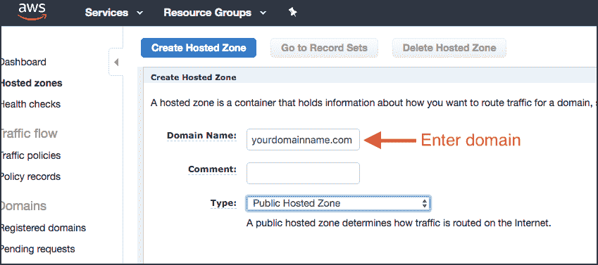

2.创建托管区域后，您需要 NS(名称服务器)记录:

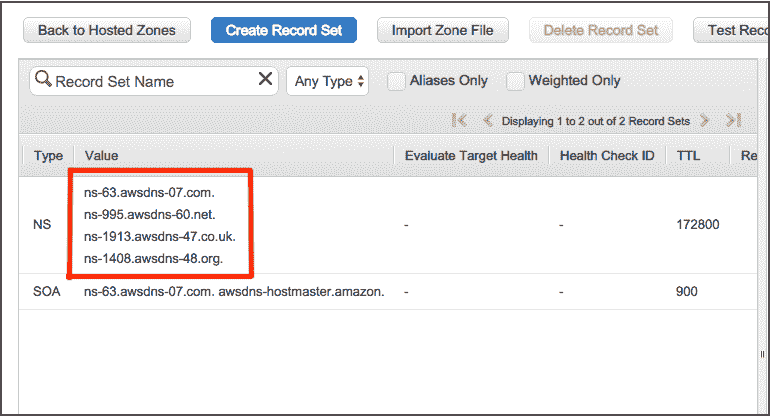

3.转到您的域名注册机构并登录。根据您的注册商，您应该可以在您的设置中找到一个名为“名称服务器”的部分，您可以对其进行编辑。您需要跨 AWS NS 记录进行复制，并在您的域设置中更改现有 NS 记录。

请注意，不要在 NS 记录的末尾复制句号/句号。比如 is 应该是“ns-63.awsdns-07.com”，而不是“ns-63.awsdns-07.com。”

传播需要 24 小时。

### **设置你的 S3 桶**

与此同时，你可以设置你的 S3 水桶。index.html 等文件存放在 S3 存储桶中。

您必须为您的网站配置两个存储桶:1)yourdomainname.com 和 2)www.yourdomainname.com。

第一个存储桶是您的主存储桶，您将在其中上传所有文档，例如您的 index.html。第二个存储桶重定向到第一个存储桶。要设置您的 S3 时段，请遵循关于如何设置您的 S3 时段的 AWS 文档( [2:创建和配置时段并上传数据](https://docs.aws.amazon.com/AmazonS3/latest/dev/website-hosting-custom-domain-walkthrough.html#root-domain-walkthrough-s3-tasks))。

除了文档之外，还有一些事情需要注意:

*   在第 2.1 节(第 2 部分):单击链接[我如何创建 S3 存储桶？](https://docs.aws.amazon.com/AmazonS3/latest/user-guide/create-bucket.html)这是一个分步指南，解释了您需要选择的所有设置。
*   在第 2.1 节(第 3 部分):你还没有上传你的网站文件。您可以同时添加一个测试 index.html。

记下您的**终点**。你可以在你的 S3 桶>“属性”标签>“静态虚拟主机”框中找到这个。它应该是这样的:http://your domain name . com . S3-website . eu-west-2 . Amazon AWS . com

### **在路线 53 中添加别名/“A”记录**

最后回到 53 号公路，打开你的托管区，设置你的别名记录。您可以按照文档中的“步骤 3:为 example.com 和 www.example.com 添加别名记录”进行操作。这很简单。

一旦 NS 设置传播完毕，**您的站点就开始运行了**！您将能够访问您的网站在域名地址，如 yourdomainname.com

但是，请注意这并不安全，你会在地址栏看到一个 **http://** 前缀。我将在下一节讨论这个问题。

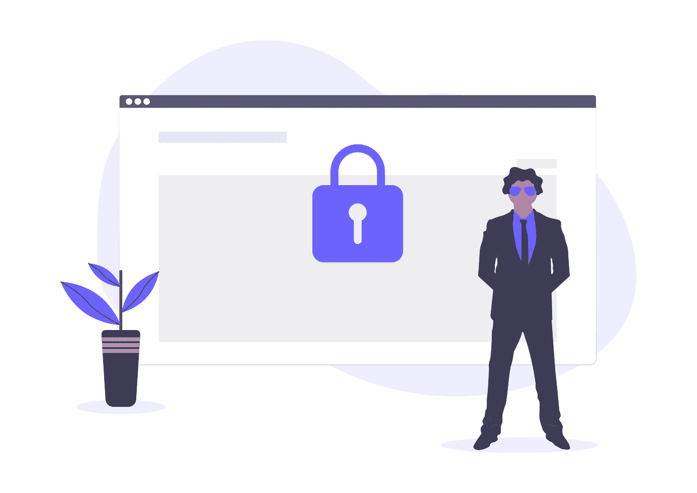

### 如何使你的网站安全，什么是 SSL 证书？

确保网站安全非常重要，为此你需要获得 SSL 证书。SSL 代表[安全套接字层](https://en.wikipedia.org/wiki/Transport_Layer_Security)，它使用加密技术在用户和站点之间安全地传输数据。谷歌还将提高 HTTPS 网站的排名。

如果你用 SSL 证书保护网站，你会在地址栏看到 **https://** 和一个挂锁符号。

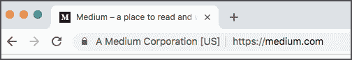

SSL 证书有不同的类型:[扩展验证证书](https://en.wikipedia.org/wiki/Extended_Validation_Certificate)和[域验证证书](https://en.wikipedia.org/wiki/Domain-validated_certificate)。对于个人网站或博客，只需要域验证证书。你也不会像上面的例子那样在左边看到你公司的名字。只有当你有一个扩展的验证证书时，你才能得到这个证书，这个证书更适合大公司/企业。

### SSL 证书需要多少钱？

我看到了一系列获得 SSL 证书的方法。您可以支付额外费用购买一项服务，这项服务将代表您完成这项工作，或者您也可以使用 [Let's Encryp](https://letsencrypt.org/getting-started/) t 免费完成这项工作。Let's Encryp 是一个官方认证机构(CA)。但是你必须每三个月更新一次证书，而且过程相当复杂。

我不想支付额外费用，也不想经历每三个月更新一次的麻烦。方便的是，AWS 可以用很少的费用发布 SSL 证书。你为每张证书支付 0.75 美元，有效期为一年。

如果你选择不使用 AWS，确保你做了调查并选择了一个[可信的 CA](https://www.geckoandfly.com/24460/free-trusted-ssl-certificate/) ！

### **如何用 AWS 获得 SSL 证书？**

登录您的 AWS 控制台并导航到 [AWS 证书管理器](https://aws.amazon.com/certificate-manager/) (ACM)。

确保将默认的地区(俄亥俄州)更改为 N. Virginia。这在指南中没有明确说明，只有 N. Virginia 地区可以颁发证书。我吃了苦头才知道，浪费了很多时间！

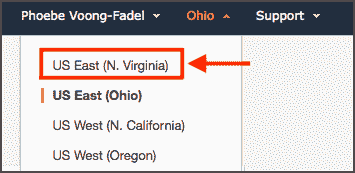

然后单击“配置证书”下的“开始”。

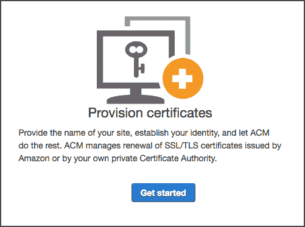

遵循 AWS (“使用控制台请求公共证书”)的[文档，并使用](https://docs.aws.amazon.com/acm/latest/userguide/gs-acm-request-public.html) [Victoria Drake 的指南](https://vickylai.com/verbose/hosting-your-static-site-with-aws-s3-route-53-and-cloudfront/)(在“SSL 证书”下)。

**除了指南**还有一些事情没有完全解释清楚:

*   你需要通过电子邮件或者直接通过 DNS 来验证你的域名所有权。我建议总是通过 [**DNS 验证**](https://docs.aws.amazon.com/acm/latest/userguide/gs-acm-validate-dns.html) 来验证所有权。
*   一旦您请求了您的证书，您将得到类似这样的内容(除了状态将是待定)。点击“导出 DNS 配置文件”:

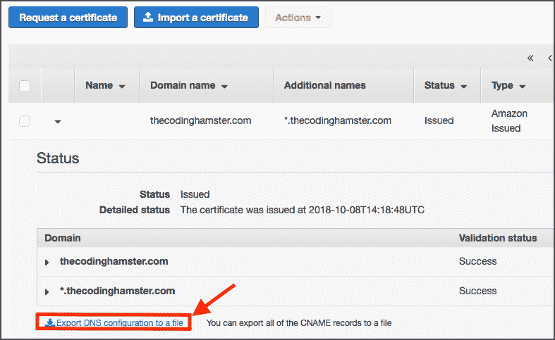

这是一个 Excel 电子表格，将包含类似这样的内容:

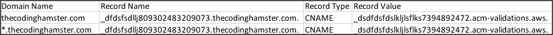

*   你需要通过注册商将这些记录添加到你的 DNS 设置中。登录并转到 DNS 设置。不同的注册商有不同的界面，但是你在你的 DNS 设置下寻找你的主机记录。
*   点击【添加记录】>记录类型为 **CNAME** :

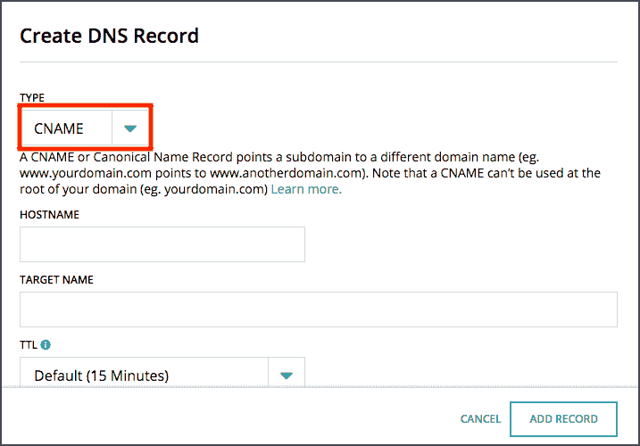

您需要添加两条记录:1)主机名应该是“@”，目标名应该是 DNS 配置文件中的记录值。

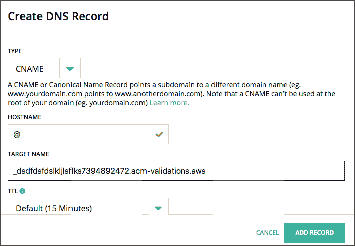

2)主机名应该是*(星号)，目标名应该是 DNS 配置文件中的记录值。

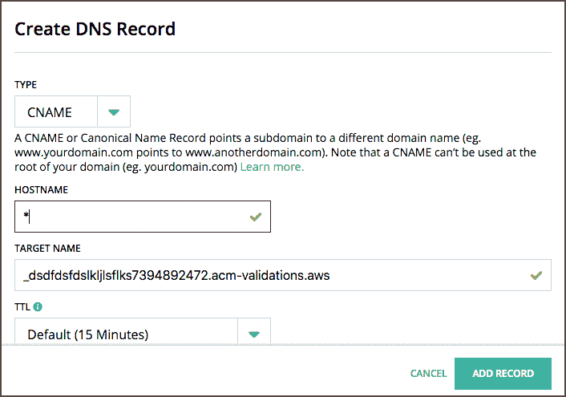

如果你想了解更多关于 CNAME 和记录类型的信息，我找到了这篇[有用的文章](https://help.hover.com/hc/en-us/articles/217282457-How-to-Edit-DNS-records-A-AAAA-CNAME-MX-TXT-SRV-)。

挺长的，不过我把有用的部分抽出来了:

> "注意:主机名是指域名前的前缀。要创建空白记录，请在主机名字段中使用@符号。这表示一个空前缀(因此名称与域名完全匹配；例如 divapirate.com)。@ hostname 也称为域的根。主机名中的*(星号)是通配符，代表任何前缀。例如，为*.divapirate.com 创建记录会将 <any prefix="">.divapirate.com 指向提供的 IP 地址。</any>

你只需要等待验证。对我来说，这花了大约一个小时。

### 如何添加您的 SSL 证书？

使用 AWS，您可以通过设置[**【CloudFront】**](https://docs.aws.amazon.com/AmazonS3/latest/dev/website-hosting-cloudfront-walkthrough.html)为您的网站添加 SSL 证书。CloudFront 非常适合加速你的网站。我使用了 [AWS 文档](https://docs.aws.amazon.com/AmazonCloudFront/latest/DeveloperGuide/using-https.html)和 [Victoria Drake 的指南](https://victoria.dev/verbose/hosting-your-static-site-with-aws-s3-route-53-and-cloudfront/)(留意她有用的提示)。

请注意，当您创建您的 CloudFront 发行版时，会有一个下拉菜单来添加您的 SSL 证书。如果您已经获得了 SSL 证书，它将在下拉菜单中预填充。

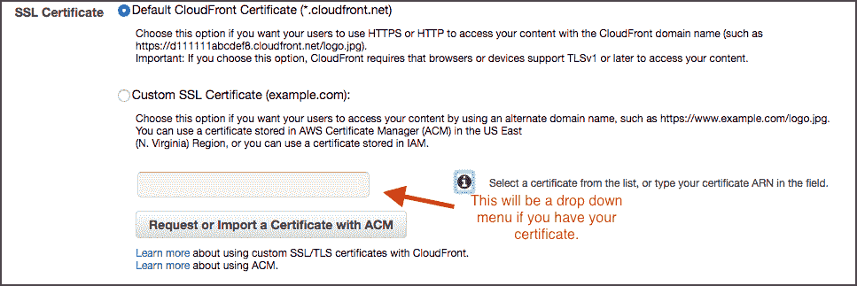

您在 CloudFront dashboard 中的状态应该更改为“Enabled”。这不是即时的，需要一点时间。

### **快到了……**

最后，您需要从 CloudFront 发行版获得您的**域名**。应该是这样的 dsfdser83543。cloudfront.net**。**

返回 Route 53 > hosted zone >将两个别名记录(别名目标)都更改为 CloudFront 域名。

瞧啊。你已经用 AWS 托管了你的第一个**安全静态网站**。

* * *

希望这对你有用。如果你有任何问题或者只是想打个招呼，在 Twitter 上找我 [@PhoebeVF](https://twitter.com/PhoebeVF)

非常感谢维多利亚·德雷克的指导。关于这个主题的更高级的教程，请查看 Victoria 的文章:[“用 AWS S3、Route 53 和 CloudFront 托管你的静态站点”](https://victoria.dev/verbose/hosting-your-static-site-with-aws-s3-route-53-and-cloudfront/)。

插图来自[https://undraw.co](https://undraw.co/)