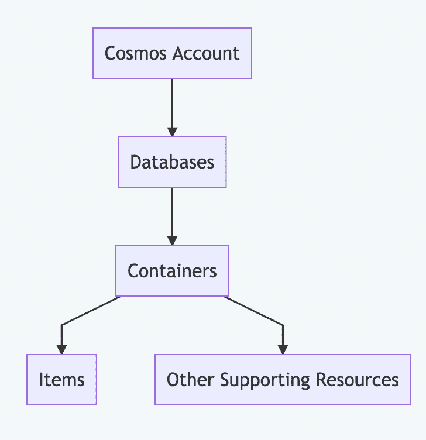
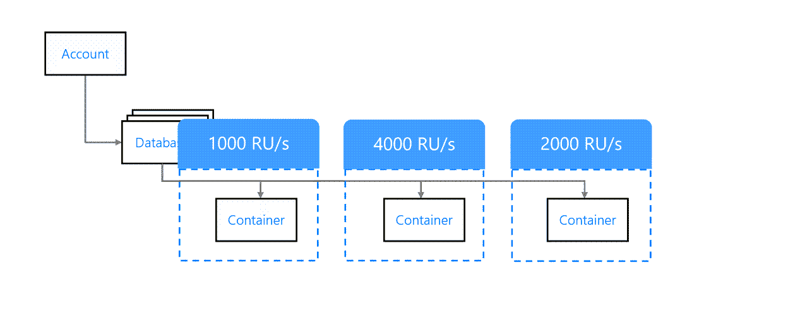
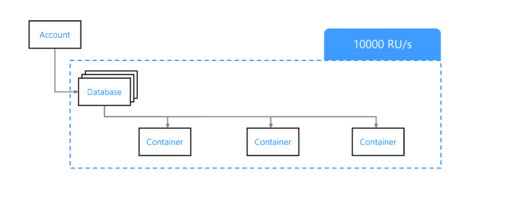
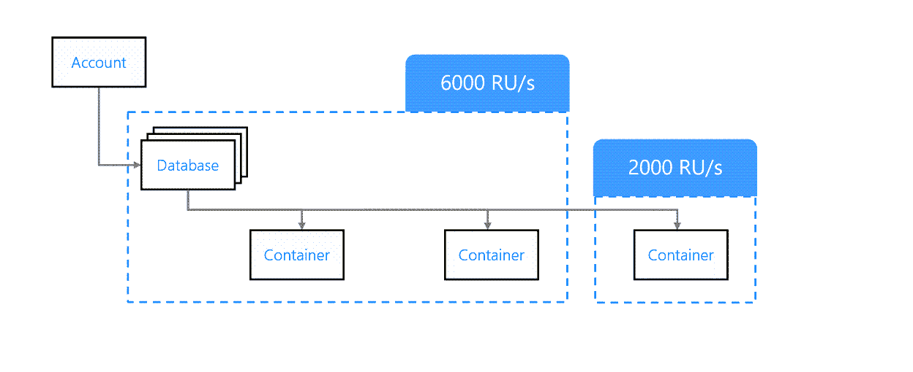
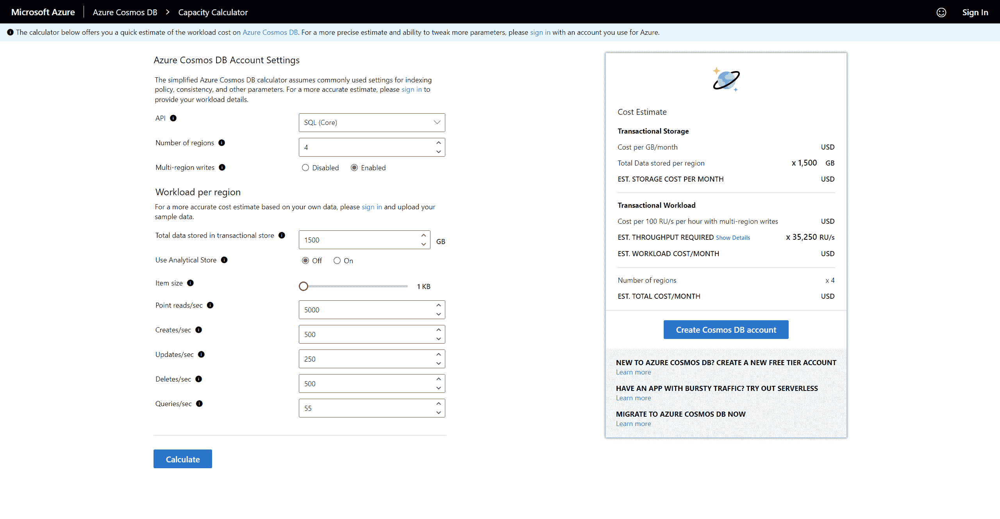

# 如何设置 Azure cosmos db——初学者数据库指南

> 原文：<https://www.freecodecamp.org/news/a-beginners-guide-to-azure-cosmosdb/>

在本文中，我们将介绍 Azure Cosmos DB 的基础知识，并理解它提供的配置选项。

我们将讨论资源管理概念、数据模型、API 和配置选项。

## **1。Azure Cosmos DB 是什么？**

Azure Cosmos DB 是一个文档数据库服务，它使我们能够在一个高度可用、全球一致、可扩展的基于云的 NoSQL 数据库中存储、查询和索引我们的数据。

它是完全托管的，这意味着可用性、可靠性和安全性都由我们来处理。

### **Cosmos DB API**

Cosmos DB 的突出特性是，您可以将其配置为使用 SQL 或 NoSQL 与您的数据进行交互。它通过为您想要存储的每种类型的数据提供不同的 API 来做到这一点。

这些 API 包括:

1.  ****SQL API****——用于使用类似 SQL 的语法存储和查询数据。这是默认和推荐的 API。
2.  ****Gremlin API****——如果我们想使用类似图形数据库的语法与数据交互。
3.  ****Table API****——用于从 Azure Table Storage 迁移到 Cosmos DB 的应用。
4.  ****Cassandra API****——用于处理为 Cassandra 数据库设计的数据。
5.  ****MongoDB API****–用于处理为 MongoDB 数据库设计的数据。

通过提供这些 API，Cosmos DB 使我们能够轻松地从现有的数据存储迁移到 Cosmos DB。当我们探索如何以编程方式连接到 Cosmos DB 时，会有更多的介绍。

请注意，API 并不决定如何存储数据。这些数据储存在 NoSQL 的数据库中。

### **为什么选择 Cosmos DB？**

因为还有其他基于云的数据库可以用来存储数据，所以理解为什么要迁移到 Cosmos DB 是很重要的。

Cosmos DB 提供了一些其他基于云的数据库所不具备的高级功能:

*   轻松的全球数据分发–通过多区域读写操作提高可用性和速度。
*   专用吞吐量
*   一位数毫秒延迟。
*   保证可用性
*   高级索引和分区

还有更多。

除此之外，API 使得在不同的数据库方法之间切换变得更加容易，而不需要物理地迁移数据。

## **2。基本 Azure Cosmos DB 概念**

我们来看看 Azure Cosmos DB 的一些基本概念。

### **资源层级**

下面是 Azure Cosmos DB 的资源层次结构。



Cosmos DB resource Hierarchy

让我们来了解一下每一级以及在层次结构的不同级别上可用的配置。

#### **宇宙账户**

Cosmos 帐户是 Azure Cosmos DB 中的顶级资源。它是我们的 Cosmos DB 实例的入口点。

在 Cosmos 帐户级别定义了以下功能:

1.  用于连接数据库实例的唯一 DNS 名称，如 https://{ account } . documents . azure . com/
2.  全球分发功能–您可以定义要在多少个地区分发您的数据。
3.  帐户中所有资源的默认一致性级别。您可以为单个资源覆盖此设置。

#### **数据库和容器**

一个帐户可以包含多个具有相同分发需求的数据库。每个数据库可以包含多个容器。您还可以使用数据库来管理底层容器的用户、权限和吞吐量。

****每个容器都类比于 SQL 中的一个表，MongoDB 中的集合，Gremlin 中的 graph 等等。**** 容器是存储和吞吐量可伸缩性的基本单位。它们在客户定义的多个区域中进行水平分区和复制。

集装箱的吞吐量有两种定义方式:

1.  ****专用调配吞吐量模式****–可以为每个容器实例分配一个固定的吞吐量。成本更高，由 SLA 提供支持。
2.  ****共享调配吞吐量模式****–在共享模式下运行的所有容器实例的总吞吐量保持不变，而各个容器可以有不同的实时吞吐量。

在容器级别，我们还可以选择配置索引策略和默认 TTL。

#### **容器的内容物**

与 SQL 表类似，容器可以包含多个资源。最重要的资源是项目。

****一个条目是一个单一的记录单位。**** 例如，表格中的一行，集合中的一个文档，图形中的一个节点等等。

其他一些资源包括基于 JavaScript 的:

1.  存储过程
2.  用户定义的函数
3.  扳机

### **一致性水平**

数据可以跨多个区域复制，并且允许写入。在这种情况下，确定数据的一致性要求非常重要。

让我们看看 Azure Cosmos DB 中可用的不同一致性级别及其含义:

1.  ****强****–所有地区的数据保持完全相同。这意味着写操作是昂贵的，并且直到所有区域都有数据时才完成。
2.  **–写操作的延迟受区域间固定时间间隔的限制。例如，在执行写操作之后，保证数据在下一个 *t* 秒内可用。**
3.  ******会话****–当在同一会话中执行读取时，在该会话中写入的数据将可供读取。当对于一个用户会话来说，所有的读写都由一个区域负责时，这是很好的。**
4.  ******一致前缀****–数据将按照写入的顺序读取。例如，如果在区域 1 中，我们先写入数据 A，然后写入 B，那么在区域 2 中，A 将先于 B 可用。**
5.  ****–顺序和过时都不重要，唯一重要的是数据最终将在所有地区可用。工作速度快，但一致性最差。****

********探索****——需要不同一致性水平的场景。****

### ****请求单位(RUs)****

**根据 Microsoft Learn 上的定义:**

> **对于 1KB 的项目，执行点读取(即通过 ID 和分区键值获取单个项目)的成本是 1RU。**

**成本基于执行数据库操作所需的系统资源，如 CPU、IOPS 和内存。我们的应用程序所消耗的 ru 最终被记入账户。有不同的模式可以设置 Cosmos 帐户，这些模式会影响计费:**

1.  ******调配的吞吐量模式****–设置以 ru/秒为单位的预期吞吐量。该模式在帐户级别选择，但是可以在数据库或容器级别提供 RUs。**
2.  ******无服务器模式****——按实际消费单位付费。**
3.  ******自动缩放模式****–账户设置为根据使用情况自动缩放。这对于用途可变或不可预测的应用程序来说很好。**

### ****数据库分区****

**正如前面在容器一节中提到的，一个容器可以被划分成多个分区。通过设置分区键可以做到这一点。**

#### ****分区和索引****

*   ******逻辑分区******

**逻辑分区是共享相同分区键值的项目的集合。例如，如果一个名为“Users”的容器由一个键“State”进行分区，那么逻辑分区就是共享相同“State”值的项目的集合。**

*   ******指标******

**索引用于提高查询的性能。在常规 SQL 数据库中，默认情况下基于主键创建索引。Cosmos DB 项目还包含一个名为项目 ID 的唯一字段。**

**Cosmos DB 中的默认索引是分区键和项目 ID 的组合。分区键用于定位逻辑分区，项目 ID 用于定位特定项目。因此，为了更快地访问，选择一个好的分区键是很重要的，它可以将数据均匀地分布在各个分区上。**

*   ******物理分区******

**物理分区的作用是提供水平可伸缩性。物理分区是一个或多个逻辑分区的集合。来自单个逻辑分区的数据不能跨多个物理分区存在。**

******用户无法控制数据在物理分区间的分布。**** Cosmos DB 是一项托管服务，当需要可伸缩性时，系统会自动将数据分布到各个物理分区。**

**这形成了另一个指导原则的基础，即分区键应该导致更小的逻辑分区。如果逻辑分区太大，将会影响系统的可伸缩性。**

#### ****如何选择分区键****

**现在，我们知道分区键是什么了。但是我们如何选择一个好的分区键呢？以下是一些指导原则:**

1.  ******不可变****–数据创建后分区键不可更改。**
2.  ******高基数****–分区键的大量可能值会导致大量的小逻辑分区。有利于索引和可伸缩性。**
3.  ******均匀分布****——除了高基数，每个可能值的可能性相等也很重要。这有利于跨分区均匀分布数据。**
4.  ******读取重容器****–对于读取重容器，选择在读取查询中频繁出现的分区键很重要。否则，将失去基于分区键的索引的好处。同样有益的是，大多数查询可以从单个分区读取数据，跨分区查询被最小化。**
5.  ******使用物品 ID 作为分区键****–Cosmos DB 支持一个名为物品 ID 的唯一字段。该字段是自动生成的，并保证是唯一的。这是分区键的一个好选择。**

******探索**–**为什么不用物品 ID 作为分区键？**

**这里有更多关于[选择分区键](https://docs.microsoft.com/en-us/azure/cosmos-db/partitioning-overview#choose-partitionkey)的信息。**

#### ****合成分区键****

*   **将多个字段连接在一起以创建分区键。**
*   **使用哈希函数创建分区键后缀。**
*   **使用随机字符串创建分区键后缀。**

## ****3。Cosmos DB 数据模型****

**如前所述，CosmosDB 中的所有数据都以 NoSQL 方式存储。让我们看看数据模型的一些方面。**

### ****文档数据模型****

**在文档数据模型中，每个条目称为一个文档。在 Cosmos DB 术语中，文档可以称为项目。**

**面向文档的数据库将具有以下特征:**

*   ****——每一项都是一个单独的实体。****
*   ********易于横向扩展****—可以为数据创建物理分区以提高性能和扩展存储。****
*   ******无模式****–数据库本身不会强制任何模式。这为存储不同数据格式的实体提供了灵活性。这也有助于结构随着时间的推移而演变。**

### ****项目****

**Cosmos DB 中的每个*条目*都是一个 JSON 文档。对这些文档的写操作是原子的。条目包含一个唯一的*条目 ID* 和一个*分区键*，用于在多个逻辑分区之间划分数据。**

**分区键也可以是嵌套字段。例如，在下面的 JSON 中， *city* 字段可以用作分区键，即使它不在根级别。**

```
`{
    "id": "1",
    "name": "John",
    "address": {
        "street": "1 Main St",
        "city": "New York"
    }
}` 
```

**创建容器时，必须提供分区键路径。在上面的例子中，路径将是`/address/city`。**

## ****4。如何配置 Cosmos DB****

**在 Cosmos DB 中，SQL API 是一种查询语言，允许我们使用类似 SQL 的语法查询文档数据库中的数据。选择 SQL API 而不是其他 API 有很多原因:**

*   **低延迟**
*   **自动缩放**
*   **由 SLA 支持的 99.999%可用性**

**它非常适合高性能应用，如:**

*   **从物联网设备收集和查询数据——这会产生大量数据，需要快速处理。**
*   **零售应用——具有不同的使用模式，可以从弹性扩展中受益。**
*   **多平台应用程序——可以从文档结构的灵活性中获益。**

### ****吞吐量供应****

**在配置 Azure Cosmos DB 时，我们可以在数据库和容器级别提供吞吐量。**

#### ****集装箱级吞吐量****

**在容器级别提供的吞吐量仅适用于容器。它不会影响数据库的其他容器。例如，在下图中，每个容器都有不同的吞吐量。**

**

Container-level throughput provisioning** 

**这是推荐的吞吐量调配方式。如果每个容器都映射到一个单独的应用程序功能，那么在容器级别提供吞吐量是有意义的。**

#### ****数据库级吞吐量****

**我们还可以在数据库级别提供吞吐量。这将在数据库中的所有容器间共享。**

**

Database Level Throughput Provisioning** 

**如果所有容器都有相似的负载模式，这没什么，但是在大多数情况下，这将导致不可预测的结果。**

#### ****混合吞吐量****

**可以混合容器和数据库级别的吞吐量供应。为此，我们首先在数据库级别定义一个吞吐量。然后，在创建容器时，我们可以指定使用哪种吞吐量模式。**

**以共享吞吐量模式配置的容器将共享在数据库级别提供的吞吐量。在专用吞吐量模式下配置的容器将在容器级别提供自己的吞吐量。**

**

Mixed throughput provisioning** 

**请注意，我们不能将容器从共享吞吐量模式转换为专用吞吐量模式，反之亦然。要改变这一点，我们需要删除容器并创建一个新的。**

### ****存储****

**为了估计存储需求，我们可以使用 Azure Cosmos DB 容量计算器。**

**

Cosmos DB Capacity Calculator** 

**输入估计的负载、复制策略和存储要求后，计算器可以提供此类设置的估计成本。**

### ****生存时间(TTL)****

**可以为容器中的文档设置生存时间(TTL)。这对于预计将在短时间内删除的文档非常有用。它可以在容器级别进行配置，也可以在文档级别被覆盖。最大 TTL 值是 2147483647。**

**在容器级别，TTL 需要设置为以下值之一:**

1.  ******不存在****–没有 TTL，即使试图在文档上设置 TTL 也不会过期。**
2.  ******-1****–默认无 TTL，但可以在文档级添加。**
3.  ******秒数****–默认 TTL 是提供的秒数。这可以在文档级别被覆盖。**

**使文档过期并优化所消耗的存储可以提高性能并降低成本。因此，决定使用哪个 TTL 值以及哪些项目过期很重要。**

**一些解决方案可能需要 Cosmos DB 作为中间存储来执行查询并将结果传递给最终存储。在这种情况下，您应该使用 TTLs 尽快使文档过期，以最大限度地降低成本。**

### ****Cosmos DB 消费模式****

**下面我们来详细了解一下不同的消费模式。**

#### ****无服务器****

**在无服务器模式下，服务按照实际消耗的 ru 数计费。当消费模式不可预测并且可能取决于活动、功能发布、一天中的时间、季节性销售、假期等因素时，这是非常好的。**

**它在以下情况下也很有用:**

1.  **一个新的应用程序启动了，我们没有太多的负载。我们也不知道负载将如何增长。**
2.  **DB 支持 Azure Functions 上托管的无服务器应用程序。随着应用程序获得更多用户，数据库也将获得更多请求。**
3.  **开始使用 Cosmos DB，并且在配置和成本方面没有太多经验。**
4.  **该服务预计不会扩展，并且消耗的资源可能会少于最低可配置资源单位。**

#### ****调配与无服务器****

**在无服务器和调配消费模式之间做出选择是成本和性能之间的权衡。使用以下要点来帮助您做出决定:**

1.  **工作负载—可预测且足够大的工作负载有利于调配的消费模式。**
2.  **RU 限制——调配的吞吐量不会超过确定的最大 RU，而无服务器可以扩展到 Cosmos DB 中允许的最大 RUs。当遇到突发情况时，可以使用无服务器。**
3.  **全球分销——这是一个重要因素。无服务器模型不是跨区域分布的，因此可以用于单个区域。提供的模型跨区域分布，可用于多个区域。**
4.  **存储限制–无服务器每个容器只能存储 50 GB 的数据，而配置后每个容器可以存储无限的数据。**

#### ****自动缩放模型****

**自动扩展模式在调配型和无服务器型消费模式之间找到平衡。它的工作原理是根据需要在指定的范围内动态提供资源。**

**让我们看一下自动扩展和调配吞吐量之间的比较:**

1.  ****工作负载**–自动扩展吞吐量在最低可接受性能和我们希望的最高成本之间波动。如果工作负载是可预测的，那么调配更好，因为我们既不想损失性能，也不想在长期内产生更多成本。**
2.  ****RU 消耗**–通过自动缩放，我们可以将安如限制设置为与供应的相同。不同之处在于，调配计费始终在指定的 ru 上完成，但自动扩展计费基于实时消耗的 ru 或调配 ru 的 10%,以较高者为准。记住这一点，建议仅当实际消耗在超过 66%的时间内接近调配的限制时，才使用调配的消耗模型。**

**还可以将容器从自动扩展迁移到供应吞吐量，反之亦然。在迁移过程中，RU 值由系统自动选择，并且必须在迁移后进行验证或手动设置。**

## **包扎**

**感谢阅读。这应该让你对 Azure 的 CosmosDB 服务如何工作以及如何配置它有所了解。如果你想和我联系，你可以在 [Twitter](https://www.twitter.com/abh1navv) 上找到我。**