# CSS 网格初学者指南

> 原文：<https://www.freecodecamp.org/news/a-beginners-guide-to-css-grid-3889612c4b35/>

卡拉·卢顿

# CSS 网格初学者指南


Photo by [Greg Rakozy](https://unsplash.com/photos/vw3Ahg4x1tY?utm_source=unsplash&utm_medium=referral&utm_content=creditCopyText) on [Unsplash](https://unsplash.com/search/photos/css?utm_source=unsplash&utm_medium=referral&utm_content=creditCopyText)

我第一次听说 CSS Grid 是在 2016 年底。我参加了我的第一次科技女性会议，一位与会者提到这是多么令人惊讶。一晃一年半过去了，我终于开始深入研究网格。作为 Flexbox 的忠实用户，我已经知道这将如何改变游戏规则。

当我开始学习 CSS 网格时，最大的问题是:网格和 Flexbox 有什么不同？我发现一般来说，Grid 可以做 Flexbox 能做的一切事情。有些人认为网格是多维布局的，而 Flexbox 应该用于一维布局。但是 Grid 在一维布局方面也很棒——尤其是当您稍后回来并决定要将布局变成多维的时候。

### 设置 CSS 网格

Grid 非常容易设置——只需要两行 CSS 代码。

**HTML**

```
<div class=”wrapper”>  <div class=”item”>1</div>  <div class=”item”>2</div>  <div class=”item”>3</div>  <div class=”item”>4</div>  <div class=”item”>5</div>  <div class=”item”>6</div></div>
```

**CSS**

```
.wrapper {    display: grid;    grid-template-columns: 10rem 10rem 10rem;}
```

瞧啊。你有一个网格。说真的，这就是你所需要的。非常棒。

您会注意到，与将 Flexbox 设置为`display: flex`不同，将`display: grid`添加到您的包装器不会立即产生影响。这是因为您没有明确定义您希望您的网格有多少列。你将和`grid-template-columns`一起这样做，就像我上面做的那样。在这个例子中，我设置了三列，每列的宽度为 10 雷姆。

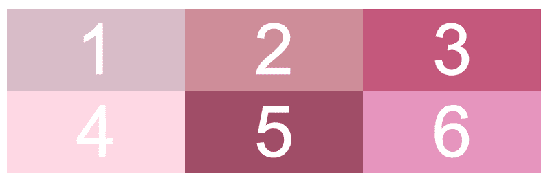

Basic CSS Grid

当设置`grid-template-columns`时，你可以使用任何你想要的值，但是我建议远离百分比，除非你想加起来是 100%。这是因为你必须考虑到你的`grid-gap`(我们稍后会深入探讨)的数量，这可能会有点棘手。

### 显性与隐性轨迹

在我说显式和隐式轨道之前，我们先来说说什么是轨道。轨道是列和行的编号方式。在 CSS Grid 中，你通过轨迹线来计算列和行，而不是单独计算它们。这是我们开始时的网格——我已经对所有的轨道行和列进行了编号，以便让您更容易看到。

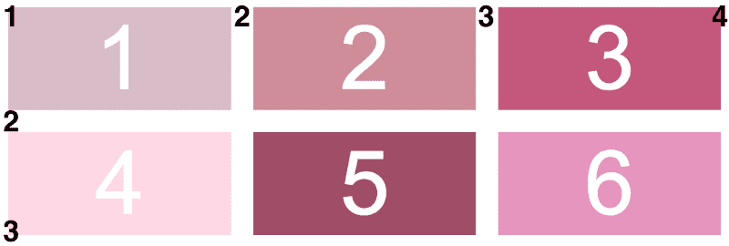

CSS Grid with column lines and row lines numbered out

你可以看到我们实际上有四列线和三行线。这将有助于在网格上放置您的项目。

**一个小提示:**如果你正在使用 Firefox 的开发者版(普通 Firefox 的测试版),它实际上有一些很棒的开发工具来查看列和行轨道编号。如果您检查您的包装元素，然后转到布局选项卡，选中您的包装框，现在您的网格将如下所示！我真的希望 Chrome 在未来增加一个类似这样的 inspect 功能。非常有帮助。

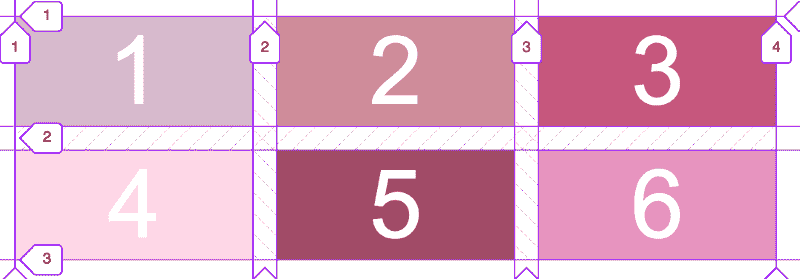

Firefox Developer Edition Inspector Tools

让我们回到显式和隐式轨道的区别。如果我们从上面获取代码，您会注意到我们只设置了列。在这种情况下，我们已经**显式地** 设置我们的列有三个，但是我们已经**隐式地** 设置我们的行。我们有六个条目，但是很明显所有这些条目都不能放在三列中，所以第二行被隐式设置。

这有点令人困惑，所以我强烈建议您自己尝试一下 CSS Grid，看看显式和隐式轨道之间的区别。

### 添加网格间隙

将网格间隙想象成边距，只不过它将被添加到项目之间，而不是添加到网格之外。我遇到过很多这样的情况，当我在 Flexbox 网格中的项目上添加边距时，却不得不转到网格的包装器并设置相同数量的边距，但为负值，以抵消在网格外设置的边距。谢天谢地，有了 CSS Grid，你就不用处理这些了。

让我们以上面的 CSS 为例，添加一些网格间隙。

```
.wrapper {  display: grid;  grid-template-columns: 10rem 10rem 10rem;  grid-gap: 1rem;}
```

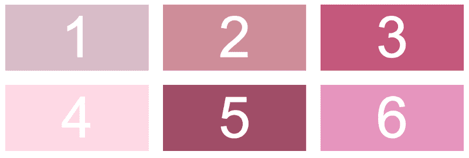

CSS Grid with 1rem of grid-gap

我使用了简写属性`grid-gap`，但是您可以通过使用`grid-column-gap` 和`grid-row-gap`为列和行定义一个显式值。

**注:[铬 66](https://blog.chromium.org/2018/03/chrome-66-beta-css-typed-object-model.html) 将由`grid-gap`变为`gap`，`grid-column-gap` / `grid-row-gap`变为`column-gap` / `row-gap`。*

### Repeat()函数

当对三个宽度相同的列使用`grid-template-columns`时，定义每个列的宽度非常简单。但是，如果想要更多的列，就需要大量的输入。这就是`repeat()`函数的用武之地。

这是我们一直使用的添加了`repeat()`函数的例子。

```
.wrapper {  display: grid;  grid-template-columns: repeat(3, 10rem);  grid-gap: 1rem;}
```

正如你在我的 CSS 中看到的，我设置了三列，每列 10 雷姆宽。这个网格看起来与我们的网格间隙示例中的网格一模一样。通过使用`repeat()`函数，当你想要设置很多列时，我们只是让书写的东西更简单，更容易阅读。

### 分数单位

分数单位，或 fr，是 CSS Grid 中引入的一个新的 CSS 长度单位，我可以看到自己一直在使用它。假设我们想要三列等宽。我们可以使用分数单位，而不是在项目上设置`width: calc(100% / 3)`。将分数单位视为“自由空间”

让我们继续我们一直在使用的例子。

```
.wrapper {  display: grid;  grid-template-columns: 1fr 1fr 1fr;  grid-gap: 1rem;}
```

你会注意到我唯一改变的是`grid-template-columns`。我现在告诉浏览器我需要三列，并且我希望这些列中的每一列占据一个小数单位或一个“自由空间”这与 Flexbox 的`flex-grow`属性非常相似。

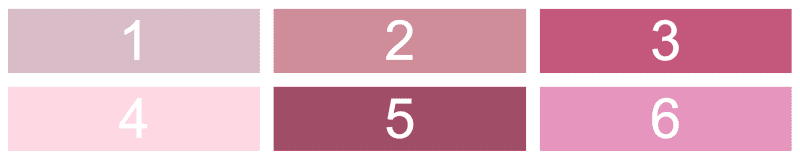

CSS Grid using fractional units

每一项都比上一个例子宽一点的原因是，它们现在尽可能多地占据了空间，同时仍然适合三列。在这种情况下，我没有设置硬宽度，所以它们占据了我的屏幕的整个宽度。我知道如果不在你自己的屏幕上看这个有点难，所以我绝对建议你自己处理这个。

您也不必将所有列都设置为 1fr。在下面的例子中，我将第一列和第三列设置为 10rems，而中间一列设置为 1fr。您还可以将列设置为 2fr、3fr 等，该列的项目将占用 2 倍、3 倍(等等)的空间。

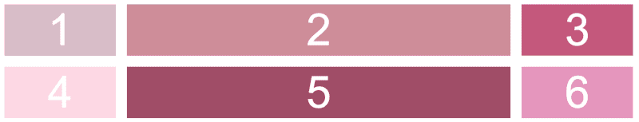

CSS Grid with only the middle column set to 1fr

### 调整单个网格项目的大小

让我们来讨论一下如何确定单个网格项目的大小。您不能在单个项目上设置硬宽度，因为我们用`grid-template-columns`显式设置了宽度。但是，如果您希望我们示例中的第五项是多列的宽度，该怎么办呢？我们可以使用`grid-column`和`span`来实现这一点。

```
.wrapper {  display: grid;  grid-template-columns: repeat(3, 10rem);  grid-gap: 1rem;}
```

```
.item5 {  grid-column: span 2;}
```

你会在上面看到，我们将第五项的`grid-column`设置为跨度为 2，这将允许第五项跨越两列的宽度。

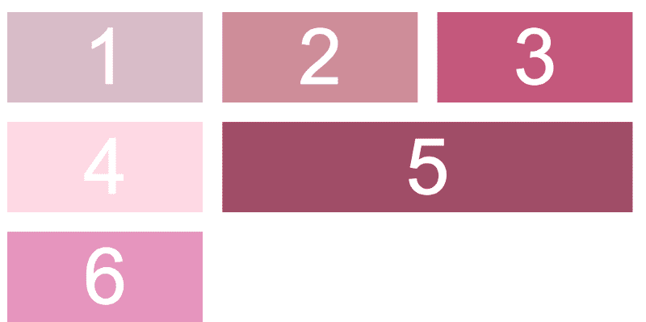

CSS Grid with span on an individual item

但是如果您希望第五项跨越三列呢？这就是将要发生的事情。

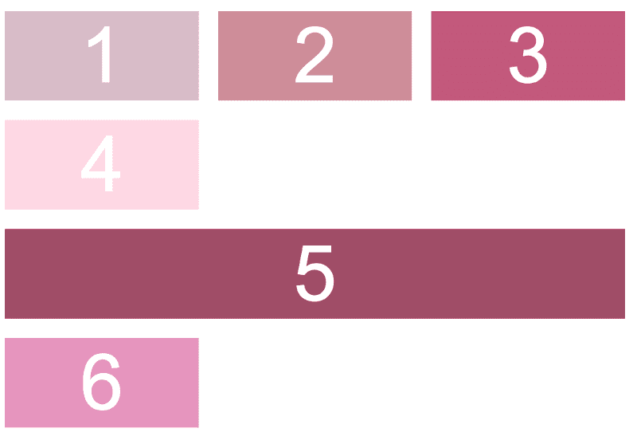

CSS Grid spanning item five across three columns

因为第五项自然从第二列开始，我们没有足够的空间让它跨越我们设置的总宽度。因此它将向下移动到下一行。如果你想让一个项目跨越多行，你可以从`grid-column`到`grid-row`应用同样的概念。

有一个非常简单的解决方案可以修复第五项下移后留下的空白。无论您是将项目设置为跨行还是跨列，都可以使用它— `grid-auto-flow: dense`。

```
.wrapper {  display: grid;  grid-template-columns: repeat(3, 10rem);  grid-gap: 1rem;  grid-auto-flow: dense;}
```

```
.item5 {  grid-column: span 3;}
```

在 CSS 网格中，网格会自动检查项目是否合适。就像我上面说的，如果一个项目不适合它，它会跳到下一行。`Grid-auto-flow: dense`告诉网格用任何合适的项目填充这些空白空间。在本例中，我添加了第七个网格项，这样网格会自动将第七个和第六个项移动到空白处。

CSS Grid 将总是首先布局需要放在特定位置的项目——在本例中是第五个项目，因为它跨越了三列。然后，如果您设置了`grid-auto-flow: dense`，它将寻找其他项目来适应网格上的空白点。

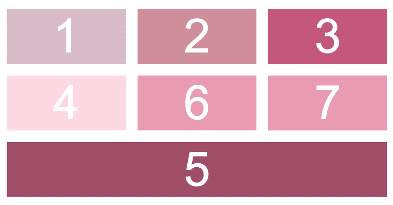

CSS Grid with grid-auto-flow: dense

在您已经定义了您的项目之后，`grid-auto-flow`属性本身决定了您需要向哪个方向添加另一行或列。行是默认值。除了使用`grid-auto-flow: dense`之外，我还没有看到这方面的大用例。

### 放置网格项目

在我们调整单个网格项的例子中，我们最初将第五项设置为`grid-column: span 2`，这允许第五项跨越两列。实际上，`grid-column`是`grid-column-start`和`grid-column-end`的简称。T4 也是如此。

因此，从技术上讲，我们将第五项设置为`grid-column-start: span 2`和`grid-column-end: auto`。本质上，我们告诉网格从第五项开始，它自然会在那里，但去两倍的大小。

让我们再次使用第五项，我将使用 Firefox Developer Edition 的 inspector 工具向您展示这一点，这样您可以更容易地看到第五项位于哪个轨道行。我还添加了几个网格项目。

```
.wrapper {  display: grid;  grid-template-columns: repeat(3, 10rem);  grid-gap: 1rem;}
```

```
.item5 {  grid-column-start: 1;  grid-column-end: 3;}
```

CSS Grid 将在我们的第五个项目之前布局所有的项目，停下来，然后看看我们开始和结束第五个项目的地方，并把它放在我们告诉它的地方。这里的简写是`grid-column: 1 / 3`，其中 1 是我们的开始值，3 是我们的结束值。

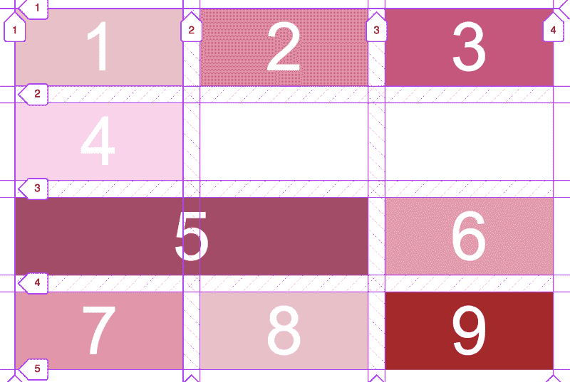

CSS Grid using grid-column-start and grid-column-end

您还可以告诉单个网格项目您希望它跨越多宽以及您希望它在哪里结束。在这个例子中，我使用了速记属性`grid-column`,所以我告诉第五项跨越两列，在第四行结束。

```
.wrapper {  display: grid;  grid-template-columns: repeat(3, 10rem);  grid-gap: 1rem;}
```

```
.item5 {  grid-column: span 2 / 4;}
```

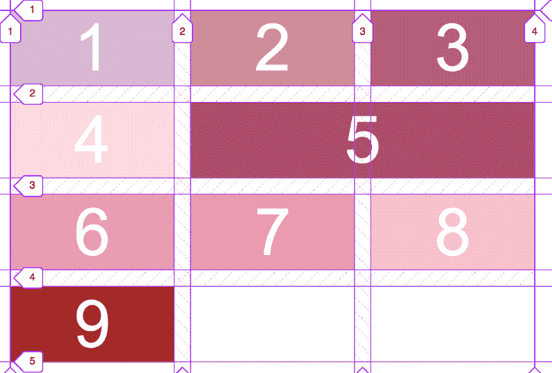

CSS Grid with grid-column shorthand property

如果你想让你的项目跨越网格的整个宽度，但是不知道你的网格有多宽，你可以设置`grid-column: 1 / -1`。基本上-1 值告诉你的项目一直到最后一个轨道。如果你对行这样做，你会注意到你的项目可能不会一直到网格的底部。它只会去你的**显性，** 行行而不是你的隐性行。

### 资源

这里有一些我强烈推荐的资源，可以让你更深入地了解 CSS 网格！

*   韦斯博斯 ' [CSS 网格教程](https://cssgrid.io/)——完全免费，也是我了解网格的地方。我喜欢他的教学风格！
*   CSS 技巧完全指南 CSS 网格 —当你被困在网格的某个方面时，这里有一些很棒的备忘单。
*   CSS 网格花园 —一种实践你所学的 CSS 网格的有趣方式。我建议在尝试之前先做一个教程，因为它有时会让人有点困惑。

感谢阅读我的 CSS 网格教程！查看我的其他文章，如[如何回答可怕的“告诉我你自己”面试问题](https://medium.freecodecamp.org/how-to-answer-the-dreaded-tell-me-about-yourself-interview-question-cec7137ca17b)、[为什么你应该雇用一名训练营毕业生](https://medium.com/@karaluton/why-you-should-hire-a-bootcamp-grad-49874ccee2e0)或[我如何成为一名开发人员的故事](https://medium.com/@karaluton/from-music-publicist-to-web-developer-767b023c44cd)。

一定要在 Twitter 上关注我的许多关于技术的推文，如果我是诚实的，也有许多关于狗的推文。

[**卡拉卢顿(@卡拉卢顿)|推特**](https://twitter.com/karaluton)
[*卡拉卢顿的最新推文(@卡拉卢顿)。前端开发者+前音乐公关。退役芭蕾舞演员……*twitter.com](https://twitter.com/karaluton)