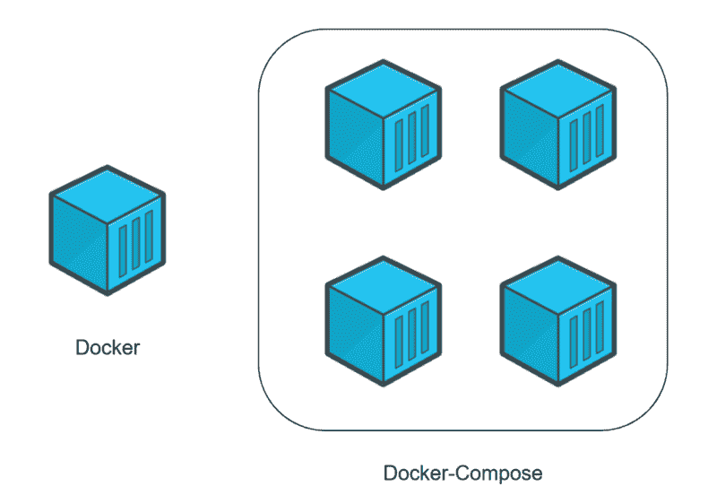

# Docker 初学者指南——如何用 docker-compose 创建客户机/服务器端

> 原文：<https://www.freecodecamp.org/news/a-beginners-guide-to-docker-how-to-create-a-client-server-side-with-docker-compose-12c8cf0ae0aa/>

#### 你是一个开发者，你想发现 docker-compose？这篇文章是为你写的。

简要介绍 Docker-Compose 之后，您将能够使用 Docker 创建您的第一个客户端/服务器端应用程序。

> 这篇文章考虑到你知道 Docker 的基础知识。如果没有，不要慌！我建议您阅读我的第一篇文章来了解 Docker，并学习如何创建您的第一个应用程序。

[**Docker 入门指南—如何创建自己的第一个 Docker 应用**
*你是一名开发人员，想从 Docker 入手？这篇文章是为你写的。在简单介绍了 Docker 是什么以及为什么使用它之后，你将能够用 Docker 创建你的第一个应用程序。*](https://herewecode.io/blog/a-beginners-guide-to-docker-how-to-create-your-first-docker-application/)

#### 什么是 Docker-Compose？

Docker-Compose 是 Docker 提供的工具。简单地说，实现这个工具是为了解决项目中的架构问题。

您可能已经在我的上一篇文章中注意到了，我们创建了一个简单的程序，显示“Docker 很神奇！”当它推出的时候。

不幸的是，当你是一个开发者时，你很少创建一个独立的程序(一个不需要任何其他服务来运行的程序，比如数据库)。

但是，如何知道自己是否需要 Docker-Compose 呢？非常简单——如果您的应用程序需要几个服务来运行，您就需要这个工具。例如，如果您创建了一个需要连接到您的数据库来认证用户的网站(这里是 2 个服务，网站和数据库)。

Docker-compose 为您提供了在一个命令中启动所有这些服务的可能性。

#### Docker 和 Docker-Compose 的区别

Docker 用于为您的应用程序管理一个单独的容器(服务)。

Docker-Compose 用于为同一个应用程序同时管理几个容器。这个工具提供了与 Docker 相同的功能，但是允许您拥有更复杂的应用程序。



Docker (individual container) VS Docker-Compose (several containers)

#### 典型的使用案例

这个工具会变得非常强大，并允许您非常快速地部署具有复杂架构的应用程序。我会给你一个具体的案例研究，证明你需要它。

想象一下，你是你的网络软件的骄傲的创造者。

您的解决方案提供了两个网站。第一种允许商店只需点击几下鼠标就能创建他们的网上商店。第二个致力于客户支持。这两个站点与同一个数据库交互。

你开始成功了，但你的服务器已经不够用了。因此，您决定将整个软件迁移到另一台机器上。

不幸的是，你没有使用 docker-compose。因此，您将不得不一个接一个地迁移和重新配置您的服务，希望什么都没有忘记。

如果您使用 docker-compose，只需几个命令，您就可以在新服务器上部署整个体系结构。您现在所要做的就是进行一些配置并加载数据库的备份，以完成迁移。

#### 现在让我们用 Docker-Compose 创建您的第一个客户机/服务器端应用程序

既然您已经知道 docker-compose 的用途，那么是时候创建您的第一个客户机/服务器端应用程序了！

本教程的目标是用 Python 创建一个包含句子的小型网站(服务器)。这个句子必须由 Python 中的程序(客户端)检索，该程序将显示这个句子。

> 注意:本教程考虑到您已经在您的计算机上安装了 Docker，并且您已经掌握了基本知识。如果不是这样，我邀请你参考[我之前的文章](https://www.freecodecamp.org/news/a-beginners-guide-to-docker-how-to-create-your-first-docker-application-cc03de9b639f/)。

#### 1.创建您的项目

为了创建您的第一个客户机/服务器应用程序，我邀请您在您的计算机上创建一个文件夹。它必须在根目录下包含以下文件和文件夹:

*   一个' *docker-compose.yml* '文件(docker-compose 文件，包含创建不同服务的必要指令)。
*   一个“*服务器*文件夹(该文件夹将包含设置服务器所需的文件)。
*   一个“*客户端*文件夹(该文件夹将包含设置客户端所需的文件)。

通常情况下，您应该有这样的文件夹结构:

```
.
├── client/
├── docker-compose.yml
└── server/
2 directories, 1 file
```

#### 2.创建您的服务器

为了开始提醒 Docker 的基础知识，我们将从创建服务器开始。

**2a。创建文件**

移动到您的“*服务器*文件夹，并创建以下文件:

*   一个' *server.py* '文件(包含服务器代码的 python 文件)。
*   一个'*index.html*'文件(包含要显示的句子的 html 文件)。
*   一个' *Dockerfile* '文件(docker 文件，将包含创建服务器环境的必要指令)。

通常情况下，您应该在以下路径' *server/* '中拥有此文件夹架构:

```
.
├── Dockerfile
├── index.html
└── server.py
0 directories, 3 files
```

**2b。编辑 Python 文件**

您可以将以下代码添加到“ *server.py* ”文件中:

```
#!/usr/bin/env python3

# Import of python system libraries.
# These libraries will be used to create the web server.
# You don't have to install anything special, these libraries are installed with Python.
import http.server
import socketserver

# This variable is going to handle the requests of our client on the server.
handler = http.server.SimpleHTTPRequestHandler

# Here we define that we want to start the server on port 1234\. 
# Try to remember this information it will be very useful to us later with docker-compose.
with socketserver.TCPServer(("", 1234), handler) as httpd:
    # This instruction will keep the server running, waiting for requests from the client.
    httpd.serve_forever()
```

这段代码将允许您在这个文件夹中创建一个简单的 web 服务器。它将检索 index.html 文件的内容，并在网页上共享。

**2c。编辑 Html 文件**

您可以将以下句子添加到'*index.html*'文件中:

```
Docker-Compose is magic!
```

这个文件在启动时会被服务器共享，并显示这句话。

**2d。编辑坞站文件**

这里我们将创建一个基本的 Dockerfile，它将负责执行我们的 Python 文件。我们将使用为执行 Python 而创建的官方映像。

```
# Just a remember, dockerfile must always start by importing the base image.
# We use the keyword 'FROM' to do that.
# In our example, we want to import the python image (from DockerHub).
# So, we write 'python' for the image name and 'latest' for the version.
FROM python:latest

# In order to launch our python code, we must import the 'server.py' and 'index.html' file.
# We use the keyword 'ADD' to do that.
# Just a remember, the first parameter 'server.py' is the name of the file on the host.
# The second parameter '/server/' is the path where to put the file on the image.
# Here we put files at the image '/server/' folder.
ADD server.py /server/
ADD index.html /server/

# I would like to introduce something new, the 'WORKDIR' command.
# This command changes the base directory of your image.
# Here we define '/server/' as base directory (where all commands will be executed).
WORKDIR /server/
```

#### **3。创建您的客户端**

为了继续提醒 Docker 的基本知识，我们将创建客户端。

**3a。创建文件**

移动到您的“*客户端*文件夹，并创建以下文件:

*   一个' *client.py* '文件(包含客户端代码的 python 文件)。
*   一个' *Dockerfile* '文件(docker 文件将包含创建客户端环境的必要指令)。

通常，您应该在以下路径' *client/* '中拥有此文件夹架构:

```
.
├── client.py
└── Dockerfile
0 directories, 2 files
```

**3b。编辑 Python 文件**

您可以将以下代码添加到“ *client.py* ”文件中:

```
#!/usr/bin/env python3

# Import of python system library.
# This library is used to download the 'index.html' from server.
# You don't have to install anything special, this library is installed with Python.
import urllib.request

# This variable contain the request on 'http://localhost:1234/'.
# You must wondering what is 'http://localhost:1234'?
# localhost: This means that the server is local.
# 1234: Remember we define 1234 as the server port.
fp = urllib.request.urlopen("http://localhost:1234/")

# 'encodedContent' correspond to the server response encoded ('index.html').
# 'decodedContent' correspond to the server response decoded (what we want to display).
encodedContent = fp.read()
decodedContent = encodedContent.decode("utf8")

# Display the server file: 'index.html'.
print(decodedContent)

# Close the server connection.
fp.close()
```

这段代码将允许你获取服务器网页的内容并显示出来。

**3c。编辑 Docker 文件**

至于服务器，我们将创建一个基本的 Dockerfile，负责执行我们的 Python 文件。

```
# Same thing than the 'server' Dockerfile.
FROM python:latest

# Same thing than the 'server' Dockerfile.
# We import 'client.py' in '/client/' folder.
ADD client.py /client/

# I would like to introduce something new, the 'WORKDIR' command.
# This command changes the base directory of your image.
# Here we define '/client/' as base directory.
WORKDIR /client/
```

#### **4。返回 Docker-Compose**

正如您可能已经注意到的，我们已经创建了两个不同的项目，服务器和客户端，都有一个 docker 文件。

到目前为止，你已经知道的基础知识没有任何改变。

现在我们将编辑存储库根目录下的' *docker-compose.yml* '。

> 注意:Docker-Compose 非常完整，本文旨在给你一个具体而典型的例子。这就是为什么你不会看到所有的关键词。

```
# A docker-compose must always start by the version tag.
# We use "3" because it's the last version at this time.
version: "3"

# You should know that docker-composes works with services.
# 1 service = 1 container.
# For example, a service maybe, a server, a client, a database...
# We use the keyword 'services' to start to create services.
services:
  # As we said at the beginning, we want to create: a server and a client.
  # That is two services.

  # First service (container): the server.
  # Here you are free to choose the keyword.
  # It will allow you to define what the service corresponds to.
  # We use the keyword 'server' for the server.
  server:
    # The keyword "build" will allow you to define
    # the path to the Dockerfile to use to create the image
    # that will allow you to execute the service.
    # Here 'server/' corresponds to the path to the server folder
    # that contains the Dockerfile to use.
    build: server/

    # The command to execute once the image is created.
    # The following command will execute "python ./server.py".
    command: python ./server.py

    # Remember that we defined in'server/server.py' 1234 as port.
    # If we want to access the server from our computer (outside the container),
    # we must share the content port with our computer's port.
    # To do this, the keyword 'ports' will help us.
    # Its syntax is as follows: [port we want on our machine]:[port we want to retrieve in the container]
    # In our case, we want to use port 1234 on our machine and
    # retrieve port 1234 from the container (because it is on this port that
    # we broadcast the server).
    ports:
      - 1234:1234

  # Second service (container): the client.
  # We use the keyword 'client' for the server.
  client:
    # Here 'client/ corresponds to the path to the client folder
    # that contains the Dockerfile to use.
    build: client/

    # The command to execute once the image is created.
    # The following command will execute "python ./client.py".
    command: python ./client.py

    # The keyword 'network_mode' is used to define the network type.
    # Here we define that the container can access to the 'localhost' of the computer.
    network_mode: host

    # The keyword'depends_on' allows you to define whether the service
    # should wait until other services are ready before launching.
    # Here, we want the 'client' service to wait until the 'server' service is ready.
    depends_on:
      - server
```

#### **5。构建坞站-复合〔t1〕**

一旦 docker-compose 设置好了，就需要构建客户机/服务器应用程序了。该步骤对应于“docker build”命令，但适用于不同的服务。

```
$ docker-compose build
```

#### 6.运行坞站-合成

您的 docker-compose 已经完成！现在是时候开始了！该步骤对应于“docker run”命令，但适用于不同的服务。

```
$ docker-compose up
```

就这样，就这样。你通常应该看到“Docker-Compose 是魔术！”显示在您的终端上。

> 注意:正如教程中所指出的，您的“服务器”服务使用计算机的端口 1234 来分发其内容。如果你在电脑上打开“ [http://localhost:1234/](http://localhost:1234/') ”页面，你应该会看到“Docker-Compose 很神奇！”。

### 代码可用

如果您想检索完整的代码，以便更简单地发现它或执行它，我已经将它放在我的 Github 上供您使用。

**->-**-[GitHub:客户端服务器 Docker-Compose 示例](https://github.com/gael-thomas/Client-Server-Docker-Compose-example)

### Docker 的有用命令

像往常一样，我用 docker-compose 准备了一个可能对你有用的订单列表。

*   停止容器和移除容器、图像…由' *docker-compose up* 创建。

```
$ docker-compose down
```

*   显示服务的日志输出(例如:'*docker-compose logs-f client*')。

```
$ docker-compose logs -f [service name]
```

*   列出容器。

```
$ docker-compose ps
```

*   在正在运行的容器中执行命令(例如:“*docker-compose exec server ls*”)。

```
$ docker-compose exec [service name] [command]
```

*   列出图像。

```
$ docker-compose images
```

## 结论

每当你需要一个关于如何用 docker-compose 创建客户机/服务器端的简单而具体的例子时，你都可以参考这篇文章。如果您有任何问题或反馈，请随时提问。

如果你想要更多这样的内容，你可以[在 Twitter](https://twitter.com/gaelgthomas/) 上关注我，在那里我会发关于 web 开发、自我完善和我作为一个全栈开发人员的旅程的推文！

你可以在我的网站上找到其他类似的文章: [herewecode.io](https://www.freecodecamp.org/news/a-beginners-guide-to-docker-how-to-create-a-client-server-side-with-docker-compose-12c8cf0ae0aa/herewecode.io) 。