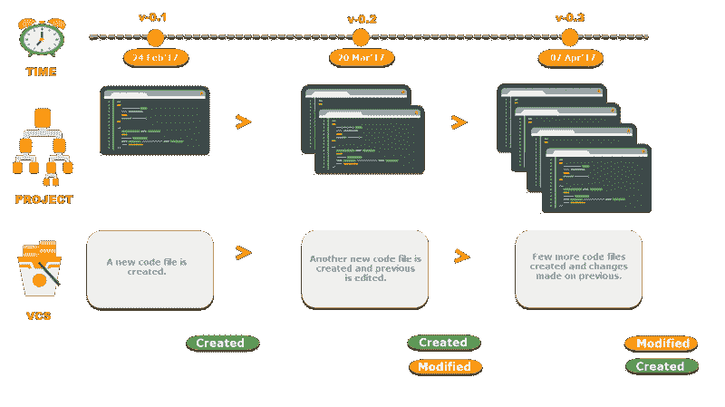
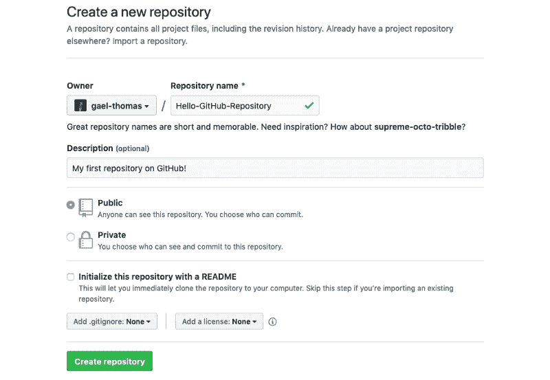
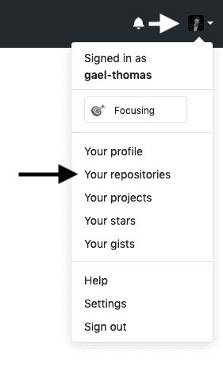
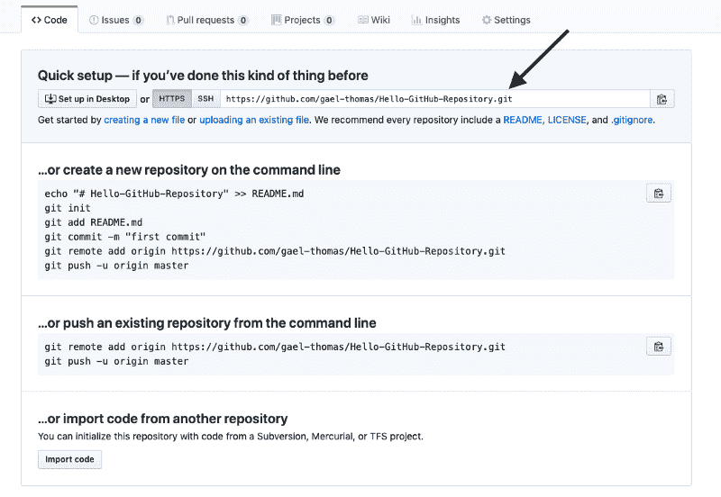
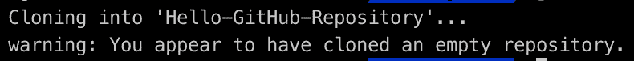
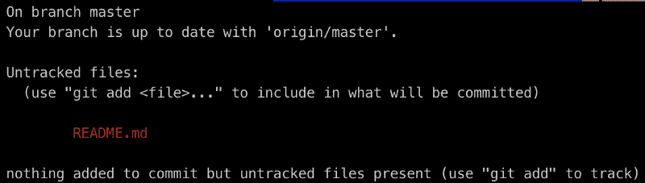
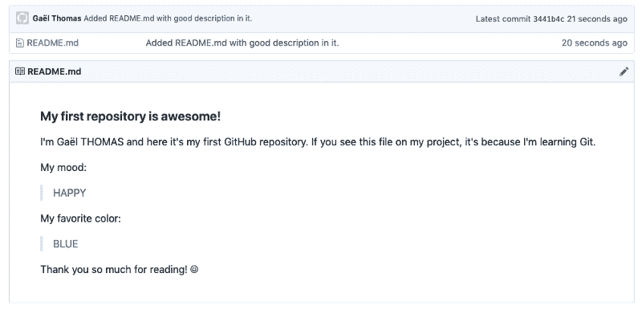

# Git 初学者指南——如何开始和创建您的第一个存储库

> 原文：<https://www.freecodecamp.org/news/a-beginners-guide-to-git-how-to-create-your-first-github-project-c3ff53f56861/>

#### 如果你是一名开发人员，你想开始使用 Git 和 GitHub，那么这篇文章就是为你而写的。

在简单介绍了什么是 Git 以及如何使用它之后，您将能够创建和使用 GitHub 项目。

#### Git 是什么？

Git 是由 T2 的 Linus Torvalds 于 2005 年创建的一个免费的开源软件。这个工具是一个版本控制系统，最初是为了与几个开发人员一起开发 Linux 内核而开发的。

存在许多控制系统，如 CVS、SVN、Mercurial 等，但今天 Git 是版本控制的标准软件。

#### 版本控制，对吧？

如果您是开发领域的新手，这些话不会告诉您任何东西。不过，不要着急，看完这一小段，你就会确切地知道什么是“*版本控制系统(VCS)* ”。

版本控制是一个管理系统，它考虑到了您对一个文件或一组文件所做的修改(例如:一个代码项目)。有了这个系统，开发人员可以在同一个项目上协作和工作。

分支系统由版本控制支持，允许开发人员在将协作者所做的所有变更合并到主分支之前单独处理一个任务(*示例:*一个分支，一个任务或一个分支，一个开发人员)。

开发人员所做的所有更改都会被跟踪并保存在历史记录中。跟踪每个协作者所做的修改可能是有益的。



Version Control System (VCS) change history — Copyright to [ToolsQA](https://www.toolsqa.com/git/version-control-system/) post

#### 在哪里可以找到 Git 仓库

如果您想开始使用 Git，您需要知道在哪里托管您的存储库。有许多托管平台，你可以把你的代码免费。有些选项不是免费的，但是除了在特殊情况下，大多数情况下你并不需要它们。

这里有三个最流行的 Git 托管服务:

*   [**GitHub**](https://github.com/) **:** 最近归微软所有——2008 年推出(2018 年 10 月 3100 万用户)。
*   [**GitLab**](https://about.gitlab.com/) **:** 归 GitLab Inc .所有——2011 年推出。
*   [**BitBucket**](https://bitbucket.org/product/)**:**归 Atlassian 所有——2008 年 6 月推出。

> 注意:托管平台有两种方式，在云上(在线托管)或自安装在你的服务器上(私人托管)。

#### 为什么使用 Git 作为开发人员

这个工具对于全世界的开发者来说都是不可避免的。以下是该工具的优势列表:

*   无需更多副本，当您完成应用程序的重大更新或 bug 修复工作时，您只需" *push* 您的项目在线保存即可。
*   删除并中断您的代码；你只需要输入一个命令就可以回到之前的版本并继续你的工作。
*   与您的朋友一起工作，而不用在每次代码更改时发送包含压缩项目的电子邮件。
*   你可以忘记你做过的事。需要一个简单的命令来检查自上次保存工作以来所做的更改。

我只是告诉你如果你目前不使用 Git 的主要优势。相信我；这个工具会变得非常重要。例如，您可以配置服务来使用 Git，并自动部署和测试您的代码。

### 现在，让我们用 Git 和 GitHub 来练习一下

现在你知道 Git 和 Github 是什么了，是时候用具体的练习来练习了。

完成这些练习后，您将能够使用 Git 的所有基本功能通过 GitHub 创建和管理您的项目。

> 注意:我选择 GitHub 作为我们的 Git 托管服务，因为它是世界上使用最多的。不要害怕；其他服务的程序完全相同。

> 请记住这篇文章，考虑你所知道的所有基本的 SHELL 命令。如果没有，这篇文章的某些部分将会令人困惑。

#### 第一步——是时候开始了！

期待入门？我们开始吧！

这第一个练习不是很复杂；分两步走。Git 安装和 GitHub 帐户创建。

**a. GitHub 账户创建**

要创建您的帐户，您需要在[上连接 GitHub 主页](https://github.com/)并填写注册表格。


GitHub main page with registration form

仅此而已！你正式成为 GitHub 的新成员了！

**b. Git 安装**

现在您需要在您的计算机上安装 Git 工具。Git 软件有很多种，但最好安装基础的才能开始。我们将使用命令行与 GitHub 通信。

一旦您对命令行更加熟悉，您就可以下载带有用户界面的 Git 软件了。

*   *对于 Ubuntu:*

首先，更新您的软件包:

```
$ sudo apt update
```

接下来，用 apt-get 安装 Git:

```
$ sudo apt-get install git
```

最后，验证 Git 安装是否正确:

```
$ git --version
```

*   *对于 MacOSX:*

首先，下载最新的 [Git for Mac 安装程序](https://sourceforge.net/projects/git-osx-installer/files/)。

接下来，按照屏幕上的指示操作。

最后，打开一个终端，验证 Git 安装是否正确:

```
$ git --version
```

*   *对于 Windows:*

首先，下载最新的 [Git for Windows installer](https://gitforwindows.org/) 。

接下来，按照屏幕上的说明进行操作(您可以保留默认选项)。

最后，打开一个终端(例如:powershell 或 git bash ),并验证 git 是否安装正确:

```
$ git --version
```

*   *对于所有用户:*

正确完成安装还需要最后一步！当您要保存您的工作时，您需要在您的终端中使用您的信息运行以下命令来设置默认用户名和电子邮件:

```
$ git config --global user.name "Gaël Thomas"
$ git config --global user.email "example@mail.com"
```

#### #2 步骤—您的第一个 GitHub 项目！

现在你已经准备好了，你可以返回到 GitHub 主页面，点击菜单栏中的“ *+* ”图标。


GitHub menu bar with “+” icon

点击此按钮后，会出现一个新菜单，带有“*新存储库*”条目。点击它！


Submenu with “New repository” entry

将出现储存库创建页面。为您的第一个存储库选择一个酷名字，并在点击“*创建存储库*按钮之前加上简短的描述。

> 注意:在本文的上下文中，请不要勾选“用自述文件初始化这个存储库”。我们稍后将创建一个“自述”文件！



Repository creation menu

干得好！您的第一个 GitHub 存储库已经创建。如果您想查看您的所有存储库，您需要在菜单栏中点击您的个人资料图片，然后点击“*您的存储库*”。



Submenu with “Your repositories” entry

#### 第三步——一个好的封面

是时候对存储库进行第一次修改了。你觉得给它做个封面怎么样，一种欢迎的文字？

**a .你的项目的本地版本**

您的第一个任务是在您的计算机上获得存储库的副本。为此，您需要"*克隆*存储库。在存储库页面上，您需要获得“ *HTTPS* 地址。



Repository page with “HTTPS” address

一旦你有了存储库的地址，你需要使用你的终端(通过 shell 命令)移动到你想要放置目录副本的地方(例如你可以移动到你的" *Documents* "文件夹中)。准备好后，您可以输入:

```
$ git clone [HTTPS ADDRESS]
```

该命令将在给定地址创建存储库的本地副本。



Output message of “git clone” command

现在，您的存储库在您的计算机上。你需要带着:

```
$ cd [NAME OF REPOSITORY]
```

> 注意:当您克隆时，Git 将在您的计算机上创建一个存储库。如果需要，您可以使用计算机用户界面访问您的项目。

**b .储存库版本**

现在你可以创建一个名为“ *README”的文件。* md "在您的文件夹中(通过终端或您计算机上的用户界面)。我不会给你更多关于这一步的细节，没什么特别的。打开您的文件夹并添加一个文件，就像它是一个标准文件夹一样。

如果你想做一些酷的事情，把这个模板复制粘贴到你的“ *README.md* 文件中。您可以替换钩子之间的信息来个性化输出。

```
### My first repository is awesome!

I'm [PSEUDO/NAME] and here it's my first GitHub repository.
If you see this file on my project, it's because I'm learning Git.

My mood:

> [MOOD NAME]

My favorite color:

> [COLOR NAME]

Thank you so much for reading! ☺
```

让我们分享我们的作品吧！

现在您已经修改了项目，您需要保存它。这个过程叫做提交。

为此，请回到您的终端。如果你已经关闭它，回到你的文件夹。

当您想要保存您的工作时，需要四个步骤。这些步骤被称为:“*状态*”、“*添加*、“*提交*、*推送*。我已经为你准备了一个标准程序，每次你想保存你的工作时都要执行。

> 注意:以下所有步骤都必须在您的项目中执行。

*   "*状态*":一旦你开始工作，你需要做的第一件事就是检查你修改过的文件。为此，您可以键入以下命令来显示更改列表:

```
$ git status
```



“git status” output in our project

*   "*添加*":在变更列表的帮助下，您可以使用以下命令添加您想要上传的所有文件:

```
$ git add [FILENAME] [FILENAME] [...]
```

在我们的例子中，我们将添加“ *README.md* ”，因为我们想要保存这个文件。

```
$ git add README.md
```

> 注意:如果您再次键入“git status”,“readme . MD”将会以绿色显示。这意味着我们已经正确地添加了文件。

*   " *commit* ":现在我们已经添加了我们选择的文件，我们需要写一条消息来解释我们所做的事情。如果我们想要检查更改历史，此消息可能会有用。这里有一个例子，说明我们可以把什么放在我们的案例中。

```
$ git commit -m "Added README.md with good description in it."
```

*   "*推*":你到了，你现在可以把你的作品放到网上了！如果您键入以下命令，您的所有工作都将在线，并且可以直接在存储库页面上看到。

```
$ git push origin master
```

你做到了！如果你回到你在 GitHub 上的存储库页面，你会看到你的" *README.md* "文件，它有一个漂亮的预览。



Repository page with “README.md” file

### Git 的有用命令

作为 Git 初学者，您仍然缺少一些必要的命令。这是一个在你的项目中会对你有用的列表。

*   显示提交的历史记录(对项目进行的所有修改)。

```
$ git log
```

*   恢复自上次提交以来的所有更改。

```
$ git checkout .
```

*   恢复自上次提交以来对特定文件的所有更改。

```
$ git checkout [FILENAME]
```

*   显示自上次提交以来文件的最后更改。

```
$ git diff [FILENAME]
```

*   移除项目中所有意外的文件(未提交)。

```
$ git clean -dfx
```

*   添加所有文件，同时提交。

```
$ git commit -am [MESSAGE]
```

#### 下一步是什么？

在本初学者指南的下一部分，您将发现以下三个主题:

*   什么是好的提交消息？
*   为什么这很重要。
*   编写提交消息的清单。

->[Git 初学者指南——如何写好提交消息](https://herewecode.io/blog/a-beginners-guide-to-git-how-to-write-a-good-commit-message/)

## 结论

我希望这个指南和 Git/GitHub 上的例子对你有所帮助！如果您有任何问题或反馈，请随时提问。

如果你想要更多这样的内容，你可以[在 Twitter](https://twitter.com/gaelgthomas/) 上关注我，在那里我会发关于 web 开发、自我完善和我作为一个全栈开发人员的旅程的推文！

你可以在我的网站上找到其他类似的文章: [herewecode.io](https://www.freecodecamp.org/news/a-beginners-guide-to-git-how-to-create-your-first-github-project-c3ff53f56861/herewecode.io) 。